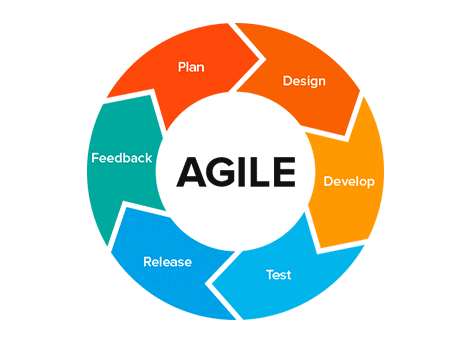

After hearing about the onboarding of a new teammate, it made me think about my past technical training experiences. I thought about the six previous training processes I had been through and the four I had the chance to design myself, which led me to ponder on "What makes a training process a good one?" for the trainee and the trainer.

That left me with some observations about what worked for me and what worked for others (or not). I hope these insights will guide you in creating effective and agile technical training as a part of the onboarding process that you and the trainees will enjoy and find valuable.

# What are our expectations?
Before getting into what actually is a "good training" process, we first need to define its goals and our expectations from it. So if you think about it, the main ideal goals are:
* To gain an **effective team member** who can handle any task from the first moment.
* The training process occurs in a **short time frame**.
* We want the **new person to fit** in socially, because that will help make the workplace more fun to be in and, in turn, improve the collaboration between them and other teams in the future.
From my experience, there are several reasons why a training process will not reach those **nearly impossible goals**. Let's dive into why.

## A too-broad range of topics
Trying to cover too many topics (frameworks, languages, and so on) in the training process will create a very long onboarding process that most **people would not like to be in** one like that. Consequently, trainees will try to rush to finish, hoping to make a good impression or just trying to get it done already. But this will probably result in them missing our exercises targets.

## Unclear and transparent exercises goals
This issue can cause an **unclear process and a waste of time**. For example, we can ask the trainees to familiarize themselves with a new programming language by generally pointing them to some online guides versus guiding them to learn specific topics with relevant exercises, which will focus them only on our relevant goals.

## Underestimating the benefit of training buddies
In the onboarding process, buddies/mentors are very effective in **social integration and remove some fundamental technical friction** for the trainees. But one is often not assigned, or their mentorship task is not prioritized over their daily work.

# Realistically setting our expectations
After talking about what are less realistic goals, let's focus on setting ones that will give us a more achievable outcome:
* Trainees should know where to **find information quickly**, not only from the closest team member or their training buddy.
* Trainees should have a basic grasp of frameworks, technologies and be able to **do simple tasks**. Therefore they should understand the team's main projects' code flow.
* The training process should happen within **managed and clear time expectations** created with the trainees and for them.
* Trainees should be comfortable with regular **water-cooler office talks** between themselves and others, professionally or on the latest episode of the trending TV show.

# Designing the training process
After we've figured out our goals, we need to design what will be in our "good training" process. But what principles should we build on?

## Managing training steps' goals clearly
The training managers will need to **manage the training content's coverage** over its goals (much like a unit test's coverage on our code) to gain a more efficient and effective process for only leaving what is essential. Also, they will need to give clear guidance on **what to focus on**, which should help to focus the trainees and therefore **save time** (for everyone).

## Every training goal must meet at least one matching exercise
The objective here is to **get the trainee’s "hands dirty"** and raise relevant questions early on. For example, familiarize them with your HTTP web server frameworkby asking them to develop a server with content-relevant, simple (enough) logic.

## Tailor the training to the seniority level
Different seniority levels follow different levels of knowledge, as we all know, so we need to keep that in mind. That is to **avoid "wasting" the time** of more experienced trainees with simpler exercises, or diving in too deep in the case of less experienced trainees.
For example, familiarize them with your favorite messaging queue libraries. In the case of junior developers, the relevant exercise could be just sending/receiving a message. And in the case of mid-level (and above), practicing more advanced topics like backpressure, error handling, etc.

## Allow trainees to do things their way
Suggest multiple ways of learning or doing a task if possible, resulting in a **better process for a broader range of people** (for example, adding links to YouTube lectures alongside written material for people who prefer watching videos instead of reading).

## Self-serve! With buddies' support
Making the training self-serve is essential for several reasons:
* **Minimizes dependency** on the trainer because everything is written down, allowing trainees to work at their own style and pace.
* It forces us to maintain all the training material in written form, **not in a specific person's mind** (so better bus factor :) ).
* Allows sharing the training with all stakeholders in the company, which will help to get **constant valuable feedback** from them.
That shouldn't be an afterthought because if poorly done, it can discourage new team members and jeopardize their confidence in the training and feelings about the company.

# What to keep in mind during the training
We talked about the content and structure of the training, but what should we do during it?

## Group environment
In the case of more than one person in training at the same or similar stages, we should **create a supportive group environment** by sitting them together or/and having fun activities especially for them. That is beneficial for several reasons, from having a motivating environment in the onboarding period to helping to improve inter-all-company/team communications due to formed connections.

## Create transparency in trainee progression
You achieve that by using your favorite task management system, so we can **manage and support the process**. Consequently, the trainees will know what comes next, hopefully also giving them something to look forward to.

## Incorporate your production standards
Incorporate design and design review standards, code review, code style, etc. Due to that simulated exercises are usually not interesting (nor fun) and will provide less **relevant knowledge or practical experience**.

# "The only constant is change"
Like everything in programming, nothing stays the same for long. The same is true for our training goals. To keep in sync, we need to take a page from the agile methodology playbook. So let's treat this as a regular software project in your system (one of the most critical ones).

If we follow the agile process, but in the context of training, we have the following:

1. **Planning** our training goals to be relevant and precise to our current needs.
2. **Design** the required exercise ideas while considering our needs and appropriate seniority levels.
3. **Develop** the required materials to support this process. I recommend managing the material as code with the same tools, creating a simple and transparent company-wide process.
4. **Test** it by getting internal feedback and reviews from stakeholders.
5. **Release** it to the onboarding newcomers.

## Wrapping up with feedback
We've covered everything except the feedback, which is the most important — so let's finish with that.
We **need constant feedback** from the trainees, team members, buddies, and team leaders at different times. But what should we look for?..
Focus on which topics the trainee used more than once after the training, and define which topics were actually relevant or not.
We should also focus on what was not enough, overlooked, or needs to stay as is. But how can we gauge this? The best effort in my mind is to try to understand this by asking all stakeholders the following questions:
* Which subjects did the trainee feel to be hard or easy?
* Where did the trainees need more or less support?
* Which tasks took more time than estimated? If by the trainee or by planned estimations.
* Which training aspects were different from the actual team's practices?
Review this after about six months so that the trainee will have the chance to do a wide enough range of tasks. Remember that the more topics the training covers, the more time and costs it will accumulate.

# Summary
To sum up, we saw the importance of a well-formed and tailored onboarding process and its effects on new people. So I will use again the saying "the only constant is change", because you can only do that in a constant mode of thorough feedback and evolving as any successful software project should.
