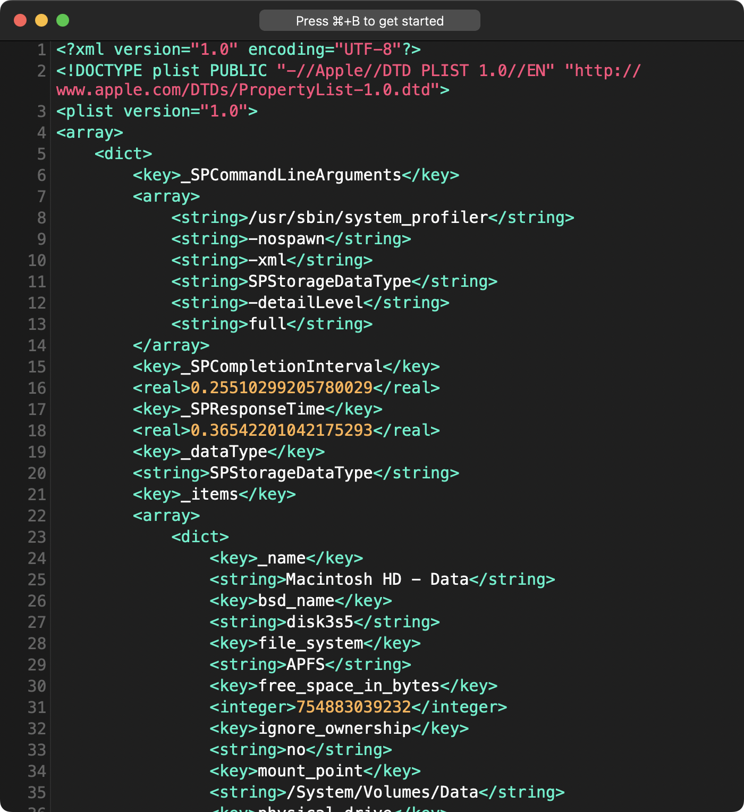

Some command snippets from my learnings using the `--xpath` option in `xmllint` on macOS.

## What is xpath?

**NOTE**: As of this writing `xmllint` uses `xpath` version 3.1. (http://xmlsoft.org/)

XML Path (xpath) is a command line binary that allows the user to traverse the nodes (paths) in an XML tree or JSON tree.

> The primary purpose of XPath is to address the nodes of XML trees and JSON trees. XPath gets its name from its use of a path notation for navigating through the hierarchical structure of an XML document. XPath uses a compact, non-XML syntax to facilitate use of XPath within URIs and XML attribute values. XPath 3.1 adds a similar syntax for navigating JSON trees.
 
from: <https://www.w3.org/TR/2017/REC-xpath-31-20170321/>

## Where to find xpath on macOS

### Binary Path

xmllint is in `/usr/bin/xmllint`

### xmllint --xpath Help Page

If you open Terminal.app and type `/usr/bin/xmllint --xpath` then press Return you will get the following help output. (compressed to only show the xpath related output)

```
/usr/bin/xmllint --xpath
Usage : xmllint [options] XMLfiles ...
        Parse the XML files and output the result of the parsing
        --version : display the version of the XML library used
        ...
        ...
        ...
        --xpath expr: evaluate the XPath expression, imply --noout

Libxml project home page: http://xmlsoft.org/
```

Not super helpful, IMO, if you want to know how to apply the commands 😜.

## Using --xpath

### Create a test file

The following examples use a plist file (fancy xml) containing information about the storage devices on a macOS system.

You can create the same file with the following command

`/usr/sbin/system_profiler -xml SPStorageDataType > ~/Desktop/storage_data_type.plist` 

Contents of the file should look similar to the below.



### Examples 

Below is an example showing the basic command structure

`/usr/bin/xmllint --xpath "xpath expression" xml_data.xml`

### Reading data from XML output

**Return all contents of the xml file**

The following command will print the entire contents within the first `<array>` tag.

`xmllint --xpath "//array" storage_data_type.plist`

**Return all keys in the plist**

The following command will print the content stored in all top-level keys in the first `<array>`.

`xmllint --xpath "//array/dict/key/text()" storage_data_type.plist`

```
_SPCommandLineArguments
_SPCompletionInterval
_SPResponseTime
_dataType
_items
_name
bsd_name
file_system
free_space_in_bytes
...
```

**Return all second level array**

The following command will print all contents within any second level `<array>` tags.

`xmllint --xpath "//array/dict/array" storage_data_type.plist`

**Return the first sting from each dict in the second array**

The following command will print the text (`text()`) values contained in the first string (`string[1]`) in each dictionary. This gives us the names of the mounted drives. 

`xmllint --xpath "//array/dict/array/dict/string[1]/text()" storage_data_type.plist`

```
Macintosh HD - Data
Macintosh HD
StatusBuddy_v2.0-89
SFSymbols
```

**See the bsd_name of the disk**

`xmllint --xpath "//array/dict/array/dict/string[2]/text()" storage_data_type.plist`

```
disk3s5
disk3s1s1
disk5s1
disk4s2
```

**See the free_space_in_bytes for each disk**

`xmllint --xpath "//array/dict/array/dict/integer[1]/text()" storage_data_type.plist`

```
754883039232
754883039232
36237312
168611840
```

## Conclusion

After working with `xmllint --xpath` for a bit, I've found that it works well for adequately structured xml but not so much for plist files. So output like an HTML response from a `curl` command or, heaven forbid, an API responds in xml, `xmllint --xpath` is a perfect tool for the job. But, for plist files, while you can see and get to information within the plist, you have to make some assumptions about the structure, and if that structure happens to be off, you might not get the correct output that you're expecting.

However, to work with plist files formatted in xml, using something like [PlistBuddy](https://captam3rica.github.io/Plistbuddy-Guide/) is the way to go because it's designed to traverse the structure of plist files.

