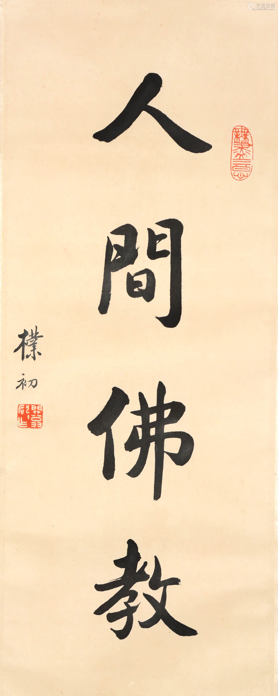

## 人间佛教的提出 —— 人间性

“人间佛教”这个概念是由近代的太虚大师首先提出的，然后在海外的汉传佛教中得到了普遍的认可和推广，反观大陆地区，这个概念虽有提及，但次数并不多，更谈不上主要推广了。结合本人在大陆的经历，也可以印证这点，当然，个人经历可能存在偏颇，欢迎读者们指正和补充。

太虚大师（1890年1月8日－1947年3月17日）提出“人间佛教”时，具有强烈的时代背景，当时正处民国时期，各种战争，内忧外患，不仅给国家和人民带来无穷无尽的苦难，当时的佛教也被严重地冲击了，甚至可以说是奄奄一息。僧人们不仅无法学习佛法，甚至连生存都很有问题，不得不依靠做佛事（经忏）来“糊口”，这样的背景下，被当时的知识分子批评为“为死人服务的佛教”。

太虚大师有鉴于此，于是提出“人间佛教”，“人生佛教”的口号，呼吁僧众和信徒们应该把重心放到现实的“人生”，和实际的“人间”来，并进一步提出了“人成即佛成”，即希望从人格的角度提升自我，而最完美的人格莫过于佛陀了，因为只有佛陀才有最圆满的智慧和慈悲，所以佛陀是最完美的人格榜样了。

所以从这里不妨总结下“人间佛教”的第一条原则 —— 即重视现实人生，实际生活等人间世的佛教，而非仅为超度亡灵，一味诵经拜忏等做佛事的佛教。当然，这里并不是否定佛教有超度亡灵的功能，而是重心不在于此而已。

## 朴素的教义和教理 vs 过度神格化和神秘化的故事

据学者分析，早期的佛教传播，大多走的是上层路线，相当于是在“贵族”和“知识分子”中传播为主的，这样的群众基础当然可以直接了当地说教义，说哲理。信众们不仅能够接受这样的说法，还能够付诸实践。然而，群众基础本身也是无常，也是因缘法，后面的群众主体发生了变化，慢慢地，普罗大众才是主要的信众。而普罗大众的受教育程度和知识分子们相比，肯定是很有差距的，正因为此，佛教的传播就不得不借助大量的“故事”才能弘传了。毕竟，义理晦涩难懂，而故事则是老少皆宜，尤其是“神话”故事，内容则更加丰富了，更容易传播了。于是“佛经”里面的“神话”色彩也逐渐变得浓厚了起来。

这就很容易地解释了部派佛教时期为主的四部阿含，大多是非常朴素的教义和哲理，和现实的人生，实际的生活密切相关。而到了大乘佛教时期，经典里面的“神话”色彩变得越来越浓，经典的开头，场面变得越来越宏大，漫天神佛了。然而，只要是佛经，只要是“真经”，里面的核心依旧是教义，只是“包装”越来越豪华了。甚至有时候会给人一种“错觉”，让人只看到了“包装”而非内涵了，尤其是当有人买株还珠的时候，我们就可以断定地说，他只是喜欢这个“包装”而已，而非里面的“实质”。

因此，比起佛教里面许许多多的神话色彩，其实佛教的教义才是永恒的核心和根本。一切神化的故事，无论多么传奇，多么精彩，最终都是为了这个根本教义而存在的。而这个根本教义即是佛教基础（四圣谛，十二缘起，八正道），以及大乘的三个体系（中观、唯识和如来藏）。

所以从这里不妨总结下“人间佛教”的第二条原则 —— 重视核心教义，而非神格、神秘化的“外壳”。同样，这里并不是彻底否定这些神格化，神秘化的存在，而是说他们不是佛教的核心和实质，教义和教理才是。

## 最融洽的相处 VS 被视为“迷信”

作为一个佛教徒而言，身边不仅会有兴趣相投的金刚道友，也必定少不了很多有无信仰人士，而这些无信仰人士不仅有同事，朋友，甚至还有我们最亲近的父母，子女，兄弟姐妹和伴侣等。因为亲近的关系，时常在一起相处，如果一方经常提及灵异、灵感、神奇、神秘之事，不可避免地会让其他人产生“迷信”的印象。在佛教的范围内，灵异、灵感、神奇、神秘之事当然是习以为常的。但在佛教之外，在普通人的生活经验之中，这些事情却是没有的，也很难相信这类的事情。无形之中，无信仰人士便会不自觉地远离这种“迷信”之人，乃至远离了佛学和佛法。按理来说，佛教徒都应该“接引”他人来亲近佛法，学习佛教，可事实上，却常常因为我们自己不恰当的言谈令人远离，这不得不说令人十分遗憾了。

如果可以回到佛教根本的核心，学会用佛法的角度看待世间的问题，多从因缘的角度去分析，这样的心态甚至会比一般人看到更深层次的问题，不仅可以帮助自己调伏烦恼，而且可以更加理性，更加客观地谈论事情，处理起来，因为更加冷静和全面考虑，事情的处理结果也往往更好了。能做到这样，也就可以称得上佛教中的“智者”了。

对于高等教育都非常普及的今天来说，做到上面这点并不困难，只要多闻多思学习佛法的核心和根本即可达成。毕竟如因缘法这样的道理，并不难理解，用起来，也不会很困难。很多时候做不到，也只是因为我们对这个思维方式不太习惯而已，稍多练习，持续练习，便很容易养成这样的思维习惯，不仅因缘法，或缘起法是如此，其他的道理也是类似的。

因为这些道理是普遍成立的，不受任何条件的约束，不依赖任何外在的条件，也不受任何时空的限制。古今中外，无一不含，也没有任何一件事物不遵守这样的规律 —— 所以当我们谈论这些核心教理的时候，甚至可以不用特定的佛教名词也可以讲述这些道理时，那个时候不仅不会被视为“迷信”，甚至连“佛里佛气”的印象也不会有了。

## 我所总结的“人间佛教”

最后我想总结下我所理解的“人间佛教”，虽然这个概念已经被广泛地认可并被接受，可是“人间佛教”却没有一个“统一”的概念与说明。当我查阅维基百科时，还只是引用了1998年台湾地区的《台湾大百科全书》的寥寥数语。之后我对这个词条做了增补，补充了几位延续此思想的高僧大德们的总结，但因为维基百科的写作限制，无法做更多的个人总结，因此在这里大概总结一下，希望可以抛砖引玉，最终有一个统一的认知。

### 什么是“人间佛教”？

人间佛教是以人为本，以人间为道场，不脱离现实人生和实际生活，积极造福于全体人类的觉悟教育。以出生在人间，修行在人间，觉悟在人间，教化在人间的佛陀和他的教法作为该概念的理论依据。简略解释如下：

* **以人为本**： 即以人类为主要的教化对象，而非鬼神，非天，非旁生（动物）。
* **以人间为道场**：即重视在人间的修行，不遁世、不避世。
* **不脱离现实人生和实际生活**：即重视在日常生活、工作和学习中实践所学，不仅仅寄托于来生。当然也不会否定来生，只是重心在于此生 —— 对此时，此地，此人都有现世意义的教育和引导作用。
* **造福全体人类**：积极入世，重视慈善，以修行感化他人，利益他人（利他心），净化人心。最终乃至对全社会，全人类带来积极正面的影响。佛教几乎不讲“异教徒”，更不会从根本上去区分什么人是“异教徒”，只要任何人，任何时候需要佛法，它就会在那，不离不弃。
* **觉悟教育**：这是佛法的终极目标，按照不同的层次，不同的需求来说，佛法也可以分为不同的层次。通常来说，“求神拜佛”是最低层次的需求（民间信仰大多算此类），其次是修行五戒十善的“人天善法”，中间还可以有声闻，缘觉和菩萨，后三者才是佛法的终极目标，总结来说就是觉悟 —— 解脱和菩提。

### 人间佛教提倡什么？

* **重视教理**：包括基础教理，即四圣谛，十二因缘，三十七道品（最常见的是四念住和八正道），缘起中道，其次才是大乘三大体系的般若（中观）、唯识和如来藏。
* **了解教史**：佛教是全世界，全体人类的，已经是全球化的时代，作为知识分子，佛教青年来说，了解佛教史应该是必修功课了。只有了解佛教史，才会懂得为何会有南传，汉传和藏传三大体系，了解佛教史形成的原因不离因缘，也就会对未来的佛教格局充满想象的空间，并为之努力和奋斗。
* **重视自我的修行，或说重视自力的修行**：这也是佛学和佛法的本质，佛学本身只是知识，只有实践才会更深的体悟，只有实践，才会由内而外，才能真正发挥其作用，也只有这样，才能真正的感染他人，弘扬佛法。
* **简约朴素**：简洁大方，质朴，这是目前最符合全球化视角，现代人类的修行方式。保护环境，爱护环境，珍惜环境 —— 佛教徒们当然也不例外。
* **积极向上，阳光自信**：从外人的视角来看，佛教里面看似有很多消极的言论，比如对“苦”的强调，对“末世”的“悲观”态度，对于“末世人性”的“否定”，所有的这些都容易被外人认为佛教是“消极”的。对于佛法稍有深入了解的人便会知道，这些说法要么是错误的，要么就是偏颇的。不可否认，佛教有时也会把这些当做劝谏的工具（方便），但我们更应该了解其目的和核心 —— 不离开解脱和菩提。
* **真正的普世价值**：以佛法来说，是最有资格谈论自由与平等的，因为佛教的理论所支持的自由是绝对的自由，没有条件的自由，不受约束的自由，而不仅仅是他人赐予的自由。而佛教理论所支持的平等，也是绝对的平等，一切的平等，没有例外。佛陀和普通人，乃至地域道的众生，也是绝对平等的。

### 人间佛教不提倡什么？

这里仅仅说的是“不提倡”，并不表示要否定他们，也不表示他们没有意义，只是从人间的多数人的角度出发，现代人的角度出发，不应该作为“主要”的内容以及不应该过于强调。凡事都有例外，也有少数派，当然可以理解少数人依旧可以从这些“不提倡”的事情中获益，甚至“成就”，但对于绝大多数来说，还是应该采取保守的，稳妥的“正路” —— 举例说明，以教育为例，因为佛教的本质还是教育，所以教育的例子最为贴切。对于绝大多数人来说，去学校（小学，中学，高中，大学等）是最稳妥的学习方式，虽然我们都知道很多杰出的人士甚至都没有上过学，或者很早就退学了，但他们终归是少数，而且，即使是他们的后代们，依旧会选择去学校学习。

* 不提倡过度神化 —— 包括佛陀、菩萨乃至高僧大德们的事迹。
* 不追求神异经验，神通，感应，或其他神秘力量 —— 这些都是普通人体验之外的事情，很容易被视为“迷信”
* 不过多谈论鬼神之事（哪怕是护法神） —— 理由同上
* 不过分渲染末法，恶世 —— 这原本是净土宗的劝谏只说，目的是劝谏大家抓紧时间休息，时日不多了，但处理不当，就会被当做是“消极”的了，而且禅宗说“日日是好日”，哪有不好的日子呢。
* 不过分否定自己和他人的人格 —— 这依旧是净土宗的方便之法，目的在于把净土宗当做唯一的“出路”，但处理不当，就会变得非常不自信，甚至性格懦弱，很容易和强调自主性，创新性的现代社会格格不入。
* 不过分依赖他人 —— 这依旧是净土宗的方便之法，目的在于仰仗阿弥陀佛的愿力才能往生净土，但他力中也有自力，若没有自己的努力（自力），往生决难成功。
* 不算命，不预测灾祸（非末日论）—— 个别“大德”或个别“教派”也会用这样的方法来劝谏大家努力修行。副作用也很明显，时间太短的预研容易被反转，结果成为他人的笑柄。时间太长的预研又起不到“激将”的目的。
* 不与现代社会，科技，文明相对立，不过分“怀古” —— 很多“大德”甚至会批评现代发展的发展导致物质泛滥，精神缺乏，物欲横流，远不如古代的“放牛娃”，或偏远地区的人一样有“清净”的生活。这种的言论在佛教内部还真是不少见，一方面利用互联网来讲法，一方面却批评现代科技的发展。这真是非常不客观的，非常不理性的，未免会有“端起碗吃肉，放下筷子骂娘”的非议。从现代人的角度来说，方方面面都有享受到了科技带来的好处 —— 以佛教来说，现在可以远程上课，远程共修，音频视频听闻佛法，以及互联网上丰富的佛教资源，经律论唾手可得，各种讲解百花齐放，形式丰富多彩。可以说任何一个普通人所能访问到的资源，都要超过过去任何一个古代的“藏经阁”了。这些都是科技带来的现成的好处了。

### 人间佛教不离因缘

以上所列举的很多内容都和当下的环境有关，尤其是全球化，现代化的背景。从因缘的角度来说，人间佛教的提出和推广，也属于因缘的范畴，并未超脱与此。换句话说，当时空因缘再度发生变化的时候，这个人间佛教的概念和提倡等，也应该做出那个时候的调整才行，并非一成不变。

甚至可以说，2500年前的古印度，原始佛教就是当时的“人间佛教”，后来的四阿含就是部派佛教时期（公元前3，400年到公元前后）的“人间佛教”，而“般若”则是大乘早期（公元1，2世纪）时期的“人间佛教”，“唯识”则是大乘中期（公元3，4世纪）的“人间佛教”，而“如来藏”则是大乘后期的“人间佛教”。而当今21世纪的“人间佛教”则是具有整体性，包容性，圆融性的全体佛教了（重视基础教理而非其他“外围”）。

祝新年快乐，平安自在。

愚夫合十。

