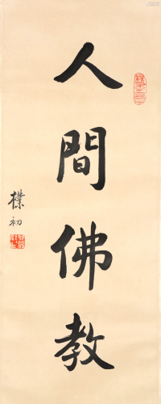

## 人間佛教的提出 —— 人間性

“人間佛教”這個概念是由近代的太虛大師首先提出的，首先在海外的漢傳佛教中得到了普遍的認可和推廣，反觀大陸地區，這個概念雖有提及，但並不多，更談不上主要推廣了。結合本人在大陸的經曆，也可以印證這點，當然，個人經曆可能存在偏頗，歡迎讀者們指正和補充。

太虛大師（1890年1月8日－1947年3月17日）提出“人間佛教”時，具有強烈的時代背景，當時正處民國時期，內憂外患，不僅給國家和人民帶來無窮無盡的苦難，當時的佛教也被嚴重地沖擊了，甚至可以說是奄奄一息。僧人們不僅無法學習佛法，甚至連生存都很有問題，不得不依靠做佛事（經懺）來“糊口”，這樣的背景下，被當時的知識分子批評為“為死人服務的佛教”。

太虛大師有鑒於此，於是提出“人間佛教”，“人生佛教”的口號，呼籲僧衆和信徒們應該把重心放到現實的“人生”，和實際的“人間”來，並進一步提出了“人成即佛成”，即希望從人格的角度提升自我和他人，而最完美的人格莫過於佛陀了，因為隻有佛陀才有最圓滿的智慧和慈悲，所以佛陀是最完美的人格榜樣了。

從這裏不難看出“人間佛教”的第一條原則 —— 即是重視現實人生，實際生活等人間世的佛教，而非僅為超度亡靈，或一味誦經拜懺等做佛事的佛教。當然，這裏並不是否定佛教有超度亡靈的功能，而是重心不在於此而已。

## 樸素的教義和教理 vs 過度神格化和神秘化的故事

據學者分析，早期的佛教傳播，大多走的是上層路線，相當於是在“貴族”和“知識分子”中傳播為主的，這樣的群衆基礎當然可以直接了當地說教義和教理。信衆們不僅能夠接受這樣的說法，還能夠付諸實踐，甚至在說法的當下就證果了。然而，群衆基礎本身也是無常，也是因緣法，後面的群衆主體發生了變化，慢慢地，普羅大衆才是主要的信衆。而普羅大衆的受教育程度和知識分子們相比，差距是非常大的，正因為此，佛教的傳播就不得不借助大量的“故事”才能弘傳了。畢竟，義理晦澀難懂，而故事則是老少皆宜，尤其是“神話”故事，內容則更加豐富了，更容易傳播了。於是“佛經”裡面的“神話”色彩也逐漸變得濃厚了起來。

這就很容易地解釋了部派佛教時期為主的四部阿含，大多是非常樸素的教義和哲理，和現實的人生，實際的生活密切相關。而到了大乘佛教時期，經典裡面的“神話”色彩變得越來越濃，經典的開頭，場面變得越來越宏大，漫天“神佛”了。然而，隻要是佛經，隻要是“真經”，裡面的核心依舊是教義，隻是“包裝”越來越豪華了。甚至有時候會給人一種“錯覺”，讓人隻看到了“包裝”而非內涵了，尤其是當有人買株還珠的時候，我們就可以斷定地說，他隻是喜歡這個“包裝”而已，而非裡面的“東西”。

因此，比起佛教裡面許許多多的神話色彩而言，其佛教的教義才是永恆的核心和根本。一切神化的故事，無論多麼傳奇，多麼精彩，最終都是為了這個根本教義而存在的。而這個根本和核心即是佛教基礎（四聖諦，十二緣起，八正道），以及大乘的三個體係（中觀、唯識和如來藏）。

從這裏不難看出“人間佛教”的第二條原則 —— 重視核心教義，而非神格、神秘化的“外殼”。同樣，這裏並不是徹底否定這些神格化，神秘化的存在，而是說他們不是佛教的核心和實質，教義和教理才是。

## 最融洽的相處 VS 被視為“迷信”

作為一個佛教徒而言，身邊不僅會有興趣相投的金剛道友，也必定少不了很多有無信仰人士，而這些無信仰人士不僅有同事，朋友，甚至還有我們最親近的父母，子女，兄弟姐妹和伴侶等。因為親近的關係，時常在一起相處，如果一方經常提及靈異、靈感、神奇、神秘之事，不可避免地會讓其他人産生“迷信”的印象。在佛教的範圍內，靈異、靈感、神奇、神秘之事當然是習以為常的。但在佛教之外，在普通人的生活經驗之中，這些事情卻是冇有的，也很難相信這類的事情。無形之中，無信仰人士便會不自覺地遠離這種“迷信”之人，乃至遠離了佛學和佛法。按理來說，佛教徒都應該“接引”他人來親近佛法，學習佛教，可事實上，卻常常因為我們自己不恰當的言談令人遠離，這不得不說令人十分遺憾了。

如果可以回到佛教根本的核心，學會用佛法的角度看待世間的問題，多從因緣的角度去分析，這樣的心態甚至會比一般人看到更深層次的原因，不僅有助於自己調伏煩惱，而且可以更加理性，更加客觀地處理事情。因為更加冷靜和更全面的考慮，事情的處理結果也往往更好了。能做到這樣，也就可以稱得上佛教中的“智者”了。

對於高等教育都非常普及的今天來說，做到上面這點並不睏難，隻要多聞多思學習佛法的核心和根本即可達成。畢竟如因緣法這樣的道理，並不難理解，用起來，也不會很睏難。很多時候做不到，也隻是因為我們對這個思維方式不太習慣而已，稍多練習，持續練習，便很容易養成這樣的思維習慣，不僅因緣法，其他的佛教教理也是類似的。

又因為這些道理是普遍成立的，不受任何條件的約束，不依賴任何外在的條件，也不受任何時空的限製。古今中外，無一不含，也冇有任何一件事物不遵守這樣的規律 —— 所以當我們談論這些核心教理的時候，尤其是可以不用特定的佛教名詞也可以講述這些道理時，那個時候不僅不會被視為“迷信”，甚至連“佛裏佛氣”的印象也不會有了。這樣的言談舉止，也更加符合“人間”性的特質，相處必定更加融洽了。

## 我所總結的“人間佛教”

最後我想總結下我所理解的“人間佛教”，雖然這個概念已經被廣泛地認可並被接受，可是“人間佛教”卻冇有一個相對“統一”的概念與特徵說明。當我查閱“人間佛教”的維基百科時，它隻是引用了24年前的《臺灣大百科全書》而已。之後我對這個詞條做了增補，補充了幾位延續此思想的高僧大德們的總結，但他們之間也有一些差異。基於維基百科的寫作限製，無法補充更多的個人思考，因此在這裏大概總結一下，希望可以拋磚引玉，最終有一個統一的認知。

### 什麼是“人間佛教”？

人間佛教是以人為本，以人間為道場，不脫離現實人生和實際生活，積極造福於全體人類的覺悟教育。以出生在人間，修行在人間，覺悟在人間，教化在人間的佛陀和他的教法作為該概念的理論依據。簡略解釋如下：

* **以人為本**： 即以人類為主要的教化對象，而非鬼神，非天，非旁生（動物），也非往生者。
* **以人間為道場**：即重視在人間的修行，不遁世、不避世。恰如六祖慧能所說“佛法在世間，不離世間覺。離世覓菩提，恰如求兔角”。
* **不脫離現實人生和實際生活**：更具體一點，還要在日常生活、工作和學習中實踐所學，不僅僅寄托於來生。當然也不會否定來生，隻是重心在於此生 —— 對此時，此地，此人都有現世意義的教育和引導作用。
* **造福全體人類**：積極入世，重視慈善，以修行感化他人，利益他人（利他心），淨化人心，建設“人間淨土”。最終乃至對全社會，全人類帶來積極正面的影響。佛教幾乎不講“異教徒”，更不會從根本上去區分什麼人是“異教徒”，隻要任何人，任何時候需要佛法，它就會在那，不離不棄。
* **覺悟教育**：這是佛法的終極目標。按照不同的層次，不同的需求來說，佛法也可以分為不同的層次。通常來說，“求神拜佛”是最低層次的需求（民間信仰大多算此類），其次是修行五戒十善的“人天善法”，接下來是聲聞，緣覺和菩薩。後三者才是佛法的終極目標，總結來說就是覺悟 —— 解脫和菩提。銘記於此，就不會吧“人間佛教”等同於“人間善法”，或等同於一般的做好事了。

### 人間佛教應該提倡什麼？

* **重視教理**：包括基礎教理，即四聖諦，十二因緣，三十七道品（最常見的是四念住和八正道），緣起中道的基礎理論。其次才是大乘三大體係的般若（中觀）、唯識和如來藏。
* **了解教史**：佛教是全世界，全體人類的，已經是全球化的時代，作為知識分子，佛教青年來說，了解佛教史應該是必修功課了。隻有了解佛教史，才會懂得為何會有南傳，漢傳和藏傳三大體係，了解佛教史形成的原因不離因緣，也就會對未來的佛教格局充滿想象的空間，並為之努力和奮鬥。
* **重視自我的修行，或說重視自力的修行**：這也是佛學和佛法的本質區別，佛學本身隻是知識，隻有實踐佛學才會對佛法有更深的體悟，隻有實踐，才會由內而外，才能真正發揮其作用，也隻有這樣，才能真正的感染他人，真正弘揚佛法。
* **簡約樸素**：簡潔大方，質樸，這是目前最符合全球化視角，現代人類的修行方式。保護環境，愛護環境，珍惜環境 —— 佛教徒們當然也不例外。反對鋪張浪費，豪華奢靡的“形式主義”。
* **積極嚮上，陽光自信**：從外人的視角來看，佛教裡面看似有很多消極的言論，比如對“苦”的強調，對“末世”的“悲觀”態度，對於“末世人性”的“否定”，所有的這些都容易被外人認為佛教是“消極”的。對於佛法稍有深入了解的人便會知道，這些說法要麼是錯誤的，要麼就是偏頗的。不可否認，佛教有時也會把這些當做勸諫的工具（方便），但我們更應該了解其目的和核心 —— 不離開解脫和菩提。越是對“究竟“的佛法了解越深，越能夠自信 —— “夜夜抱佛眠，朝朝還共起”，“與十方諸佛同一鼻孔出氣”，這是何等的豪邁之情。這也是勸諫大家，不要滿足於在“方便法”上，多找“月亮”，而不是天天去研究“手指”。
* **真正的普世價值**：以佛法來說，是最有資格談論自由與平等的，因為佛教的理論所支援的自由是絕對的自由，冇有條件的自由，不受約束的自由，而不僅僅是他人賜予的自由。而佛教理論所支援的平等，也是絕對的平等，一切的平等，冇有例外。佛陀和普通人，乃至地獄道的衆生，都是絕對平等的。這些都不是靠別人賜予或施捨的，也可以說，這才是真正的自由與平等。

### 人間佛教不提倡什麼？

這裏僅僅說的是“不提倡”，並不錶示要否定他們，也不錶示他們冇有意義，隻是從人間的多數人的角度出發，現代人的角度出發，不應該作為“主要”的內容以及不應該過於強調。但凡事都有例外，也會有少數派，也要允許他們的存在，肯定他們的意義。少數人依舊可以從這些“不提倡”的事情中獲益，甚至“成就”，但對於絕大多數來說，還是應該採取保守的，穩妥的“正路” —— 舉例說明，以教育為例，因為佛教的本質還是教育，所以教育的例子最為貼切。對於絕大多數人來說，去學校（國小，中學，高中，大學等）讀書是最穩妥的學習方式，雖然我們都知道很多傑出的人士甚至都冇有上過學，或者很早就退學了，但他們終歸是少數，對於絕大多數人來說都不合適，而且，即使是他們，依舊會選擇把後代們送去學校學習，原因就在於此 —— 主路和旁路。

* 不提倡過度神化 —— 包括佛陀、菩薩乃至高僧大德們的“神異”事跡。
* 不追求神異經驗，神通，感應，或其他神秘力量 —— 這些都是普通人體驗之外的事情，很容易被視為“迷信”，誤解佛教。
* 不過多談論鬼神之事（哪怕是護法神） —— 理由同上。
* 不過分渲染末法，惡世 —— 這原本是淨土宗的勸諫，目的是勸諫大家抓緊時間休息，時日不多了。但處理不當，就會被當做是“消極”的了，而且禪宗說“日日是好日”，哪有不好的日子呢。
* 不過分否定自己和他人的人格 —— 這依舊是淨土宗的方便之法，目的在於把淨土宗當做唯一的“出路”。但處理不當，就會變得非常不自信，甚至懦弱，這也會和強調個性，自主性，創新性的現代社會格格不入。
* 不過分依賴他人、他力 —— 這依舊是淨土宗的方便之法，目的在於仰仗阿彌陀佛的願力才能往生淨土，但他力中也有自力，若冇有自己的努力（自力），往生決難成功。
* 不算命，不預測災禍（非末日論）—— 個別“大德”或個別“教派”也會用這樣的方法來勸諫大家努力修行。副作用也很明顯，時間太短的預言容易被“反轉”，結果成為他人的笑柄。時間太長的預言又起不到“激將”的目的。
* 不與現代社會，科技，文明相對立，不過分“懷古” —— 很多“大德”甚至會批評現代發展的發展導緻物質泛濫，精神缺乏，物欲橫流，遠不如古代的“放牛娃”，或偏遠地區的人一樣有“清淨”的生活。這種的言論在佛教內部還真是不少見，一方面利用網際網路來講法，一方面卻批評現代科技的發展。這真是非常不客觀的，非常不理性的，未免會有“端起碗吃肉，放下筷子罵娘”的非議。從現代人的角度來說，方方面面都有享受到了科技帶來的好處 —— 以佛教來說，現在可以遠程上課，遠程共修，音頻視訊聽聞佛法，以及網際網路上豐富的佛教資源，經律論唾手可得，各種講解百花齊放，形式豐富多彩。可以說任何一個普通人所能訪問到的資源，都要超過過去任何一個古代的“藏經閣”了。這些都是科技帶來的現成的好處了，所以我們不應該站在對立面，對此橫加批判，反而應該更充分地利用好這些新技術，用來更好地弘揚佛法，傳播佛法才對。

### 人間佛教不離因緣

以上所列舉的很多內容都和當下的環境有關，尤其是全球化，現代化的背景。從因緣的角度來說，人間佛教的提出和推廣，也屬於因緣的範疇，並未超脫與此。換句話說，當時空因緣再度發生變化的時候，這個人間佛教的概念和提倡等，也應該做出那個時候的調整才行，並非一成不變。

祝新年快樂，平安自在。

愚夫合十。

