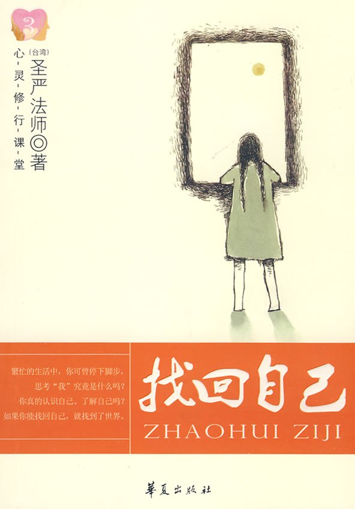

* 書名：《找回自己》
* 作者：聖嚴法師
* 在線閱讀：https://ddc.shengyen.org/?doc=08-08-001
* 電子書：https://github.com/yuqianyi1001/faguquanji  其中的“08 第八輯 生活佛法類”

以下文字大多是書中原文的引用（以雙引號開頭）。個人的補充僅是灰色字體部分。

## 空虛和迷茫

“當一個人不知道自己生存在這個世界上的目的是什麼的時候，就會感到空虛。當飯吃飽了，衣服有得穿，房子有得住，也有自己的車子了，日子過得雖然不是最好，但還過得去的時候，就開始思索人生究竟還有什麼呢？如果找不到方向和目標，心中茫茫然的，空虛感就會出現了。

“空虛的原因，往往是無聊和無奈。像一條在茫茫大海里的船一樣，沒有盡頭也沒有方向，又沒有大風大浪的刺激，好像隨便往哪邊開都是一樣，即使不動也無所謂。只是，不動時好像沒事可做，動了又覺得不是自己的方向而感到無聊，最後陷入一種茫茫然的空虛感當中。有這種空虛感的時候，無論是打保齡球、看電影、喝酒、去卡拉OK、看MTV等，各種各樣刺激的娛樂，都不可能給你一種真正落實的安慰感，不過是暫時麻醉了你、刺激了你，讓你的感覺因忙著一件事情而產生移情作用。一旦時間過了，空虛感又會回來，實際上內心永遠是空虛的。

“當一個人的生命沒有目的，欠缺意義，生活便會顯得十分空虛，甚至像行屍走肉一般。

## 人生的目標、目的、方向感

“‘建立生命的方向感’是我（注：指聖嚴法師）這幾年所積極提倡的一個觀念，我經常在許多對年輕人演講、談話的場合中，提到這個觀念。

“其實不一定是年輕人，中年人、老年人也都應該要有方向感。因為中年人若沒有了方向感，很容易面臨“人到中年百事哀”的困境；老年人沒有了方向感，則容易陷入一種末日將至的恐懼當中。

“因此，在我們的一生當中，一定要不斷提起自己的方向感。有了長遠的生涯規畫，人生才不會茫然無依、誤入歧途。

“所謂生命的方向，其實就是生命的目標；首先要確立主要方向，次要的目標、次要的方向才不會有偏差。主要的目標確立之後，所有次要的目標，都必須在這個方向內進行。工作可以改換，職業可以更易，工作的環境也可以變動，唯一不變的就是要朝這個方向努力。如果我們沒有一個主要的、永遠的大目標，便很容易迷失方向。

“在實踐的過程中，還必須時時以主要目標，做為修正的準繩。例如說你最大的目標是要為國家社會謀福利，結果因為害了人以後可以得到一筆非法之財，或是做了某件壞事以後，可以擁有很大的權力，這樣的事能做嗎？當然不能做，因為這是違背了你自己所設定的大目標。

“那麼，該如何決定我們的目標呢？

“要以自己所具備的條件，再加上所處的環境以及時代背景，來決定方向。我們不一定要做一個偉大的或是成功的人物，但必須要能夠培養完美的人格，以及安身立命。其中身心的平安，應該是最重要的目標。

“很多人常常誤會方向感的意思，以為方向感就一定要做什麼大事。這樣的決心固然很好，可是環境不一定許可你完成。譬如你想要賺大錢，或是想要成為一個大企業家，這雖然很好，但是錢賺不成的時候，大企業家做不成的時候，也還是要活下去，不能因此失去生命的目標。更何況無論是賺錢，或是成為企業家，都不應該是生命真正的方向。

“真正的方向應該是：一生當中不要違背自己的身心安定、健康、安全和大眾的幸福，這才是人生的大方向。

## 人生的四個階段：認識自我、肯定自我、提升自我和消融自我

**認識自我**

“認識自己是很重要的，如同作戰時都強調要‘知己知彼，百戰百勝’，瞭解自己的訓練夠嗎？實力夠強嗎？後勁夠嗎？同時也要知道自己有多少缺點。所謂缺點就是自己的不足之處，包括性格上的、人際關係上的，以及自己是否能如實觀察現實環境。

“瞭解自己除了知道自己的優缺點，也包括清楚知道自己究竟擁有多少資源；即使瞭解得很透徹，也還要打個折扣，因為你所能擁有的，不一定能夠支配、運用。明白這層限制，才是真正認識了自己。

“一個人一旦知道自己的不足，一定會謙虛，雖然他對自己的能力打折扣，但並不等於自卑、沒有信心，而是他不自誇，確實知道自己能夠做到什麼程度。雖然他並不一定走得比別人快，但是隻要盡心盡力，走完以後，就能知道自己真正的能力有多少、能夠發揮的有多少。經過這一番實證所得到的自我肯定，才是紮實的肯定，也才是真正的認識自我。

**肯定自我**

個人補充：個人覺得在聖嚴法師其他書籍裡面的“自我肯定”講述得更加清晰一些，所以下面的內容不是出自《找回自己》這本書，而是其他書籍，具體的書目參考備註。

“自我肯定，必須從因果的事實和因緣的現象來認識自我是什麼？這是一種自我價值的肯定，如果否定這種價值，將會覺得人生只是一場無聊又無奈的惡夢。《聖嚴法師教禪坐》

“自我肯定，就是對自己有信心，如果沒有自信心的人，就會像一隻火雞，遇到警報時，會把翼翅及尾羽豎起來虛張聲勢一番；或者像一隻澳洲的鴕鳥，牠害怕敵人襲擊時，便一頭鑽進沙堆裡，躲起來，自欺而不能欺人地苟且偷安一番。《聖嚴法師教禪坐》

“不過，所謂自我肯定不是自大、虛矯，而是如實踏實。《聖嚴說禪》

個人補充：“肯定自我”可以分為兩個層次：
1. 第一個層次的“肯定”和現代教育裡面的肯定一樣，肯定每個人的價值，肯定每個人都是有價值的，對於個人，家庭，朋友，公司乃至社會。其次是肯定每個人都有無線的潛力，這也是教育初衷，經過教育之後，可以挖掘更大的價值，發揮更多的作用，對家庭乃至社會做出更大的貢獻。
2. 第二個層次的”肯定“則是來自於佛教的理論，即肯定每個人都能成佛，每個人都具足圓滿的佛性，可以經由修行達成圓滿的智慧和慈悲。以人格的角度來說，佛陀具有的最圓滿的人格，即是我們每個人的榜樣，也是我們每個人所能夠達到的“切實”目標。如果可以理解到這層，那麼這個“肯定”也可以說是最圓滿的“肯定”了。

**提升自我（自我成長）**

“知道自己有所不足，就會努力成長自己；如果犯了錯就應該認錯，然後努力修正自己的偏差；能夠改正自己的缺點，就是成長。

“自我成長最好的辦法，應該是多為他人設想。所謂“知己知彼”，知道自己的優缺點以後，就要進一步瞭解他人。瞭解他人的目的並非要打敗他，或是與對方競爭，比較高下、勝負，而是為了要學習。我們可以先從自己周遭的人學習起，譬如一個家庭，如果丈夫能常常看到太太的優點，太太也能常常看到先生的優點；孩子常常看到父母的優點，父母也能常常看到孩子的優點。如此，這個家庭一定能互相尊重，也能互相學習成長。

“我們永遠要謙虛，永遠要知道自己是不足的、是有缺點的，那麼就永遠有進步的機會，也有成長的可能。

**消融自我**

“原則其實很簡單，少一些自私心，多一些慈悲心；少一些煩惱心，多一些智慧心。當有情緒出現時，就要用觀念和方法來調整、疏導以及化解，而這個過程就是在“自我消融”了。

“時時以感恩的心來過生活，‘自我’就會消融。因為知道宇宙之大，個人實在是太渺小了，一個人所知、所能、所奉獻的，都是微不足道的，但反觀我們所接受的恩惠，卻太多、太大了。如果真的能如此自省、覺察，就是懂得自我消融，能生活在‘自我消融’的狀態中，雖然我們現在還沒有成為菩薩、成為佛，至少傲慢心及自以為是的心，就不會那麼地強烈了。

“此外，還有一種自我消融的方法就是懺悔，雖然說‘人非聖賢，孰能無過’，但為了自己的自私自利，而傷害眾生或傷害人，就應該要懺悔。懺悔是表示知道自己的過失，非常對不起他人，而心中有所愧疚。懺悔之後，仍必須負起對他人的責任；也唯有負起責任，愧疚感才會減輕、減少。

“自我肯定的同時，一定也要自我消融。有的人常常不經意會表現出驕傲、自負的態度，但是聽聞佛法以後，懂得觀察和反省自己的缺點，就會有慚愧心，也會變得謙虛；而且想到自己些微的成果和貢獻，是由許多人共同促成的，有時是因為“時勢造英雄”，靠環境造成的，有時是因為有貴人幫忙才完成的，不全然是因為自己的因素。能夠這樣想，漸漸就會轉變自己的觀念，而不再老是覺得自己了不起，傲慢的態度和習氣，慢慢地就會轉變為謙虛和慚愧。如此，自我就能夠減少一點，自我也就消融一點了。

“所以，自我消融是要可以用慚愧的心、謙虛的心，而一點一滴地完成。一開始從消融百分之零點零一就好，只要持之以恆地堅持下去，等到消融到百分之九九點九九九的時候，不就是大菩薩了嗎？

“從自我肯定、自我提昇，到自我消融，是從‘自我’到‘無我’的三個修行階段。

## 真正的自我

“你可曾想過，我們所認為的‘我’，或者‘自我’究竟是什麼？你可能因為從小到現在，大家都叫你這個名字，你也已經聽慣了，就覺得這個名字就是我，我就是這個名字。你也可能會認為：‘我的身體是我，我的家是我，我的思想是我，我的能力是我，我的財產是我，還有我的太太，我的先生，我的孩子，都是我的。’但是在這些話裡，出現的只有‘我的……’、‘我的……’，就是沒有說出究竟什麼是‘我’。

“那麼，‘我’到底是什麼呢？

“真正的自我，應該是能夠主宰自己，能夠差遣、調配、控制自己的身心活動，自己能夠做得了主，這個才是自我。應該要向東走，就不會往西去；能夠主宰自己的雙手去救人、助人，而不是殺人、不是打人；也能夠主宰自己的心，讓它生起慚愧心、謙虛心，而不是驕傲心、自大心。

“盡心盡力做自己能做的，學自己應該學的，承擔自己應該承擔的，儘量地付出，從中不斷地修正自己，這就是找回自我最好的方法。

## 最後的補充

限於篇幅，無法用簡短的文字概括全書的內容，也非常贊同一位讀者的看法 —— 這類具有真正智慧的文章其實可以一讀再讀，個人經驗也是如此，每次讀完一篇，都會發現一些以前沒有注意到的內容，又或是對於已經知道的內容會有新的體會。

除了上述的內容之外，《找回自己》中還有“第二篇，不被自己框住”，“第三篇，迴歸內在的聲音”，共20篇文章。在這些文章中，聖嚴法師經由有一貫的佛學的智慧，用現代的語言重新詮釋了很多常見的觀點，例如“固執和執著”，“主觀和客觀”，“好念頭、壞念頭”，“心與物的調和”，“良心”，“自由和尊嚴”等等。用智慧的眼光釐清這些常見的詞彙和觀點對於自我成長，人際交往來說非常重要。通常來說，人之所以有煩惱，大多和錯誤或偏頗的觀點有關，這樣的情況甚至不容易察覺，所以有時間的話，非常推薦讀者們還是親自閱讀下《找回自己》這本書，或《法鼓全集》中同類型的生活佛法系列書籍。

祝兔年快樂，平安自在。

愚夫合十。

