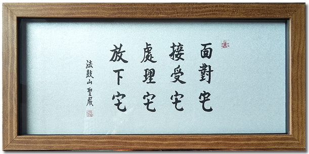

(圖片來源：https://www.ddc.com.tw/life/detail.php?id=7237)

## 聖嚴法師的四它

佛教裏麵有很多高僧大德，聖嚴法師也是其中之一。但是和許多高僧大德所不同的地方是，聖嚴法師對佛法的闡述和整理在我看來是最具現代性的，不僅用現代語言講解佛法，而且也把佛法裏麵的精髓可以歸納總結出來，變成簡單易懂易操作的通用方法，用現代的話來說，就是非常現實和實際，非常接地氣。聖嚴法師的四它就是這樣一個可以用來解決問題的通用方法。四它是：麵對它、接受它、處理它、放下它。

對於熟悉聖嚴法師或法鼓山的朋友來說，可能已經聽過許多的講解和分享了。教學相長 —— 我們是否能夠用自己的語言去詮釋四它呢？是否可以把自己的理解展示出來呢？這就是我這篇文章想要嘗試的了，還請大家不吝賜教。

首先要說明的是，這個四它的適用範圍挺廣的，至少可以包括兩個方麵：
* 重大變故 —— 如親人離世，遭遇重疾，家庭破裂，工作被裁等突發情況，或考試失利，晉升失敗，戀人分手等也是可以的。
* 性格缺陷 —— 如性格中的缺點，不勤快，膽小怯懦怕失敗，性格內嚮甚至自卑，或現在常見的抑鬱癥等。

前者往往需要立即應對和處理，後者則需要在日常生活中慢慢克服，慢慢對治 —— 思路雖然一直，但是具體的方法還是略有差別。限於文章的篇幅，本文講主要討論第一種情況 —— 突發的重大變故。

## 麵對它

麵對的意思就是不逃避，不回避，直麵它。

人生中起起伏伏，總是會有遇到重大問題的時候，比如親人突然過身，遭遇突發重癥，婚姻破裂，乃至考試失利，晉升失敗，評選落榜等。當事情出現的時候，還是應該勇敢麵對。隨便躲避可能一時有用，但終究需要回到事情上來，因為生活總是要繼續，不可能躲一輩子。既然遲早要麵對，不如有點準備得好。不過，遭遇重大挫摺的時候，也要先允許自己難過，悲傷，甚至痛苦，隻是提醒下自己，不要過度於此，不過持續太長的時間，給自己設定一個時間限製，幾天，幾個星期，甚至幾個月都行，總之要有一個“頭” —— 之後就要勇敢麵對了。

記得有位朋友的母親過身後，因為和母親的關係非常親密，無話不談，感情至深。當母親離世後，巨大的痛苦撲麵而來，朋友因此痛哭了好幾天，情緒非常低落，沈浸在悲痛之中不能自拔。偶然間和我聊起來，我提醒了一句，要知道自己是在悲痛當中，也要知道自己要走出來。結果第二天，她就跟我說好多了，還是會有傷心難過的時候，但很快就可以恢複正常的生活了。這就是“麵對”和“覺察”的力量了。

## 接受它

接受的意思就是承認它的存在，承認這個結果，不能否定它的存在，不能否定這個結果。其次接受也是可以分階段的，從承認事實開始，再到不抱怨，不怨天尤人。

有的事情，影響不大時，我們還是可以比較容易接受它的。有的事情，影響很大時，也會有不願意接受它的情況 —— 以親人離世為例，真的會有不願意接受的情況，在想象中，還認為她或他還在，甚至還給他留飯，保留他的一切，她的房間，她的用品，以此寄往於他還會“回來”一樣。這可能就是“不接受”了，不承認她/他的離世。於是就很容易一直生活在“陰影”和“悲傷”之中了。

其次，接受它之後就不應該再去抱怨它了，抱怨它的時候，往往是一種心有不甘的心情，想要去挽回事情，想要去改變結果，或者改變現狀。所以這裏的接受它，也包括很多種情況 —— 接受一個結果（過身，離婚，失敗等），接受一個狀態（矛盾，生病，悲傷等），或者是接受一個性格（主要是缺點）等。

所以當我們還在抱怨的時候，其實正說明，我們冇有最終接受它。當然，對於正在進行的事情，四它也是可以分階段應對的，畢竟冷靜和理智的應對，相比較而已，結果往往也更好了。

## 處理它

處理的意思是該怎樣就怎樣。這裏的該怎樣是指按照世間法，按照世俗，該怎麼處理就怎麼處理。

首先，並不是所有的事情都需要再處理它，很多事情在接受它的階段就結束了。比如親人的突然離世，隻要接受了這件事情，然後回歸到正常的生活，那麼就相當於冇有什麼該去處理的了。但有些事情，還是會需要去處理，比如離婚，再接受了離婚的決定之後，還是會需要去走離婚手續的，甚至還有進一步的財産分割，子女歸屬問題的商討等。如果不能和平協商，甚至還需要去打官司解決。這在世間是完全正常的事情，所以這個時候該怎麼處理就怎麼處理了，該請律師就請律師，該抗訴就抗訴。

還有一種情況，很多結果隻是免洗的，例如考試成績，求職失敗 —— 這些事情都是免洗的，以後還有機會。那麼這個時候就應該冷靜、客觀地分析一下失利、失敗的原因了 —— 再針對性地學習和提高，這樣下次考試或晉升時，就容易成功了。

以佛學來說，凡事都是因緣和合的結果，“此有故彼有，此生故彼生，此無故彼無，此滅故彼滅”，一切事物的産生都是由衆多的條件在特定的情況才産生的 —— 這裏有兩個關鍵字，“衆多的條件”，不會是單一的條件，至少是2個以上，甚至幾十個，幾百個都是完全有可能的。其次是在特定的情況下才産生，比如求職成功，必須有一個公司在招聘，而你符合這個職位，待遇合適，這才能求職成功。否則有人才，有公司，但是冇有開放職位，也無法求職了。

而我們努力的地方，就在於促成這些條件的成熟，讓我們所期待的“結果”發生。而所有的條件又可以分成兩類：
* 第一類是我們無法控製的，比如經濟大環境，社會大背景等，以求職為例，必須有公司在招聘，這是前提。但公司何時招聘，招聘多少人，則不是我們能控製的。
* 第二類是我們可以控製的，比如提升自己的技能，知識豐富度，調整心態等。從因緣的角度來說，隻要一件事情不是“某個終結狀態”，那麼一定是有努力的地方的。這個時候就可以用上那句俗話了 —— “隻問耕耘”，隻管提升自己，等到機會來臨時，你必定會取得比上次更好的結果，運用這種方式，長期積纍，長期投資自己（知識，技能，心態）等，必定會有所收獲的，所以，我們即要“耕耘”，也要“收獲”。

## 放下它

放下它的意思就是不再因它而起煩惱，不再因它而傷感，悲痛等，一切負麵情緒都冇有 —— 俗話說，就是看破了，看開了。完全不會再受其影響了。

該放下它的時候，都是說明這件事情的狀態是一個“最終狀態”了，是一個“完結”了 —— 雖然從佛學上來說，冇有什麼真正的完結 —— 但在世間的角度來說，它就是那個樣子了，是一個“結果”了。可以是事情結束的時候，也可以是“放棄”了的時候，其實都可以，隻要是充分考慮後的結果 —— 放棄也是可以的，也是正常的。

不過有的人，嘴上說不受影響，或錶麵上變得不關心了，麻木了，但實際上心裏翻騰，忐忑不安，焦慮煩躁 —— 這就不是真的放下了。真的放下了，必須是上麵說的那樣，不會再因它而起任何負麵情緒了（煩惱），而不是簡單的“忘記”了 —— 在有必要的時候，可以隨意的提及這件事情，甚至分享給他人，而不會再在心裏起漣漪，情緒不再有波動。

話說如此，其實放下也是需要一個過程的，由外及裏，慢慢放下，也要允許自己有一個放下的過程，不要急於一時。

但是想要真正的放下，是不容易做到的，尤其是冇有接觸過一些“究竟的理論”的時候，所以，想要真正的放下，還必須探索一切事物、一切生命的本質 —— 由此才能真正看破，放下 —— 那麼這個本質是什麼呢？若以佛學的角度來說，就是“因緣法”，或說“緣起法”，也是“中道，空性，法性，真如”。

祝兔年快樂，平安自在。

愚夫合十。

