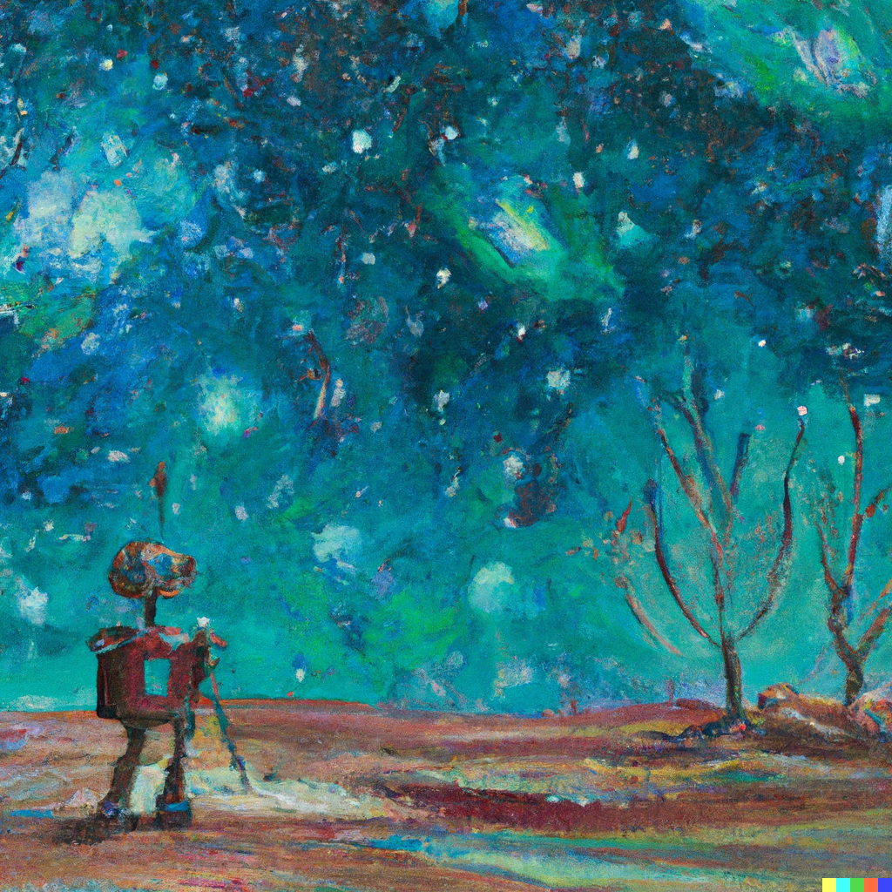

<h3><I>AI apocalypse or a the next in chapter in human advancements?</h3></I>

---------------------------------------------------------------

---------------------------------------------------------------

>"Open the pod bay door HAL" - Dave

>"I am sorry Dave. I am afraid I can't do that" - HAL

With the hype that ChatGPT has generated, one could be forgiven to fear an AI apocalypse on the horizon. But let us keep aside that discussion for movies and History Channel let us look objectively at the impact of ChatGPT on our tech and society. We must look at history to find examples of similar breakthroughs and their impact, we must evaluate objectively what it means for job markets and society.

---------------------------------------------------

## From the Horse's Mouth.
It's the late 19th century and automobiles are a rising trend all around the globe, but still, most of the world depends on horses for transportation, let's hear what is mood among the horses association about this new magic machine.

One group of horses thinks this is just another fancy tool that will be forgotten as it can never serve millions of people all over the world, and the fuel it uses is rare to find.

Another group of horses thinks if anything it means more jobs for horses and better jobs for them, the machines would take over more boring jobs like plowing the field or running water pumps.

The third group is more worried than anyone else and is not taken seriously by most. They worry that this machine would take over their jobs and they would be limited to a ceremonial attraction in parks.

---------------------------------------------------

## Don't be a Luddite.
The Luddites were a secret oath-based organization of English textile workers in the 19th century who formed a radical faction that destroyed textile machinery. They feared that the machines would eliminate the job markets and leave them and their families starving.
When cranes were adopted across ports the workers went on strike to stop them from taking over their jobs. Similar strikes happened across India when computers were introduced into government services.

><b><I>"The real problem of humanity is the following: We have paleolithic emotions, medieval institutions, and godlike technology. And it is terrifically dangerous, and it is now approaching a point of crisis overall." - Edward O. Wilson</b></I>

---------------------------------------------------

## What is ChatGPT
It is a very powerful and well-trained language model. It is trained on a lot of data and can combine that learning to provide custom answers to our questions. As it has been trained on multiple forms of text data like songs, stories, code, wiki, and virtually all forms of text available on the internet it can combine this information to generate custom solutions to our questions.

As powerful and all-knowing as it might feel, it has its limitations. For one, it has no or very limited knowledge of the world after its training and therefore it is not something you want to use for your morning news. Everything it produces is plagiarized because it's all derived from data it was trained on, it only combines it in a useful way to maximize the reward function.

---------------------------------------------------

## The Possibilities
Never in human history has a new tool caused the total number of jobs to go down. Yes, when the telephone came the telegram industry became extinct when the automobile came horse carriages became a decoration on the wall, but it did not reduce the total number of jobs in the world, it only accelerated the pace of human expansion. Turning itself into the factory of the world allowed China to raise billions of people out of poverty and when manufacturing moved out of the USA it turned itself into the hub of innovation and entrepreneurship creating some of the biggest industries in the world.

### The Game of Scale.
Google became the leader in search engines not because it has the most sophisticated search algorithm, but because it has the most indexed pages in the world. The same would be true for upcoming language models, it's not about who produces the clearest and natural output, it is about who has the most information they can generate from.

As we see more such models become reality it would lead to a new kind of tech race one where players would try to compete for users by offering them better tools near real-time information, summarization for easier consumption of information, and tools to get content out faster.

### API's
Just as the Internet led to the rise of software jobs across the world, APIs built on top of these models would provide millions of new jobs for people who would try to build tools using them. An industry would rise which would use these models to generate value.

We would need people to build these models, which would consume a gargantuan amount of data, results that would need to be served across multiple fronts, web, mobile, IoT, and robotics. All this would need an army of engineers, designers, testers, API developers, and above all users to consume these results to produce value for the people.

---------------------------------------------------

## Space: The Final Frontier
Imagine being a miner on an asteroid, with a drill trying to extract Deuterium for fusion reactors on mars, how horrible that experience would be. If you think oil drillers in the middle of the ocean, feel alone and deal with danger, boy this would be on a whole new level (literally). These are the kind of jobs AI would take over one day, did you want that job in the first place, I hope not.
Space is vast and dangerous and filled with uncertain environments; the current generation of robots is not good enough to explore them. We need a smarter machine that is better at taking decisions and this could be a step in that direction, imagine a ChatGPT-like system onboard an unmanned probe evaluating sensor data on a planet before deciding on whether to explore it or move on. It would require combining a lot of existing knowledge like geography, in a sensible way to make a decision. If you are not already aware of The Von Neumann Probe it might be a good time to jump into that rabbit hole.

---------------------------------------------------

## Conclusion
I must say this again, never in human history has a new technology caused a reduction in the total number of jobs in the world.

><b><I>"Give me a firm place to stand and a lever and I can move the Earth." - Archimedes</b></I>

Maybe this breakthrough in AI/ML is the lever that would finally allow us to make humanity an interplanetary species and secure our future.

<b>Hope you enjoyed reading it!!</b>

Feel free to share your thoughts, I would love to hear your perspective on the topic.