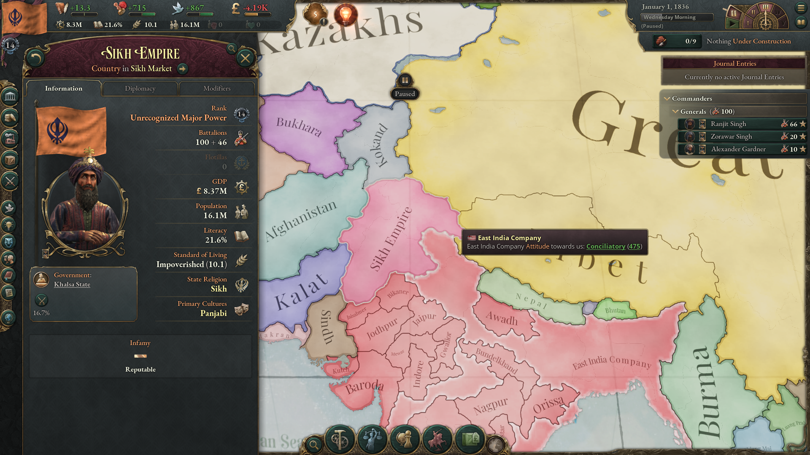
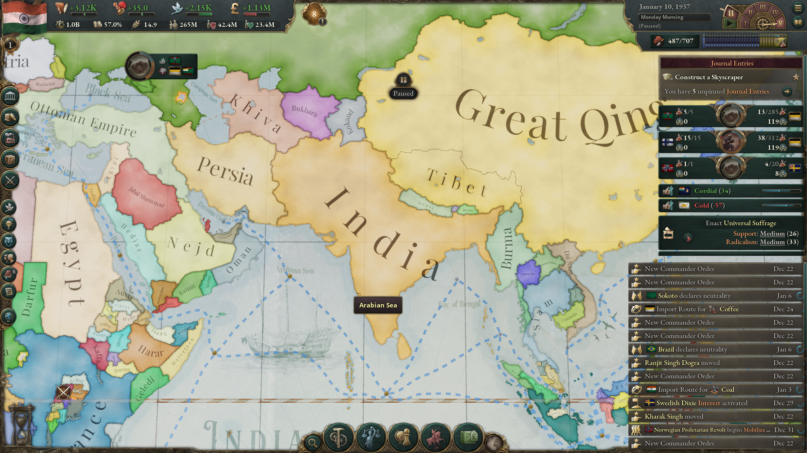

<h3><I>Empire under the pun</I></h3>

-----------------------------------------------------------------------------------------------------------------

-----------------------------------------------------------------------------------------------------------------

Okay so I have been playing a ton of Victoria 3, and being an Indian I had to keep pushing to form India and puppet British Empire.
So, it took weeks of frustrating playthroughs and learning to finally get this achievement in game and that proves why it is one of the rarest achievements in the game. In this blog I would like to go through how I went about it and what challenges I faced so more people could enjoy this.

-----------------------------------------------------------------------------------------------------------------

-----------------------------------------------------------------------------------------------------------------

First let’s go over why this is one of the most difficult achievements in the game.

At the start of the game in 1836, Sikh empire is a land locked nation surrounded by major powers on all sides who want to take over those fertile lands, East India Company being their biggest rivals. With no ports trade becomes limited through land with immediate neighbours like Qing. They do have a big army which helps in the early game but also become a drain on the economy and difficult to feed as you grow. They have little to no innovation and a population too big to tax in early game.

Having looked at the challenges let’s look at some of the opportunities we have as Sikh empire in the game.

Sikh empire starts with a big professional army that could rival any major nation, including EIC if British don't get involved, something we would exploit a lot. They sit on a rare patch of land which can grow a huge amount of opium and are direct neighbours of Qing the unlimited opium consumer, this means we can keep growing and selling opium to raise our tariffs to fund the war.

Now let’s go over the strategy I used.

1. Start by raising the tax to maximum and levying consumption tax on services and opium and some other high value good, you can reduce the salaries of government servants but never for the military as they are the key and we need their moral as high as possible.

3. Improve relations with Qing, Russia, French, Persia and Ottoman as they are the key players on our region and could help us counter British.

2. Next take Baluchistan as it holds a considerable amount of Iron mines which we would need in our early game to feed our Arms industry, also having a few ports won't hurt but we won’t depend on them till later. At this point no major nation would get involved if Russia or anyone else does use it to Force recognition, but try to end this war as quickly as possible.

3. Once you have created a stable supply of iron for your Arms industry and have good relations with Qing annex Sindh this should get EIC involved in the fight add rest of the Punjab and Delhi to war goal and involve Qing on your side by giving an obligation. You could time this with when British go to war with Qing for Hong Kong, this would keep them out of war, in that case you can ask French for help. With your professional army and King Ranjit Singh as a general this would not be very tough to win.

4. Now you can focus on industrializing the nation before the next attack. Focus on passing Serfdom abolished so you can pass Agrarianism to build opium plantations and ship it off to Qing to grow your economy. If you run out of coal take over Afghanistan as a puppet and later annex them.

5. At this point you would have a huge army with nice supply from Arms industry to feed them, try to avoid too many liberal laws for now as it would might cause revolution, we need focus on outward expansion.

6. Next go after smaller puppets of EIC in Rajputana every 5 years and try to take Awadh or Gujrat from them as soon as possible, at this point you would be a great power with enough land to expand your industry freely.

7. Expand your navy and other military technology to match those of British and French, we would need to match British in naval power to have any chance on this.

8. At this stage we can launch a naval invasion of British isles, remember to launch two seperate invasion at the same time, as the AI would only defend one and let the other pass. If your military is big enough you would easily be able to take over British Isles in not time, keep a few units on defence against EIC, not need to take any more land from them for now.

<h3><I>Empire Under the Pun</I><h3>

9. With British defeated its colonies are for the taking, especially EIC which we can now puppet along with its own puppets, note at this stage due to your infamy you might have a few nations taking EIC's side to defeat you. But as you now have British forces as well to support you it should not be a big challenge.

10. Once you have made EIC your vassal try to push out French from madras port and Portugal from goa to unite rest of Indian territory, at this stage you can form INDIA.

<h3></I>Celebrate/I></h3>

-----------------------------------------------------------------------------------------------------------------

-----------------------------------------------------------------------------------------------------------------

<I>btw its the sun coming up, you should go sleep now</I>
