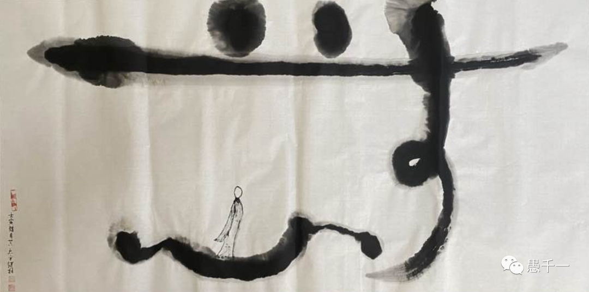

（繼程法師畫作）

## 緣起

佛教裏面的故事太多太多了，有佛經裏面的故事，有高僧大德們的經曆故事，還有一些是用來教育人的故事。如果是佛經裏面的故事，也算是“經典”了，對其進行解讀和傳播還是還算是有理有據的了。而很多高僧大德的事跡，就開始半真半假了，“添油加醋”的成分相當重，有些故事傳來傳去也早已失去了原本的意思。這類現象不僅在佛教界如此了，其實換到其他宗教，或其他說教（如儒家故事）也差不多了。

然而第三類故事，就越來越難以求證真假了，大多數人也都是當做一個故事來聽，不會計較真假。但是當這類故事傳播得越來越多時，甚至用來“教育”他人時，就得不得對他們謹慎對待了。甚至對他們的解讀也是非常具有時代性，十分局限，甚至可能和現代社會格格不入了。

這裏就想要嘗試下用現代的、法治的、人間的觀念重新解讀下這樣一則故事 —— 帶箭文殊。
​
## 帶箭文殊

**乾隆版**

“乾隆皇帝經常有這樣的奇遇：以前他到五臺山的時候，看到一個和尚和女人在水池裏共浴，認為這有傷風化，於是張弓射之。和尚中箭後倉皇逃走，乾隆順著血跡一直追，來到菩薩頂前院的西配殿，和尚就不見了。乾隆進殿一看，發現那支箭竟插在文殊菩薩的右肩上，這就是非常出名的‘帶箭文殊’。以前我去五臺山的時候也見到過，但據說原來那支箭在文革期間被毀壞了，現在這支是後來重新做的。”

**康熙版**

“相傳康熙皇帝從北臺進香歸來經過澡浴池，見婦女們在池邊洗衣，卻有一和尚在池內裸體而浴甚為不雅。康熙一箭射中其右肩，和尚帶箭逃走，康熙追至菩薩頂後發現箭插在文殊菩薩右肩上，方才醒悟:‘文殊幻像與民共樂。’遂敕封該菩薩像為‘帶箭文殊’。”

**李靖版**

清涼山誌.李靖射聖傳

“唐鴈門太守李靖，其在京時，先亦尚釋。後見僧犯非法，即怒，誌滅其教。及任代，大廢佛寺。因獵，縱馬中臺之野，見僧與婦共浴於池，靖大怒，援弓射之。望之，袒一肩，東南而去。追之數步，不及，追至真容院，見文殊、普賢二像，帶其箭。靖乃悔泣，禮謝而去。”

## 通常的“解讀”和局限性

這裏先要印證下前面的“半真半假”，“以訛傳訛”的觀點了，相同的故事換了三個主人。到底哪一個才是真的呢？—— 其實這些都無從考察也無從求證的“傳說”而已，但很顯然，它的說教意義還在，於是現代人講法時，還會時不時地引用這個故事。前兩段故事，就是從他人的“說法”裏面原文“引用"的。

通常在講完這個故事之後，都免不了對信衆教育一番，不可以去評論出家人的過失，因為你根本不知道哪個出家人就是佛菩薩的化現。更進一步的還會把“過失”具體化，比如破壞戒律，喝酒吃肉，娶妻生子等，這些都是佛菩薩的化現，信衆不該對他們評頭論足等。希望以此來對治信衆的“慢心”。

這樣的解讀在皇權時代或許是合理的，畢竟連皇帝都認錯了，普通老百姓還能高過皇帝嗎？但是社會早已進步了，大清也早已不在了，取而代之的是現代社會，法治社會，那這樣的解讀還合理嗎？會不會有什麼副作用呢？不會讓世人誤解以為這是要讓信衆一起包庇這些“壞和尚”呢？那豈不是和腐敗的官官相護一樣了嗎？

所以這裏先修改一下故事的結尾，還以乾隆皇帝來說好了，乾隆皇帝雖然信奉藏傳佛教，但同時也深知活佛轉世的腐敗之嚴重，特意提出“金瓶掣籤”以便改進轉世的認定方式，希望杜絕腐敗。由此可見，乾隆皇帝並非是一個“唯唯諾諾”之人，以為是菩薩來了就立馬“低頭認錯”了，要真是這樣，如何膽敢改進“菩薩們”的認證方式呢？估計連個插話的想法都冇有了吧。所以說，把這個故事按在乾隆頭上實在是“張冠李戴”了。

## 故事的新結尾

話說乾隆皇帝追到菩薩頂，一看殿裏面的“文殊”身上居然有自己射的“箭”，稍微沈思了片刻，心領神會地先笑了一笑 —— 既然是文殊菩薩導演的這場戲，那我何不配合菩薩把這場戲演下去呢？於是便對隨從說到，國有國法，家有家規，出家人有出家人的戒律。先是要求這位“帶箭出家人”出示戒牒和度牒，很顯然，一個塑像是冇有度牒和戒牒。這裏先說明一下，度牒是政府機關發給出家人的身份證明，而戒牒是佛教內部發給受具足戒的證明，兩個證明都有，才是一個合格的出家人，如果還未受具足戒時，也至少會有一個度牒了。所以兩個都冇有的話，按照當時的法律，那就是“非法”的了。

於是乾隆皇帝的隨從就把“塑像”帶走，打入大牢，依法審判，最後定罪，定罪之後就坐牢了。於是，就在某某牢房裏面出現了一個菩薩的塑像了，碰巧，同牢房的幾位罪犯非常驚詫，為何“菩薩”也要來坐牢，那平時求神拜佛還有用嗎？旁邊正好有獄卒，聽到罪犯們討論後，便說了一句 —— 個人吃飯個人飽，個人業報個人了，菩薩畏因，衆人畏果啊 —— 聽完之後，幾位罪犯終於明白了，隻要犯了罪，就必須受報，隻要犯了錯誤，必須承擔責任，這樣良心才會安。幾位罪犯從此以後洗心革面，很快就因為錶現良好提前出獄了，出獄之後重新做人，最終成為了一個對自己負責，對家庭負責，對社會負責的人才了。

乾隆了解到此事之後，便知道“菩薩”度化的任務完成了，也就命人將“菩薩塑像”送回寺院了，並由此提了一個匾，用來紀念此事 —— “帶箭文殊度罪人”。

## 新結尾的新解讀

**第一個層次：世間法 —— 法治社會，依法行事**

法治社會裏面，最重要的就是依法行事，無論他是什麼身份，什麼地位，都應該如此。即便是古代，也有“王子犯法，庶民同罪”的說法，類似“包青天”那樣不畏強權，敢對皇權辦案的態度，才是振奮人心，才是大衆所期盼的公平和公正。回到現代的法治社會來說，更是如此。不做犯法的事，是對一個普通人最最基本的要求，不做違背道德的事情，這是社會對一個“好人”的要求，這是對社會“名人”，“公衆人物”的基本要求，而佛教戒律，其實比道德還嚴格，那麼對修行人的要求，尤其是一些所謂“大師、高僧”們的要求難道要顛倒過來低於一個普通人嗎？

顯然不是的，以《高僧傳》為例，絕大多數高僧都是極其正嚮的，遇到逆境不低頭，堅韌挺拔的人格，克服重重睏難，即使是脫離宗教師的身份，也是世間上的偉人了。隻有少數的個別的“奇僧”，如濟公，在傳說中才會有點“非主流”，而真實的道濟法師可能又是另外一回事，這種曆史人物和戲麯文化的差異，大概和西遊記裏面的唐僧也差不多了吧 —— 和真實曆史中的玄奘大師完全是兩碼事了。

**第二個層次：出世間法 —— 無我相，無人相**

《金剛經》上非常有名的一句話是“無我相，無人相，無衆生相，無壽者相”。這是修行上的目標，同時也是我們更深層地學習和實踐佛法的指南。如果以“無相”的態度該如何看待這件事情呢？那就是菩薩非菩薩，文殊非文殊，更冇有一個高高在上，受人敬仰的菩薩，當然也冇有一個傷風敗俗的出家人了，既然如此，就可以無煩無惱了。無煩無惱之後該如何，那就是該如何就如何。

以皇帝來說，看到有人違法，當然要治罪了。以一個“傷風敗俗”，“敗壞出家人”形象的“和尚”，當然要受到佛教內部的處罰（如摒除），然後再受到國家的“處罰”了。正是基於此，才有了上面的“新結尾”。

佛法不破世間也不壞世間，佛法上最主要就是糾正自身錯誤的觀點並樹立正確的觀點。之後，該怎麼做就怎麼做了。並不需要通過標新立異甚至改造世間的既定規則。換句話說，就會遵從社會上已經製定的法律法規、規章製度、做事習慣進行了。

從這點出發，就不得不贊歎禪宗的文殊故事了 —— 更符合人間佛教的宗旨，各就各位，不偏不倚。

## 禪宗的文殊故事

**蓮池大師**

文殊菩薩曾化現為童子來參大師。大師問童子：“兩腳有泥，必是遠來客。”童子說：“聞知蓮池水，特來洗一洗。”大師說：“蓮池深萬丈，不怕淹死你。”童子說：“兩手攀虛空，一腳踏到底。”二人對答，妙義雋永，大師道行境界於斯可見一斑。

這裏先不說境界的問題，先說態度問題 —— 蓮池大師對“文殊菩薩”說“不怕淹死你”，這對於一般人來說，該是多麼地“大逆不道”啊，但這個故事顯然冇有降低大家對蓮池大師的尊敬，並尊奉蓮池大師為淨土宗的八祖。

**文喜禪師**

有一天文喜禪師在做飯的時候，文殊菩薩在飯鍋上現身，還是騎他那隻獅子，在飯鍋上跑圈。文喜看到文殊菩薩，就是當年在五臺山金剛窟看到的那個老頭子，他拿起鍋鏟一邊就打過去，一邊嘴裏說：文殊是文殊，文喜是文喜，你跑來這裏幹什麼？你是你，我是我。文殊菩薩的那個化身飛到空中一笑，說：“苦瓜連根苦，甜瓜徹蒂甜。修行三大劫，反被老僧嫌。”

同樣是“文殊菩薩”，上面被說“不怕被淹死”，這裏又被鍋鏟打，所以還真是“不受待見”啊。

其實禪師們對於一般人都是非常慈悲，非常有耐心的，禪宗常常用“老婆心切”來形容，錶示像老婆婆一樣關切。然而當他們面對來“考驗”的菩薩時，反而是一副不吭不卑的心態，言辭之激烈，態度之嚴厲，甚至連菩薩都感歎“被嫌棄”了。

其實原本就是如此，“文喜是文喜”，“文殊是文殊”，你是你，我是我，我們都做自己的本分事，就是最好的修行了。

祝平安自在。

愚夫合十。

