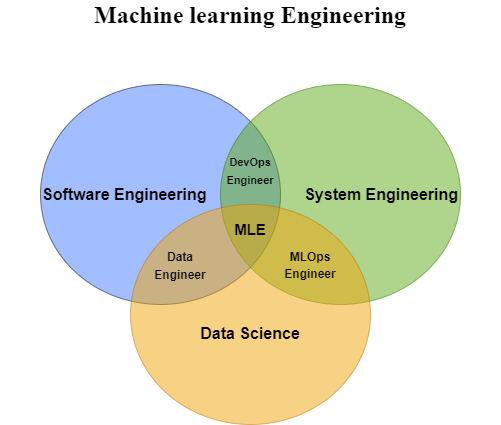
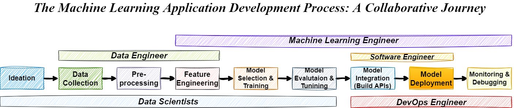
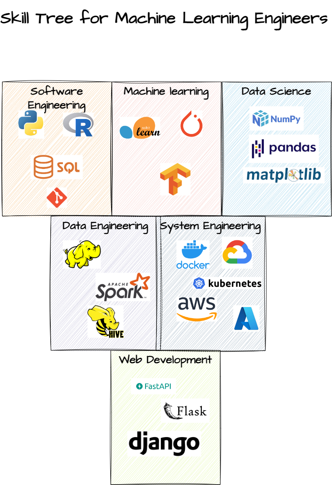

<h3><I>Bridging the Gap Between Data and Solutions</I></h3>

<h5><I>What is a Machine Learning Engineer and how do you become one?</I></h5>

-----------------------------------------------------------------------------------------------------------------

-----------------------------------------------------------------------------------------------------------------

> "The rise of powerful AI will be either the best or the worst thing ever to happen to humanity. We do not yet know which." - Stephen Hawking

As long as I have been an MLE people have always asked me what it means, in one form or another, everyone has their own interpretation as the field is still evolving with new ideas like MLOps coming to light. After being one for the last 5 years I think I have some qualifications to try and answer that question.

> "Are you like a data scientists who can code?"

> "How are you different than a software engineer?"

> "What does your day at work look like?"

> "What skills do I need to learn to become one?"

So through this article, I would like to answer some of these questions and provide a basic overview of what is a MLE and what skills you need to become one. Let's go...

<h2>What is a Machine Learning Engineer?</h2>

---------------------------------------------------------------

---------------------------------------------------------------

A Machine Learning Engineer sits at the center of 3 key domains; Software Engineering, Data Science, and System Engineering. Now, this does not mean we are experts in all these trades but that we can combine them to build products that are reliable, consistent, and resilient.

<h3>From Ideation to Production</h3>

---------------------------------------------------------------

---------------------------------------------------------------

As shown in the above image, ML product development needs multiple roles to work together to deliver a great product, let us take a closer look at each of these stages and the roles associated with them.
- Ideation: Define the problem you want to solve and how it adds value.
    - Data Scientists work with businesses to define what's possible and how it can be used to solve the problem.
- Data Collection: The team collects & identifies relevant data sources keeping data privacy in mind.
    - Data Scientists define what kind of data is needed and its attributes.
    - Data Engineers identify the relevant data sources and bring them to the staging layer.
- Pre-processing the data, for example joining multiple data sources into semantic tables for easier consumption.
    - Data Engineer plays the key role here by making sure data is ready to use and pipelines are compliant.
    - Data Scientists make sure the transformations applied do not create biased data sources and meet the requirements.
- Feature Engineering: The team uses the raw data to build features that are informative and useful for the model.
    - Data Scientists build features that could feed useful information to the model, they also make sure these features are nonbiased.
    - Machine Learning Engineers here are to make sure that feature transformations are reproducible, modular, and scalable in nature.
- Model Selection & Tuning: this is when the team starts building the model and tuning it to produce high-value results.
    - Data Scientists experiment with an array of models to find the one that fits their needs and use hyperparameters to tune the results.
    - Machine Learning Engineers are the ones building these models sometimes from scratch or by implementing existing algorithms.
- Model Integration: the team builds APIs that can deliver model results seamlessly across the organization's infra.
    - Machine Learning Engineers play the main role here by optimizing and building training, and inference pipelines that can be consumed by these APIs
    - Software Engineers implement these APIs to make sure they adhere to industry standards.
- Model Deployment: At this stage, the team deploys its product across multiple stages like DEV, UAT, and PROD.
    - Machine Learning Engineers implement a reliable MLOps framework which would allow the team to monitor training and results over time.
    - DevOps Engineers are useful in this stage as they can help implement a string CI/CD system to automate these processes.
- Model Monitoring: The MLOps framework built allows the team to monitor the results and make any necessary changes.
    - Machine Learning Engineers push new features to make the system more stable and keep the results consistently over time.
    - DevOps Engineers can help build more automation at this stage.

<h2>Machine Learning Engineering Skill Set</h2>

---------------------------------------------------------------

---------------------------------------------------------------

As a Machine Learning Engineer, you will need to have a good understanding of various technologies to build and deploy machine learning applications.

<ol>
    <li>Programming Languages: You need to have a good understanding of programming languages such as Python, R, and SQL to build machine learning models and data pipelines.</li>
    <li>Machine Learning Libraries: You would need to know machine learning libraries such as scikit-learn, TensorFlow, and PyTorch to build, train, evaluate, and deploy machine learning models.</li>
    <li>Data Science Libraries: Although exploratory analysis won't be a big part of you should also be familiar with data science libraries such as NumPy, Pandas, and Matplotlib to preprocess, analyze, and visualize data, this would allow you to play a bigger role in smaller firms.</li>
    <li>Big Data Technologies: You need to have experience with big data technologies such as Hadoop and PySpark to handle large volumes of data needed to train these models.</li>
    <li>Platform & System Engineering: You should be comfortable with cloud computing platforms such as AWS, Google Cloud, and Azure to deploy models on the cloud.</li>
    <li>Containerization Technologies: Such as Docker and Kubernetes to package and deploy machine learning applications would give you an edge, as many companies today face challenges with deploying models on existing infra.</li>
    <li>DevOps Tools: You should be familiar with DevOps tools such as Git, CircleCI, and Azure DevOps to automate the build, test, and deployment pipelines.</li>
    <li>Web Frameworks: This one is optional but in my experience knowing how to build APIs to deliver results of your model gives you an edge over others, learning FastAPI, Flask or Django would go a long way for your career.</li>
</ol>

Keep in mind these are skills people develop over many years and no one expects you to know everything at the start of your career.

<h2>Accidental Engineers</h2>

Most machine learning engineers I have met including myself were once aspiring researchers or data scientists who over time realized that they have the soul of an engineer and enjoy building and deploying models more than experimenting on notebooks. But the role itself has existed since the later 50s with an evolving title.

<ul>
    <li>Statistics Engineer</li>
    <li>Knowledge Engineers</li>
    <li>AI Programmers</li>
    <li>Quantitative Engineers</li>
</ul>

All these have shared some common attributes with Modern MLEs, as they all sit closer to researchers and help engineer their ideas into reality. This is the key to being a successful MLE a strong understanding of Data Science should be the foundation of any Machine Learning Engineer as they should be able to develop new algorithms or customize existing ones to solve unique problems.

<h2>Conclusion</h2>

Names and labels might keep changing over time but the fact is mad scientists would always have minions by their side turning blueprints into reality.

<h4>If you enjoyed the article.</h4>

> Leave a comment to let me know what you think.

> Connect with me over [Linkedin](https://www.linkedin.com/in/agni25/), [Medium](https://agniakash25.medium.com/)

> Share the article with your network.