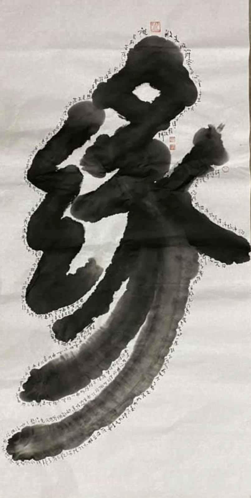
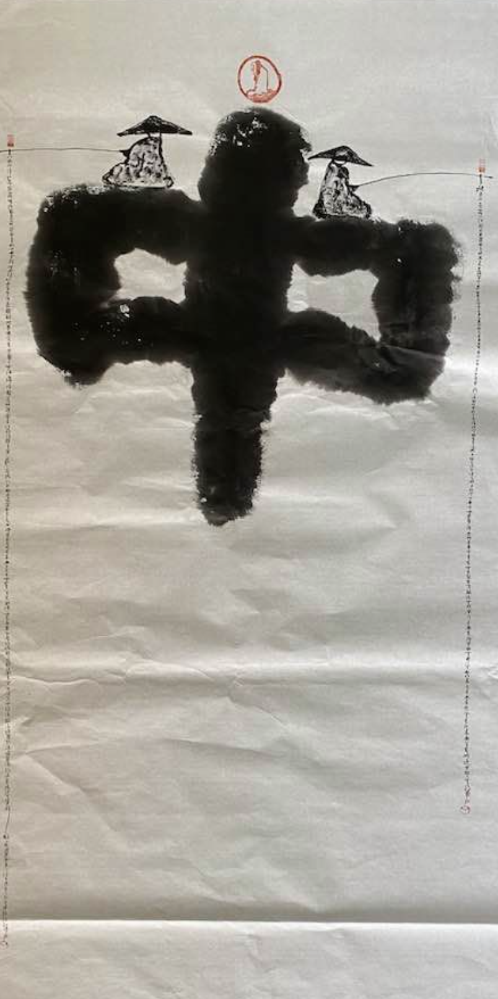

佛教从释迦牟尼佛弘法的时代开始，至今已经过去了2500多年了，在这漫长的传播当中，佛教也不断吸收当地的文化，并由此发展出来各种各样的形态，充分展示了佛教的灵活性和坚韧的生命力。除此之外，祖师大师们也不断地用佛法去诠释很多旧有的思维和文化，并以此希望作为接引和教化信众的桥梁 —— 通过这个桥梁进入到真正的佛法当中 —— 而这个桥梁就是佛教中的“方便法”。

时过境迁，这个原本应该当做桥梁作用的方便法，却慢慢地变成了很多人所追求的目标了，这种本末倒置的现象在当今的社会当中非常普遍。然而，这类现象并不新鲜，佛经里面常用的“如标月指”来形容这类方便法，而对于这些现象则批评说“如愚见指月，观指不观月”[1]。意思是说 —— 有人问月亮在哪里，那人便用手指指给他看。结果问的人不去顺着手指看月亮，反而研究起来这根手指来了 —— 说它是胖是瘦，是白是黑，指甲很漂亮，上面戴的戒指也很漂亮等等。这就是本末倒置了。

有鉴于此，我们才要回到目标上来，回到月亮上看来，那便是这篇文章要介绍的主题 —— 佛教中最核心、最根本、最重要的理论 —— 缘起和中道。

## 缘起

（继程法师画作）

先说缘起，或叫因缘。有时为了强调他们的法则性，就称之为 —— 缘起法，或因缘法。

最核心的缘起理论只有四句话，即“此有故彼有，此生故彼生。此无故彼无，此灭故彼灭”。分别说明了一切事物的四种状态 —— 有、生、无、灭 —— 都是相互依存的关系。很明显，有和无是一对，生和灭是一对。生和有是关联的，生起未灭，称之为有。先有后无，称之为灭，所以无和灭也是有关联的。以一个完整的生命周期顺序来说，即是 —— 生，有，灭，无。

**什么是生？**

其次解释如何是生？即一切事物的产生，都是由众多的其他事物在特定的条件下产生的。这里有两个关键字，一是众多，即两个以上，二是特定的条件。当然，这个众多里面，有时可以再分主次，主要的就称之为“因”，其他的可以称之为“缘”。特定的条件是指“因”和“缘”要能够发生作用时。

最常见的例子之一便是 —— 一颗种子发芽生长的过程。种子 —— 即是因，是最重要的因素。种子想要发芽离不开空气，水。这里的空气，水就是缘。如果只有种子，而没有水，或没有空气，也是不能发芽的。想要发芽，必须让种子，水和空气相互接触才行，最常见的做法就是把种子放到一个湿润的土壤里面 —— 这就是特定的条件了。

以上的例子中不难发现，种子是最重要的，没有种子，就没有发芽等后续的一切事情了，因此这里的种子就是“因”了，其他众多的元素称之为“缘”，特定的条件常用“和合”或“际会”来表达，整个合起来就是“因缘和合”或“因缘际会”了。

不是所有的事务都有单一的“因”，有些事物的“因”可以是两个，例如生育，想要生育一个健康的宝宝，必须同时要有两个人，一个男人和一个女人。这两者的作用同等重要，因此就可以说这里的“因”是男人和女人了，而所谓的缘则是他们想要共同生育的意愿以及合适的时机，最终才能怀孕，分娩和养育孩子了。

其次还有众多因的时候，例如煮八宝粥，既需要八种不同的食材才能煮出一顿八宝粥来，八者也缺一不可，也不可雷同，否则就不能是严格意义上的八宝粥了，可能是七宝粥，六宝粥，甚至三宝粥，二宝粥，一宝粥了。所以这里的八种食材就可以称之为因，其他的条件，如锅，火，煮等就是缘了。

以此类推，还有更多“因”的情况，甚至还有无数种因的时候，当一件事情足够复杂，其中的关键因素必然也多，重要的部分都可以称之为“因”了。有的时候，因和缘很容易区分，有的时候，却不容易区分。当不容易区分的时候，就把所有的条件可以都称之为“缘”了。从佛学概念的角度来说，“因”也是“缘”里面的一种，只是因为他的作用突出，因此才在有些事情单独起名叫“因”了。

（缘可以分为：因缘，增上缘，所缘缘和等无间缘。）

**什么是有？**

生是最重要的概念，理解了生，再理解后面的有、无和灭就相对容易了。

其次说有，什么是有？即一种事物的持续状态叫做有，这个有，和生一样，同样需要具足各种条件且不被破坏才能持续下去。如人之所以“有”生命，是因为有食物，空气和水的供给才能“有”，这三者缺一不可。如果缺少了，就会迅速走向灭亡了，就不能再持续有了。生命的有，还比较容易说明和体验。但一般物品，甚至山河大地的有，日月星辰的有，就不容易发现他们持续“有”的条件了，即便如此，但还是可以推理一下。

例如一座山要持续有，就是因为这座山所在的地基要先有，如果它的地基哪天不稳了，那么这座山也会发生变化，要么形状发生了变化，要么甚至完全消失了。可能发生这种地基变化的可能有地震，火山，海啸等。甚至可能是人为的原因，例如有一天需要开发这块土地，而土地上原本有座小山，综合考虑把小山给推平了，然后再开发搞建设了。

山河大地如此，日月星辰也是如此，他们之所以有，是因为他们的状态暂时是稳定的。一旦稳定的条件发生变化，他们的存在也就立即会发生变化了。古代的人想要理解日月星辰的变化相对困难，但现代科学，尤其是天文学已经非常发达了，例如一颗黑洞就可以瞬间吞没好多星球。而星系之间也会发生碰撞，只是因为天文学的庞大性，“暂时”稳定的状态随便就是几百万年，几亿年之多，让仅有百年生命的人，误以为他们是“恒定”的状态了。

所以“有”必须依然条件，且不遇到其能被破坏的事件，才能持续地“有”。

**什么是灭？**

当一切事物存续的条件发生变化时，事物就从一个稳定的状态逐渐变得不稳定，直到最终的消亡了。或者遭遇到一个外力的干扰时，事物也能被瞬时发生消亡，或逐渐灭亡。

如人的生命，即使是没有病变，没有遭遇意外，人还是会老，会死。

这是一般人的经验和体验，但如果从医学的角度来说，一切器官的运作都有消耗，都会有损耗，当消耗和损耗发生到一定程度时，就不能再继续工作了。一切生命，都有生命周期，都会死亡。在科学上，至今也没有发现不会死的“生命”了。

其次是一般的物品，也是同样的，即使内部稳定可以保持很久，如山河大地，但在遇到重大灾难或地壳运动时，同样会发生变化，甚至灭亡。这就是为何会有曾经的陆地变成了海洋，曾经的海洋，变成了陆地。而日月星辰也是如此，星球之间的碰撞，或遭遇黑洞等，都可能会导致一个星球的消亡。

只要是有的东西，一旦把时间拉长，终究会归于消亡。只是因为认知的手段不同，一般人所了解的范围是不同的。在古人看来，山河大地，日月星辰几乎是永恒的。但在今人看来，山河大地受地壳运动的影响，无时无刻不在变化之中，只是因为变化缓慢，才让我们觉得他们没有变化而已。日月星辰也是如此，但目前科学上已经可以观测到星系的消失了，黑洞吞没星系的场景，这是多么伟大的进步啊。

**什么是无？**

无即使消亡以后的状态。无并不是说一样东西突然消失得无影无踪了，无的意思是，原本的那个事物消亡了，或消失了。

如生命死亡以后，我们经常会说他没了，不在了。这并不是他的遗体不在了，或骨灰没有了，而是说这个“人”，一般意义上的“活人”不在了，没有了，这个状态就称之为“无”了。

物体的无也是如此，例如一个苹果，被吃了，被分解了，那么这个“苹果”也就没有了。小到一个苹果是如此，大到山河大地，日月星辰也是如此，或终究会如此。只要把时间拉得足够长，那么一切事物都会走向灭亡，消失 —— 这也是般若中常说的“毕竟无”，“毕竟空”的含义之一了。

## 中道

**不常不断**

说到这里可能有人会觉得悲观，如果一切的事物终究是要灭亡的，那么我们存在的意义在哪里呢？

事实上，并不会有一切都灭亡的时候，一切事物都会在流转，只是换了个形式，换了个样子 —— 这就是佛法上说的“不常不断”。不常即意味着没有自始至终、永恒不变的事情的存在，一切事物的产生和持续都是相互依赖相互依存的结果。从最严格的意义上来，一切事物无时无刻都在发生变化，并没有一个绝对静止的东西的存在。如现代的科学发现，即使是在一个极其微小的原子里面，还有电子在围绕着原子核在运动。

不断，即意味着一切事物都是生生不息，不要误会，并不说一个苹果被吃了，以后会再有一个一模一样的苹果。生生不息的意思，一切事物不会完全断灭，绝对断灭。以苹果为例，苹果被吃了，果肉变成了人的营养，内核又变成了绿色肥料从新进入生态，就是人吃进去后，有些成本也会排泄出来又会滋润了其他的生命，尤其是以前的农村，经常用人和动物的排泄物来施肥的时候，这种蔬菜水果的生生不息感会更有体会了。如果苹果不是被吃了，而是烂在地里面了，更是如此，立即成了肥料了，苹果的一切都会进入生态系统，然后多少又回到了新的苹果上来。

对于事物的生命循环，比较直接，也符合大多数人的观察，所以比较容易被理解的。其实这个道理，也适用于生命的，这就是佛教里面非常重要的十二因缘了。即无明、行、识、名色、六入、触、受、爱、取、有、生、老病死。为了说明生命的生生不息，十二因缘通常也可以解释为三世两重因果，即是说，因为过去的无明、行，产生这世的生命（识、名色、六入），以及这世的行为（触、爱、取），因为欲贪，欲爱，执取，便会导致下一辈子的“生，老病死”。

只是受限于目前的科学和医学发展，还无法完全搞清楚“意识”是怎么回事，所以对于生命的生生不息是有很多模糊性，不能完全了解。但如果对此有兴趣，其实有很多的纪录片有探访过一些还存“前世记忆”的人，又或者是一些心理医生从催眠的方式，了解到一个人记忆深处的东西，是从未去过的地方，从未了解过的事情，但却在记忆深处被唤醒。没有“亲身经历”过这些的人，的确是很难相信的，但只要保持一颗开放的心态，自然而然就会有更多的发现的。

不常不断是佛教里面中道思想里面最重要的概念之一了，同时也是佛教和其他宗教所不同的地方（佛学上称之为“不共”）。不常，即否定了有一个自始至终、永恒存在的造物主。也否定了人的生命会有一个永恒不变的“灵魂”存在，想要正确了解佛教关于生命的轮转，就必须深入学习唯识了，尤其是其中的第八识，即阿赖耶识，其特点之一就是不常不断，即否定了永恒不变“灵魂”的存在，又为“生命”的生死流转找到了一个逻辑自洽的“依托”。限于篇幅，再此不做开展了。

**不落两边**

中道思想最重要的特质就是不落两边。各种思想，无论是古代的，还是现代的，都容易落入一边，因而产生了各种认识上的偏差。

古代印度，其他宗教经常落入的两边是：

* 常是一边，认为有造物主的存在，断是另外一边，认为一切都是临时的，终究归于灭亡，然后一切都无了。
* 有（生）是一边，认为一切实有，自性有。空（灭）是另一边，一切都终究归于灭亡，然后一切都无了，认为一切都是虚无的。
* 一是一边，主要是泛神主义，认为有一个大我，一切都在这个大我之中，大我无处不在，无时不在。另一边是异，认为一切都是独立存在的，否定他们之间的联系。

而佛法是不落入两边的，对此最有力的回应即是《中论》中的八不：

**不生亦不灭。不常亦不断。不一亦不异。不来亦不出。**

而现代的很多人都宣称自己相信科学，进而标榜自己是唯物主义。其实要说到唯物主义并不新鲜，古代印度时就有一个宗教叫做 —— 顺世派，即认为世间的万事万物都是物质的而已，从而否认有自主的精神作用，进而演变成了重视物质的享乐主义 —— 这和当今社会中贪图享受的人的思想何奇一致啊。

也有很多人认为佛教是唯心主义 —— 其实这也是对佛教的误解。虽然佛教重视“心”的作用，但并不完全否定外在的事物的暂时性存在，相反，对于他们的认识和观察也很多，如根据人的感觉器官而展开的六根与六尘，即眼耳鼻舌身意，色声香味触法，其中前面的五个 —— 色（眼睛所见到的）、声（耳朵所听到的）、香（鼻子所嗅到的）、味（舌头所尝到的）、触（身体所接触到的，硬，软，涩，滑等） —— 都是物质性的，有时又把这些统称为“色法”。

所以佛法并不是纯粹的唯心主义，那更不是纯粹的唯物主义了。

**总结之观念上的中道**

以上的中道，可以称之为观念上的中道，思想上的中道，或认识上的中道 —— 不落两边，不执着于任何一边。因为执着于任何一边都是偏颇，容易产生烦恼，进而变成冲突和矛盾。

当然，中道也不是骑墙，不是说有一个中间的位置可以立足，如果有一个中间的位置可以立足，那就像骑墙了。佛法的中道是不执着于两边，只要不执着于它就可以了，那什么是这里的执着呢，就是认为一定是那样，绝对是那样，然后彻底否定另一边。如有人认为绝对是空，有的东西都是虚无缥缈的。或有人认为一定是有，会灭亡的只是他们的表象，他们的本质会一直存在的。这样就是执着于另一边了。

**总结之事项上的中道**

事项上的中道即远离极端的行为，偏激的行为。

如极端的享乐是佛教所反对的，极端的苦行也是佛教所反对的，佛教鼓励合情合理的生活享受，生活品质。如果你有万贯家财，那么你购买豪车住在豪宅都是合情合理的，佛教对此并不反对（这是对在家人而言，出家人则要遵守戒律了，会有非常不同的规定）。相同的道理，佛教也鼓励适当的苦行，因为苦行可以锻炼出坚韧的意志，坚强的品质，以此来维护修行人所需要的道心，但佛教也反对无意义的苦行，如自虐等。

其次是修行上，不要太紧，也不要太松。

太紧时，容易有“急功近利”“急于求成”的心态，想要一天就念诵完一本大经，想要一个月就完全改掉一个毛病，想要一年就完成一件大事。这些事情往往是脱离实际的，不现实的。其次是太松，太松则会产生“懈怠”，“放逸”，从而浪费了宝贵的时间，珍贵的生命。佛经里面有一个非常有名的弹琴喻[3] —— 佛陀问一个在出家前以弹琴为生的弟子，琴弦太紧会如何，弟子回答说，声音太刺耳，且琴弦容易断。佛陀又问，太松会如何，弟子回答说，声音出不来。修行也是如此，要不紧不松，每个人的“度”不同，甚至同一个在不同的阶段的“度”也不同，所以要时常观察和调整这个“度” —— 现代的人多用“平衡”这个词，但其实是相同的意思。

## 写在最后

正确认识缘起和中道是佛教最核心，最根本和最重要的事情了。缘起 —— 也是佛教思想中最基础的理论，在此之上，再想要去了解大乘佛教的三大思想都非常容易。例如，有人可能会说“空性”才是佛教最核心的理论 —— 其实缘起就是空性，只是所说角度不同，缘起侧重的一切事物的流转，而空性则侧重“本质”或“共性”的部分，所以这两个理论合起来有称之为 —— “因缘有自性空”。

（特此补充下：“自性”一词在佛教经典中的引用非常多，一会儿有，一会儿无（或空），想要正确理解其有无，一定放到具体的语境中和它所属的思想体系中才能说有说无。一般来说，般若中观说“无”，如来藏中说“有”。般若中观是延续缘起有说自性空的。而如来藏，则侧重于强调人人都能成佛，且这个佛就藏在每个人的“身体”里，只要把“污染和杂质”去除即可显现出圆满的佛果了。以圣严法师和印顺长老的解读来说，如来藏即空性，如来藏其实是“方便说”，一者是安慰害怕“无我”的人，二者用来吸引印度佛教后期的外道们[4]，如此而言，对比如来藏说，还是“缘起有自性空”是最究竟了义的了 —— 这或许就是在印度佛教时期，唯有中观和唯识两大学派，而没有如来藏系学派的原因吧。）

从空性也可以进一步做说明，此空性在有情上来说就是佛性，一切众生都有成佛的可能性。此空性在无情之物上来说，就是法性，法尔如是 —— 如何如是？即因缘都是才有，所以事物之间必定会不停流转，这样也可以说“如是因，如是缘”了。

或者有人说唯识才是最重要的，且唯识对十二因缘的诠释是两是一重因果，而非常见的三世两重因果 —— 这是因为唯识侧重于清晰、精确地说明生命流转的现象 —— 是依阿赖耶识而开展的，所以唯识宗的因缘法也叫 —— 赖耶缘起。为了便于区别一般的解释，便把三世两重因果的缘起称之为 —— 业感缘起。又有经典侧重于法界的认识，于是又有了 —— 法界缘起。无论是哪种“缘起”，最核心，最基础的依然是十二因缘的缘起，或此有故彼有的缘起，无非是侧重点不同，然后再次“缘起”上稍加展开或修饰。

对于中道 —— 其实我们总是习惯二元对立的立场，我的vs你的，我们的vs你们的，向左的vs向右的等，非黑即白，非白即黑，由此产生强烈的矛盾和冲突。我们也总是习惯于把复杂的问题简单化，以此来掩盖自己所知的不足，从而得出简单的结论 —— 非黑即白，非白即黑的二元结论。而不是善于冷静地、客观地分析其背后产生的原因（因缘）。我们也总是急于做出自己的评判，而忽略了对于事实的了解是不足的，是片面的。这些都不符合中道的原则，中道的原则其实很简单，不落两端 —— 多听多看，多观因缘。

注：

[1] 《注大乘入楞伽经》卷八：如愚见指月，观指不观月。

[2] 《杂阿含经》第二六二：世人颠倒依于二边，若有、若无，世人取诸境界，心便计着。迦旃延！若不受、不取、不住、不计于我，此苦生时生、灭时灭。迦旃延！于此不疑、不惑、不由于他而能自知，是名正见，如来所说。所以者何？迦旃延！如实正观世间集者，则不生世间无见，如实正观世间灭，则不生世间有见。迦旃延！如来离于二边，说于中道，所谓此有故彼有，此生故彼生，谓缘无明有行，乃至生、老、病、死、忧、悲、恼、苦集；所谓此无故彼无，此灭故彼灭，谓无明灭则行灭，乃至生、老、病、死、忧、悲、恼、苦灭。

[3] 《佛说四十二章经》：有沙门夜诵经。其声悲紧。欲悔思返。佛呼沙门问之。汝处于家。将何修为。对曰。恒弹琴。佛言。絃缓何如。曰。不鸣矣。絃急何如。曰。声绝矣。急缓得中何如。曰。诸音普调。佛告沙门。学道犹然。执心调适。道可得矣。

[4] 《大乘入楞伽经》卷二：佛言：大慧！我说如来藏，不同外道所说之我。大慧！如来、应、正等觉，以性空、实际、涅槃、不生、无相无愿等诸句义，说如来藏，为令愚夫离无我怖，说无分别无影像处如来藏门，未来现在诸菩萨摩诃萨，不应于此执着于我。大慧！譬如陶师于泥聚中，以人[5]功水杖轮绳方便作种种器；如来亦尔，于远离一切分别相无我法中，以种种智慧方便善巧，或说如来藏，或说为无我，种种名字各各差别。大慧！我说如来藏，为摄着我诸外道众，令离妄见入三解脱，速得证于阿耨多罗三藐三菩提，是故诸佛说如来藏，不同外道所说之我。若欲离于外道见者，应知无我如来藏义。

愚夫合十。

