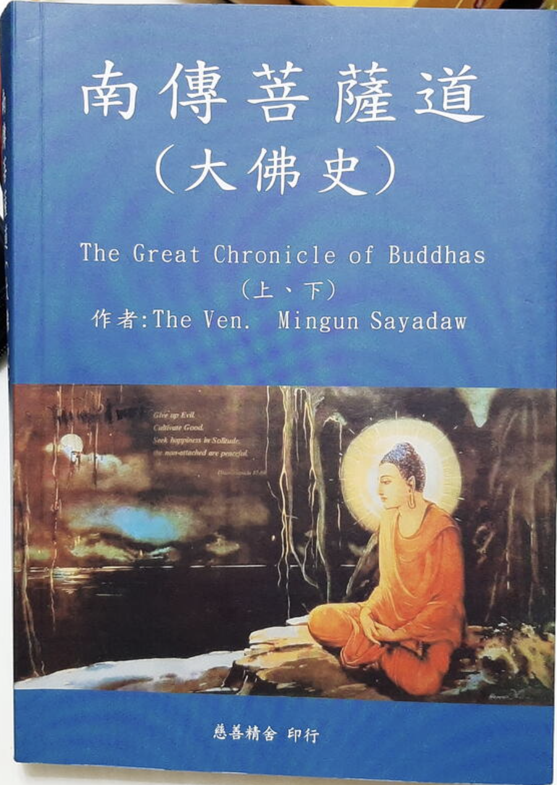

## 《南傳菩薩道》簡介

“本書的作者是緬甸已故的Bhaddanta Vicittasārābhivaṁsa，明昆三藏持者大長老。”

大長老在1953年成了緬甸有史以來的第一位三藏持者（Tipiṭakadhara）。他花了四年的時間通過了在緬甸最艱難的佛學考試。這項考試不單隻要求應考者能流利地背誦三藏，更需要精通一切註疏與疏鈔。在1985年，大長老能一字不差地背誦一萬六仟頁佛教經典的能力被列入健力世大全裡。(過後另有五位比丘通過了這項最艱難考試。目前在世的還有三位。) 

<備註：當時是1999年；這裏的佛教經典隻巴利藏，而非北傳的經藏，北傳的經藏數量過於龐大，暫未聽聞過有人可以背誦北傳的大藏經的。）

明昆三藏持者大長老，在（南傳上座部）佛教第六次經典結集召開前，他被委為三藏經典總編輯。在召開經典結集的兩年期間內，他扮演了回答者的角色(即第一次結集時優婆離尊者與阿難陀尊者的角色)。其時發問者是已故的馬哈希大長老(他扮演了大迦葉尊者的角色)。

經典結集結束之後，在當時緬甸首相烏努（U Nu）多次懇求之下，大長老從1956年至1969年期間，一共花了十三年的時間來編這套《大佛史》。這套《大佛史》一共有六集八冊。第一集上下兩冊解釋如何修習菩薩道，其主要資料來源是《佛種姓經》、《行藏》、《本生經》及它們的註疏，也有些部份是引用自其他經典及論著，例如《清淨道論》。其餘五集六冊則解釋佛法僧三寶：第二至第五集細述佛陀降生人間至證入般涅槃期間的事跡；第五集的最後一章解釋法寶；而第六集上下兩冊則簡述諸大弟子的事跡，包括比丘、比丘尼及在家男女居士。這套巨著為緬甸佛教作出了巨大的貢獻，普遍受到僧伽與在家眾的歡迎與稱頌。

（《南傳菩薩道》）此書分為上下兩冊，譯自英文版的《大佛史》（The Great Chronicle of Buddhas）的第一集上下兩冊講解菩薩道的部份。

一九九三年二月九日，大長老在明昆山法流寺病逝，享年八十一歲。

## 南傳也有菩薩道

這個標題可能會令很多人感覺驚訝，因為大多數人在聽說南傳佛教時，都說他們是小乘，聲聞或二乘人，即修行解脫道，卻少有人知道，南傳也是有菩薩道的。

事實上，南傳不僅有菩薩道，而且對於修行菩薩道也有詳細的說明，次第，這對於即使是在南傳佛教很興盛的地區，有人想要發心成佛，也是值得鼓勵和稱贊，也有經典為依據，因此就成佛而言，依據南傳經典也是可修可證的。

## 為何南傳不是以菩薩道為主呢？

以阿含經為主的經典錶明，以苦集滅道，十二緣起為核心理論的教法裏面，其目的是斷苦，滅苦，徹底地斷除苦 —— 這便是涅槃。而且依據《阿含經》來說，隻要達到了這滅苦的涅槃，在阿羅漢與佛來說，並無不同（這點北傳唯識宗裏面也是承認的），如佛的十號裏面，有一個“應供”，舊譯時就使用的是“阿羅漢”。阿羅漢與佛的不同之處，最大不同則在於，是否要聽聞佛法才證涅槃，佛是自悟後而證涅槃的，而阿羅漢則需要聽聞佛陀說法才能證涅槃了。正因為依據《阿含經》來說，佛陀的涅槃和阿羅漢的涅槃是相同的，因此以《阿含經》為主的教法裏面冇有提及太多如何成佛的事情。

雖然以北傳佛教的角度來說，經常批評聲聞乘行者是小乘，自了漢，但這是因為根據大乘經典而言的，對於隻知道，或隻信仰《阿含經》的人來說，知苦，斷集，修道，滅苦這是一個完整的、自洽的修證體係的。再擴大來說，一切宗教和宗教之間，宗派和宗派之間，最根本的差異就是所取信的“經典”不同，或對其“詮釋”不同。關於這點，以後有機會再展開來說。

## 南傳對於菩薩認定標準極高

南傳的菩薩必須被佛授記後，才能稱之為菩薩，這類菩薩都是不會退轉成凡夫的。而被授記必須滿足八個條件，羅列如下：

1. 是人
2. 是男人
3. 波羅蜜已經圓滿至足以使他在那一生證得阿羅漢果。
4. 遇到一尊活著的佛陀
5. 是一位相信業力的隱士（kammavādi，佛教以外的出家人）或是一位佛教的比丘。
6. 具備四禪八定與五神通。
7. 有不惜犧牲自己生命修波羅蜜的非凡精進力。
8. 善欲足夠強大至令他發願成佛。

八個條件最值得註意的是“3. 有能力在那一生證得阿羅漢位”，但為了成佛而不取證。其次還要具備四禪八定與五神通，即除阿羅漢才有的漏盡通。

而北傳的菩薩稱謂則是非常普遍的，原則上，隻要發心成佛就可以稱之為菩薩了，甚至隻要發心學佛，無論發心是否成佛，都可以稱之為菩薩了。這是依據《法華經》裡面的，沒有三乘道，隻有一佛乘來說的。《法華經》經文：“十方佛土中，唯有一乘法，無二亦無三，除佛方便說。”

所以有道場把所有的信眾稱之為菩薩，也就不足為奇了。再次，即使是在一般的道場，見到勤勤懇懇護持道場的老居士們，大多也稱之為老菩薩。這既是如理如法的稱呼，也是符合信衆情理的稱呼了。

# 菩薩的性別和人、非人

其次是南傳中的「只有人」和「男人」這兩點是和北傳不同的；北傳的菩薩不限制僅僅是人，非人也可以，如天龍八部都可以是菩薩，如果連非人都可以是菩薩，更何況是女性了，所以北傳的女性菩薩，而很多流傳的菩薩形象也有很多是女性菩薩，如送子觀音像等。

# 菩薩的分類或級別

南傳菩薩可以分為三個級別：

1. 慧者菩薩，即慧根，慧力或慧心所比較強大。
2. 信者菩薩，即信根，信力或信心所比較強大，也錶明其慧和信相比不夠強大。
3. 精進者菩薩，和以上兩者相比，慧和信都不夠強大，但很精進。

三者菩薩修行成佛的時間分別是：

1. 慧者菩薩 —— 四阿僧祗與十萬大劫
2. 信者菩薩 —— 八阿僧祗與十萬大劫
3. 精進者菩薩 —— 十六阿僧祗與十萬大劫

《南傳菩薩道》中甚至說，辟支佛需要經曆兩阿僧祗與十萬大劫才能成就，而希望成就像目犍連和捨利佛兩位大尊者這樣的“上首弟子”，則需要一阿僧祗與十萬大劫，其次的“大弟子”們則需要十萬大劫。

北傳的菩薩分類則更加精細，說法也多，這裏隻採用最被流傳的五十二階位之說，其可以分為5大類，和最後的等覺和妙覺。其五大類是：十信、十住、十行、十回嚮和十地。

而修行時間則需要三大阿僧祇劫或百阿僧祇劫之說，如果以三大阿僧祇劫之說，可以分成三大階段，第一階段是初地之前為第一阿僧祇劫，第二階段是從初地到八地，第三階段是八地到成佛。

無論是南傳還是北傳，成佛的時間都需要極其久遠了。當然，這裏說的成佛是指報身佛，或化身佛，而不是名字佛，理體佛或法身佛。

# 波羅蜜

一個阿僧祇劫就是無比久遠的時間，何況多個。所以無論是三個，四個，八個，十六個還是一百個，在這麼長的時間內，菩薩們都是修行波羅蜜，纍積波羅蜜，這點總體的原則是一樣的。

《南傳菩薩道》列舉了所需要修行的十種波羅蜜，分別是：佈施、持戒、出離、智慧、精進、忍耐、真實、決意、慈、捨。

其中的佈施、持戒、智慧、精進、忍耐和北傳的六波羅密中的五種是類似的，北傳的菩薩道需要六種波羅蜜，即除了前面五種，再加上禪定。而北傳也有十波羅蜜的說法，即從般若中再開出四種波羅蜜，方便，願，力和智。簡單的對應關係可以參考下表：

# 菩薩名字

鑒於以上的高標準（被授記，不退轉）來說，彌勒菩薩是南傳唯一承認的菩薩了。除此之外，就不再承認有其他菩薩了，即使是有發心修行菩薩道的人，但是因為還冇有達到被授記的程度，所以不會承認他的菩薩身份。

而北傳佛教的菩薩們數量則非常多，最常見的菩薩們有：觀世音菩薩，文殊師利菩薩，地藏菩薩，彌勒菩薩，大勢至菩薩，準提菩薩等。這些菩薩們都是大菩薩，即菩薩摩訶薩，按照上面的52階位來說，也都是等覺菩薩的級別了。

當然，這裏冇有包括釋迦牟尼成佛之前的菩薩名字了，或其他佛成佛之前的菩薩名字了，隻要是共同認可的佛，那麼他們之前的菩薩身份也是大多被認可的。

# 聞思修

《南傳菩薩道》中也把智慧波羅蜜分成三種，
“分別是：一、聞所成慧（sutamaya paññā）；二、思所成慧（cintāmaya paññā）；三、修所成慧（bhāvanāmaya paññā）。

一、聞所成慧：

（i）五蘊、十二處、十八界、四聖諦、廿二根、十二因緣、由四念處等所組成的三十七菩提分，以及善惡等各種法的排式。

（ii）無可責備、有助於為眾生帶來快樂與福利的世間知識。如此菩薩培育了聞所成慧而成為智者，成就自己，也為他人建立智慧。

二、思所成慧：

菩薩通過深入地省察五蘊等究竟法，以培育思所成慧。

三、修所成慧：

 在體驗到禪那、觀智或道果時所獲得智慧是修所成慧。即是前九個觀智，譬如觀察有為法無常、苦、無我的思惟智。”

備註：南傳佛教把智慧（或觀智）分成十六個層次，分別是：
　　　　
1. ‘名色分別智’(Namarupaparicchedañāna)是首先要作的工作，用來破世人的“一個”，“一體”的邪見。
2. ‘緣攝受智’(Paccayapariggahañāna)是幫助我們觀照名、色法個別的生起因緣。
3. ‘三相思惟智’(Sammasanañāna)是斷除我們對五蘊的執著。
4. ‘生滅隨觀智’(Udayabbayañāna)是觀照名、色法的生滅。
5. ‘壞隨觀智’(Bhangañāna)是覺知名、色法的壞滅。
6. ‘怖畏現起智’(Bhanyañāna)是生起對諸行法的怖畏。
7. ‘過患隨觀智’(Ādinavañāna)是觀照色法的過患與危厄。
8. ‘厭離隨觀智’(Nibbidāñāna)是對諸行法的厭離。
9. ‘欲解脫智’(Muñcitukamyatāñāna)是欲解脫出離於一切行。
10. ‘審察隨觀智’(Patisankhāñāna)是審察前面的六智，它也是三相思惟智。
11. ‘行捨智’(Sankhārupekkāñāna)是捨離諸行的智。
12. ‘隨順智’(Anulomañāna)是隨順於前面的八智及後面的三十七菩提分法，以行道而得其道果。
13. ‘種姓智’(Gotrabhūcittā)是超越凡夫種姓的智。
14. ‘四道智’(Magga cittā)是走嚮四位聖人的道智。
15. ‘四果智’(Phala cittā)是產生四位聖人的果智。
16. ‘餘漏智’(Paccavekkhaņañāna)是審察自己的剩餘的煩惱，而用擇法去斷除這些煩惱的智慧。

這裡是的前九個，即是截止到“欲解脫智”了，後面又說最多可以達到“行捨智”（第11個觀智）的一部分，再繼續修觀智，就無法成佛，而隻能成阿羅漢了，所以菩薩會在修行到“行捨智”的一部分，就不會繼續修觀智了。

而聞思部分，南傳北傳幾乎是一樣的解釋了，內容也幾乎都是一樣的。北傳的聞所成慧也可以用五明來總結，即是內明（佛學）、醫方明（醫學）、工巧明（技藝）、聲明（音樂）、因明（邏輯學）。五明也可以總結為兩類：佛學和世間學問，學習世間學問的目的，也不外乎是廣結善緣了（纍積福德），為圓滿波羅蜜提供前提條件了。

# 菩薩和佛在智慧上的差別

前面已經提到了南傳菩薩最多可以修證到第11個觀智 —— 即行捨智的一部分。直到要成佛的那一世，才會繼續修證第11個觀智，直到第16個觀智，即成佛了。從上述的列錶可以看到，這中間還有5個觀智的區別。

北傳的菩薩有52階位，但第52階位為妙覺，即是佛了。所有菩薩位的最高位是第51位，稱之為等覺菩薩。再查佛典，等覺菩薩和佛已經沒什麼區別了，和佛的覺悟是平等的，所以稱之為等覺。也可以說，其差別太微細太微細了。有時也會解釋說還有一份微細無明未斷，所以還未成佛，還是菩薩了。

# 俗諦和究竟諦

書中這樣介紹俗諦和究竟諦：

“俗諦：俗諦是符合一般上人們給予事物的名稱。一般人們是根據形狀來為東西命名。他們稱這種形狀的東西為「人」，那種形狀的東西為「牛」，另一種形狀的東西為「馬」。

究竟諦：在究竟上存在的真實法是為究竟諦。譬如，當人們說：「識知各種事物的是心」，那認知之法本身即是究竟諦，因為在究竟上它是存在的。當人們說：「由於熱和冷等相對的現象而變化的東西即是色」，那變化之法本身即是究竟諦，因為在究竟上它們是存在的。如此，心所及涅槃也是究竟諦，因為在究竟上它們是存在的。

究竟諦有兩種：一、自性諦；二、聖諦。所有四種究竟法即，心、心所、色法及涅槃組成了自性諦（sabhāva-sacca），因為在究竟上它們是真實的。

在世間的事裡，有屬於自性諦的身體快樂和心的愉悅兩者。若某人接觸到可喜的目標，由於觸覺他會感到快樂。無人能夠否認說：「不，那不是真的」，或是說：「接觸可喜的目標是不可喜的。」無人能這麼說是因為那人所接觸的是真正的可喜觸所緣。”

聖諦：即是苦集滅道四聖諦了。

北傳佛法裡面也用二諦來詮釋全體佛法，不過在究竟諦（北傳通常稱之為勝義諦）上，南北的詮釋是不同的。北傳一句三個體係，分別有自己的勝義諦。如般若中觀把空觀當做勝義諦，而唯識則把圓成實性作為勝義諦，如來藏則把如來藏當做勝義諦。這隻是最簡單的二諦分類了，再複雜一點，則會把二諦也分成多個層次，如四重二諦說。其中最初級的，和南傳類似，或把空性作為勝義，而最高級的二諦，則是超越一切語言文字、經驗體會，而變成不可思，不可議，不可說了。

# “信與慧平衡，精進與定的平衡”

書中說「過多的信導緻太過熱忱；過多的慧導緻狡滑；過多的精進導緻煩躁散亂；過多的定導緻心昏沈；但是絕不會有過多的念。」

北傳也說關於定和慧平衡的說法，如《頓悟入道要門論》“定多慧少，增長無明；慧多定少，增加邪見”，以及信和慧的平衡，《大般涅槃經》卷36：「若人信心無有智慧，是人則能增長無明；若有智慧無有信心，是人則能增長邪見。」和《大毘婆沙論》卷6：「無信之慧增長諂麯。無慧之信增長愚癡」，所錶達的意思是一緻的。關於念的部分，當然是指「正念」了，而非「邪念」，正念當然不會過多，隻會因為不常常串習而導緻「失念」了，或者是「智慧」不夠產生了無解，結果變成了「邪念」了。

