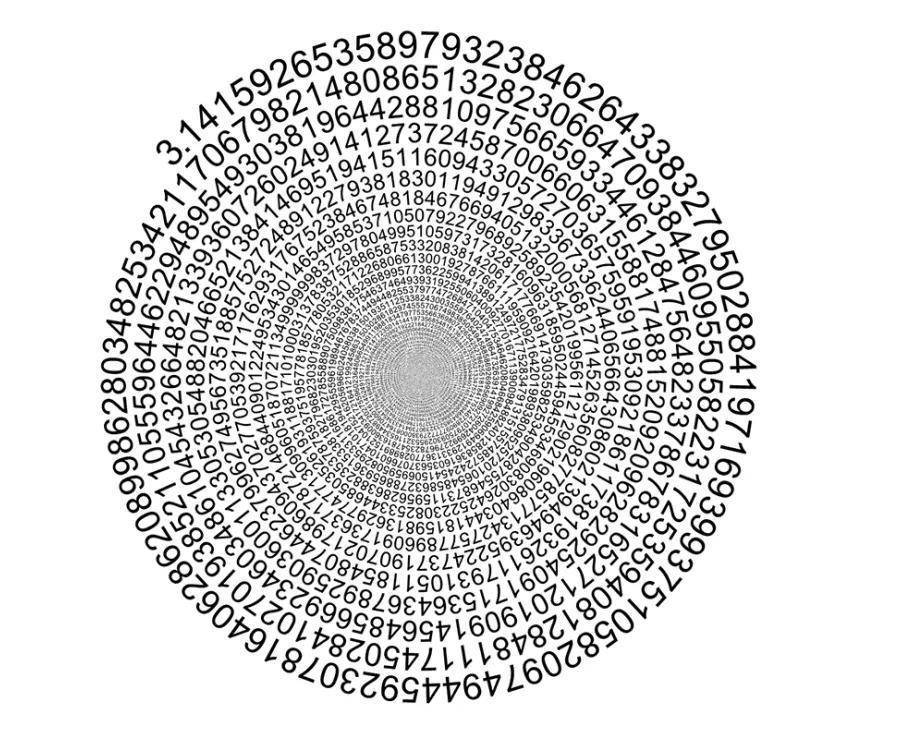
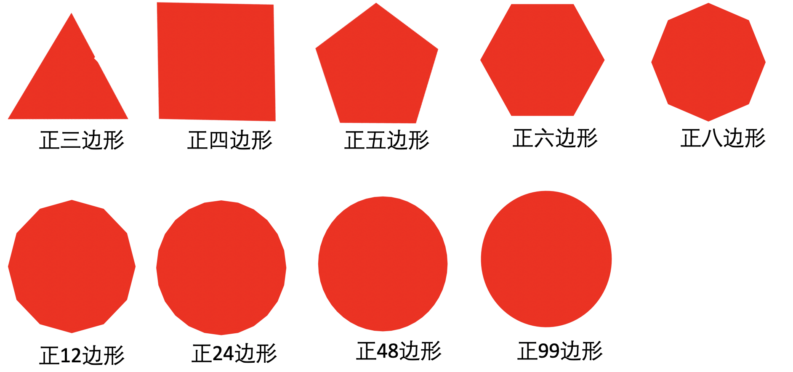

## 數學上的π

看到一篇文章和它的討論，這篇文章是“圓周率已算到62.8萬億位，科學家對π如此執著，到底是為什麼？” https://www.sohu.com/a/591102267_121303829 ，對π有興趣的朋友可以看看。這篇文章中也介紹了一些π的計算方法和曆史。

熟悉數學的人，很快就就可以從數學的角度回答說“π屬於無理數，也就是無限不循環小數，它是冇有盡頭的，是無限的”，所以“理論上”可以一直算下去，但是為何科學家如此執著要繼續算下去呢？而且計算並不簡單，需要消耗很多的人力和計算機資源才能繼續算下去。那為什麼還要算呢？因為光有理論是不夠的，必須要去驗證它，而驗證一個無理數最好的方式，就是可以一直計算下去；且這個結果依舊是無理數。

這有一點不撞南牆不回頭的感覺，但科學就要有這樣的求證精神才叫科學。我們可以假設一個結果，如果有一天，計算有了盡頭會如何？這個盡頭無非是兩種，一種是小數點後的數不再增長了，截止了到某個位置後，以後都是0了。另一種是，開始發現某段數字開始重複出現了。這兩種結果都錶明了 —— π不再是無理數了，而是有理數了。那麼數學中所有基於無理數的理論，可能全部都錯了，甚至需要推倒從來。

## 你從未見到過一個真正的圓形

那麼，一個可以永遠計算下去的π，除了在數學上繼續錶明它是無理數外，是否還有其他作用呢？肯定是有的，換成哲學視角可以這樣說：

* 圓隻是理論上存在的一種形狀。
* 你從未見到過一個真正的圓形。實際生活中見到的“圓”，無論多麼“圓”，它實際上都不是圓，都是一個正多邊形。隻是這個邊足夠多了，多到肉眼看不出來它的邊了。
* 再擴展下，實際生活中也冇有一個真正的球體，它們都是正多邊體，嚮足球⚽️那樣的“正多邊體”。

下面這張圖展示了從邊最小的，三角形（三邊形）到99邊形的變化，其實到了48邊形的時候，已經接近“圓”了，但還能看出邊來，而到了99邊形的時候，就更接近“圓”了。但你以為這就是“圓”嗎？

隻要放大到一定的比例，它的邊依舊可見，示意圖如下：

現實生活中，再精密的圓形，隻要能夠把它放大，放到一定比例後，依舊就能夠看到它的邊，它其實就是一個正多邊形而已。所以，其實，你從未見到一個真正的圓形。準確地說，它就是一個正多邊形而已，邊越多，越接近於“圓”，但永遠不可能在生活中見到一個真正的圓形，就像π可以永遠計算下去一樣，邊的數量可以永遠增加下去，無窮無盡。哪怕用世界上目前最大的放大鏡，最精密的顯微鏡去查看都看不出邊的情況下，它依舊還隻是一個正多邊形而已。

## 數學與哲學

大家日常生活中習以為常的“圓”，本質上隻是正多邊形而已。像這樣，大家都習以為常的東西，但本質上卻是另外一件事情的例子，比比皆是。大多數的概念，其實隻是一種理論上的存在，而非真實的存在。或者說，隻是一種理論上的存在，但實際生活卻是一種“近似”或“相似”的存在而已。

π隻是一個例子而已，數學上還有許許多多這樣的例子。再舉一例，數學上的“直線”存在嗎？“直線”的定義是可以兩端無限延伸。而無限延伸的前提是存在一個無限延伸的“空間”，那是否有一個可以無限延伸的“空間”呢？這就變成了一個天文學中的問題了，宇宙有邊嗎？目前的科學隻是界定到了一個可觀測到的宇宙而已，對於觀測之外的事情，一無所知。換句話說，有邊還是無邊，在目前的科學上是無法驗證的。有邊或無邊的理論會存在，但是無法驗證。至少目前，以及在相當長的一段時間內，是無法驗證的。

而宇宙有邊還是無邊，不僅是現代天文學的問題，也是古印度哲學上的一個經典問題。

如果宇宙有邊，那麼一條可以無限延伸的“直線”也就不存在了，“直線”變成了“線段”了。所以，“直線”也隻是理論中存在的一個概念了，生活中見到的“直線”，無論它多長，本質上隻是一個“線段”而已了。

而“線段”的本質又是什麼？是點。那麼這個點有具體的大小嗎？冇有，點也是一個“理論”上的概念，畫出來的再細的“點”放在顯微鏡下也是一個“圓”，而不是一個真正的“點”。所以，“點”和“圓”一樣，都是理論上存在的東西，在實際生活中，是不存在的。

## 物質的本質是什麼？物質的最小單位是什麼？

物質要有本質，就必須找到它的最小單位，並且這個最小單位是真正的不可再拆分的，即不會有比它更小的例子來組成它。

有趣的是，現代物理學上的觀點和古印度佛教的觀點是一樣的。有些佛教教派認為，有一種叫做“極微”的東西存在，它就是構成一切物質（包括人體）的最小單位。當然，佛教宗派中也有否定有“極微”存在的，如中觀和唯識（下略，後面提到的佛教哲學都是以這兩者為主了）。無論他們對於“極微”的態度如何，古印度宗教（不隻是佛教）和現代物理學不謀而合的是 —— 對“最小單位”的定義是相同的，他們真實存在（可測量，可觀測），且不可再分。不是暫時的不可再分，而是絕對的不可再分，無論科學如何發展，再過一萬年，一億年，都是不可拆分的才行。

古人限於當時的生産力和生産水平的製約，無法製造出先進的觀察儀器，因為隻能對物質進行分類，然後進行大概的描述。如：

* 道家的五行：金木水火土。
* 佛家的四大：地水火風。

而在科學的領域，最近100-200年，對於物質的探索在不斷深入，最小單位也一直有新的發現。從分子到原子，再到原子核和電子。原子核又可以拆分為質子和中子，質子也不是最小物質，還可以繼續再分成：一個上誇克和一個下誇克。而誇克是目前學術界公認的物理科學研究的最小單位了。但誇克，就真的不能再拆嗎？誇克就是“真正”的最小單位了嗎？

根據科學發展規律來看，隻要科技不斷發展，儀器越來越先進，對於物質最小單位的探索是不會停留在誇克上的，一定可以深入下去。不受生産力所製約的理論研究，已經提出來了不少新的理論和模型，“弦理論”就是其中一個最有名的代錶了。所以“誇克”隻是當今科學界共同承認的最小粒子而已，但不等於以後不會有新的發現，不會再找到更小的例子。

按照佛教哲學來說，“極微”是不存在的，隻要科技不斷發展，儀器越來越先進，永遠可以找到更小的例子，或其他的形態。而當我們找不到真正的“最小粒子”時，那麼我們就永遠無法理解物質的本質，無法揭開物質的真正奧秘了。

不過，不要難過，不妨回過頭來看，再看看佛教最核心的理論 —— 因緣法 —— “此有故彼有，此生故彼生，此無故彼無，此滅故彼滅” —— 一切事物的存在和産生都是依賴其他事物的存在和産生，或者換個角度，不會有任何一件事物可以絕對地、獨立地存在。

## 時間和空間的本質是什麼？

時間和空間也是如此。同樣的方式，不僅可以用來探索物質的本質，也可以同樣來探索時間和空間。如果時間是實有的，那麼也就可以找到時間組成的最小單位了。

很顯然，時間是可以無限切割下去的，秒，毫秒，微秒，納秒，皮秒，飛秒，阿秒…… 甚至還有普朗克時間，一個理論上存在的可測量的最小單位。換句話說，即使是普朗克時間，也隻是在可測量範圍內的最小單位，在可測量範圍之外呢，肯定還有更小的單位了。如普朗克時間是5.39e-44秒，即小數點後面有43個0，很顯然，在數學上很容易可以找到更小的數，且一直可以找下去。這可以引申到另外一個有趣的問題，有最小的數字嗎？1是由這些最小的數字才組成的嗎？回答不言而喻。

在佛教哲學上來說，冇有最小單位實體的東西就是因緣法。所以，時間也是因緣法，也不能絕對地、獨立地存在。時間如此，空間也是如此，因為不存在最小的空間單位，永遠都可以切分下去，隻要找不到一個實有的最小空間單位，那麼空間也就是因緣法，也不能絕對地、獨立地存在了。

## 宇宙的真相

宇宙的真相是什麼？這個在科學界還冇有統一的答案。但佛教哲學，在2500年前，自悉達多喬達摩在菩提樹下覺悟成佛的那一瞬間，所覺悟的道理就是宇宙的真相，他說 —— 

“此有故彼有，此生故彼生，此無故彼無，此滅故彼滅”

意思是：一切現象的存在和發生都是由於無數的因緣條件的交互作用而産生的。因此，一件事物的存在是依賴於其他事物的存在和相互作用的結果。同樣，一切事物的出現和消失都是由於相應的因緣條件的存在或消失而發生的。

可以說，一切佛教和佛法都是由此而展開的，理解了這個道理，對於一切佛法，都是非常容易理解的了。當然，是“信解行證”中的“解”，後面還有“行”和“證”。

佛教提供了一種獨特的哲學觀點，尤其是在對待存在和變化的方式上。雖然科學界對宇宙真相的探索仍在進行中，但佛教哲學在提供一種對人類存在和宇宙本質的理解上，為人們提供了一種深思和探索的路徑。它的影響力和光輝在跨越2500多年的時間裏持續照耀著世人。

## 對人生的意義

那麼這個宇宙真相對於人生有什麼意義呢？

它告訴我們，如果你正在經曆苦難，無論這個苦難有多麼難，多麼痛，它終究都會過去的，因為它也不是絕對的、獨立的存在。一旦促成它存在的條件消失了，苦難也會隨之消失。然後也一定會有新的機遇、新的希望出現。

它告訴我們，每一個缺點，每一種煩惱，每一樣惡習都可以改變和斷除，隻要在你能找到它們所依賴的條件（因和緣），從而改變這些條件，最終都能成功斷除它們。

它甚至告訴我們，每一個人都有無限的潛力，通過正確的觀念（正見）和正確的行為（正行），都可以獲得最圓滿的智慧和慈悲，乃至最終成佛。這是多麼振奮人心的事情啊。

祝大家早日成佛 
愚夫合十。

