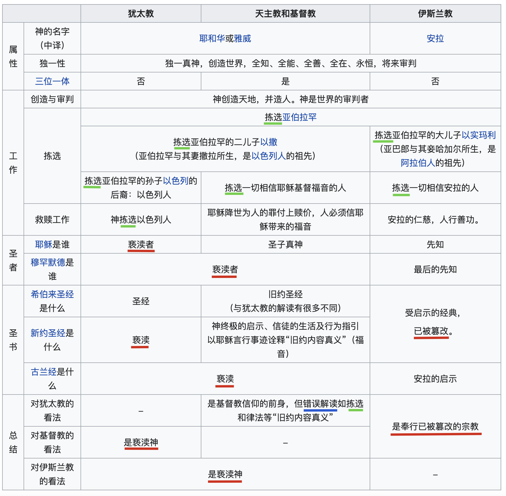
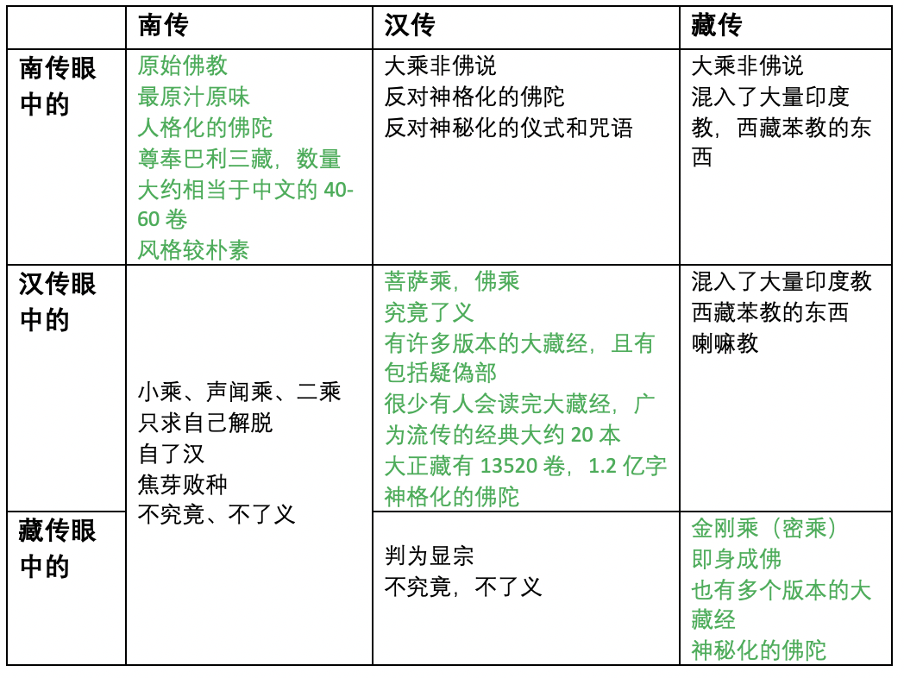
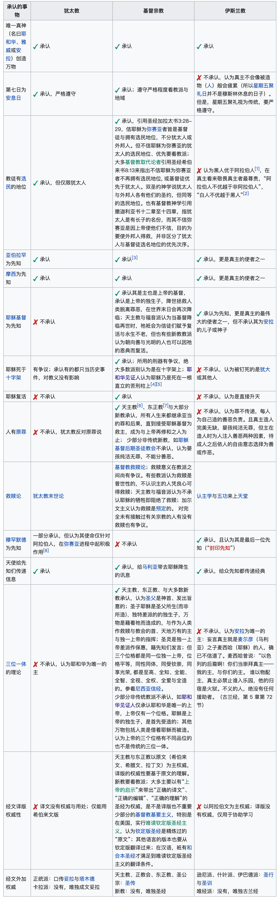

## 别人眼中的你和自己眼中的你

有一段时间，网上特别流行一组对比图，叫“自己眼中”对比“别人眼中”，或再加上其他人视角对比图，十分有趣，有自嘲，也充分向我们展示各种认知误区。对于我们不了解的行业，自己印象中的是一回事儿，实际上是另一回事儿。当然，也有自嘲的成分在里头，总之是十分有趣的。

以上四图来自于：https://www.sohu.com/a/26699531_123753。

## 写在前面

所有概述的东西，分类的东西都是依多数而谈，或者相关的说法普遍存在，并不是精确的论述，更不是强调说每个人都如此。以宗教来说，所有的信徒大概可以分为两类：

1. 包容的，开放的 —— 只学习自己所信仰的宗教和宗派，对于其他的东西，闭口不谈，或如实说不清楚，不知道。虽然不清楚不知道，但并不妨碍自己继续信仰和实践自己的宗教和宗派。同时也包容其他宗教和宗派的存在，更包容者和开放者，甚至还能肯定他们的价值。
2. 偏执的，极端的，甚至是狂热的 —— 必定只坚持自己的宗派是唯一正确的，其他人都是错误的，只是错误程度不同，错多少而已。有一些是全错，有一些错了部分，这也就是偏执者了。再进一步，就是全然否定他们的价值和存在的意义，对他们充满排斥，甚至是敌意。而狂热和极端者不会停留在言语和文字的讨伐上，还会想要从物理上消灭他人。

从这个角度来说，下面图里面的观点都是或多或少带点偏执的，不是包容和开放者的心态了。

## 泛基督教宗眼中的彼此和自己

不仅世俗的事情有很多如此反差的对比，其实宗教也一样，以世界第一大的宗教，基督教来说，也是如此。

先放第一张图，这张图就是各个基督教（或泛基督教，后面直接简称基督教了）彼此眼中的自己和对方了。这里还只是展示了犹太教，天主教，基督教和伊斯兰教了。以笔者所在的美国来说，还有其他新型宗教也是非常兴盛的，如“耶和华见证人”和“后期圣徒教会”（俗称摩门），如果加上再进行综合对比，那就更加热闹了。

图片来源：https://zh.wikipedia.org/wiki/%E5%9F%BA%E7%9D%A3%E6%95%99

有趣的地方是：
* 首先是红线标记的地方，“亵渎”两字重复了6次，其实“篡改”重复了2次，“错误解读”出现了1次。总结来说，就是自己当然认为自己是正确的了，而看别人时，要么是篡改，要么是错误解读了。
* 其次是绿线标记的文字，“拣选”两字重复了7次。由此可见，大家只是选择的人事物不同而已了。

在基督教相关的维基百科中有这么一句总结，还是很准确的：“大体来说，后者承认前者，但前者不承认后者。如基督宗教承认摩西、不承认穆罕默德；伊斯兰教承认摩西及耶稣（虽然对耶稣的看法与基督宗教有异）；犹太教不承认耶稣及穆罕默德。”

有趣的是，这句总结不仅适用于基督教，而且适用于佛教。

## 佛教各宗派眼中的自己和彼此

再进一步的法义和事项上的对比可以参考这篇文章。

【原创】试比较南传上座部与大乘佛教
https://mp.weixin.qq.com/s/5wnuFIAoA1bzH3MecyivYQ

## 佛教和基督教在教史上的对照

## 附录

基督教在事项和教义上的进一步对比，

图片来源：https://zh.wikipedia.org/zh-hans/%E4%BA%9E%E4%BC%AF%E6%8B%89%E7%BD%95%E8%AB%B8%E6%95%99

祝大家早日成佛 
愚夫合十。

