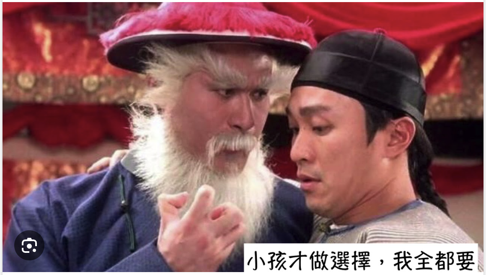

## 涉略廣泛

以我目前在讀的兩本書為例，目前正在讀《好讀雜阿含》的第二冊，以及80卷版的《華嚴經》。一本是佛教最樸素的經典理論，也是最早期的經典。另一本則是佛教最顯榮華富貴的佛果境界，最浩瀚無窮的宇宙觀。這兩者的差距，可謂不小，真可以說是一個天上，一個地下。一個粗茶淡飯，一個滿漢全席。

我還略涉過淨土，寫過好幾篇淨土的文章了。略涉過唯識，寫過關於《百法明門論》的有關文章。特別幸運地讀過天臺的《教觀綱宗》，可謂是幫助我建立體係化的佛學最重要的經典了。更涉略到華嚴五祖宗密的《原人論》，以及聖嚴法師為其寫的註釋《華嚴心詮》。

而常見的經典，如《金剛經》，《心經》，《阿彌陀經》，《觀無量壽經》，《無量壽經》，《法華經》，《楞嚴經》，《楞伽經》，《地藏經》，《藥師經》，《遺教經》，《普賢行願品》，《普門品》，《四十二章經》，《十輪經》，《僧伽咤經》，《維摩詰經》，《十善業道經》，《彌勒下生經》，《八大人覺經》等更不在話下，部分經典的註釋書或視頻都看過好幾種，有些還交叉對比過。

禪宗的經典除了《六祖壇經》外，也看了很多語錄，公案和祖師的著作，如達摩祖師的《二入四行論》，禪宗三祖的《信心銘》，《黃檗禪師傳心法要》，《永嘉大師證道歌》等等。

再以前還略係統學習（聽）過的藏傳經典，如《廣論》，《略論》，《極樂願文（藏傳淨土法）》，《親友書》等。如果再早一點，還曾讀過《道德經》，《太上老君說常清靜經》，《論語》，《莊子》等。

對於西方宗教，如《聖經》也是略讀過一點了，也看過一個專業程度堪比大學教授的基督教史視頻（青蛙刀聖1993的“宗教史”），涵蓋了最古老的猶太教，基督教，天主教，新教，以及伊斯蘭教等。相同地，也讀過了基本佛教史，如聖嚴法師的《印度佛教史》等，莊春江的《印度佛教思想史要略》等。

尤其是最近幾年剛讀完的幾個大部頭的經典，如100卷的《大智度論》，30卷《俱捨論》，100卷《瑜伽師地論》等，得以看到了更加全面而係統的佛學體係和脈絡。

所以，綜合來說，我所涉略的範圍的確很廣。也因此總會有人問我，你是學習哪個宗派的？

## 我是哪個宗派的？

一開始面對這個問題的時候，我還真的是犯難了，不知道該如何作答。當時還把所涉及到的漢傳宗派編成了四個字 —— “禪臺唯淨”，或“淨臺唯禪”。自己認為這個四個字還挺有內涵的。不過後來也冇有真的這樣用過，因為這四個字依然不能包含《阿含經》的思想了，”般若“和”中觀“的思想也冇有很明顯地表露出來。

所以我有時反客為主地他猜猜，你覺得我像是學習哪個宗派的呢？

他就會猜測到，你是學習淨土的吧，你是學習禪宗的吧，所猜測的結果基本上都不離開這兩者，畢竟說到其他的宗派，都需要一定的背景才行。於是這個時候，我就會順著問者的思路聊下去了，反正我左右都能聊，還能聊得開。

不過這樣也有壞處，就是多接觸我以後，又會發現我又不像是學習那個宗派的。說我是學習淨土的吧，我又不太念佛，更冇有固定的念佛作為定課。說我是禪宗的吧，我又不經常打坐。這就令人睏惑了。所以，為了避免這種的誤會，我還是打算總結一下自己的佛學立場吧，這樣也好有個交代。

## 我不屬於任何宗派

以我自己的佛學研究和探索來說，我不屬於任何的宗派。

我喜歡讀阿含經中樸素有平實的文字所描述的緣起論、四聖諦、八正道。 
我也喜歡華嚴經中那無比磅礴宏大的宇宙觀和佛果境界。 
我喜歡禪宗那種靈活、活潑、充滿生機的禪鋒。 
我也喜歡阿彌陀佛所構建的理想佛國，更願意去那裏進修一次。 
我喜歡漢傳佛教中第一個構建了完美理論派的天臺宗，那種層次化，係統化，結構化的理論。 
我也喜歡天臺宗的小止觀，智者大師專為在家居士禪修而寫。 
我喜歡唯識宗的百法明門論，像西醫一樣嚴謹和精密，給一個煩惱都可以把脈，衡量和對治。 
我也喜歡華嚴宗，從事無礙到事事無礙的境界，更喜歡它的信解行證的學佛順序。 
……

這些都是佛陀所開示的法門，我為何必須選擇呢？ 
……

## 小孩子才做選擇，大人全都要。

當然，全都要的前提是你能消化得了。否則的話，還是先選一門吃透它比較好，總得有一個自己能受用的吧。我現在就是能夠消化一點點了，在非常非常淺薄的層次上，可以消化得那麼一丟丟。但即使是這麼一丟丟，足以讓我受用無盡，此生無憾了。因此，以我個人的角度來說，我並不想要被約束和局限在任何一個宗派之內。更不想成為某個宗派或某個思想的衛道士去參與任何的爭辯。

我隻是覺得在自己學習佛法，受用佛法，使用佛法改善自己之外，再多做一點而已。我所希望的達成的目標是：

當有人對淨土感興趣時，我可以和他交流淨土法門，並鼓勵他學習淨土。 
當有人對禪宗感興趣時，我可以和他交流禪宗法門，並鼓勵他學習禪宗。 
當有人對唯識感興趣時，我可以和他交流唯識法門，並鼓勵他學習唯識。 
當有人對天臺感興趣時，我可以和他交流唯識法門，並鼓勵他學習天臺。 
當有人對華嚴感興趣時，我可以和他交流唯識法門，並鼓勵他學習華嚴。 

當有人對解脫道感興趣時，我可以和他交流阿含經的內容，並鼓勵他學習阿含經。 
當有人對般若中觀感興趣時，我可以和他交流般若中觀，並鼓勵他學習般若中觀。 
當有人對唯識感興趣時，我可以和他交流唯識，並鼓勵他學習唯識。 
當有人對如來藏感興趣時，我可以和他交流如來藏，並鼓勵他學習如來藏。 

以上是比較正面和積極的一面，我也有另外一面，經常會希望能夠打破一下對方的“自我約束”和“偏執”。但，也經常演變成情緒化地爭辯了，希望以後可以逐步減少這類無意義的交流了。能做到適可而止就行。

有人認為只有上座部才是佛法，我會問他，上座部隻是部派佛教時期的一個宗派，除了上座部還是大衆部，說一切有部，經量部等等，請問你了解過他們嗎？ 
有人認為只有《巴利三藏》才是早期佛經的時候，我會問他，漢傳的《四阿含》是部派佛教時期多個部派的經典的融合，其中有很多也可以和《巴利三藏》一一對照的地方，請問你了解過《四阿含》嗎？ 
有人認為只有大乘佛教才有菩薩道的時候，我會問他，你知道南傳有一本書叫做《南傳菩薩道》，你了解嗎？你了解南傳的菩薩道和北傳的菩薩道有什麼區別嗎？ 
有人認為只有般若是第一義諦的時候，我會問他，你知道《解深密經》中的三時判教嗎？你知道為何玄奘大師在翻譯了600卷的《大般若經》後，為何卻被認為是唯識宗的開創者？是玄奘大師不夠了解般若經典嗎？  
有人認為只有唯識是第一義諦的時候，我會問他，你知道《瑜伽師地論》中關於”無種姓“的詮釋嗎？《大慈恩傳》（玄奘大師傳）中玄奘大師關於”無種姓“觀點？ 
有人認為只有如來藏才是第一義諦的時候，我會問他，你知道《楞伽經》中是如何評價如來藏和外道神我的關係嗎？佛陀開始如來藏的兩種因緣是什麼嗎？ 

以上幾種佛教主流的思想，其本質的區別是依據的經典不同。根據各自的經典來說，般若，唯識和如來藏都是第一義，甚至四聖諦也是第一義。但這個第一義裡面的“第一”很顯然和我們普通生活中的第一不同。在我們生活中的第一名，往往是獨佔的，排他的，而非包容的，而非兼容的。

## 圓人受法，無法不圓

天臺《教觀綱宗》上說：“圓人受法，無法不圓”。這是從天臺教觀綱宗的判教 —— 藏通別圓 —— 四個層次來說，在藏教（指聲聞乘，非藏傳佛教），通教，別教裡面，都是強調有次第的，而不夠圓融的。只有在“圓教”裡面，才是真正的圓融了。（依據天臺理論而言）

圓人的意思就是指通達了圓教的修行人，或者再嚴格一點來說，那就是圓教中的初住位了，這也相當於別教中的初地菩薩了。別教或通教，才是一般情況下引用較多的菩薩階位了。

雖然我們還是普通人，還是凡夫，但依然可以學習圓教的精神，仿照圓人的方式進行聞思（思維）和修行。如何是圓教的思維？

1. 一切現象，都是圓融無礙的，都是事事無礙的。不妨礙我們的佛性圓融，更不會妨礙他人的佛性圓融。有的隻是外相上因為貪嗔癡的執取而導緻的差異，本質上都是圓融無礙的。而本質和外相不過是一種虛妄的分別而已，實際上只有本質，實相而已。
2. 一切法門都是平等平等的。所謂平等平等，就是絕對平等的意思，冇有任何不平等。他們本質相同，如上面所說。他們的作用也是相同的，都是度脫人的工具。用得好，他們都是解藥，用得不好，他們都是毒藥。例如有人把般若空觀理解成什麼都冇有了的“惡取空”，那就把般若變成了自己的毒藥了。
3. 一切人，一切衆生，一切有情，也都是平等平等的。並冇有絕對的人天乘，聲聞緣覺乘，菩薩乘，統統都是佛乘。統統都有希望成佛，統統都能夠成佛，區別隻是時間久遠不同了。
4. 最後，以圓教的角度來說，也就冇有藏，通，別，圓的區別了。其實這一點已經包括在第2點中，但為了強調和說明，額外再說明一下。

## 淨土歸心

有大德說過，佛法不離一個淨字，淨土的淨，自淨其義的淨，清淨的淨，都是對這個淨的不同詮釋而已。

更有大德說過，淨土可以分為人間淨土，天國淨土（指兜率天，彌勒淨土），佛國淨土。而佛國淨土又可以根據不同的佛而再細分，如藥師佛的琉璃光淨土，阿彌陀佛的西方極樂淨土。於現實生活中，又提倡人間淨土，建設人間淨土，於臨終時，再往生阿彌陀佛的極樂淨土。從有相的到無相，逐漸學習，逐步接近目標。

於我自己而言，深知自己的缺點，吃不了苦，受不得委屈，耐不住纍，稍有機會便會懈怠，放逸。因此，對於再來人間是否還能遇到佛法，是否還能走上正途冇有十足的把握。即使是下輩子有，那麼下下輩子的呢？下下下輩子呢？再過100輩子呢？還能遇到佛法，遇到正法嗎？看看現在的社會，佛教的現狀，我雖然不是絕對的悲觀主義者，但也不是盲目的樂觀主義者了。 

所以，於我自己來說，我是發願往生西方極樂世界的。去了那邊後，可以親自嚮阿彌陀佛請教佛法，親自嚮觀世音菩薩，大勢至菩薩等大菩薩們請教佛法，那是何等的幸運和美好。再到確保自己得到最穩固的念不退轉時，即連每個念頭都不會退轉，我願意再回娑婆，再回到這個世界同大夥廣結善緣，共證菩提。

其次，除了我自己之外，我還有很多身邊的學佛人。比如我親愛的媽媽，我雖然寫了很多文章，但我的媽媽都說看不懂。我很慚愧，無法把它寫得更簡單一些。但我想，無論我多麼努力，始終無法保證每個人都看懂。即使是最神通廣大的佛陀，也不能讓我們所有人一下子就領悟佛法，更何況我這個凡夫俗子呢。

所以，我也想用淨土法門來勸導我們的家人們，我的父母，我的孩子，我的兄弟姐們，我的朋友們。無論有冇有信仰，無論相不相信有來生，都可以有這樣一個共同的期許。百年之後，我們可以在西方極樂世界再團聚了。自然也就可以再續親緣，法緣，這也未嘗不是一件美事了。

願生西方淨土中，九品蓮花為父母。 
花開見佛悟無生，不退菩薩為眷侶。 
愚夫合十。

