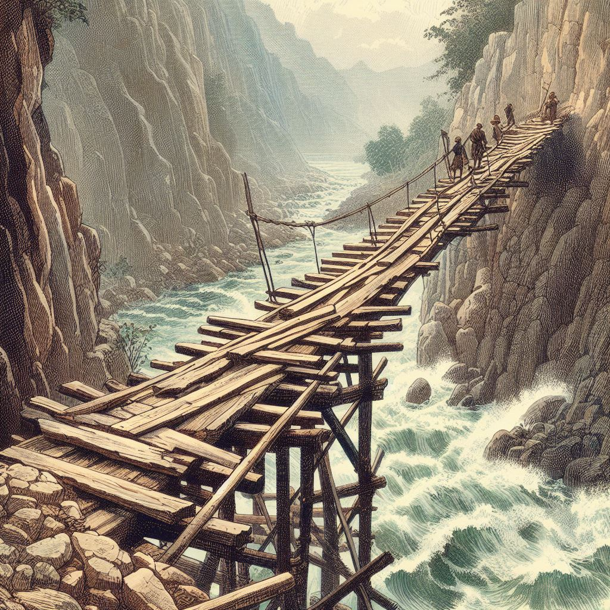

## 恐嚇從善

美國有一個曆史悠久、非常冷門的節目叫《Beyond Scared Straight》，中文翻作「少年監獄之旅」或「以恐嚇改善」，這節目搭配的是亞特蘭大政府在青少年預防犯罪計畫中推出的一項「體驗活動」，他們選中了一些令父母和學校都頭疼的問題孩子，讓他們去體驗坐牢生活，由獄卒管理，跟最窮兇惡極的犯人關在一起，體驗坐牢的真實樣貌，以恐懼入獄、進而改過嚮善。

被選中的孩子都不是普通的壞孩子，而是那些具備明顯犯罪傾嚮甚至有犯罪前科的孩子，他們打架、偷竊、搶劫、縱火、辱罵親人，讓家長束手無策、感到無望。

這個創意聽起來似乎很有道理，節目的效果非常真實，一開始也受到了很多人的支持。然而結果非常意外，首先受到了司法部和其他專家的批評和反對，因為這行為本身涉嫌違反了聯邦的《青少年司法和預防犯罪法》。其次2002年NGO組織康培爾研究團隊對此專案進行了一個係統性回顧的研究，最終證實：

1. 以恐嚇改善無效。
2. 以恐嚇改善反而刺激了犯罪率的增長。
3. 以恐嚇改善是一個失敗的計劃。

中文參考：https://www.facebook.com/rulescreative/photos/a.1579532998941143/2782560101971754/?type=3
英文參考：https://en.wikipedia.org/wiki/Beyond_Scared_Straight

## 正向教育

教育可以分成兩類，一類是正向教育，以教育和鼓勵為主。另一類就是逆向教育，以威脅、恐嚇和打擊的方式迫使他不得不接受教育。現代社會和文明的地區都做出了自己的選擇，選擇了越來越正向的教育。

以我本人的求學經曆而言，上小學的時候，班裏也是有幾位問題學生的，他們的個頭還不小，結果就是經常可以看到老師在教育他，體罰他，打他。他們還會還手，結果就變成了老師和學生打架了，結果還是因為老師更強壯一些，最終總能武力製服他們。我們那個時候上學，老師體罰學生是非常普遍的事情，父母們也經常對老師說，孩子在學校，不聽話的話，該打就打，打壞了也不要緊。有時，父母還會幫著老師打學生。

短短幾十年過去了，這類現象完全倒正過來了。現在的老師，連學生的一根毫毛都不敢碰了，體罰也被教育部明令禁止了。老師們的言語也變得溫柔了，不再是那種輕易侮辱人的話語了。現在也再也冇有家長去跟老師說，可以打孩子了，要打也是父母帶回家自己教育了。而在歐美國家，即使是父母在家裏，也不能打孩子了。

## 陽光大道和獨木橋

陽光大道，顧名思義就是指適合大多數人走的路，而且是安全的，穩妥的，路途中不會有大坑，不會讓你葬送生命，最重要的是，最終都可以到達終點。當然，其中會有少數的意外發生。總體來說，陽光大道是安全的、穩妥的、容易達到目的。

相比之下，獨木橋則是一種充滿風險的選擇，而且對於行人來說，是首先需要懂得平衡的技巧，才有可能平安到達終點的。稍不留神，就會跌落橋下，輕則傷筋動骨，重則丟失性命。

對於大多數人來說，很自然都會主動選擇平穩的、安全的陽光大道了。除非是無路可走，隻有獨木橋了，這個時候才會為了到達終點而不得不冒險一試。

以社會上的教育體係來說，其實也可以粗略地分為兩種，一種教育是學校的教育體係，從小學，中學再到大學。但其實還有一個教育機構，同樣具備“教育”的功能 —— 那這個教育機構是什麼地方呢？就是監獄，去裏面的人通常說就是去坐牢。但還有一種叫法，其實是叫“勞改”，即“勞動改造”，期望通過勞動改造的方式，令犯人能夠認識錯誤，改過自新。雖然監獄的功能不隻是教育，還有懲罰和限製人身的作用，但也兼有教育的價值，畢竟都是希望他們可以改過自新，好好做人的。

## 密法

**顯密法是相對的**

佛法也可以大概分成兩類：顯宗和密宗，對應的佛法則是：顯法和密法。有顯就有密，有公開的佛法，就會有秘密的佛法，這兩者是辯證的關係。用佛學術語來說，就是相待的關係。如有大，就會有小。一樣地，有顯法就會有密法。所以，密法的存在是必然的。

**顯密法也是因緣法**

所謂密法，就是秘密的法門，即隻要不公開流傳的，都可以算作是密法了。如咒語（也叫真言）早先就是在密法中非常推崇和鼓勵的佛法。但隨著時間的推移，咒語被越來越多的人所接受，最終變成了顯法，乃至成為了很多寺院和道場的早晚課內容了。例如《大悲咒》《準提咒》等。

由此可見，密法也不總是固定的密法，也是可能變成顯法的。這是因為密法的定義，是根據佛法的傳播方式來定義的。而傳播方式也顯然是屬於世間法，有為法的範疇，因此它們也不是固定的、永恆不變的，而是會根據因緣的變化而變化的。上面就給出了一個密法變顯法的例子了。

那麼有冇有可能顯法變密法呢？其實也是有的。其實曆史上也短暫有過，但考慮到文章需要發表的風險，我就用一個假設的場景好了。假設有一個特殊的國家，在這個國家裏面嚴格限製宗教，不允許傳教。但因為宗教的需求旺盛，大家心靈缺乏寄托，最終還是會“傳教”，只是這種傳教的方式會被限定在指定的地方進行，而無法公開地，普遍地傳教了。

如果這個國家再進一步，直接把所有的宗教定性為非法活動，明令禁止一切傳教活動，同時毀滅所有的宗教建築，典籍。就好像穆斯林在古印度時做的那樣，對佛教趕盡殺絕。最終，一切的佛教活動就會全面轉地下，掩蓋，掩藏，大家口耳相傳，嚴密公開暴露。這種極端的情況下，那麼一切佛法都會轉為密法了，因為隻會通過秘密的方式進行傳播了。

由此可見，隻要因緣變化，密法可以變顯法，顯法也可以變密法了。

**應該如何看待密法**

如果隻從傳播方式的不同來看，那麼顯密法並無本質的區別。尤其是當社會發展到比較文明的時候，對各種事物都比較包容的時候，還需要通過秘密方式來傳播的必要性就降低了。

如果是在宗教自由的文明社會裏面，還依賴秘密的方式來傳播，隻能通過秘密的方式來傳播。那麼這種密法大概率就是和現代法治社會相沖突了，也就更不符合大多數人的道德觀了。甚至是違法的。如果公開或者被揭露的話，有確鑿證據的情況下，都是可以被提起刑事訴訟的。當然，宗教是一個很複雜的問題，也會有政治上的考量，所以並不是每一起案件都會被公佈於衆的。

所以對於這種和現代法律相沖突的密法，是要極其謹慎對待的。對於普通人來說，遇到騙子的概率超過99%。畢竟有太多人鑽這個“密法”的漏洞，從而幹起了見不得人的勾當，而這些勾當裏面，最常見的和最嚴重的莫過於騙色和淫亂了。（剩下的不到1%的概率，也不在我文章的討論範圍之內了。世界很大，總會有比較落後的地方，缺乏現代教育的地方，還能夠接納那類事情了。）

**密法也分正向教育和逆向教育**

目前的顯法（截止到我寫文章的時候），絕大多數都是正向教育的，即以鼓勵和教育為主。

而密法裏面，雖然也有正向教育，比如密宗裏面的淨土法門。但密法裏面，逆向教育的比重相當之大，從各種護法的形象便可一目了然，許許多多都是面目猙獰的。對於這類逆向教育的方法，因為和現代教育的正向教育理念相違背，也免不了變成了密法。即隻能通過較秘密的方式才能傳播了。

這種逆向教育的密法，就像是在遍地汽車的現代社會裏面走獨木橋了。
