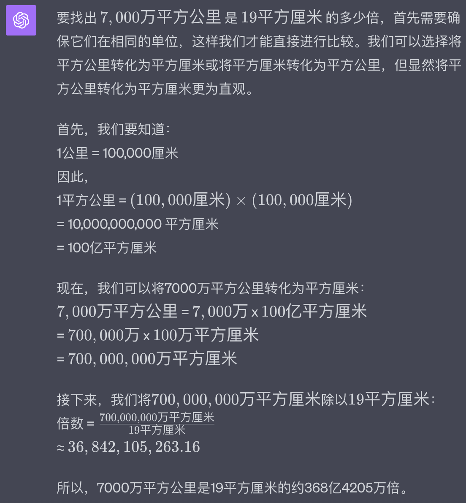
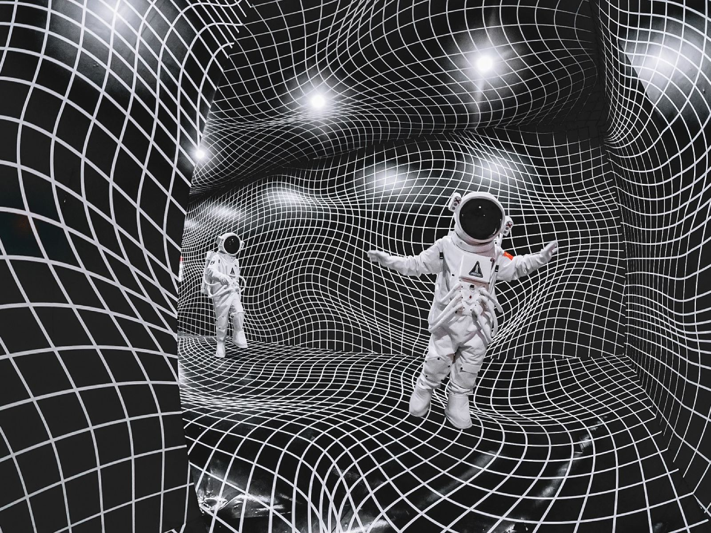
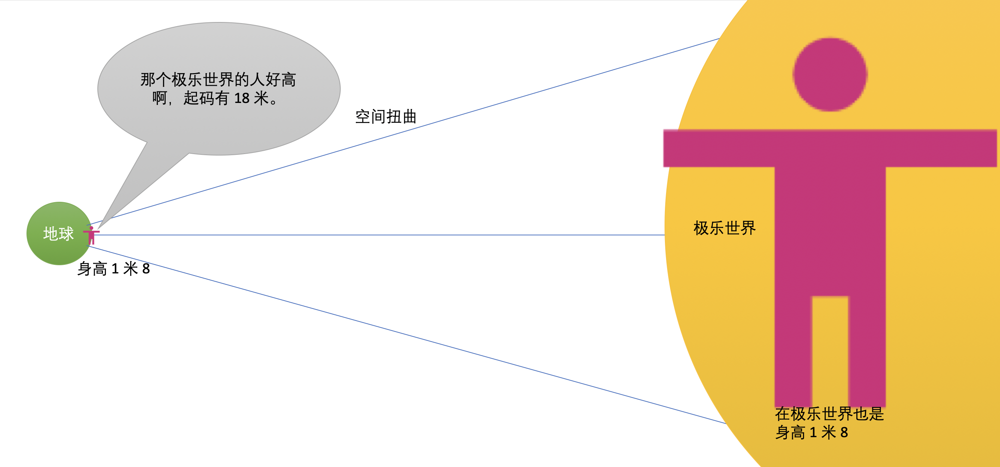
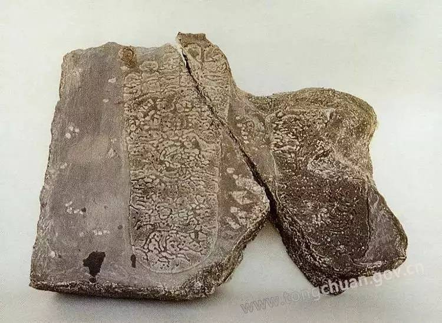

## 阿弥陀佛有多高？

比山还高大的说法，还是一种降维了的说法。佛经里面描述的佛菩萨，实际上比珠峰还大。我不过是简化了一下，把它变成了比山还高大的人。我们先来看看《赞佛偈》中是如何描述阿弥陀佛的高大的。

阿弥陀佛身金色　相好光明无等伦  
白毫宛转五须弥　绀目澄清四大海  
光中化佛无数亿　化菩萨众亦无边  
四十八愿度众生　九品咸令登彼岸  

其中，“白毫宛转五须弥，绀目澄清四大海”这两句就是在称赞阿弥陀佛的身体是无比高大的。具体怎么高大呢，这里用了两个细节，第一个是一根特殊的眉毛。这根眉毛是长在额头中间的，就是平常看见佛像上的额头上的那个点。不过一般佛像上的那个点，其实不是一个点，而是一根非常长的毫毛盘起来的样子。如果展开来的话，就是一根长长的毫毛了。

“根据佛经记载，白毫相是指（人间的释迦牟尼）佛的眉间有白毛，柔软如兜罗绵，其色雪白，光洁清净，长一丈五尺，右旋卷收”[1]。而阿弥陀佛的白毫有多长呢？可以围绕五个大的须弥山那么长。而须弥山又是一个佛教世界观中的一个小世界的核心。我们再简略和缩小一下，就用珠峰来代替了。那五个珠峰合起来有多大呢？这个白毫都可以围绕它一圈。所以，可想而知，阿弥陀佛的佛身会有多大了。

其次是，“绀目澄清四大海”，白话文就是“他的眼睛是深蓝色的，清澈透明，像四大洋海一样广阔”。阿弥陀佛的眼睛，比四大海都大，这个四大海，依然是佛教中的地理知识，还是属于世界观的一部分。我们同样简化和缩小下，就以和印度相邻的印度洋来说，其面积也有7000万平方公里。

普通人的眼球大约有2.5厘米的直径，相当于一个乒乓球的大小，面积大约是19平方厘米。根据 chatGPT 的计算，阿弥陀佛的眼睛至少是普通人眼的约368亿倍。

按照女孩子们最喜欢的 185cm 身高来推算阿弥陀佛的身高，那就是6.808亿公里了。而太阳距离地球仅仅只有 1.5 亿公里。所以阿弥陀佛的身高比太阳距离地球的四倍还长。记住，这还是缩减版的对比。按照佛经的描述，只会更高更大了。用 Bing 生成的参考图片如下（越近的物体视觉上越大，所以太阳离得远，看上去比地球小，但阿弥陀佛即使离得再远，从视角效果依然很大）：

## 一种可能的科学解释

从信仰上来说，佛经上的描述都是准确无误的，而且因为是超越人类的经验，所以必定认为他就是这样的。但是对于初学者来说，或者“理性”的信仰者来说，总是不太愿意接受这类超越人类经验的事物，最多也只是处在半信半疑的状态了。

虽然前文中不建议“理性”的求法者，求真理们不应该关注佛教核心思想之外的内容。这是因为把精力过度地用来思考这些事情，是很难有结果的。但如果只是偶尔的思考，不用过多的精力，那还是可以接受的。

于我自己来说，探索阿弥陀佛身高的事情，也只是当做主要内容学习后的一种趣味思考和练习了。这种探索，在某个时刻，突然就会灵光乍现，还能得出一种自己认为合理的解释了。

话说暑假期间，在北京参观了一场航天官方艺术展 —— 漫无边界，其中有一个场景是这样的：

这里展示的是太空中扭曲的空间。那弯弯曲曲的代表的是光，原本的光线都应该直的，但是因为空间扭曲的原因，所以把光也扭曲了。结果这里展示的光线就是这种弯弯曲曲的了。实际上，这种弯曲弧度是很大的，不会在很短的距离內弯曲这么多次。也就是说，会在非常长的空间內是外延的。可能有人会问，那这和阿弥陀佛巨大无比的身高又有什么关系呢？

就是上面这张图了。意思是地球人的身高是 1.8 米，相同的人，去了极乐世界后，还是 1.8 米。但是因为地球和极乐在两个世界，所处的时空不同。空间在其中发生了扭曲，不过这里的扭曲是变大了。于是，极乐世界上的这个人还是 1.8 米，但在地球人看来，她的身高最少也有 18 米了。扩大了 10 倍都不止。

延续这个推理，如果时空的扭曲程度再大一些，大到了 368 亿倍。也就是阿弥陀佛的身高对比地球人的倍数。那么一个普通人，到了极乐世界后，即使他的身高不变。还在地球人上的人看上去，这个人变大，大到了可以和阿弥陀佛相同的比例了。反过来，阿弥陀佛如果从极乐世界来到地球接引众生时，他的身高也会变成了地球人的比例了。很多净土往生录记录了不少临终者在往生前亲见阿弥陀佛来接引，但是没说，那个来接引的阿弥陀佛比太阳还大了。

当然了，即使是阿弥陀佛来到地球上，变成了地球人的比例。其身高也不会很矮小的。大概会和释迦牟尼佛差不多。按照有人对释迦牟尼佛身高的推测，大概是当时普通人身高的 1.5-2 倍，以当时的印度人的身高大约是 1.6米，释迦牟尼佛的身高就是 2.4 米-3.2米之间了。这是玄奘大师根据在印度求法期间所见到的佛足遗迹后，在大唐时期制作的佛足印。

根据在《法师传》中记载，在摩揭陀国，“一精舍中有如来所履石，石上有佛双迹，长一尺八寸，广六寸，两足下有千辐轮相，十指端有“卐”字华纹及瓶、鱼等皎然明著。是如来将入涅槃发吠舍厘至此。于河南岸大方石上立，顾谓阿难，此是吾最后望金刚座及王舍城所留之迹也”[2]。这里的一尺八寸，大约就是60厘米，相当于现在 92 码的男鞋。高个子的男孩鞋码可以到 46 码,46 码的 2 倍就是 92 码了。从这里也大概知道，释迦牟尼佛身高大概真的有 3米高了。

以上就是我根据太空的时空扭曲现象来推测的为何极乐世界的阿弥陀佛会有那么大的身高了。这样看来，即使是不用超过人类经验，阿弥陀佛巨大的身高也是可以解释得通的了。

正如前面说的一样，这类事情的探索，就当做是一个课外兴趣吧。于求法者，求真理而言，还是应该把中心放在佛教的核心思想上了。只有核心思想才是最最重要的，其他的都是次要的。如果阅读该文可以提升一点学佛的趣味性，“科学性”，那也算是不枉费我一番写作的功夫了。

祝天天开心。

参考：
[1] 佛菩萨为何眉心都有一个点？ https://www.sohu.com/a/271806452_100033143  
[2] 玄奘法师造的佛足印  https://www.sohu.com/a/441769695_466973

