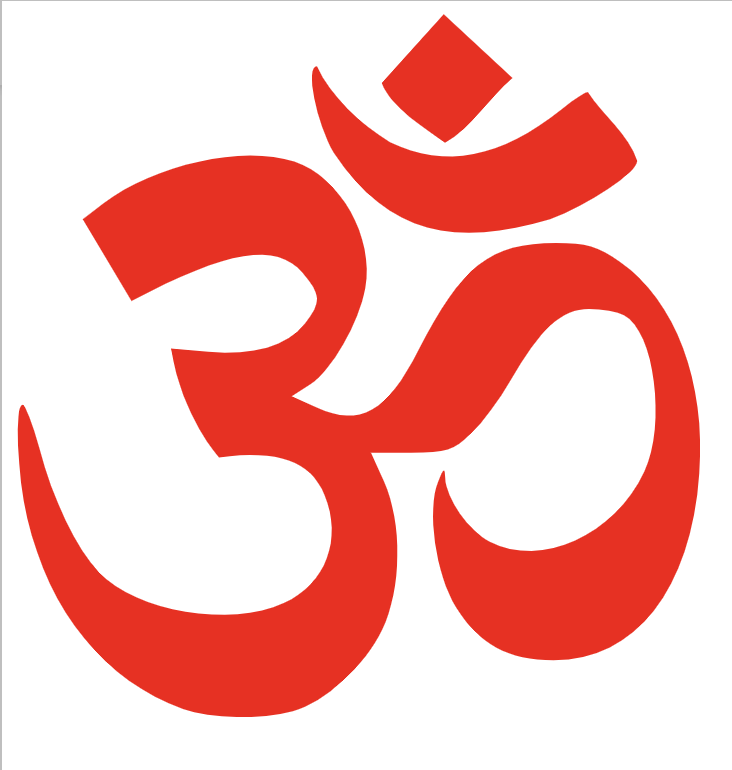

備註：這個是梵語Om（漢字用唵，發音ōng），即是印度教的標誌，也是佛教諸多咒語的首字，更是藏傳佛教中的種子字。

如來藏思想在漢傳佛教中特別流行，不僅被禪宗所接納和採用，就是漢傳佛教的其他宗派，如天臺，華嚴和淨土等也不免受到影響。勉強說來，隻有玄奘大師後的新唯識才算是和如來藏保持了畢竟清晰的邊界，證據可參考《成唯識論》和《瑜伽師地論》，這兩者都不涉及如來藏，甚至還批評了“本來清淨”一類的觀點。

然而，如來藏思想從佛教史發展來看，是後期才比較流行的思想，再後期一點就是秘密大乘了，也就是通常所說的密教。根據很多人的說法，密教的思想又是延續了的如來藏思想。關於密教和印度教的討論已經足夠多，總結來說，無非是極其相似，不僅思想上的內容很相似，就是外在的形式，事項上的修煉都是極其相似的。不過，這點就不在這裏展開了。

回到如來藏和印度教來說，這兩者也有很多觀點是非常相似的。難怪有人說，學習如來藏者，要警惕下，仟萬不要最終變成了印度教神我的信徒。如果那樣的話，那真是非常可惜了。

實際上，很多人學習如來藏的朋友，都不太關註和了解印度教的神我思想，甚至從來冇有去了解過印度教的神我思想。經常有人開玩笑說，如果不註意區分的話，哪一天遇到了印度教的信徒，可能會有一種相見恨晚的相似感。

## 如來藏和印度教神我思想的對比

有鑒於此，在chatGPT4.0的幫助下[1]，總結了如下的相似之處：

1. **人人都有佛性/Brahman** 
* 如來藏強調人人都有佛性，這一佛性是純淨無瑕（本來清淨）的，隻是被無明和煩惱所遮蔽。
* 印度教的觀點是每個生命體都有ātman，都是Brahman的一部分。人的真我（ātman）被視為神聖的、永恆的，並與宇宙的自我（Brahman）相一緻。

1. **修行是淨化的過程**
* 如來藏思想中，通過修行和實踐，衆生可以去除遮蔽佛性中的染汙（煩惱和無明），最終達到覺悟。
* 在印度教中，通過內觀、瑜伽和冥想來淨化自己，個體可以認識到自我與Brahman的一緻性，從而超越生死輪回，達到解脫。（Brahman很多人翻譯為是“梵”，即“梵我一如”是其根本思想）

1. **不二教義**
* 如來藏思想中的佛性與一切衆生之間冇有本質的區別，隻是在現象上出現了差異。經常強調“不二”或“一如”的觀念，即萬物的本質都是一樣的，皆為佛性或如來藏的體現。
* 印度教的Advaita Vedanta（非二教義）也強調一切皆是Brahman，所有的區分和差異都是表面的、相對的。
  
1. **佛性與神我**
* 雖然強調無我，但也認為有一個普遍存在的真理或本質，即如來藏或佛性。
* 印度教認為，雖然世界是多樣的，但背後有一個統一的原則或本質，即Brahman（宇宙自我）。

1. **佛性與神我都是永恆的**
* 在佛教中，世間一切都是無常的，隻有如來藏，即佛性，是不變的，是衆生最終的歸宿。
* 在印度教中，整個宇宙、物質世界（prakriti）都是變化的，而唯一不變的是真我（ātman）和宇宙自我（Brahman）。
  
1. **悲心與普渡**
* 如來藏思想中強調，因為每個衆生都有佛性，所以每個衆生都值得被憐憫、被救渡。
* 印度教中也有對所有生命的尊重，因為每個生命體都有神聖的ātman。所以印度教中吃素的人非常多，甚至比佛教徒中吃素的還多。
  
1. **覺性（內在指引）**
* 在佛教中，如來藏或佛性是一個內在的、固有的潛力或本質，它可以指引衆生走嚮覺醒。
* 在印度教中，內在的ātman是個體真實的自我，也是指引個體走嚮靈性覺醒的核心力量。

1. **真實本質**
* 佛教中的法（Dharma）表示宇宙的法則或真理，與之相應的如來藏是每個衆生內在的真實本質。
* 印度教中的Dharma也指代宇宙的秩序和法則，與之相應的ātman則是每個生命體的真實本質。

1. **對真實的追求**
* 佛教中，真實的本性（如來藏）被遮擋，但修行可以揭示其真實。
* 印度教中，真我（ātman）被無知（avidya）所遮擋，但通過修行和知識，人們可以認識其真實本質。

1. **不可說——非語言的真理體驗**
* 如來藏或佛性的真實體驗被描述為超越言語的，是一種直接、非概念的體驗。
* 印度教的神秘主義者也經常描述Brahman的體驗是超越言語和思想的。

1. **無明**
* 如來藏思想中，衆生之所以未能認識到自己的佛性，是因為被煩惱、無明和妄想所迷惑。
* 印度教描述，衆生之所以身處苦難，是因為avidya（無知）遮擋了他們對ātman和Brahman的認識。

1. **智慧與慈悲**
* 在佛教中，智慧和慈悲是兩個不可或缺的品質。智慧能夠幫助我們認識到如來藏，而慈悲則是佛性的體現。
* 在印度教中，jnana（知識或智慧）和bhakti（奉獻或虔誠）是兩個重要的修行途徑，它們幫助修行者認識到ātman與Brahman的關係。

1. **對神秘體驗的追求**
* 如來藏思想中，（指某些宗派）某些修煉和冥想的目標是達到神秘的體驗或覺悟，這是直接體驗佛性的一種。
* 印度教的某些傳統，特別是與瑜伽和冥想相關的，也追求神秘的體驗，作為與Brahman連接的直接證據。

通過以上的對比可知，兩者的相似程度實在是太高了，有些地方隻要把名詞一換，簡直就是一模一樣。

## 為什麼佛陀要講“如來藏”？

可能有人會問了，那為什麼佛要給大家講如來藏呢？如來藏相關的經典非常之多，常見的就有如《楞嚴經》《如來藏經》等。在《如來藏經》，佛陀用了九個比喻來說一切衆生皆有如來藏。這九個比喻分別是：

1. 金藏比喻：如同在砂石之中藏有純金，雖被砂石掩蓋，但金的本質仍然純淨。
2. 稻穗比喻：如同稻穗中有稻粒，但需要去殼才能看到。
3. 蜜藏比喻：如同蜜被蜜蜂窩掩蓋，需要打開才能取到甜蜜。
4. 油藏比喻：如同芝麻中有油，但需要壓榨才能提取油。
5. 火藏比喻：如同木頭中存在火，但需要摩擦才能點燃。
6. 牛乳藏比喻：如同在牛乳中存在黃油，但需要經過處理才能提取。
7. 寶藏比喻：如同在地下藏有寶物，但需要挖掘才能找到。
8. 芽藏比喻：如同在種子中存在芽苗，但需要適當的條件才能生長。
9. 水藏比喻：如同在源泉中存在清水，但需要挖掘才能流出。

不過在這些經典中，佛陀並冇有說明為何要講如來藏？直到在《楞伽阿跋多羅寶經》卷2中，“一切佛語心品之二”：

**經文：**
爾時，大慧菩薩摩訶薩白佛言：「世尊！世尊修多羅說，如來藏自性清淨，轉三十二相，入於一切衆生身中，如大價寶，垢衣所纏。如來之藏常住不變，亦複如是，而陰、界、入垢衣所纏，貪欲恚癡不實妄想塵勞所汙，一切諸佛之所演說。雲何世尊同外道說我，言有如來藏耶？世尊！外道亦說有常、作者離於求那，周遍不滅。世尊！彼說有我。」

**直譯：**

當時，大慧菩薩摩訶薩問佛：「世尊，您說過，如來藏的本性是純淨的，具有三十二的特徵，存在於所有生命體內，就像一件被骯髒的衣物包裹的珍貴寶石。如來藏始終是恆定不變的，但被五蘊、六界、十二入等的骯髒衣物所覆蓋，也被貪心、瞋恨、無知和虛假的想法所玷汙。所有的佛都這麼說過。那麼，世尊，為什麼您和外道一樣也說有「我」存在，認為這個「我」是永恆、創造者、獨立的如來藏，且永不消失？」

**評論：**
這段經文中，大慧菩薩摩訶薩詢問佛關於如來藏的教義與外道（異教徒）的觀念之間是否有區別，尤其是在“我”的存在概念上。其中有兩個重點值得關註：
* 第一：外道也說有我，認為有一個真實的、永恆不變的、不會消失的“我”。
* 第二：世尊也說有我，且這個我就是如來藏，它的本性是純淨的。並且用了“髒衣服包裹著的寶貝”來比喻，這個比喻和《如來藏經》的比喻類似。

然後佛陀就回答了大慧菩薩的這個提問。

**經文：**
佛告大慧：「我說如來藏，不同外道所說之我。大慧！有時說空、無相、無願、如、實際、法性、法身、涅槃、離自性、不生不滅、本來寂靜、自性涅槃，如是等句，說如來藏已。如來、應供、等正覺，為斷愚夫畏無我句故，說離妄想無所有境界如來藏門。

大慧！未來現在菩薩摩訶薩，不應作我見計著。譬如陶家，於一泥聚，以人工水木輪繩方便，作種種器。如來亦複如是，於法無我離一切妄想相，以種種智慧善巧方便，或說如來藏，或說無我。以是因緣故，說如來藏，不同外道所說之我。是名說如來藏。開引計我諸外道故，說如來藏，令離不實我見妄想，入三解脫門境界，悕望疾得阿耨多羅三藐三菩提，是故如來、應供、等正覺作如是說如來之藏。若不如是，則同外道所說之我。是故，大慧！為離外道見故，當依無我如來之藏。」

**直譯：**

佛對大慧菩薩摩訶薩說：「我所說的“如來藏”與外道說的“我”是不一樣的。大慧，我有時候會用“空”、“無相”、“無願”、“如”、“實際”、“法性”、“法身”、“涅槃”、“離自性”、“不生不滅”、“本來寂靜”、“自性涅槃”這些語句來描述如來藏。而如來、應供、等正覺之所以這樣說，是為了幫助那些害怕“無我”觀念的人理解，並指出真正的如來藏是超越妄想和任何事物的。

未來和現在的菩薩摩訶薩，不應該執著於“我”的觀念。就像陶工用泥和各種工具製作各種器皿，我也用各種智慧和方法，或說有如來藏，或說無我。主要是因為這些原因，我談論如來藏，這與外道的“我”是有區別的。我談論如來藏，是為了引導那些抱有“我”觀念的外道（異教徒或不同宗教的信徒），希望人們能遠離錯誤的、虛妄的“我”的觀念，進入三種解脫的境界，迅速實現最高的覺悟，即阿耨多羅三藐三菩提。如果不是這樣，那麼我的說法就會和外道說的“我”一樣。因此，大慧，為了遠離外道的觀念，你應該依賴無我的如來藏。」

**評論：**
這段經文主要是佛陀解釋“如來藏”的概念，強調其與外道所說的“我”有所不同，並鼓勵大慧菩薩摩訶薩遠離“我”的執著。同時，這裏點出來了佛陀說如來藏的兩個原因：
* 第一：“為斷愚夫畏無我句故，說離妄想無所有境界如來藏門”，是為了幫助那些害怕“無我”觀念的人理解，並指出真正的如來藏是超越妄想和任何事物的。其中“無我”是基礎佛法和般若係的重要思想。
* 第二：“開引計我諸外道故”，白話為，是為了引導那些抱有“我”觀念的外道（異教徒或不同宗教的信徒）。意思，用“如來藏”這樣近似外道“我”（ātman）的概念吸引外道，這樣外道更容易相信佛法，然後再把外道引導進入“三解脫門”。而三解脫門的內容即是空、無相、無願。這樣就能迅速獲得最高的覺悟 —— 即是成佛了。

而三解脫門正是基礎佛法和般若係（或中觀）的重要思想，這樣兩次都回歸到了基礎佛法和般若法門了。

## 總結

換句話說，如果你能夠接納“無我”的思想，並不會害怕。同時又知道三解脫門是成佛的快速途徑，那麼其實是冇有必要額外再去學習一個和外道相近的“我”的“如來藏”思想的。

而如果你害怕“無我”，總覺得那就是一種虛無的感覺，要有一個“我”才覺得踏實。那麼你就可以學習下如來藏了，因為如來藏裏面清楚地告訴我們，我們有一個本來清淨的自性，一個本來清淨的如來藏。

隻是為了避免這個如來藏和外道的“神我”（ātman），一定要記得多多學習無我和三解脫門，而無我和三解脫門的講解，多在阿含經和般若係經典中。

祖師大德們肯定也註意到這點，所以，在講解如來藏時，一定要搭配講“空如來藏”，這樣才不至於墮入外道的“神我”上而認為有一個永恆不變的“東西”，無論那個東西叫什麼 —— “我，如來藏，自性。這也是“如來藏”思想的中道：空如來藏，不空如來藏，以及空不空如來藏。

再補充一點，當年禪宗達摩祖師來漢地弘傳禪宗時，最早用的正是這部《楞伽阿跋多羅寶經》來“以心印心”。直到五祖弘忍大師時，才開始用《金剛經》，不僅因為它更簡練、還因為它說無我更加直接。結果使用《金剛經》的年代也不多，禪宗又開始推崇起《楞嚴經》來了，而且幾乎不提《楞伽經》中，佛陀對大慧說的，佛陀說如來藏是說給那些害怕“無我”，以及外道中執著有我的兩點重要原因了。而重心也從無我之如來藏，變成了有我之如來藏（把如來藏當自性就是有我之如來藏，這裏的“自性=我”），這實在是一件很遺憾的事情了。

對於如來藏的發展感興趣朋友，不妨可以參考下：
1. 印順法師的《如來藏之研究》。 https://deerpark.app/reader/Y0037/1 
2. 法鼓山創辦人聖嚴法師的《華嚴心詮》中的第四章：直顯真源——佛了義實教。https://ddc.shengyen.org/?doc=07-14-008&tree_id=j1_3828 。

其他參考：

1. chatGPT4.0對於如來藏和印度教相似性的的回答 https://chat.openai.com/share/3cf8ed4d-374a-4758-bd30-482a2a4fe775
2. 楞伽阿跋多羅寶經，卷第二 https://deerpark.app/reader/T0670/2
3. 我之前的文章：嘗試對比中觀、唯識和如來藏 https://mp.weixin.qq.com/s/n1RfPHv65iJtp1WmARvSNQ 

