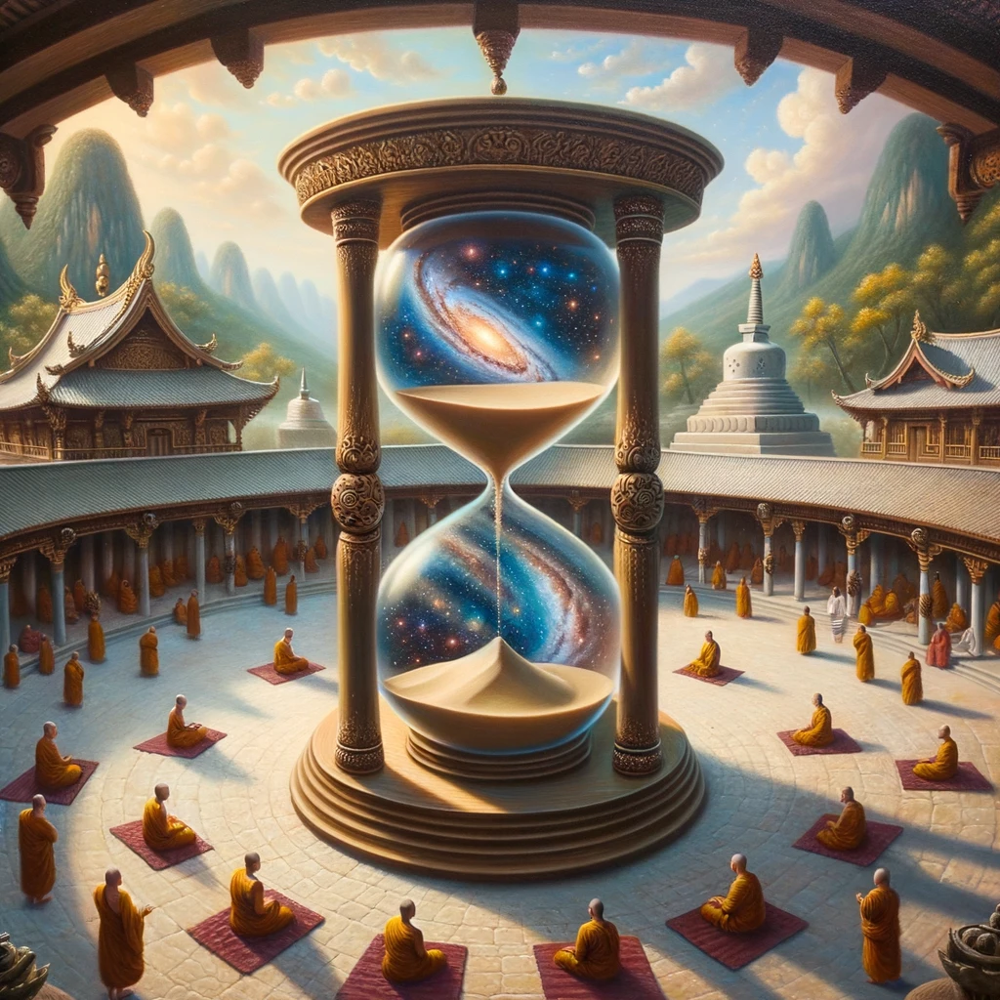
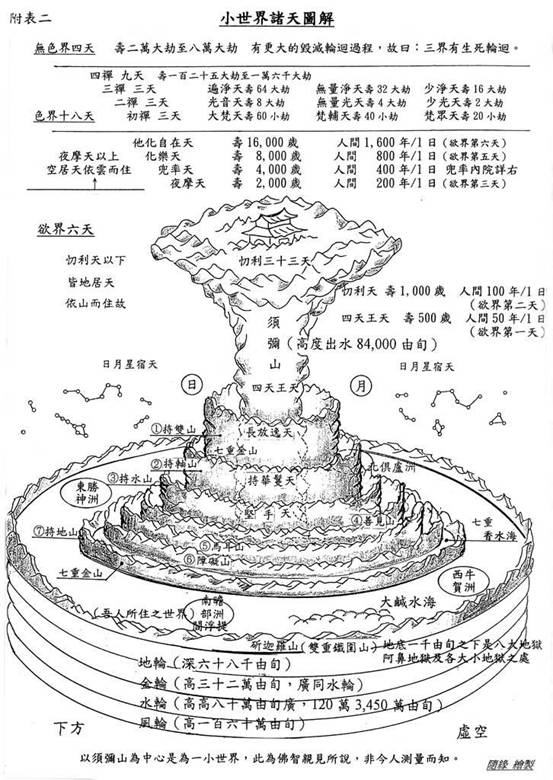

佛教里面关于时间的论述很多，有论述说：
* 时间是有依赖性的：因为时间离不开空间，离不开事物的变化，若一切事物都不存在变化，时间则不存在。
* 时间不是实有的：实有的概念就是有一个最小的时间单位，而佛学上认为时间可以无限切割，不存在最小单位。目前科学虽然在不断探索可观测到的时间，但是，理论上的最小时间依旧是不存在的。
* 时间是相对的：如《华严经 - 普贤菩萨行愿品》中说，“我能深入于未来，尽一切劫为一念，三世所有一切劫，为一念际我皆入”，意思是，普贤菩萨可以把一切劫化作一念。一切劫可以理解整体的时间概念，或无限长的时间。一念则大概是0.018秒。菩萨菩萨可以把无限长的时间，融入成一念。这就说明了时间的相对性了。其次，民间或《西游记》中也有“天上一日，地上一年”的说法，这也表明了时间的相对性了。

备注：一念的推算：一刹那为一念，二十念为一瞬，二十瞬为一弹指，二十弹指为一罗预，二十罗预为一须臾，一日一夜有三十须臾。 而一日一夜有24个小时，是480万个“刹那”。 也就是说，一刹那，就是一念，才0.018秒。

不过想要理解这个时间的相对性是不太容易的。毕竟现在科学上的相对论发展，还是比较初级的阶段。所以，本文就用一些佛学和科学的事例，先来说明一下时间的确是有相对性的。可以开拓眼界，也可以增加学佛的趣味性。

## 小世界

佛教的一个小世界是以须弥山为中心的，简略来说，须弥山下面有地狱，须弥山的山腰和山顶则是天界。人间则在海上，分成四个洲，其中我们在南边的瞻部洲。

不过地理位置不是本文的重点，本文想要说明的时间的相对性。

按照地狱界，人界，天界，这三界的时间也是不一样的。虽然图中只列举了天界和人界的时间差，不过地域界和人界也是同样有时间差的。只是在图中略过了。所以，我们也只看下天界和人界的部分。

天界一共有28层天，最低天是四天王天，就是四大天王（东方持国天王，南方增长天王，西方广目天王，北方多闻天王）所住的地方。

图中说，人间50年，才等于四天王天的1天。而四天王天的天人们，寿命是500岁。因此还可以推算下是相当于人间的多少年，即500 x 50 x 365 = 9125000人间年。即9百万岁。这个年龄可真够大了。不过以天界来说，还是最低的。

除了最低天之外，我们再来看下兜率天。我们的未来尊佛，弥勒菩萨，现住在兜率天的内院中。那里的天人又有多久的寿命呢？

图中的兜率天，即欲界的第四层天，那里的天人寿命是4000岁，那里的一天是人间的400年。同样地，我们也折算成人间的时间，来看看他们都有多少岁？即4000 x 400 x 365 = 5'8400'0000。即5.8亿年。

而经典上说弥勒菩萨将于5.7亿年后，将下生人间成佛，成为弥勒佛。这个时间还是比较接近的了。那为何会有1400万年的时间差？可以猜测下，或许是弥勒菩萨不用等到4000岁，只要人间成佛的因缘具足，可以提前下生人间了。或许是4000岁是个大约的数字，而不是精确的数字。就好像人间一样，平均寿命70-80岁，其实也是一个范围的，相比天人也是类似，不会完全是一个岁数的。

总之，这里给出来了一个5.7亿年的数学推理了。算是回答了标题中的问题了。

## 《华严经》之“寿量品”读书笔记

寿量品：尔时，心王菩萨摩诃萨于众会中告诸菩萨言：「佛子！此娑婆世界释迦牟尼佛刹一劫，于极乐世界阿弥陀佛刹为一日一夜；极乐世界一劫，于袈裟幢世界金刚坚佛刹为一日一夜；袈裟幢世界一劫，于不退转音声轮世界善胜光明莲华开敷佛刹为一日一夜；不退转音声轮世界一劫，于离垢世界法幢佛刹为一日一夜；离垢世界一劫，于善灯世界师子佛刹为一日一夜；善灯世界一劫，于妙光明世界光明藏佛刹为一日一夜；妙光明世界一劫，于难超过世界法光明莲华开敷佛刹为一日一夜；难超过世界一劫，于庄严慧世界一切神通光明佛刹为一日一夜；庄严慧世界一劫，于镜光明世界月智佛刹为一日一夜。佛子！如是次第，乃至过百万阿僧祇世界，最后世界一劫，于胜莲华世界贤胜佛刹为一日一夜，普贤菩萨及诸同行大菩萨等充满其中。」

这品可能是《华严经》最短的一品了。只有这一个段落，而最长的一品，有20卷，或40卷之多。这个段落的长度，可能都不到1卷的十分之一。所以这品真的很短了。

佛教里面的描述，经常是无比宏大的场面。时间也是，无比久远。而这段经文，就在于说明各个世界的时间是不同的，这里的不同，比起小世界中的天界和人界来说，比例更为宏大。根据以上的经文，折算成人间的寿命，我们可以得到这个表格。

首先我们要知道一劫是多久。佛教里面劫的概念，分为三等：小劫、中劫、大劫，且劫数自有其算法：《 大智度论 》自寿自十岁，百年增一至八万四千岁为止，然后再百年减一至十岁为止，如是一增一减，为一小劫 (（84000－10）x 100 x 2 = 1679万8000年)，二十小劫为一中劫 (1679万8000年 X 20 = 3亿3596万年)，经成、住、坏、空，四中劫为一大劫：3亿3596万年 X 4 = 13亿4384万年。

根据给定的经文，整理出的表格如下（这里用的是“大劫”）：

| 世界名称                          | 一日一夜对应到娑婆的年数   | 数字 |
|--------------------------------|-------------------|-------|
| 娑婆世界 释迦牟尼佛刹           | 1                | 1 |
| 极乐世界 阿弥陀佛刹                | 13亿4384万年        | 13亿4384万年 |
| 袈裟幢世界 金刚坚佛刹             | 13亿4384万年^2   (^2表示平方) | 约180亿亿年 或1.8x10^18年  |
| 不退转音声轮世界 善胜光明莲华开敷佛刹 | 13亿4384万年^4  （4次方）  | 3.6x10^36年  | 
| 离垢世界 法幢佛刹                 | 13亿4384万年^8  （8次方）   | 1.06 x 10^73年  |
| 善灯世界 师子佛刹                 | 13亿4384万年^16  （16次方） | 1.13 x 10^146年 |
| 妙光明世界 光明藏佛刹             | 13亿4384万年^32  （32次方）  | 1.27 x 10^292年
| 难超过世界 法光明莲华开敷佛刹       | 13亿4384万年^64  （64次方）  |  1.63 x 10^584年            |
| 庄严慧世界 一切神通光明佛刹         | 13亿4384万年^128   （128次方）  | 2.68 x 10^1168年            |
| 镜光明世界 月智佛刹               | 13亿4384万年^256   （256次方）| 7.19 x 10^2336年                |
| 过百万阿僧祇世界               | ...（以此类推）  | |
| 胜莲华世界 贤胜佛刹   | 上一个世界的平方 | 无法表达了，1 x 10^无穷数 年 |  

这些劫数的计算涉及到极大的数字，很显然超出了常规的理解范围了。但我们还是可以用现代科学上的时间来进行类比。希望以此可以帮助我们理解。

## 科学上的地球年，银河年

众所周知，地球年的计算法是基于地球围绕太阳完成一周的时间。这个时间大约是365.25天，这就是为什么我们的日历上大多数年份有365天，但每四年会有一个闰年，增加一天，使得那一年有366天。这个额外的一天是为了补偿那0.25天的差距。其实这还是简化的情况，再准确点其实是365.2422天，所以闰年规则中有额外的修正：每100年的年份，如1900、2100等，即使可以被4整除，也不是闰年，除非那一年可以被400整除（如2000年）。这样的修正使得日历更接近天文学上的实际情况。

除了地球年，其实还有银河年的说法。和地球年的计算方法是一样的，地区绕太阳一周完全的时间是地球年。那么太阳绕着它的中心——即银河系中心 —— 所完成一周的时间就是太阳年了。根据目前的估计，太阳系绕银河中心完成一圈所需的时间大约为2.25亿至2.50亿年。这一估算是基于对银河的结构、质量分布以及我们太阳系在其中的运动速度的观测和测量。考虑到太阳系已经存在了约45亿年，我们的太阳系可能已经绕银河中心转动了大约20次。

也就说，假设太阳上可以住人的话，且从太阳系诞生时，这个人也出生了，那么这个人大概才20岁了。而地球上，已经过去了45亿年。

| 星球    | 围绕其中心一周的年数   | 
|----------|------------|
| 地球人   | 1年                 | 
| 太阳人  |  大约为2.25亿至2.50亿年 | 

可惜，这个表格以目前的科学发展来，还无法继续下去。

以目前的科学来说，才对太阳系有了更深的了解，比如在2006年的国际天文学联合会上刚纠正了九大行星说，把冥王星去除了，变成了八大行星了，因为冥王星不符合行星所需要的三个条件，最终冥王星被重新分类为矮行星。至于银河系的事情，知道的就更少了。而银河系之外的事情，就更谈不上了。

希望天文学可以取得更大的突破，能够续写上面这张表格。这样或许就能和上述《华严经》中的“寿量品”的表格遥相呼应了。不过即便上面这张表格只有2行，但依然可以帮助我们理解，时间是有相对性。

希望这个地球年、银河年的事例，可以帮助我们理解“寿量品”中不同世界，不同佛刹的相对时间了。

愚夫合十。

阿弥陀佛。

