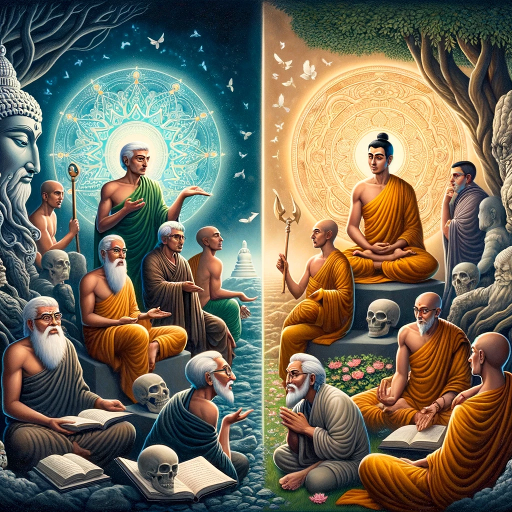

# 第一次，外道說常樂我淨

早在佛教出現之前，古印度的宗教，就存在常樂我淨的說法，那時的常樂我淨的意思是：

* 常：認為世界有永恆存在的。如果世界可以被毀滅，那就認為宇宙是永恆存在。如果宇宙可以被毀滅，那就有一種高於宇宙的存在。總之，就是存在某種永恆不變的實體或本質，可以是世界，宇宙，或高於宇宙的那種東西，如梵（Brahman）。
* 樂：認為有一種持續的終極快樂狀態。（補充：世俗說的，以苦為樂，苦中作樂，雖然可能有正面積極的一面，但終究是對於苦的本質認識不足。）
* 我：認為有一個獨立的、恆常的、不變的自我或靈魂。
* 淨：認為存在某種絕對的、無瑕的純淨狀態，並去追去這種狀態，用恆河水可以得到身心淨化。（補充：或認為身體是清淨的，並追求身體的永生，或想要永葆青春。）

佛教誕生後，首先反對的就是常樂我淨，並稱之為“四顛倒”，並對應地提出了 世間無常，一切皆苦，諸法無我，涅槃寂靜 的觀點，在佛教，這些觀點也被叫做三法印（或四法印）。三法印：諸行無常，諸法無我，涅槃寂靜。如果加上一切皆苦，即是四法印了。相對而言，三法印更為流行。而這三法印是佛教各體係、各宗派之見的共識。簡單說明如下：

* 世間無常：意味著所有存在的事物都在不斷變化，冇有任何事物是恆久不變的。這包括了物理世界的一切，如山河大地，日月星辰，以及外在的身體，也包括了精神世界（或心理世界），包括感受、感知、意識和思想。
* 一切皆苦：一切存在都是苦的。苦在這裏不僅僅指身體或精神上的痛苦（苦苦），更廣泛地指一切不滿足、不穩定和無常的狀態（行苦）。除此之外，世俗的快樂叫做壞苦，因為會很快地變壞，變壞後而産生痛苦，所以世俗的快樂被稱之為壞苦。
* 諸法無我：冇有任何事物或存在擁有一個固定、獨立的、不變的自我實體。
* 涅槃寂靜：涅槃是一種超越了苦、無常和無我的狀態，是一種最終的解脫和平靜。涅槃不受輪回的束縛，是對一切痛苦和無常的超越。

這三法印，或四法印是基礎佛學（阿含經）中最重要的內容了，學佛之人，都應該對此要有足夠的了解的。

# 第二次，佛教也說常樂我淨了

根據佛教史來說，佛教發展到了後期，為了吸引其他宗教，尤其是說“有我”的部分，如來藏思想和經典開始流行起來。而在如來藏思想裏面，常樂我淨是非常重要的特質，甚至稱之為涅槃四德。當然，對此的解釋當然和外道的非常不同，也不是之前所破斥的常樂我淨了，如來藏思想中常樂我淨的意思是說：

在如來藏思想中，涅槃有四德，即“常樂我淨”，這裏的“涅槃”，和如來藏、佛性、真心等基本上都是同一意思，隻是語境不同，上下文不同而已。

* 常：涅槃本質上是恆常不變的，冇有生滅，這就是所謂的“常”。同時，它能夠根據因緣不斷變化而始終存在，這也是“常”的含義。
* 樂：涅槃的本質是寂靜和永恆的安甯，這就是所謂的“樂”。此外，涅槃的運用是自由自在的，能夠隨心所欲，這也是“樂”的意義。
* 我：關於“我”的理解有兩種：
  * 一種是基於涅槃的本質，稱為“我”，就像《涅槃經》中提到的：“若法是實是真是主是依，性不變易是名為我”。
  * 另一種是基於自由自在的行為，也稱為“我”，如《涅槃經》中說：“有大我故名大涅槃，大自在故名為大我。雲何名為大自在耶？有八自在則名為我。”
* 德：涅槃的本質是解脫一切汙垢，這就是所謂的“淨”。同時，它能夠在變化中始終保持不受汙染，這也是“淨”的意義。

從宗教史的角度來說，常樂我淨的兩次大反轉很有趣，先是外道說常樂我淨，佛教破斥，然後隨著因緣的變化，佛教如來藏思想又大興，佛教自己說常樂我淨了，雖然內涵非常不同，但如果不深入學習佛學的話，很可能學到是外道，而非佛法。而這，是非常值得求法者警惕的。

為此，我特意請ChatGPT總結了印度教中關於“常樂我淨”的說法，參考如下，希望可以更好地還原印度教的說法，而不是通過其他人轉述。現代的印度教由古婆羅門教發展而來，尤其是商羯羅先在佛教中學習，後借鑒了佛教思想複興了古婆羅門才有了當今的印度教，所以，佛教和印度教之間的說法很相近，如果不仔細比較的話，其實是很容易混淆的。

**提問：印度的諸多奧義書中，關於常樂我淨的觀點都有哪些？**

**ChatGPT：**
*在印度的許多奧義書（Upanishads）中，關於“常樂我淨”（Satchidananda）的觀點佔據了核心地位。奧義書是印度教最重要的哲學和靈性文獻之一，它們探討了關於終極實相、宇宙本質和個人靈魂（Atman）的深奧議題。在這些文獻中，對“常樂我淨”概念的探討主要體現在以下幾個方面：*

* *常（Sat）- 真實或存在：奧義書中經常強調一個終極的真實或存在，這是一種永恆不變的、超越物質世界的實質。這種存在被認為是一切現象背後的基礎和本質。*
* *樂（Ananda）- 極樂或幸福：這些文獻中也強調一種終極的快樂或幸福狀態。這種狀態超越了物質和世俗的快樂，是一種深層的、與終極實相連接的內在喜悅。*
* *我（Chit）- 意識或知識：奧義書將意識或知識視為宇宙的一個基本屬性。這種意識不是局限於個體的，而是一種普遍的、與終極實相相連的意識。*

*在這些討論中，“常樂我淨”常常被用來描述個人靈魂（Atman）與宇宙靈魂（Brahman）的關係。這兩者被認為本質上是相同的，而個體的最終目標是意識到這一點，從而實現自我與宇宙的統一。此外，奧義書中的這些觀點也在後來的印度教哲學體係中得到了進一步的發展和解釋，尤其是在吠檀多（Vedanta）學派中。吠檀多哲學深入探討了個人靈魂與宇宙靈魂之間的關係，強調了通過靈性實踐實現這種統一的可能性。*

