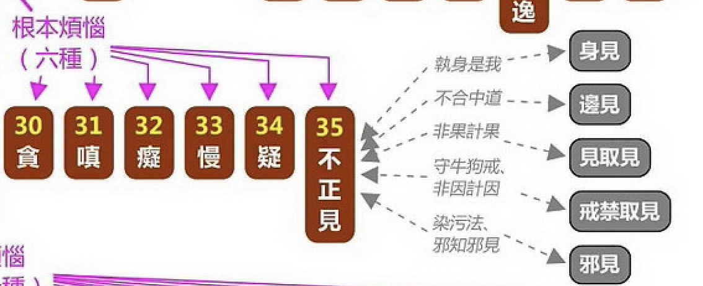

經常在學佛群裏面聽別人提起“執著”，尤其是說別人執著的特別常見。可是認真地問對方，什麼是執著時，又通常得不到正面的回應。久而久之，大家都習慣了說執著，卻並不清楚到底什麼是執著。更糟糕的是，甚至有人不知道該如何生活了，被人說這也是執著，那也是執著，仿佛就沒有不是執著的東西了。如果是這樣，那真的很有必要來討論下，到底什麼是執著了。

## 世人的執著

先來看看一些例子吧。

* 有人說：必須去海外留學，才能學到真正的東西。
* 有人說：必須考上985，211（指排名靠前的大學），人生才是圓滿的。
* 有人說：必須學會AI，才會有前途。
* 有人說：必須去國外旅遊幾次，人生才有意義。
* 有人說：必須學會一項樂器，才能考上好的大學。
* 有人說：女人若不學會化妝，將來就沒人願意娶。
* 有人說：女兒大了就得嫁人，嫁人了才會幸福，才有歸宿。
* 有人說：除非用上了xxx品牌的包包，否則人生就是缺憾。
* 有人說：非某某不嫁，如果錯過他，我會後悔一輩子。
* 有人說：我非某某品牌的coffee不喝。
* 有人說：只有某某茶才是真正的茶。
* 有人說：只有考上公務員才有出路。

這樣的例子還有很多，你要留意下，幾乎每天都會聽到類似的言論了。這些都是“執著”，而且都是普通人的執著。仔細看看這些例子，不難總結出來這裏的規律 —— 那就是認為只有這樣，才是成功的，才是圓滿的，才是有意義的，才是有價值的。“只有這樣”是指單一選擇，單一因素，才能有最好的結果。肯定這“單一選項”的同時，也否定了其他選擇了。我們不妨把個規律叫做“一因一果”。

事實上，這種“一因一果”正是諸多執著的本質，即對前因後果的錯誤認知，産出了執著。通常來說，想要達到某種結果，一般都是有很多種選擇的，所謂 —— 三百六十行，行行有狀元。如果你的目標是想要成為一個狀元，那麼任何一個行業裏面都有狀元，都是可以成為其狀元的。至於你要選擇哪個行業，應該綜合考慮，尤其是結合自身的優點、特長來說。這樣選擇一個合適的行業，才最有可能成為其狀元了。

## 學佛人的執著

不僅世人會有很多執著。其實學佛人，也是有很多執著的。比如說：

* 有人說：必須拜地藏菩薩懺才能清除罪障。
* 有人說：必須念佛這一門，才有解脫的可能。
* 有人說：只有某某師父，才是真正的老師（指善知識，下同）。
* 有人說：只有某某宗派，才是真正的佛法。
* 有人說：沒有神通作為證明，就不能認定老師的證量。
* 有人說：必須穿破衣服，用舊東西，過得像乞丐才是真正的修行人。
* 有人說：瞧，那和尚還用iPhone呢，還坐大品牌轎車，算什麼出家人啊。
* 有人說：必須每天念《楞嚴經》100遍，否則無法開悟。
* 有人說：必須修習密宗法門，其他流派都太淺薄。
* 有人說：數息打坐就是修行，研讀經論純屬多餘。
* 有人說：只有在深山老林閉關，城市裏的修行都不算數。

除了“一因一果”的例子之外，這裏又多了一些不同的“執著”的例子。那就是只有這樣，才是那樣。比如，只有打坐才是修行，這不僅把打坐和修行劃上了等號，還直接排除了其他的選擇。否定了持戒、念佛等其他方式也是修行。這顯然違背了大多數人的認知。

## 什麼是執著？

先不討論佛教的核心，先看對執著的定義和描述，ChatGPT的這個總結相當到位了。摘錄文字如下：

在佛教中，"執著"是一個核心概念，通常指對物質、想法、情感等的過分依賴或固執。以下是佛教對執著的幾種描述：

* 物質執著：對物質財富、身體或感官享受的過分依戀。
* 觀念執著：固守某些觀點、信仰或思想，不願意接受新的或不同的理念。
* 情感執著：對特定情感狀態（如快樂、愛情或悲傷）的過度追求或回避。
* 自我執著：對“我”或“自我”身份的強烈認同，這包括對自我的成就、外貌或社會地位的執著。
* 儀式執著：盲目遵守宗教或社會儀式而忽視了其背後的精神意義。

再用這個定義和描述來看上面的例子，可謂是一目了然了。如：

* 物質執著的例子：“除非用上了xxx品牌的包包，否則人生就是缺憾。”
* 儀式執著的例子：“必須拜地藏懺”，“必須在深山裏”，“必須打坐”等。
* 情感執著的例子：“非某某不嫁”，“只愛她、他一人”。
* 觀念執著的例子：“必須去國外旅遊幾次，人生才有意義。” —— 很多例子都屬於此類。
* 自我執著的例子：這個是核心，後文再剖析下。

雖然“執著”可能是佛教裏面出來的詞匯，在佛教裏面使用也最頻繁。但很顯然，上面的例子，即包括了普通人的執著，也包括學佛人的執著，所以就這個執著而言，並非是只有學佛人才有的了。

那麼執著的危害是什麼？很顯然，那就是導緻痛苦。盲目的追求和判斷，必然導緻身心上的漣漪反應。如果碰巧心願得到了滿足，這種反應會暫時隱藏起來。一旦沒有得到滿足，心與願違，那必然會産生痛苦了，而且，執著得越深，痛苦越劇烈。

## 佛學上的我執

若再進一步分析為何會有各種各樣的執著，一步步分析下去，必定都會到“自我認知”的這個根本點來。可以這樣說，一切的錯誤認知，都是以“我的看法”，“我的觀念”，“我的經驗”，“我的立場、視角”等為前提的。若沒有固執於此，那麼就不容易産生執著了。

而“我的看法”，“我的觀念”，“我的經驗”，“我的立場、視角”又是以什麼為基礎呢？那就是“我”了，或現代所說的“自我”，“自我意識”了。這也是佛教中的“我執” —— 認為有我。一個什麼樣的我呢？一個實有的“我”，一個擁有永恆靈魂的“我”，或是一個永恆固定的“我”。

[佛學大辭典（丁福保）]解釋“我執”：
（術語）認有我身之執念為我執，亦雲人執。唯識述記一本曰：「煩惱障品類衆多，我執為根，生諸煩惱，若不執我無煩惱」俱捨論二十九曰：「由我執力，諸煩惱生。三有輪回，無容解脫。」俱捨光記二曰：「我執謂我見。」梵Ātma－grāha。

ChatGPT翻譯的白話如下（有修改）：

“（佛教術語）我們堅信自己身體就是自己 —— 那種想法稱為‘我執’，也叫做‘人執’。《唯識述記》中說：‘煩惱有很多種，但我執是它們的根源，它産生了所有的煩惱。如果不執著於自我，就不會有煩惱。’《俱捨論》第二十九卷說：‘由於我執的影響，各種煩惱就産生了。這樣就會睏在生死輪回中，無法解脫。’《俱捨光記》第二卷裏說：‘我執就是對自我的看法。’用梵文說，這叫做Ātma-grāha。”

## 破除我執的根本方法 

正如剛才ChatGPT中提到的一樣，破除我執的根本方法就是梳理對於“我”的正確認識，那就是“無我”。破除對物質過分依賴，或固執的想法，那就需要對“無常”和“苦”（指不安）有正確的認識。這裏的“苦”不只是“痛苦”的意思，更是指一種不安定的狀態，任何物質（乃至意識）都是“無常”的，所以是“苦”的（只是起名為“苦”）。

為何無常？那就要對一切物質和精神的形成和存在有一定的了解了，這便是佛教的根本理論了 —— 因緣法。即一切的人事物都不會絕對地、孤立地産生和存在。它們的産出和存在都是相互依存。正因為如此，所以沒有任何永恆的人事物，它們所以依賴的東西（因緣）也一直在發生變化…… 所以，我們會看到春夏秋冬，花謝花開，人會生老病死。

總結來說，就是要明白因緣法，就會懂得“無常”和“苦”的道理，不僅物質世界如此，精神世界也如此，自我意識當然也是如此，所以最後也就沒有了“我”，即“無我”。沒有了“我”，就沒有“我所”，即沒有以我為中心的各種觀念，想法，偏見，立場等。這樣就可以破除“我執”了。

## 貪瞋癡根本的也是我執

佛教裏面經常提起“貪瞋癡”的危害，但卻很少提及“貪瞋癡”的根本其實在於“我執”。不了解“我執”，不直接破除“我執”，雖然也能夠減少貪瞋癡，但其效果肯定不如先破“我執”之後，再去減少貪嗔癡來得效果好。因為産生“貪瞋癡”的根本，在於有“我”。所以其實是“我貪”，“我嗔”，“我癡”。如果把其中的“我”破除掉了以後，“貪瞋癡”就沒有可以依賴了，沒有“依賴”就不會産生新的“貪瞋癡”。

以《百法明門論》中的分類來說，有六個核心根本煩惱，即：貪、嗔、癡、慢、疑和不正見。不正見又分為：身見、邊見、見取見、禁戒取見和邪見。

* 身見：是最常見的錯誤認知，即是把身體當成“我”，稱之為身見。
* 邊見：是常見的兩種錯誤認知，一種是斷滅論，認為人死如燈滅，一了百了。另一種是認為有一個永恆不變的靈魂。
* 見取見：非果計果 —— 不是佛教中所承認的證果，但是被當做證果了，最常見的誤解就是把神通和證果混為一談。
* 禁戒取見：非因計因 —— 古印度時期就有的牛戒，狗戒等，印度之外的地方不太多見。
* 邪見：就是其他一切不正確的認知 —— 比如把能量、維度、量子和證果聯係起來的，稀裏糊塗，不清不楚，但是可以糊弄人的。

## 破除我執才是證果的開始

以修行來說，證果是目標。無論是解脫果——阿羅漢，還是菩提果——成佛。這兩者都有一個重要的裏程碑，就是第一個證果的階位，都是從破除我執開始的 —— 見道位。

聲聞的見道位：見四諦之真理，即體悟到了苦、集、滅、道。這個真理是涵蓋了一切物質和生命的，從生命的角度來說，就是“無我”。從物質的角度來說，就是“苦”（無常）。所以在基礎佛法（《阿含經》等）中，苦，無常，無我和空，經常會一起出現，意思相同，只是錶達的側重點不同而已。

菩薩的見道位：見真如之真理，不僅要證人無我，還要證法無我。人無我，法無我其實是無我的細分了。只是在菩提道中，會進一步推導“無我”的個概念，因為“無我”，所以也是“無自性”，即是“空性”的。有時只是為了突出菩薩需要救度衆生的需求，才會更加強調“法無我”。尤其是對“涅槃”的解讀上，和聲聞有所區別。

## 法執

和我執對應的概念還有一個法執，這裏也簡略補充下。

我執 —— 就是認為有我，要麼把身體當我，要麼認為有一個永生的靈魂。

法執 —— 就是認為實有物質，或實有世界，這是粗略地說，再細的來說，就是要區別涅槃是否有無了。

我執 = 煩惱障，認為實有我，所以起煩惱。煩惱障礙涅槃。不息滅煩惱不能成阿羅漢。

法執 = 所知障，認為物質等是實有的，所以不能對物質等有正確的認識。這樣就無法認識真如。所知障礙菩提。不證真如不能覺悟佛智。

上面其實也說了，其實“無我”即可以指生命，也可以指物質。但也可以區分成“人無我”和“法無我”。其中，對於“法無我”的部分，又分為有區分的和無區分的，比如對於蘋果的認知，各個體係都認為是“無我”的。但是對於更加高級的概念，如涅槃，在不同的體係中就會有不同的認知了。暫且不展開了。

## 先從我執（煩惱障）下手一定沒錯

不過要記住一定，從實際修行中的角度來說，可以先把這些高級的概念放一邊。涅槃是什麼，佛性是什麼，如來藏是什麼，是有是無？這些概念不僅在普通人之間存在廣泛的爭議，就是在很多高僧大德之間，也並未有統一的認知。有統一認識的部分，反而是我執的部分，就是煩惱障的部分 —— 即我執，和貪瞋癡。

所以從修行的角度來說，完全可以先努力破除我執為先，然後再去減少和對治貪瞋癡。但如果對於破除我執等還有一定的難度，不能完全理解。也是沒有關係，那就從日常中對治貪瞋癡開始。貪瞋癡減少了，對於破除我執也是非常有幫助的。

若以解脫道來說，先破除我執，體證無我，自然而然就能熄滅貪瞋癡了，也就達成了解脫的目標了。

若以菩薩道來說，先破除了我執，也就是法執中最重要、最迫切的部分先處理掉了，剩下的法執，是初地菩薩以後要對治的。所以如果以初地菩薩為目標，這樣就和解脫道一樣了 —— 那就是先破除我執。

最後祝大家都能早日破除我執。
阿彌陀佛。

愚夫合十。
