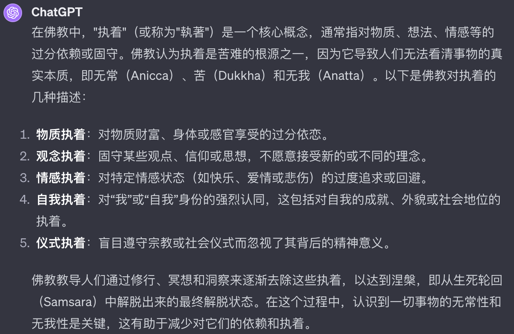

经常在一些学佛群里面听别人提起执着，尤其是说别人执着的特别多见。可是有人认真起来问对方，什么是执着时，又通常得不到正面的回应。久而久之，大家都习惯了说执着，却并不清楚到底什么是执着。更糟糕的是，甚至有人不知道该如何生活了，这也是执着，那也是执着，仿佛就没有不是执着的东西了。如果是这样，那真的很有必要来讨论下，到底什么是执着了。

## 世人的执着

先来看看一些例子吧。

* 有人说：必须去海外留学，才能学到真正的东西。
* 有人说：必须考上985，211（指排名靠前的大学），人生才是圆满的。
* 有人说：必须学会AI，才会有前途。
* 有人说：必须去国外旅游幾次，人生才有意义。
* 有人说：必须学会一项乐器，才能考上好的大学。
* 有人说：女人若不学会化妆，将来就没人愿意娶。
* 有人说：女儿大了就得嫁人，嫁人了才会幸福，才有归宿。
* 有人说：除非用上了xxx品牌的包包，否则人生就是缺憾。
* 有人说：非某某不嫁，如果错过他，我会后悔一辈子。
* 有人说：我非某某品牌的coffee不喝。
* 有人说：只有某某茶才是真正的茶。
* 有人说：只有考上公务员才有出路。

这样的例子还有很多，你要留意下，几乎每天都会听到类似的言论了。这些是“执着”，而且都是普通人有的执着。仔细看看这些例子，不难总结出来这里的规律 —— 那就是认为只有这样，才是成功的，才是圆满的，才是有意义的，才是有价值的。“只有这样”是指单一选择，单一因素，才能有一个某个最好的结果。肯定这“单一选项”的同时，也否定了其他选择了。我们不妨把个规律叫做“一因一果”。

事实上，这种“一因一果”正是诸多执着的本质，即对前因后果的错误认知，产出了执着。通常来说，想要达到某种结果，一般都是有很多种选择的，所谓 —— 三百六十行，行行有状元。如果你的目标是想要成为一个状元，那么任何一个行业里面都有状元，都是可以成为其状元的。至于你要选择哪个行业，应该综合考虑，尤其是结合自身的优点，特指来说。这样选择一个合适的行业，才最有可能成为其状元了。

## 学佛人的执着

不仅世人会有很多执着。其实学佛人，也是有很多执着的。比如说：

* 有人说：必须念地藏菩萨才能清除罪障。
* 有人说：必须念佛这一门，才有成就的可能性。
* 有人说：只有某某师父，才是真正的老师（指善知识，下同）。
* 有人说：只有某某宗派，才是真正的佛法。
* 有人说：没有神通作为证明，就不能认定老师的证量。
* 有人说：必须穿破衣服，用旧东西，过得像乞丐才是真正的修行人。
* 有人说：瞧，那和尚还用iPhone呢，还坐大品牌轿车，算什么出家人啊。
* 有人说：必须每天念《楞严经》100遍，否则无法开悟。
* 有人说：必须修习密宗法门，其他流派都太浅薄。
* 有人说：数息打坐就是修行，研读经论纯属多余。
* 有人说：只有在深山老林闭关，城市里的修行都不算数。

除了“一因一果”的例子之外，这里有多了一些不同的“执着”的例子。那就是只有这样，才是那样。比如，只有打坐才是修行，这不仅把打坐和修行划上了等号，还直接排除了其他的选择。比如念佛就不是修行了。这显然违背了大多数人的认知。

## 什麼是執著？

先不討論佛教的核心，先看對執著的定義和描述，ChatGPT的這個總結相當到位了。摘錄文字如下：

在佛教中，"执着"（或称为"執著"）是一个核心概念，通常指对物质、想法、情感等的过分依赖或固守。以下是佛教对执着的几种描述：

* 物质执着：对物质财富、身体或感官享受的过分依恋。
* 观念执着：固守某些观点、信仰或思想，不愿意接受新的或不同的理念。
* 情感执着：对特定情感状态（如快乐、爱情或悲伤）的过度追求或回避。
* 自我执着：对“我”或“自我”身份的强烈认同，这包括对自我的成就、外貌或社会地位的执着。
* 仪式执着：盲目遵守宗教或社会仪式而忽视了其背后的精神意义。

再用這個定義和描述來看上面的例子，可謂是一目了然了。如：

* 物質執著的例子：“除非用上了xxx品牌的包包，否则人生就是缺憾。”
* 觀念執著的例子：“必须去国外旅游幾次，人生才有意义。” —— 很多例子都屬於此類。

雖然“執著”可能是佛教裡面出來的詞彙，在佛教裡面使用也最頻繁。但很顯然，上面的例子，即包括了普通人的執著，也包括學佛人的執著，所以就這個執著而言，並非是只有學佛人才有的了。

那麼執著的危害是什麼？很顯然，那就是導致痛苦。盲目的追求和判斷，必然導致身心上的漣漪反應。如果碰巧心願得到了滿足，這種反應會暫時隱藏起來。一旦沒有得到滿足，心與願違，那必然是有痛苦的。而且，執著得越深，痛苦越大。

## 佛學上的我執

若再進一步分析為何會有各種各樣的執著，一步步分析下去，必定都會到“自我認知”的這個根本點來。可以這樣說，一切的錯誤認知，都是以“我的看法”，“我的觀念”，“我的經驗”，“我的立場、視角”等為前提的。若沒有固執於此，那麼就不容易產生執著了。

而“我的看法”，“我的觀念”，“我的經驗”，“我的立場、視角”又是以什麼為基礎呢？那就是“我”了，或現代所說的“自我”，“自我意識”了。這也是佛教中的“我執” —— 認為有我。一個什麼樣的我呢？一個實有的“我”，一個擁有永恆靈魂的“我”，或是一個永恆固定的“我”。

[佛學大辭典（丁福保）]解釋“我執”：
（術語）認有我身之執念為我執，亦云人執。唯識述記一本曰：「煩惱障品類眾多，我執為根，生諸煩惱，若不執我無煩惱」俱舍論二十九曰：「由我執力，諸煩惱生。三有輪迴，無容解脫。」俱舍光記二曰：「我執謂我見。」梵Ātma－grāha。

ChatGPT翻譯的白話如下（有修改）：

“（佛教術語）我们坚信自己身体就是自己 —— 那种想法称为‘我执’，也叫做‘人执’。《唯识述记》中說：‘烦恼有很多种，但我执是它们的根源，它产生了所有的烦恼。如果不执着于自我，就不会有烦恼。’《俱舍论》第二十九卷说：‘由于我执的影响，各种烦恼就产生了。这样就会困在生死轮回中，无法解脱。’《俱舍光记》第二卷里说：‘我执就是对自我的看法。’用梵文说，这叫做Ātma-grāha。”

## 破除我執的根本方法 

正如刚才ChatGPT中提到的一样，破除我执的根本方法就是梳理对于“我”的正确认识，那就是“无我”。破除对物质过分依赖，或固执的想法，那就需要对“无常”和“苦”（指不安）有正确的认识。这里的“苦”不只是“痛苦”的意思，更多的是指一种不安定的状态，任何物质（乃至意识）都是“无常”的，所以是“苦”的（只是起名为“苦”）。

为何无常？那就要对一切物质和精神的形成和存在有一定的了解了，这便是佛教的 —— 因缘法。即一切的人事物都不会绝对地、孤立地产生和存在。它们的产出和存在都是相互依存。正因为如此，所以没有任何永恒的人事物，它们所以依赖的东西（因缘）也一直在发生变化…… 所以，我们会看到春夏秋冬，花谢花开，人会生老病死。

总结来说，就是要明白因缘法，就会懂得“无常”和“苦”的道理，不仅物质世界如此，精神世界也如此，自我意识当然也是如此，所以最后也就没有了“我”，即“无我”。没有了“我”，就没有“我所”，即没有以我为中心的各种观念，想法，偏见，立场等。这样就可以破除“我执”了。

## 貪瞋癡根本的也是我執

佛教里面经常提起“贪瞋痴”的危害，但却很少提及“贪瞋痴”的根本其实在于“我执”。不了解“我执”，不直接破处“我执”，虽然也能够减少贪瞋痴，但其效果肯定不如先破“我执”之后，再去减少来得效果好。因为产生“贪瞋痴”的根本，在于有“我”。所以其实是“我贪”，“我嗔”，“我痴”。如果把其中的“我”破除掉了以后，“贪瞋痴”就没有可以依赖了，没有“依赖”就不会产生新的“贪瞋痴”。

以《百法明门论》中的分类来说，有六个核心根本烦恼，即：贪、嗔、痴、慢、疑和不正见。不正见又分为：身见、边见、见取见、禁戒取见和邪见。

* 身见：是最常见的错误认知，即是把身体当成我，称之为身见。
* 边见：是常见的两种错误认知，一种是断灭论，认为人死如灯灭，一了百了。另一种是认为有一个永恒不变的灵魂。
* 见取见：非果计果 —— 不是佛教中所承认的证果，但是被当做证果了，最常见的误解就是把神通和证果混为一谈。
* 禁戒取见：非因计因 —— 古印度时期就有的牛戒，狗戒等，汉地很少见到这类。
* 邪见：就是其他一切不正确的认知 —— 比如把能量、维度、量子和证果联系起来的，稀里糊涂，不清不楚的，但是可以糊弄人的。

## 破除我执才是证果的开始

以修行来说，证果是目标。无论是解脱果——阿罗汉，还是菩提果——成佛。这两者都有一个重要的里程碑，就是第一个证果的阶位，都是從破除我执開始的 —— 見道位。

聲聞的見道位：見四諦之真理，即體悟到了苦、集、滅、道。這個真理是涵蓋了一切物質和生命的，從生命的角度來說，就是“無我”。從物質的角度來說，就是“苦”（無常）。所以在基礎佛法（《阿含經》等）中，苦，無常，無我和空，經常會一起出現，意思相同，只是表達的側重點不同而已。

菩薩的見道位：見真如之真理，不僅要證人無我，還要證法無我。但也有大德指出，“無我”本身也是可以涵蓋在“法”上的（比如物質——色法）。物質是“無我”的，即是“無自性”的，即是“空性”的。有時只是為了突出菩薩需要救度眾生的需求，才會更加強調“法無我”。尤其是對“涅槃”的解讀上，和聲聞有所區別。

## 法執

和我執對應的概念還有一個法執，這裡也簡略補充下。

我執 —— 就是認為有我，要麼把身體當我，要麼認為有一個永生的靈魂。

法執 —— 就是認為實有物質，或實有世界，這是粗略地說，再細的來說，就是要區別涅槃是否有無了。

我執 = 煩惱障，因為有我，所以起煩惱。煩惱障礙涅槃。不成滅除煩惱成阿羅漢。

法執 = 所知障，因為認為物質等是實有的，所以不能對物質等有正確的認識。這樣就無法認識真如。所知障礙菩提。不證真如不能成佛。

上面其實也說了，其實“無我”即可以指生命，也可以指物質。但也可以區分成“人無我”和“法無我”。其中，對於“法無我”的部分，又分為有區分的和無區分的，比如對於蘋果的認知，各個體系都認為是“無我”的。但是對於更加高級的概念，如涅槃，在不同的體系中就會有不同的認知了。

## 先從我執（煩惱障）下手

不過要記住一定，從實際修行中的角度來說，可以先把這些高級的概念放一邊。涅槃是什麼，佛性是什麼，如來藏是什麼，是有是無。這些概念不僅在普通人之間存在廣泛的爭議，就是在公認的一些高僧大德之間，也並未有統一的認知。有統一認識的部分，反而是我執的部分，就是煩惱障的部分 —— 即我執，和貪瞋癡。

所以從修行的角度來說，完全可以先努力破除我執為先，然後再去減少和對治貪瞋癡。但如果對於破除我執等還有一定的難度，無法理解。也是沒有關係，那就從日常中對治貪瞋癡開始。貪瞋癡減少了，對於破除我執也是非常有幫助的。

若以解脫道來說，那麼破除我執，體證無我，自然就會熄滅貪瞋癡了，也就達成目標了。

若以菩薩道來說，先破除了我執，也就是法執中最重要，最迫切的部分先處理掉了，剩下的法執，是初地菩薩以後要對治的。所以如果以初地菩薩為目標，這樣就和解脫道一樣了 —— 那就是先破除我執。

祝大家都能早日破除我執。
阿彌陀佛。

愚夫合十。
