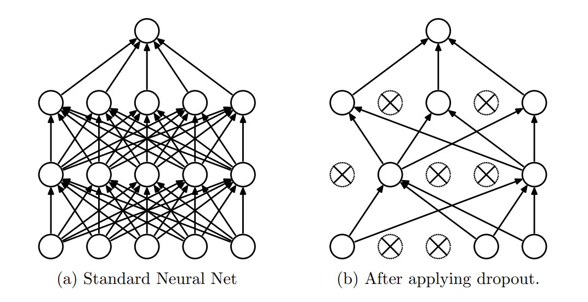
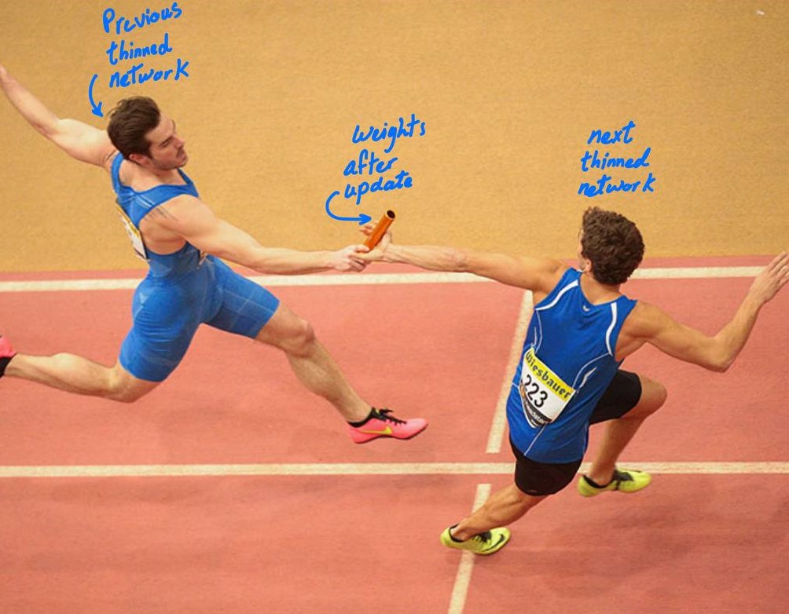

Dropout has proven to be one of the most [] and used regularization techniques to reduce overfitting, the focus of this blog won't be on Implementing dropout, as it's straightfarward implementation using common frameworks like Tensorflow, we will rather instead focus on getting deeper intuition of what dropout is actually doing to the network and why it works at all. By the end of this blog [].

## Overview
The blog is divided into the following sections:
* Introduction 
* How it works?
* Intuitions
* Intuitions behind the best practices
* Conclusion

 
remove ahmed.txt file

## Introduction
Large networks are prone to overfitting, espicially when having small datasets, in such cases on the most used techniques to reduce overfitting is dropout, it's a regularization technique in which random units from the network are dropped during training, this helps to prevent strong co-adaptation that may occur between the units in training, and thus reduce overfitting. 
|  |
|:--:| 
| *[Figure-1](https://www.cs.toronto.edu/~rsalakhu/papers/srivastava14a.pdf)* |

## How it works

One of the known regularization methods is ensemble learning, in such a method you get to train different large networks and average their predicitons, obviosly this technique requires [high computation resourecs as you are training many networks] [ and introduce slow training process]. Dropout addresses these two problems, it's similar to ensemble learning in terms of having many networks, but the process is totally different.

In dropout, random units are dropped in each training step, results with a different smaller network (thinned network) than the previous iteration, the forward and backward [ propagatoins ] are [ done ] only on that specific thinned network during that specific iteration, as a result, when accumelating the training steps of all thinned networks [something odd is here=>] it's as if we are getting the average of predictions of different networks but with less computations and time. (when you start to talk about predicitons you should have mentioned how we got to the prediction stage when we were talking about averaging the [training steps ])

think of it this way, each thinned network updates the weights [sligtly ] and pass them to the next thinned network [etc ], this means a thinned network starts where the previous thinned network stopped, and weights continues updating in that manner [on that base?].

|  |
|:--:| 
| *[Figure-2](https://sportsmatik.com/uploads/matik-sports-corner/matik-know-how/relay_1564644996.jpg)* |

So thinned networks share weights and they all participate in updating them. Each layer is presented with a keep_probability value, for instance, if a layer has a keep_prob value of 0.7, then approximately 30% of units in that layer will be dropped randomly. At test time no units are dropped and the whole network is used to make predictions, also all weights are multiplied by the keep_prob value of the layer it exists in to avoid overexcitation and we will discuss this in depth in the next section.

## Intuitions

## Best practices 