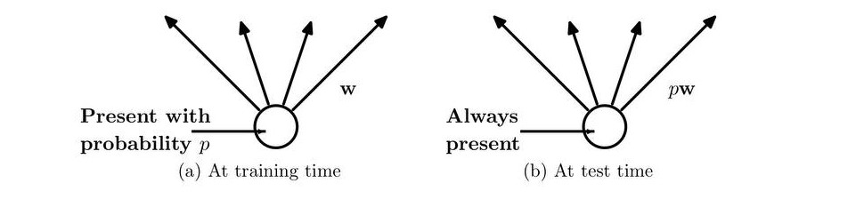
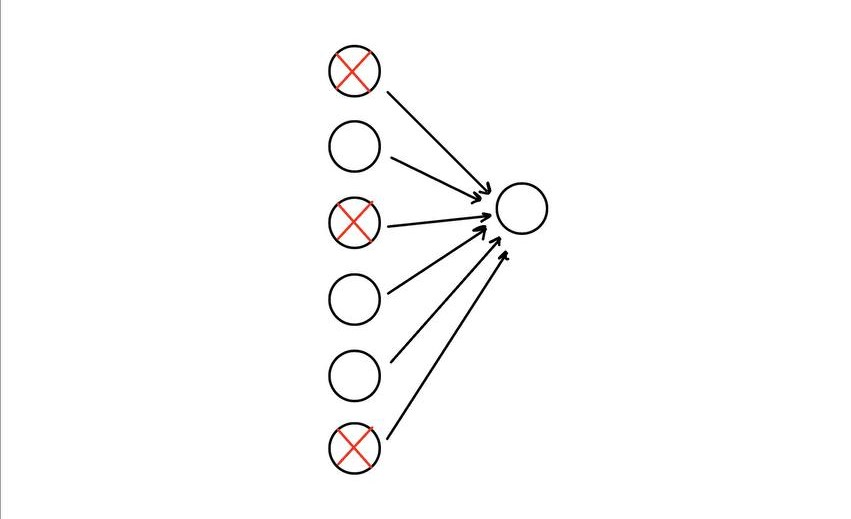

Dropout has proven to be one of the most successful regularization techniques, in this blog, the focus won't be on Implementing dropout, as it's a straightforward implementation using common frameworks like Tensorflow, but we will instead focus on getting deeper intuition of what dropout is actually doing to the network and why it works at all with such a random nature.

## Overview
The blog is divided into three sections:
* Introduction 
* How it works?
* Intuitions

 
remove ahmed.txt file

## Introduction
Large networks are prone to overfitting, especially when dealing with small datasets. In such models, regularization is often essential, and one of the most used techniques is Dropout. In dropout units from the network are dropped randomly during training, so to prevent [heavy ] co-adaptation that may occur between units, and thus reduce overfitting.
|  |
|:--:| 
| *Figure-1 from*  *[paper](https://www.cs.toronto.edu/~rsalakhu/papers/srivastava14a.pdf)* |

## How it works

One of the known regularization methods as well is ensemble learning, in such method you train different networks in parallel on often different datasets and then average their predicitons at test time. Obviosly this technique requires a lot of computational resourecs in order to train many networks and often big datasets [time  here was the problem]. Dropout addresses the problem of computation, although it's similar to ensemble learning in terms of involving many networks in training, the underneath process is totally different.

In dropout, random units are dropped in each training step, results with a different smaller network (thinned network) every iteration, the forward and backward propagatoins are implemented only on the resulted thinned network. As a result, when averaging the training steps of all thinned networks we  end up with a single network that approximately represents all these thinned networks combined but with less computations and time.

think of it this way, each thinned network updates the weights once and then pass them to the next thinned network, so a thinned network starts where the previous thinned network stopped and takes it turn of updating the weights, that's how weights continues updating. (here still)

|  |
|:--:| 
| *[Figure-2](https://sportsmatik.com/uploads/matik-sports-corner/matik-know-how/relay_1564644996.jpg)* |

So thinned networks work in series rather than in parallel!, they share the weights and participate in updating them sequencially. In dropout each layer is presented with a retention probability p, for instance, if a layer has a p value of 0.7, then roughly 30% (0.3) of units in that layer will be dropped randomly along with their incoming and outgoing connections. At test time no units are dropped and the whole network is utilized to make predictions. therefore When dropout is eliminated, units receives more connections from previous layer than what they used to during training, and thus become overexcited. To overcome the effect of overexcitation all weights in a layer are multiplied by the retention probability associated with that layer. We eventually end up with a unthinned network that has smaller weights and approximately averages the predictions of all these thinned networks.

|  |
|:--:| 
| *Figure-3 from* *[paper](https://sportsmatik.com/uploads/matik-sports-corner/matik-know-how/relay_1564644996.jpg)* |

## Intuitions:
In this section we will discuss the follwoing:
1. The effect of retention probability and why it's  recommended to be set closer to 0.5 or higher not lower?.
1. How this [reflects to reduce overfitting]? 

### The effect of retention probability and why it's  recommended to be set closer to 0.5 or higher not lower?.

Imagine setting the value of p to be very small (p=0.01) for all hidden layers, and for the sake of this example assume the network to have only one hidden layer of 100 units, as a result, the produced thinned networks will almost be of 1 unit, which are 100 times smaller than the original network. This will destory the network and completely wipe out the co-adaptation that could exist between units as each unit is trained individually, in other words, causes complete randomness and the network won't propagate any any useful information at test time. The goal then is not to completely wipe out co-adaptation, but to (reduce) it, by causing some randomness to the network that lets generalization takes place and hopefully reduce overfitting. In the same network above, when using p value of 0.5 or higher, the thinned networks will be at most 2 times smaller if not less, which allows units to work together (adapt to some extent and capture useful patterns) and train in environment that is similar to that used at inference time.  

This as well explains why the network works so well at inference time when randomness is suddenly eliminated, as when using p values larger than 0.5 we are not causing high degree of randomness, that's in addition to multiplying weights by p after training to prevent overexcitation. All these play role in making the network works well at test time. 

### how this [reflects to reduce overfitting]? 
As disscussed above, in dropout each unit is trained in many different networks, which in return reduces co-adaptation between units, this forces units to be as useful as possible on their own.
As in the follwoing image:

|  |
|:--:| 
| *Figure-4* |

the next-layer unit can't rely heavily on just one of the inputs, it has to pay attention to all of them, which means to spread the weight (this has similar effect of shrinking weights as in L2 regularization method). Units then become less sensitive to slight changes in the inputs and at the end this makes the network generalizes much better.

