#EDPSY 558: Assignment1
========================================================
author: Chungil Chae
date: September30, 2014

#1. loading dataset
========================================================

```r
ori.MEARLI <- read.csv("MEARLI.csv", header=FALSE)
MEARLI <- ori.MEARLI
summary(MEARLI)
```

```
       V1              V2            V3               V4        
 Min.   :  1.0   Min.   :3.0   Min.   :-99999   Min.   :-99999  
 1st Qu.: 86.8   1st Qu.:3.0   1st Qu.:-99999   1st Qu.:-99999  
 Median :172.5   Median :4.0   Median :     1   Median :     1  
 Mean   :172.5   Mean   :3.6   Mean   :-26162   Mean   :-26162  
 3rd Qu.:258.2   3rd Qu.:4.0   3rd Qu.:     2   3rd Qu.:     1  
 Max.   :344.0   Max.   :4.0   Max.   :     8   Max.   :     3  
       V5               V6               V7               V8        
 Min.   :-99999   Min.   :-99999   Min.   :-99999   Min.   :-99999  
 1st Qu.:-99999   1st Qu.:-99999   1st Qu.:-99999   1st Qu.:-99999  
 Median :     1   Median :     1   Median :     0   Median :     1  
 Mean   :-26162   Mean   :-26161   Mean   :-26162   Mean   :-26162  
 3rd Qu.:     2   3rd Qu.:     2   3rd Qu.:     1   3rd Qu.:     1  
 Max.   :     5   Max.   :     7   Max.   :     3   Max.   :     3  
```


#2. Column name and missing notation -99999 to Na
========================================================

```r
colnames(MEARLI) <- c("ID", "AGE", "CA", "M", "CO", "NN", "PR", "G")
MEARLI$CA <- ifelse( MEARLI$CA == -99999, NA, MEARLI$CA)
MEARLI$M <- ifelse( MEARLI$M == -99999, NA, MEARLI$M)
MEARLI$CO <- ifelse( MEARLI$CO == -99999, NA, MEARLI$CO)
MEARLI$NN <- ifelse( MEARLI$NN == -99999, NA, MEARLI$NN)
MEARLI$PR <- ifelse( MEARLI$PR == -99999, NA, MEARLI$PR)
MEARLI$G <- ifelse( MEARLI$G == -99999, NA, MEARLI$G)
str(MEARLI)
```

```
'data.frame':	344 obs. of  8 variables:
 $ ID : int  1 2 3 4 5 6 7 8 9 10 ...
 $ AGE: int  3 3 3 3 3 3 3 3 3 3 ...
 $ CA : num  0.521 NA 0.915 0.126 1.114 ...
 $ M  : num  1.175 NA 0.945 0.951 1.04 ...
 $ CO : num  1.05 NA 1.83 -0.61 0.63 ...
 $ NN : num  0.386 NA 0.812 -0.27 0.638 ...
 $ PR : num  0.83 NA 0.397 0.519 0.328 ...
 $ G  : num  0.925 NA 0.697 -0.286 0.221 NA -0.415 0.345 0.081 -0.574 ...
```

```r
summary(MEARLI)
```

```
       ID             AGE            CA              M        
 Min.   :  1.0   Min.   :3.0   Min.   :-1.14   Min.   :-2.31  
 1st Qu.: 86.8   1st Qu.:3.0   1st Qu.: 0.72   1st Qu.: 0.53  
 Median :172.5   Median :4.0   Median : 1.10   Median : 1.11  
 Mean   :172.5   Mean   :3.6   Mean   : 1.35   Mean   : 0.98  
 3rd Qu.:258.2   3rd Qu.:4.0   3rd Qu.: 2.10   3rd Qu.: 1.47  
 Max.   :344.0   Max.   :4.0   Max.   : 7.63   Max.   : 2.63  
                               NA's   :90      NA's   :90     
       CO              NN              PR              G        
 Min.   :-0.94   Min.   :-2.53   Min.   :-2.08   Min.   :-1.17  
 1st Qu.: 0.70   1st Qu.: 0.58   1st Qu.: 0.40   1st Qu.: 0.32  
 Median : 1.22   Median : 1.45   Median : 0.55   Median : 0.94  
 Mean   : 1.32   Mean   : 1.72   Mean   : 0.94   Mean   : 1.01  
 3rd Qu.: 1.83   3rd Qu.: 2.39   3rd Qu.: 1.98   3rd Qu.: 1.76  
 Max.   : 5.14   Max.   : 7.18   Max.   : 2.90   Max.   : 2.86  
 NA's   :90      NA's   :90      NA's   :90      NA's   :90     
```


#3. Descriptive Statistics
========================================================

```r
plot(MEARLI)
```

 

```r
hist(MEARLI$CA)
```

 

```r
hist(MEARLI$M)
```

 

```r
hist(MEARLI$CO)
```

 

```r
hist(MEARLI$NN)
```

 

```r
hist(MEARLI$PR)
```

 

```r
hist(MEARLI$G)
```

 


#Q1. Describe the amount and patterns(s) of missing data
========================================================

```r
summary(is.na(MEARLI))
```

```
     ID             AGE              CA              M          
 Mode :logical   Mode :logical   Mode :logical   Mode :logical  
 FALSE:344       FALSE:344       FALSE:254       FALSE:254      
 NA's :0         NA's :0         TRUE :90        TRUE :90       
                                 NA's :0         NA's :0        
     CO              NN              PR              G          
 Mode :logical   Mode :logical   Mode :logical   Mode :logical  
 FALSE:254       FALSE:254       FALSE:254       FALSE:254      
 TRUE :90        TRUE :90        TRUE :90        TRUE :90       
 NA's :0         NA's :0         NA's :0         NA's :0        
```


#Q2. What is the sample size with listwise deletion?
========================================================
254 observation | or MEARLI.lwd <- na.omit(MEARLI)

```r
require(ForImp)
MEARLI.lwd<-ld(MEARLI)
summary(MEARLI.lwd)
```

```
       ID             AGE             CA               M         
 Min.   :  1.0   Min.   :3.00   Min.   :-1.140   Min.   :-2.313  
 1st Qu.: 93.2   1st Qu.:3.00   1st Qu.: 0.717   1st Qu.: 0.528  
 Median :177.5   Median :4.00   Median : 1.099   Median : 1.107  
 Mean   :175.8   Mean   :3.62   Mean   : 1.345   Mean   : 0.984  
 3rd Qu.:266.5   3rd Qu.:4.00   3rd Qu.: 2.100   3rd Qu.: 1.472  
 Max.   :343.0   Max.   :4.00   Max.   : 7.629   Max.   : 2.626  
       CO               NN               PR               G         
 Min.   :-0.944   Min.   :-2.525   Min.   :-2.075   Min.   :-1.167  
 1st Qu.: 0.702   1st Qu.: 0.577   1st Qu.: 0.404   1st Qu.: 0.323  
 Median : 1.218   Median : 1.447   Median : 0.546   Median : 0.935  
 Mean   : 1.320   Mean   : 1.716   Mean   : 0.937   Mean   : 1.014  
 3rd Qu.: 1.826   3rd Qu.: 2.394   3rd Qu.: 1.979   3rd Qu.: 1.760  
 Max.   : 5.135   Max.   : 7.178   Max.   : 2.904   Max.   : 2.862  
```

```r
str(MEARLI.lwd)
```

```
'data.frame':	254 obs. of  8 variables:
 $ ID : int  1 3 4 5 7 8 9 10 12 13 ...
 $ AGE: int  3 3 3 3 3 3 3 3 3 3 ...
 $ CA : num  0.521 0.915 0.126 1.114 0.919 ...
 $ M  : num  1.175 0.945 0.951 1.04 -1.787 ...
 $ CO : num  1.05 1.83 -0.61 0.63 -0.61 ...
 $ NN : num  0.386 0.812 -0.27 0.638 0.386 ...
 $ PR : num  0.83 0.397 0.519 0.328 -2.075 ...
 $ G  : num  0.925 0.697 -0.286 0.221 -0.415 ...
```


#Q3. For each of the variables
## a. test univariate normality
========================================================

```r
require(nortest)
qqnorm(MEARLI.lwd$CA, pch=20, cex=0.5)
qqline(MEARLI.lwd$CA, col="gray60", lwd=2)
```

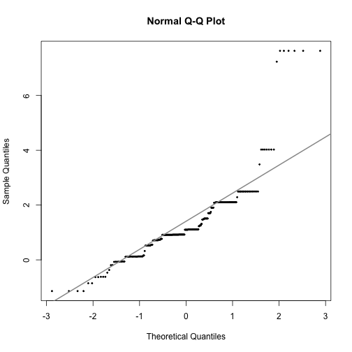 

```r
shapiro.test(MEARLI.lwd$CA)
```

```

	Shapiro-Wilk normality test

data:  MEARLI.lwd$CA
W = 0.7924, p-value < 2.2e-16
```

```r
ks.test(MEARLI.lwd$CA, "pnorm", mean=1, sd=2, alternative="two.sided")
```

```

	One-sample Kolmogorov-Smirnov test

data:  MEARLI.lwd$CA
D = 0.2368, p-value = 8.554e-13
alternative hypothesis: two-sided
```

```r
pearson.test(MEARLI.lwd$CA, n.classes=6, adjust=TRUE)
```

```

	Pearson chi-square normality test

data:  MEARLI.lwd$CA
P = 94.47, p-value < 2.2e-16
```

```r
qqnorm(MEARLI.lwd$M, pch=20, cex=0.5)
qqline(MEARLI.lwd$M, col="gray60", lwd=2)
```

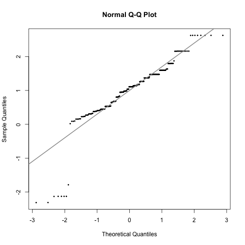 

```r
shapiro.test(MEARLI.lwd$M)
```

```

	Shapiro-Wilk normality test

data:  MEARLI.lwd$M
W = 0.8683, p-value = 5.823e-14
```

```r
ks.test(MEARLI.lwd$CA, "pnorm", mean=1, sd=2, alternative="two.sided")
```

```

	One-sample Kolmogorov-Smirnov test

data:  MEARLI.lwd$CA
D = 0.2368, p-value = 8.554e-13
alternative hypothesis: two-sided
```

```r
pearson.test(MEARLI.lwd$M, n.classes=6, adjust=TRUE)
```

```

	Pearson chi-square normality test

data:  MEARLI.lwd$M
P = 29.65, p-value = 1.632e-06
```

```r
qqnorm(MEARLI.lwd$CO, pch=20, cex=0.5)
qqline(MEARLI.lwd$CO, col="gray60", lwd=2)
```

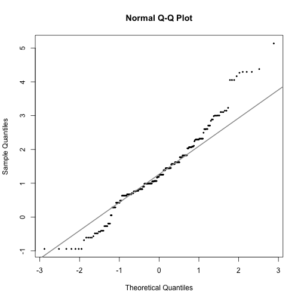 

```r
shapiro.test(MEARLI.lwd$CO)
```

```

	Shapiro-Wilk normality test

data:  MEARLI.lwd$CO
W = 0.9674, p-value = 1.522e-05
```

```r
ks.test(MEARLI.lwd$CO, "pnorm", mean=1, sd=2, alternative="two.sided")
```

```

	One-sample Kolmogorov-Smirnov test

data:  MEARLI.lwd$CO
D = 0.2535, p-value = 1.343e-14
alternative hypothesis: two-sided
```

```r
pearson.test(MEARLI.lwd$CO, n.classes=6, adjust=TRUE)
```

```

	Pearson chi-square normality test

data:  MEARLI.lwd$CO
P = 12.69, p-value = 0.00535
```

```r
qqnorm(MEARLI.lwd$NN, pch=20, cex=0.5)
qqline(MEARLI.lwd$NN, col="gray60", lwd=2)
```

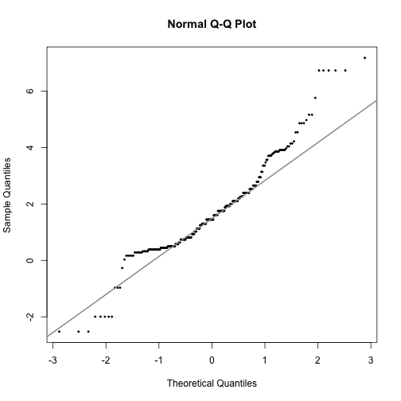 

```r
shapiro.test(MEARLI.lwd$NN)
```

```

	Shapiro-Wilk normality test

data:  MEARLI.lwd$NN
W = 0.9417, p-value = 1.652e-08
```

```r
ks.test(MEARLI.lwd$NN, "pnorm", mean=1, sd=2, alternative="two.sided")
```

```

	One-sample Kolmogorov-Smirnov test

data:  MEARLI.lwd$NN
D = 0.289, p-value < 2.2e-16
alternative hypothesis: two-sided
```

```r
pearson.test(MEARLI.lwd$NN, n.classes=6, adjust=TRUE)
```

```

	Pearson chi-square normality test

data:  MEARLI.lwd$NN
P = 73.5, p-value = 7.61e-16
```

```r
qqnorm(MEARLI.lwd$PR, pch=20, cex=0.5)
qqline(MEARLI.lwd$PR, col="gray60", lwd=2)
```

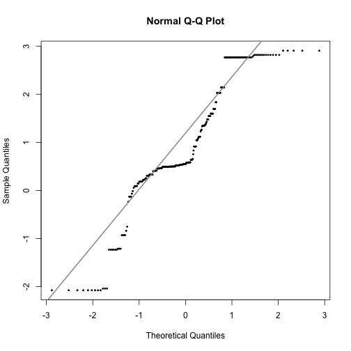 

```r
shapiro.test(MEARLI.lwd$PR)
```

```

	Shapiro-Wilk normality test

data:  MEARLI.lwd$PR
W = 0.915, p-value = 7.727e-11
```

```r
ks.test(MEARLI.lwd$PR, "pnorm", mean=1, sd=2, alternative="two.sided")
```

```

	One-sample Kolmogorov-Smirnov test

data:  MEARLI.lwd$PR
D = 0.1902, p-value = 2.078e-08
alternative hypothesis: two-sided
```

```r
pearson.test(MEARLI.lwd$PR, n.classes=6, adjust=TRUE)
```

```

	Pearson chi-square normality test

data:  MEARLI.lwd$PR
P = 72.36, p-value = 1.331e-15
```

```r
qqnorm(MEARLI.lwd$G, pch=20, cex=0.5)
qqline(MEARLI.lwd$G, col="gray60", lwd=2)
```

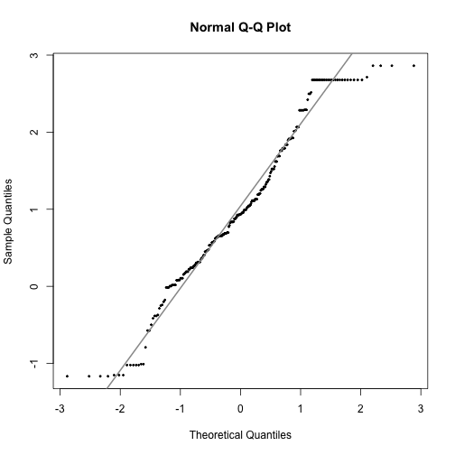 

```r
shapiro.test(MEARLI.lwd$G)
```

```

	Shapiro-Wilk normality test

data:  MEARLI.lwd$G
W = 0.9689, p-value = 2.455e-05
```

```r
ks.test(MEARLI.lwd$G, "pnorm", mean=1, sd=2, alternative="two.sided")
```

```

	One-sample Kolmogorov-Smirnov test

data:  MEARLI.lwd$G
D = 0.1996, p-value = 3.245e-09
alternative hypothesis: two-sided
```

```r
pearson.test(MEARLI.lwd$G, n.classes=6, adjust=TRUE)
```

```

	Pearson chi-square normality test

data:  MEARLI.lwd$G
P = 9.716, p-value = 0.02114
```


## Multivariate Normality
========================================================

```r
require(QuantPsyc)
require(mvnormtest)
mn <- mult.norm(MEARLI.lwd, chicrit=0.001)
mn$mult.test
```

```
         Beta-hat  kappa p-val
Skewness    17.06 722.26     0
Kurtosis   102.62  14.25     0
```


## b. describe the level of departure (mild, moderate, severe)
========================================================

```r
require (psych)
round(skew(MEARLI.lwd$CA,type=2),2)
```

```
[1] 2.26
```

```r
round(kurtosi(MEARLI.lwd$CA,type=2),2)
```

```
[1] 7.97
```

```r
describe(MEARLI.lwd$CA, type=2)
```

```
  vars   n mean   sd median trimmed mad   min  max range skew kurtosis
1    1 254 1.35 1.43    1.1    1.19 0.9 -1.14 7.63  8.77 2.26     7.97
    se
1 0.09
```

```r
mardia(MEARLI.lwd$CA)
```

 

```
Call: mardia(x = MEARLI.lwd$CA)

Mardia tests of multivariate skew and kurtosis
Use describe(x) the to get univariate tests
n.obs = 254   num.vars =  1 
b1p =  5   skew =  211.5  with probability =  0
 small sample skew =  216.5  with probability =  0
b2p =  10.71   kurtosis =  25.07  with probability =  0
```

```r
round(skew(MEARLI.lwd$M,type=2),2)
```

```
[1] -1.44
```

```r
round(kurtosi(MEARLI.lwd$M,type=2),2)
```

```
[1] 5.1
```

```r
describe(MEARLI.lwd$M, type=2)
```

```
  vars   n mean   sd median trimmed  mad   min  max range  skew kurtosis
1    1 254 0.98 0.81   1.11    1.02 0.64 -2.31 2.63  4.94 -1.44      5.1
    se
1 0.05
```

```r
mardia(MEARLI.lwd$M)
```

 

```
Call: mardia(x = MEARLI.lwd$M)

Mardia tests of multivariate skew and kurtosis
Use describe(x) the to get univariate tests
n.obs = 254   num.vars =  1 
b1p =  2.02   skew =  85.57  with probability =  0
 small sample skew =  87.61  with probability =  0
b2p =  7.91   kurtosis =  15.99  with probability =  0
```

```r
round(skew(MEARLI.lwd$CO,type=2),2)
```

```
[1] 0.49
```

```r
round(kurtosi(MEARLI.lwd$CO,type=2),2)
```

```
[1] 0.82
```

```r
describe(MEARLI.lwd$CO, type=2)
```

```
  vars   n mean   sd median trimmed  mad   min  max range skew kurtosis
1    1 254 1.32 1.11   1.22    1.28 0.82 -0.94 5.14  6.08 0.49     0.82
    se
1 0.07
```

```r
mardia(MEARLI.lwd$CO)
```

 

```
Call: mardia(x = MEARLI.lwd$CO)

Mardia tests of multivariate skew and kurtosis
Use describe(x) the to get univariate tests
n.obs = 254   num.vars =  1 
b1p =  0.24   skew =  10.08  with probability =  0.0015
 small sample skew =  10.32  with probability =  0.0013
b2p =  3.75   kurtosis =  2.43  with probability =  0.015
```

```r
round(skew(MEARLI.lwd$NN,type=2),2)
```

```
[1] 0.63
```

```r
round(kurtosi(MEARLI.lwd$NN,type=2),2)
```

```
[1] 1.46
```

```r
describe(MEARLI.lwd$NN, type=2)
```

```
  vars   n mean   sd median trimmed mad   min  max range skew kurtosis  se
1    1 254 1.72 1.64   1.45    1.61 1.4 -2.53 7.18   9.7 0.63     1.46 0.1
```

```r
mardia(MEARLI.lwd$NN)
```

 

```
Call: mardia(x = MEARLI.lwd$NN)

Mardia tests of multivariate skew and kurtosis
Use describe(x) the to get univariate tests
n.obs = 254   num.vars =  1 
b1p =  0.39   skew =  16.5  with probability =  4.9e-05
 small sample skew =  16.89  with probability =  4e-05
b2p =  4.37   kurtosis =  4.46  with probability =  8.3e-06
```

```r
round(skew(MEARLI.lwd$PR,type=2),2)
```

```
[1] -0.24
```

```r
round(kurtosi(MEARLI.lwd$PR,type=2),2)
```

```
[1] -0.12
```

```r
describe(MEARLI.lwd$PR, type=2)
```

```
  vars   n mean   sd median trimmed  mad   min max range  skew kurtosis
1    1 254 0.94 1.27   0.55    1.02 0.88 -2.08 2.9  4.98 -0.24    -0.12
    se
1 0.08
```

```r
mardia(MEARLI.lwd$PR)
```

 

```
Call: mardia(x = MEARLI.lwd$PR)

Mardia tests of multivariate skew and kurtosis
Use describe(x) the to get univariate tests
n.obs = 254   num.vars =  1 
b1p =  0.06   skew =  2.38  with probability =  0.12
 small sample skew =  2.44  with probability =  0.12
b2p =  2.84   kurtosis =  -0.54  with probability =  0.59
```

```r
round(skew(MEARLI.lwd$G,type=2),2)
```

```
[1] -0.01
```

```r
round(kurtosi(MEARLI.lwd$G,type=2),2)
```

```
[1] -0.45
```

```r
describe(MEARLI.lwd$G, type=2)
```

```
  vars   n mean   sd median trimmed mad   min  max range  skew kurtosis
1    1 254 1.01 1.01   0.94    1.03   1 -1.17 2.86  4.03 -0.01    -0.45
    se
1 0.06
```

```r
mardia(MEARLI.lwd$G)
```

 

```
Call: mardia(x = MEARLI.lwd$G)

Mardia tests of multivariate skew and kurtosis
Use describe(x) the to get univariate tests
n.obs = 254   num.vars =  1 
b1p =  0   skew =  0.01  with probability =  0.93
 small sample skew =  0.01  with probability =  0.93
b2p =  2.51   kurtosis =  -1.58  with probability =  0.11
```


###Multivarate skew and kur
========================================================

```r
require(ICS)
mvnorm.kur.test(MEARLI.lwd)
```

```

	Multivariate Normality Test Based on Kurtosis

data:  MEARLI.lwd
W = 578.4, w1 = 0.48, df1 = 35.00, w2 = 0.80, df2 = 1.00, p-value
< 2.2e-16
```

```r
mvnorm.skew.test(MEARLI.lwd)
```

```

	Multivariate Normality Test Based on Skewness

data:  MEARLI.lwd
U = 224.8, df = 8, p-value < 2.2e-16
```


## c. Outliers
========================================================

```r
require(mvoutlier)
outliers <-aq.plot(MEARLI.lwd[c("CA","M","CO","NN","PR","G")])
```

```
Projection to the first and second robust principal components.
Proportion of total variation (explained variance): 0.5602
```

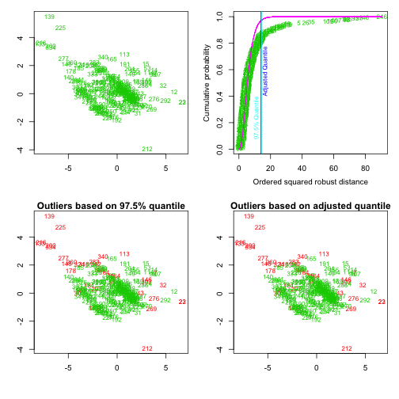 

```r
table(outliers) # show list of outliers 
```

```
outliers
FALSE  TRUE 
  218    36 
```

```r
require(DMwR)
outlier.scores <- lofactor(MEARLI.lwd, k=5)
plot(density(outlier.scores))
outliers2 <- order(outlier.scores, decreasing=T)[1:5]
print(outliers2)
```

```
[1]  93 246 146 107 160
```

```r
n <- nrow(MEARLI.lwd)
labels <- 1:n
labels[-outliers2] <- "."
biplot(prcomp(MEARLI.lwd), cex=.8, xlabs=labels)
pch <- rep(".", n)
pch[outliers2] <- "+"
col <- rep("black", n)
col[outliers2] <- "red"
pairs(MEARLI.lwd, pch=pch, col=col)
```

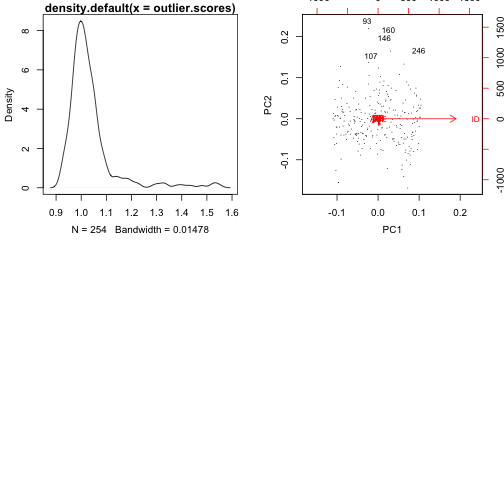  

```r
MEARLI.lwd.small <- cbind(MEARLI.lwd$CA, MEARLI.lwd$M, MEARLI.lwd$CO)
pairs(MEARLI.lwd.small, pch=pch, col=col, cex=3)
```

 

```r
require(mvoutlier)
outliers <-aq.plot(MEARLI.lwd[c("CA","M","CO","NN","PR","G")])
```

```
Projection to the first and second robust principal components.
Proportion of total variation (explained variance): 0.5587
```

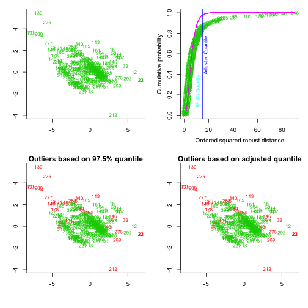 

```r
table(outliers)
```

```
outliers
FALSE  TRUE 
  219    35 
```

```r
require(DMwR)
outlier.scores <- lofactor(MEARLI.lwd, k=5)
plot(density(outlier.scores))
```

 

```r
outliers2 <- order(outlier.scores, decreasing=T)[1:5]
print(outliers2)
```

```
[1]  93 246 146 107 160
```

```r
n <- nrow(MEARLI.lwd)
labels <- 1:n
labels[-outliers2] <- "."
biplot(prcomp(MEARLI.lwd), cex=.8, xlabs=labels)
```

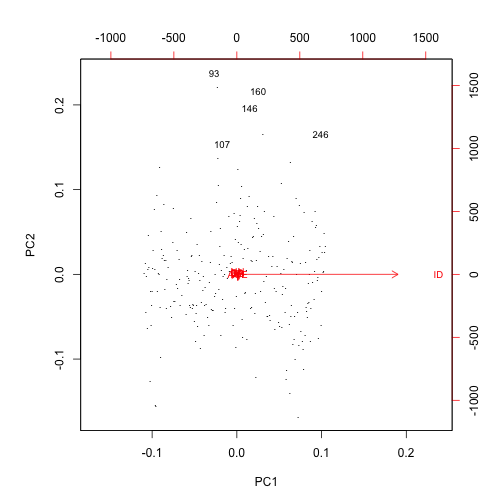 

```r
pch <- rep(".", n)
pch[outliers2] <- "+"
col <- rep("black", n)
col[outliers2] <- "red"
pairs(MEARLI.lwd, pch=pch, col=col)
```

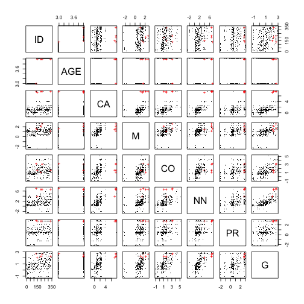 

```r
MEARLI.lwd.small <- cbind(MEARLI.lwd$CA, MEARLI.lwd$M, MEARLI.lwd$CO)
pairs(MEARLI.lwd.small, pch=pch, col=col, cex=3)
```

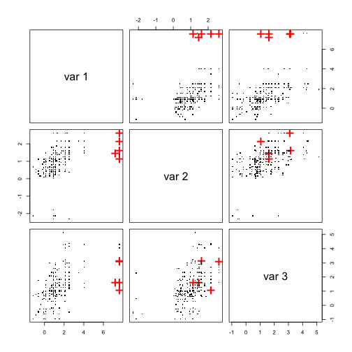 


# Bartlett Test of Homogeneity of Variances
========================================================

```r
bartlett.test(CO~AGE, data=MEARLI.lwd)
```

```

	Bartlett test of homogeneity of variances

data:  CO by AGE
Bartlett's K-squared = 0.3601, df = 1, p-value = 0.5484
```


#Q4. Linearly related? Describe any departure from linearity or potential issues.
========================================================

```r
require(lmtest)
fm1 <- lm(PR ~ AGE + CO, data = MEARLI.lwd)
fm2 <- lm(PR ~ AGE + CO + NN, data = MEARLI.lwd)
lrtest(fm2, fm1)
```

```
Likelihood ratio test

Model 1: PR ~ AGE + CO + NN
Model 2: PR ~ AGE + CO
  #Df LogLik Df Chisq Pr(>Chisq)    
1   5   -372                        
2   4   -383 -1  22.6      2e-06 ***
---
Signif. codes:  0 '***' 0.001 '**' 0.01 '*' 0.05 '.' 0.1 ' ' 1
```

```r
plot(fm1)
```

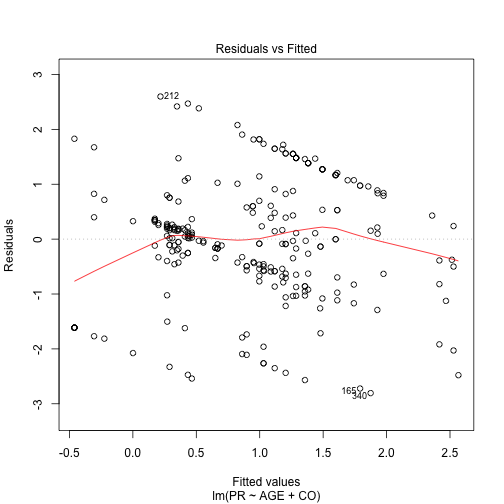 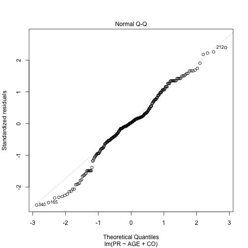 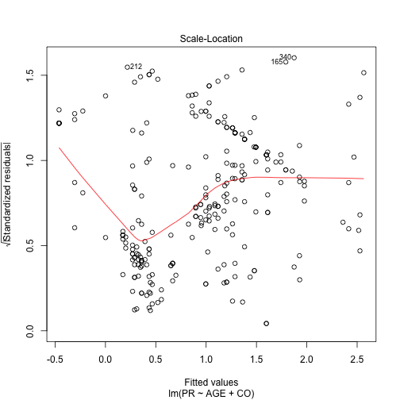 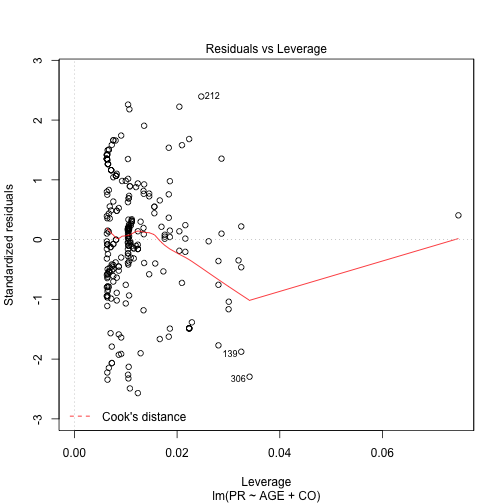 

```r
plot(fm2)
```

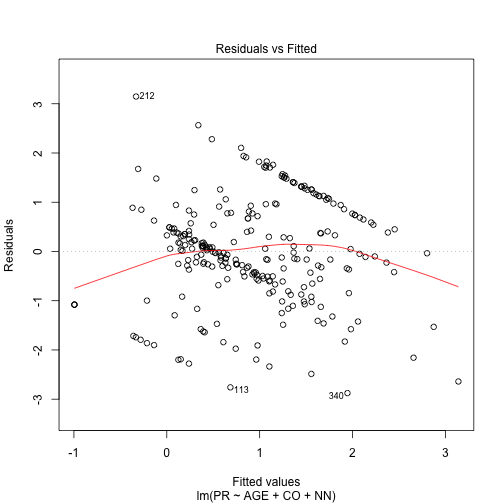 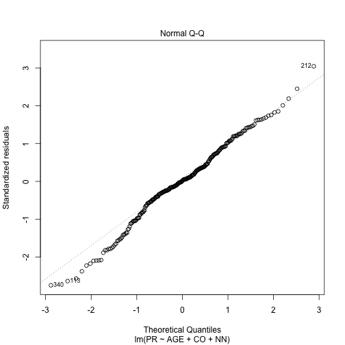 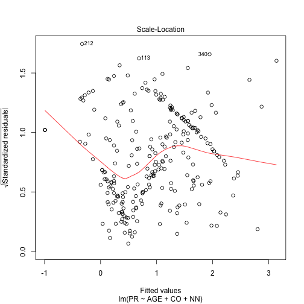 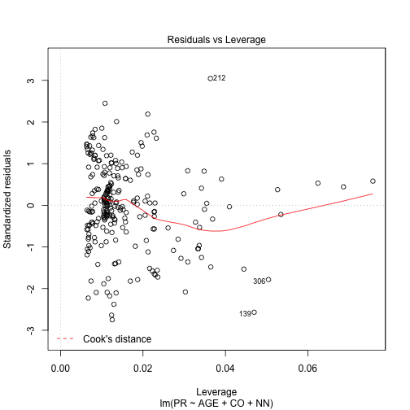 

```r
summary(fm1)
```

```

Call:
lm(formula = PR ~ AGE + CO, data = MEARLI.lwd)

Residuals:
    Min      1Q  Median      3Q     Max 
-2.8051 -0.5835  0.0236  0.7446  2.5984 

Coefficients:
            Estimate Std. Error t value Pr(>|t|)    
(Intercept)  -1.6985     0.5258   -3.23  0.00140 ** 
AGE           0.5585     0.1494    3.74  0.00023 ***
CO            0.4639     0.0656    7.07  1.5e-11 ***
---
Signif. codes:  0 '***' 0.001 '**' 0.01 '*' 0.05 '.' 0.1 ' ' 1

Residual standard error: 1.1 on 251 degrees of freedom
Multiple R-squared:  0.261,	Adjusted R-squared:  0.255 
F-statistic: 44.3 on 2 and 251 DF,  p-value: <2e-16
```

```r
summary(fm2)
```

```

Call:
lm(formula = PR ~ AGE + CO + NN, data = MEARLI.lwd)

Residuals:
    Min      1Q  Median      3Q     Max 
-2.8759 -0.5400  0.0195  0.7094  3.1469 

Coefficients:
            Estimate Std. Error t value Pr(>|t|)    
(Intercept)  -1.5285     0.5051   -3.03  0.00274 ** 
AGE           0.4656     0.1445    3.22  0.00144 ** 
CO            0.2837     0.0731    3.88  0.00013 ***
NN            0.2358     0.0488    4.83  2.4e-06 ***
---
Signif. codes:  0 '***' 0.001 '**' 0.01 '*' 0.05 '.' 0.1 ' ' 1

Residual standard error: 1.05 on 250 degrees of freedom
Multiple R-squared:  0.324,	Adjusted R-squared:  0.316 
F-statistic: 39.9 on 3 and 250 DF,  p-value: <2e-16
```


