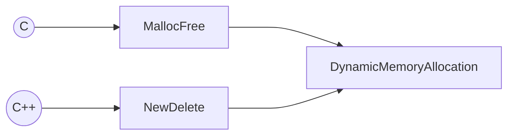

- [ ] [Memory Management](https://www.geeksforgeeks.org/introduction-to-memory-and-memory-units/?ref=lbp)
- [ ] CS Memory 분리

> C 및 C++에서는 필요할 때 메모리 블록을 할당 및 할당 해제하는 것이 매우 편리할 수 있습니다. 이것은 확실히 두 언어 모두에서 표준 관행이며 C++에서는 거의 피할 수 없습니다. 그러나 이러한 동적 메모리의 처리는 문제가 있고 비효율적일 수 있습니다. 
> 
> 메모리를 자유롭게 사용할 수 있는 데스크탑 응용 프로그램의 경우 이러한 어려움을 무시할 수 있습니다. 하지만 임베디드 - 일반적으로 실시간 - 애플리케이션의 경우 문제를 무시할 수 없습니다.

동적 메모리 할당은 비결정적인 모습이 있습니다.
1. 메모리를 할당하는 데 걸리는 시간을 예측할 수 없고 
2. 메모리 풀이 조각화되어 예기치 않은 할당 실패가 발생할 수 있습니다. 

## PC 메모리

[PIC Microcontrollers(PC memory 챕터)](https://docplayer.net/25482874-Pic-microcontrollers-an-introduction-to-microelectronics-martin-bates-third-edition.html)

PC 시스템에는 두 가지 주요 유형의 메모리가 있습니다. 주 메모리 블록은 CPU에서 처리 전후에 입력 데이터가 저장되는 RAM입니다. RAM의 데이터에 대한 액세스가 더 빠르기 때문에 운영 체제 및 응용 프로그램도 실행을 위해 디스크에서 RAM으로 복사됩니다. 불행히도 RAM 스토리지는 휘발성(volatile)입니다. 즉, PC가 꺼지면 데이터와 응용 프로그램 소프트웨어가 사라지고 컴퓨터를 다시 켤 때마다 다시 로드해야 합니다.

* 즉, 스위치를 켤 때 시스템을 시작하려면 비휘발성인 일부 읽기 전용 메모리(ROM)가 필요합니다.

하드 디스크는 자기 기록 표면이 있는 금속 디스크 세트, 읽기/쓰기 헤드, 모터 및 제어 하드웨어로 구성된 비휘발성 읽기 및 쓰기 저장 장치입니다. 운영 체제, 응용 프로그램 및 사용자 파일을 위한 대용량 데이터 저장소를 제공합니다. 

응용 프로그램은 디스크에 저장된 다음 메모리에 로드하는 데 필요한 대로 선택됩니다. 디스크가 읽기 및 쓰기 장치이기 때문에 사용자 파일을 저장할 수 있고 응용 프로그램을 추가하고 소프트웨어 업데이트를 쉽게 설치할 수 있습니다.

## C/C++ 메모리 공간
* C 및 C++의 데이터 메모리 측면에서 세 개의 개별 공간으로 생각해볼 수 있습니다.

|메모리|설명|
|:-:|---|
|Static memory|**함수 외부에 정의된 변수가 있는 곳입니다.static 키워드는 일반적으로 이러한 변수가 있는 위치에 영향을 주지 않습니다. 현재 모듈에 로컬이 되도록 해당 범위를 지정합니다.** 명시적으로 정적으로 선언된 함수 내부에 정의된 변수도 정적 메모리에 저장됩니다.  일반적으로 정적 메모리는 RAM 영역의 시작 부분에 있습니다. 변수에 대한 실제 주소 할당은 임베디드 소프트웨어 개발 툴킷(컴파일러와 링커 간의 협업)에 의해 수행됩니다. 일반적으로 프로그램 섹션은 배치를 제어하는 ​​데 사용되지만 Fine Grain Allocation과 같은 고급 기술은 더 많은 제어를 제공합니다.  일반적으로 정적 저장에 사용되지 않는 나머지 메모리는 나머지 두 메모리 공간을 수용하는 동적 저장 영역을 구성하는 데 사용됩니다.|
|Automatic variables|**정적으로 선언되지 않은 함수 내부에 정의된 변수는 자동입니다.** 이러한 변수를 명시적으로 선언하는 키워드인 auto가 있지만 거의 사용되지 않습니다. 자동 변수(및 함수 매개변수)는 일반적으로 스택에 저장됩니다.  스택은 일반적으로 링커를 사용하여 위치합니다. 동적 저장 영역의 끝은 일반적으로 스택에 사용되는 메모리입니다.  **컴파일러 최적화로 인해 변수가 수명의 일부 또는 전체 동안 레지스터에 저장될 수 있습니다. 이것은 또한 키워드 레지스터를 사용하여 제안될 수 있습니다.**|

* 동적 저장 영역의 나머지 부분은 일반적으로 힙에 할당되며, 필요에 따라 응용 프로그램에서 메모리를 동적으로 할당할 수 있습니다.

## C의 동적 메모리

C에서 동적 메모리는 일부 표준 라이브러리 함수를 사용하여 힙에서 할당됩니다. 두 가지 주요 동적 메모리 함수는 malloc() 및 free()입니다.

사용법

malloc() 함수는 요청된 메모리 영역의 크기(바이트)인 단일 매개변수를 사용합니다. 할당된 메모리에 대한 포인터를 반환합니다. **할당이 실패하면 NULL을 반환합니다.**

        void *malloc(size_t size);

free() 함수는 malloc()이 반환한 포인터를 가져와 메모리를 할당 해제합니다. 성공 또는 실패 표시가 반환되지 않습니다. 함수 프로토타입은 다음과 같습니다.

* NULL의 삭제는 어떠한 작업도 하지 않습니다. 즉 NULL포인터를 해제하는 것은 안전합니다.

        void free(void *pointer);

배열이 더 이상 필요하지 않으면 메모리가 다음과 같이 할당 해제될 수 있습니다.

        free(pointer);
        pointer = NULL;

포인터에 NULL을 할당하는 것은 필수는 아니지만 메모리가 할당 해제된 후 포인터를 잘못 사용하면 오류가 생성되므로 좋은 방법입니다.

malloc()에 의해 실제로 할당된 힙 공간의 양은 일반적으로 요청된 것보다 한 단어 더 큽니다. 추가 단어는 할당 크기를 유지하는 데 사용되며 나중에 free()에서 사용됩니다. 이 "크기 단어"는 malloc()이 포인터를 반환하는 데이터 영역 앞에 옵니다.

사용 예시

이러한 함수의 사용을 설명하기 위해 다음은 배열을 정적으로 정의하고 네 번째 요소의 값을 설정하는 몇 가지 코드입니다.

        int my_array[10];
        my_array[3] = 99;

다음 코드는 동적 메모리 할당을 사용하여 동일한 작업을 수행합니다.

        int *pointer;
        pointer = malloc(10 * sizeof(int));
        *(pointer+3) = 99;

포인터 역참조 구문은 읽기 어려우므로 [ Index ]는 연산자일 뿐이므로 일반 배열 참조 구문을 사용할 수 있습니다.

        pointer[3] = 99;

추가적인 할당 함수

malloc() 함수에는 calloc() 및 realloc()의 두 가지 다른 변형이 있습니다.

calloc() 함수는 기본적으로 malloc()과 동일한 작업을 수행하지만 단일 매개변수(이 두 값의 곱) 대신 두 개의 매개변수(배열 요소의 수와 각 요소의 크기)를 취합니다. 할당된 메모리도 0으로 초기화됩니다. 다음은 프로토타입입니다.

        void *calloc(size_t nelements, size_t elementSize);

realloc() 함수는 이전에 malloc()에 의해 할당된 메모리 크기를 조정합니다. 필요한 메모리 영역과 새 크기에 대한 포인터를 매개변수로 사용합니다. 크기를 줄이면 데이터가 손실될 수 있습니다. 크기가 증가하고 함수가 기존 할당을 확장할 수 없는 경우 새 메모리 영역을 자동으로 할당하고 데이터를 복사합니다.

        void *realloc(void *pointer, size_t size);

## C++의 동적 메모리
C++의 동적 메모리 관리는 대부분의 면에서 C와 매우 유사합니다. **C++에는 두 개의 추가 연산자(new 및 delete)가 있어 코드를 보다 명확하고 간결하며 유연하게 작성하고 오류 가능성을 낮출 수 있습니다.**

사용법

처음 두 경우에는 단일 개체에 대한 공간이 할당됩니다. 두 번째는 초기화를 포함합니다. 세 번째 경우는 객체 배열에 공간을 할당하는 메커니즘입니다.

        p_var = new typename;
        p_var = new type(initializer);
        p_array = new type [size];

삭제 연산자는 두 가지 방법으로 호출할 수 있습니다.

첫 번째는 단일 개체에 대한 것입니다. 두 번째는 배열에서 사용하는 공간을 할당 해제합니다. 각각의 경우에 올바른 할당 해제자를 사용하는 것이 매우 중요합니다.

        delete p_var;
        delete[] p_array;

* C realloc() 함수의 기능을 제공하는 연산자는 없습니다.

사용 예시

다음은 배열을 동적으로 할당하고 네 번째 요소를 초기화하는 코드입니다.

        int* pointer;
        pointer = new int[10];
        pointer[3] = 99;

배열 액세스 표기법을 사용하는 것은 자연스러운 일입니다. 할당 해제는 다음과 같이 수행됩니다.

        delete p_var;
        delete[] p_array;

할당 해제 후 포인터에 NULL을 할당하는 것은 좋은 프로그래밍 방법입니다. C++에서 동적 메모리를 관리하는 또 다른 옵션은 표준 템플릿 라이브러리를 사용하는 것입니다. 이것은 실시간 임베디드 시스템에 적합하지 않을 수 있습니다.

비슷하게 할당이 성공했는지 검사할 수 있습니다.

        int* p = new int;
        if (p)
        { ... }

## 문제 및 문제점

일반적으로 실시간 임베디드 시스템에서 동적 동작은 골칫거리입니다. 두 가지 주요 관심 영역은 리소스 고갈과 비결정적 실행 성능에 대해 취해야 할 조치를 결정하는 것입니다.

* 임베디드 시스템은 더 큰 기계 또는 전자 시스템 내에서 전용 기능을 갖는 컴퓨터 시스템(컴퓨터 프로세서, 컴퓨터 메모리 및 입/출력 주변 장치의 조합)입니다.

1. 다중 스레드 응용 프로그램에서 문제가 됩니다.
2. 메모리를 할당하는 데 걸리는 시간은 매우 다양하기 때문에 동작을 예측할 수 없습니다.
3. 구현된 응용 프로그램 코드에 메모리 누수가 발생하기 쉽습니다.
4. 메모리 누수는 찾기 어려울 수 있습니다.
5. 메모리 할당 실패가 문제입니다.
6. 메모리 단편화 문제가 있습니다.

상세한 설명

실시간 시스템에서 동적 메모리 할당에는 많은 문제가 있습니다. 표준 라이브러리 함수(malloc() 및 free())는 일반적으로 재진입하지 않으므로 다중 스레드 응용 프로그램에서 문제가 됩니다. 소스 코드를 사용할 수 있는 경우 RTOS 기능(예: 세마포어)을 사용하여 리소스를 잠그면 간단하게 수정할 수 있습니다.

더 다루기 힘든 문제는 malloc()의 성능과 관련이 있습니다. 메모리를 할당하는 데 걸리는 시간은 매우 다양하기 때문에 동작을 예측할 수 없습니다. 이러한 비결정적 행동은 실시간 시스템에서 용납할 수 없습니다.

큰 주의를 기울이지 않으면 malloc() 및 free()를 사용하여 구현된 응용 프로그램 코드에 메모리 누수가 발생하기 쉽습니다. 이것은 메모리가 할당되고 할당 해제되지 않기 때문에 발생합니다. 이러한 오류는 점진적인 성능 저하와 궁극적인 실패를 일으키는 경향이 있습니다. 이러한 유형의 버그는 찾기가 매우 어려울 수 있습니다.

메모리 할당 실패가 문제입니다. 데스크탑 애플리케이션과 달리 대부분의 임베디드 시스템은 대화 상자를 띄우고 사용자와 옵션을 논의할 기회가 없습니다. 종종 재설정이 유일한 옵션이며 매력적이지 않습니다. 테스트 중에 할당 실패가 발생하면 원인 진단에 주의해야 합니다. 단순히 사용 가능한 메모리가 부족하기 때문일 수 있습니다. 이는 다양한 조치를 제안합니다. 

그러나 메모리가 충분하지만 할당 요청을 충족할 수 있는 하나의 인접한 청크에서 사용할 수 없을 수 있습니다. 이러한 상황을 메모리 단편화라고 합니다.

## 메모리 단편화

컴퓨팅에서 파일 시스템 에이징이라고도 하는 파일 시스템 단편화는 파일 시스템이 파일 내용을 제자리에서 수정할 수 있도록 비연속적으로 파일 내용을 배치하는 경향입니다. 데이터 단편화의 특별한 경우입니다.

조각화는 크기가 다른 개체가 교대로 할당 및 할당 해제될 때 발생하고 많은 작은 개체가 할당 해제된 후 많은 큰 개체가 할당되는 경우 발생합니다.

상세한 설명

메모리 단편화를 이해하는 가장 좋은 방법은 예제를 보는 것입니다. 이 예에서는 10K 힙이 있다고 가정합니다. 먼저 3K 영역이 요청되므로 다음과 같습니다.

         #define K (1024)
         char *p1;
         p1 = malloc(3*K);

그런 다음 추가 4K가 요청됩니다.

        p2 = malloc(4*K);

3K의 메모리가 이제 무료입니다.

얼마 후 p1이 가리키는 첫 번째 메모리 할당이 할당 해제됩니다.

        free(p1);

이렇게 하면 2개의 3K 청크에 6K의 메모리가 남습니다. 4K 할당에 대한 추가 요청이 발행됩니다.

       p1 = malloc(4*K);

6K의 메모리를 사용할 수 있지만 사용 가능한 4K 연속 블록이 없기 때문에 실패합니다. p1에 NULL이 반환됩니다. 이것이 메모리 단편화입니다.

명백한 해결책은 메모리를 조각 모음하여 두 개의 3K 블록을 병합하여 6K의 단일 블록을 만드는 것입니다. 그러나 이것은 p2가 가리키는 4K 블록을 이동해야 하기 때문에 불가능합니다. 이동하면 주소가 변경되므로 포인터를 복사한 코드가 손상될 수 있습니다. 다른 언어(예: Visual Basic, Java 및 C#)에는 조각 모음(또는 "가비지 수집") 기능이 있습니다. 이는 이러한 언어가 직접 포인터를 지원하지 않으므로 데이터를 이동해도 응용 프로그램 코드에 부정적인 영향을 미치지 않기 때문에 가능합니다. 이 조각 모음은 메모리 할당이 실패하거나 실행되는 주기적인 가비지 수집 프로세스가 있을 때 발생할 수 있습니다. 두 경우 모두 실시간 성능과 결정성을 심각하게 손상시킬 수 있습니다.

## RTOS가 있는 메모리

실시간 운영 체제는 효과적으로 malloc()의 재진입 형태인 서비스를 제공할 수 있습니다. 그러나 이 RTOS는 결정적이지 않습니다.

실시간 요구 사항과 호환되는(즉, 결정적) 메모리 관리 기능이 일반적으로 제공됩니다. 이것은 가장 일반적으로 OS의 제어 하에 메모리 블록 또는 "파티션"을 할당하는 방식입니다.

* 실시간 운영 체제(Real-time operating system, RTOS)는 중요하게 정의된 시간 제약이 있는 데이터 및 이벤트를 처리하는 실시간 응용 프로그램용 운영 체제입니다

## 블록/파티션 메모리 할당

일반적으로 블록 메모리 할당은 정적으로 또는 동적으로 정의되고 지정된 고정 크기의 지정된 블록 수를 포함하도록 구성된 "파티션 풀"을 사용하여 수행됩니다. 

파티션 풀... Nucleus OS...

Nucleus OS의 경우 파티션 풀을 정의하기 위한 API 호출에는 다음 프로토타입이 있습니다.

    STATUS
    NU_Create_Partition_Pool(NU_PAR TITION_POOL *pool, CHAR *name, VOID *start_address, UNSIGNED pool_size, UNSIGNED partition_size, OPTION suspend_type);

이것은 예를 통해 가장 명확하게 이해됩니다.

    status = NU_Create_Partition_Pool(&MyPoo l, "any name", (VOID *) 0xB000, 2000, 40, NU_FIFO);

이것은 2000바이트의 메모리를 포함하고 40바이트 크기의 파티션(즉, 50개의 파티션이 있음)으로 채워진 설명자 MyPool을 사용하여 파티션 풀을 만듭니다. 풀은 주소 0xB000에 있습니다. 풀은 태스크가 블록을 할당하려고 시도할 때 사용 가능한 블록이 없을 때 할당 API 호출에서 일시 중단을 요청하면 일시 중단된 태스크가 선입 선출 순서로 깨어나도록 구성됩니다. . 다른 옵션은 작업 우선 순위였습니다.

파티션 할당을 요청하기 위해 다른 API 호출을 사용할 수 있습니다. 다음은 Nucleus OS를 사용한 예입니다.

    status = NU_Allocate_Partition(&MyPool, &ptr, NU_SUSPEND);

이것은 MyPool에서 파티션 할당을 요청합니다. 성공하면 할당된 블록에 대한 포인터가 ptr에 반환됩니다. 사용 가능한 메모리가 없으면 NU_SUSPEND가 지정되었으므로 작업이 일시 중단됩니다. 선택되었을 수 있는 다른 옵션은 시간 초과로 일시 중단하거나 단순히 오류와 함께 반환하는 것이었습니다.

파티션이 더 이상 필요하지 않으면 다음과 같이 할당이 해제될 수 있습니다.

    status = NU_Deallocate_Partition(ptr);

파티션을 사용할 수 있을 때까지 우선 순위가 더 높은 작업이 일시 중단된 경우 이제 실행됩니다. 고정 크기 블록만 사용할 수 있으므로 조각화 가능성이 없습니다. 유일한 실패 모드는 실제 리소스 고갈이며, 표시된 대로 작업 일시 중단을 사용하여 제어하고 포함할 수 있습니다.

애플리케이션 코드에 파티션 풀 상태(예: 현재 사용 가능한 여유 파티션 수)에 대한 정보를 제공할 수 있는 추가 API 호출을 사용할 수 있습니다. 메모리 누수가 발생할 가능성이 남아 있으므로 파티션 할당 및 할당 해제에 주의가 필요합니다.

## 메모리 누수 감지
일반적으로 이러한 버그의 위치 및 수정을 지원하는 프로파일러 도구를 사용할 수 있습니다.

주요 참고자료 : [Dynamic Memory Allocation and Fragmentation in C and C++](https://www.design-reuse.com/articles/25090/dynamic-memory-allocation-fragmentation-c.html)