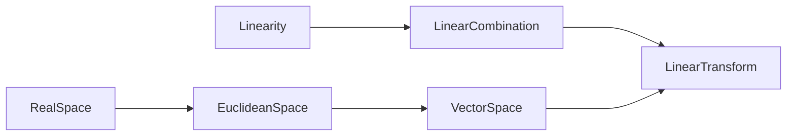

- [ ] 조금더 이해하고, 더 깔끔하게 정리하기.
- [ ] 군, 환, 체....

선형 대수는 연립 1차 방정식, 행렬, 선형 변환, 벡터, 벡터 공간 등의 다양 한 주제들이 아주 오랜 시간 동안 각기 따로, 때로는 서로 썪이면서 연구되어 자연스럽게 선형 대수라는 이름 아래 모여 수학의 중요한 분야가 되었습니다.

* 흔히 3D 게임 프로그래밍에 관한 수학 이야기를 할 때 선형 대수와 밀접한 관련이 있다고 합니다.

선행 대수란, 대수(Algebra)와는 무엇이 다른가?

대수는 '대신하는 수', 즉 미지수와 그 미지수를 사용하는 수학인 대수학을 뜻합니다.대수는 x, y등의 기호로 표현되어 있는 미지수들로 이루어진 수식들을 풀어내는 수학입니다.

선형 대수도 미지수로 이루어진 수식을 다루는 수학인데, 선형성이 다릅니다.

* 선형성 또는 선형은 직선처럼 똑바른 도형, 또는 그와 비슷한 성질을 갖는 대상이라는 뜻으로, 이러한 성질을 갖고 있는 변환 등에 대하여 쓰는 용어입니다.
* 함수의 경우, 어떠한 함수가 진행하는 모양이 '직선'이라는 의미로 사용된다. 이러한 개념은 수학, 물리학 등에서 많이 사용됩니다.
* 수학, 물리학 등에서 많이 사용된다 합니다. 다른 말로 1차라고도 한다고 합니다.

이론들

<!--
## 체 (Field)
대수적 구조의 하나로, 간단히 말해 덧셈, 뺄셈, 곱셈, 나눗셈의 사칙연산을 집합 안에서 소화할 수 있는 집합을 의미합니다. 즉 연산을 통해 나온 값 또한 해당 집합의 원소여야 한다는 뜻입니다. 

가장 간단한 체의 예시로는 유리수의 집합, 실수의 집합, 복소수의 집합이 있습니다. 그래서 이들이 체라는 것을 강조하고 싶을 때에는 각각 유리수체, 실수체, 복소수체라고 부르기도 합니다.

이해가 안간다?

체는 추상대수학에서 사칙연산이 자유로이 시행될 수 있고 산술의 잘 알려진 규칙들을 만족하는 대수 구조입니다. 모든 체는 가환환이지만, 그 역은 성립하지 않습니다. 체를 연구하는 추상대수학의 분야를 체론이라고 합니다.

field의 정의는 a, b ∈ F이면 a + b, a − b, ab 및 a/b도 F에 있는 속성을 가진 숫자 집합 F입니다(물론 b 6= 0이라고 가정 식 a/b).

$$
N = 자연수(natural number) = \{0, 1, 2, 3, . . . \} \\
Z = 정수(integer) = \{. . . , −3, −2, −1, 0, 1, 2, 3, . . . \} \\
Q = 유리수(rational number) \{ a / b | a, b ∈ Z, b != 0 \} \\
R = 실수(real number) = all real numbers \\
C = 복소수(complex number) = {a + bi | a, b ∈ R}
$$

* 음... 정확한지는 모르겠지만, 정수는 정수의 완벽함을 강조하기 위해 영어의 마지막 글자인, Z를 사용하고, 유리수의 Q는 정수들의 비율이란 의미(the set of quotients)에서 Q라는 약자가 사용되었다고 합니다.

우리는 다음 숫자 집합을 더하고, 빼고, 곱하고, 나누는 방법에 익숙합니다. 하지만, 이러한 모든 수에 대한 집합이 숫자 필드가 아닙니다.

예를 들어, 3과 5는 N에 있지만, 3 - 5는 아닙니다. 또한 3과 5는 Z에 있지만, 3 / 5는 아닙니다. 이것은 N과 Z가 숫자 필드가 아님을 보여줍니다. 하지만, Q, R, 과 C는 필드 숫자입니다.

-->

## 선형성 (Linearity)
선형성(線型性, linearity) 또는 선형(線型, linear, 라틴어: linearis)은 직선처럼 똑바른 도형, 또는 그와 비슷한 성질을 갖는 대상이라는 뜻으로, 이러한 성질을 갖고 있는 변환 등에 대하여 쓰는 용어입니다. 

선형성의 조건

가산성(Additivity), 임의의 수 x, y에 대해 다음이 항상 성립하고 
$$ {\displaystyle f(x+y)=f(x)+f(y)} $$
동차성(Homogeneity), 즉, 임의의 수 x, a 대해 다음이 항상 성립하면
$$ {\displaystyle f(\alpha x)=\alpha f(x)} $$
f는 선형이라고 합니다.
$$ Linearity = Additivity \& Homogeneity $$

함수의 경우, 어떠한 함수가 진행하는 모양이 '직선'이라는 의미로 사용됩니다. 이러한 개념은 수학, 물리학 등에서 많이 사용됩니다. 다른 말로 1차(一次)라고도 한다. (단어 '1차' 자체는, '선형'을 의미하지 않는 경우도 많습니다.)

선형성을 만족하는 선형함수를 그리면 다음과 같습니다.

$$ f(x + y) = f(x) + f(y),\ f(ax) = af(x) $$

## 선형 결합 (Linear combination)
선형 결합(線型 結合, linear combination) 또는 일차 결합(一次 結合)은 수학에서 각 항에 상수를 곱하고 결과를 추가함으로써 일련의 항으로 구성된 표현식입니다.

선형성을 가지고 있는 선형 결합의 예시

예를 들어 x와 y의 선형 결합은 ax + by 형식입니다. (여기서 a와 b는 상수입니다.) 

$$ (상수) * (항) ... \rightarrow { ax + by } $$

* ax, by는 선형성을 가지고 있습니다.

다르게 표현하면...

V를 체 K 위의 벡터 공간이 되도록 한다. 우리는 평소와 같이 V 벡터 공간의 원소를 부르고 K 스칼라의 원소를 부른다. 만약 v1,...,vn이 벡터이고 a1,...,an이 스칼라인 경우에는

$$ { a, b } \rightarrow { a1, a2, ... a_n} $$

$$ { x, y } \rightarrow { v1, v2, ... v_n} $$

해당 스칼라와 계수의 선형 결합은 다음과 같습니다.

$$
{\displaystyle a_{1}\mathbf {v} _{1}+a_{2}\mathbf {v} _{2}+a_{3}\mathbf {v} _{3}+\cdots +a_{n}\mathbf {v} _{n}}{\displaystyle a_{1}\mathbf {v} _{1}+a_{2}\mathbf {v} _{2}+a_{3}\mathbf {v} _{3}+\cdots +a_{n}\mathbf {v} _{n}}
$$

## 유클리드 공간 (Euclidean space)
수학에서 유클리드 공간(영어: Euclidean space)은 유클리드가 연구했던 평면과 공간을 일반화한 것이다. 이 일반화는 유클리드가 생각했던 거리와 길이와 각도를 좌표계를 도입하여, 임의 차원의 공간으로 확장한 것이다. 이는 표준적인 유한 차원, 실수, 내적 공간이다.

유클리드 공간은 기하학 원론의 저자인 유클리드 의 이름을 따온 공간으로, 우리가 살아가고 있는 3차원 공간을 포함해서 평면, 수직선은 물론 그 이상의 다차원 공간까지 표현하는 공간입니다.

## 벡터 공간 (Vector space)
* Vector field와 헷갈리지 말라고 합니다.

수학, 물리학 및 공학에서 벡터 공간 (선형 공간 이라고도 함)은 벡터 라고 하는 요소를 함께 더하고 스칼라 라는 숫자로 곱할 수 있는 집합 입니다. 

* 스칼라는 종종 실수 이지만 복소수 또는 더 일반적으로 모든 필드 의 요소일 수 있습니다.
* 벡터 덧셈과 스칼라 곱셈 연산은 벡터 공리라고 하는 특정 요구 사항을 충족해야 합니다.
* 실수 벡터 공간 이라는 용어및 복소수 벡터 공간 은 종종 스칼라의 특성을 지정하는 데 사용됩니다(실제 좌표 공간 또는 복소 좌표 공간).

벡터 공간은 힘과 속도와 같이 크기뿐만 아니라 방향도 갖는 물리량 의 모델링을 허용하는 유클리드 벡터를 일반화 합니다. 벡터 공간의 개념은 벡터 공간 에서 계산을 허용하는 행렬의 개념과 함께 선형 대수학의 기본입니다. 이것은 선형 방정식 시스템 을 조작하고 연구하기 위한 간결하고 종합적인 방법을 제공합니다.

## 선형 변환 (Linear Transform)
선형 변환(線型變換, 영어: linear transformation, vector space homomorphism, linear function) 또는 선형 사상(線型寫像, 영어: linear map, linear mapping) 또는 선형 연산자(線型演算子, 영어: linear operator) 혹은 선형 작용소(線型作用素)는 선형대수학에서 선형 결합을 보존하는, 두 벡터 공간 사이의 함수입니다.

1. 선형 변환 ≒ 선형 사상 ≒ 선형 연산자 ≒ 선형 작용소
2. **선형 결합**을 보존하는, 두 벡터 공간 사이의 함수

위 그림에서 T는 transformation(변환)을 의미합니다.

선형 함수가 되기 위한 조건들을 만족하려면 함수가 반드시 1차여야 함을 알 수 있습니다. 2차 이상의 차수를 가진 수식에서 첫 번째나 두 번째 조건이 절대 만족할 수 가 없기 때문입니다.

주요 참고자료 : 수학으로 시작하는 3D 게임 개발, 위키피디아, [유클리드 공간이란](https://freshrimpsushi.github.io/posts/what-is-an-euclidean-space/)