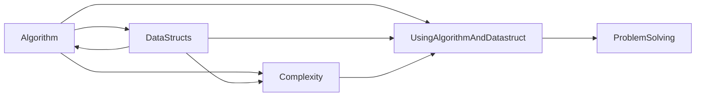

- [ ] 알고리즘... 우선순위를 정리할 필요가 있다.
- [ ] 자료구조 책... 읽기
- [ ] PS더 찾아보기

<!--
유한 시퀀스, 순서체, 순서 흠... 수학에서 순서론??
-->

<center>



</center>

## 알고리즘 (Algorithm)
알고리즘은 **어떤 문제를 해결하기 위해 정해진 일련의 절차나 방법을 공식화한 형태로 표현한 것, 계산을 실행하기 위한 단계적 절차를 의미**합니다. 

* 즉, 문제 해결에 필요한 계산 절차 또는 처리 과정의 순서를 뜻한다. 프로그램 명령어의 집합을 의미하기도 한다. 알고리즘은 연산, 데이터 마이닝(기계 학습) 또는 자동화된 추론을 수행합니다.
* **외워서 할 생각하지 말고 빨리 찾을 수 있는 것이 더 중요하다고 합니다. 이해는 필수고요.**

<details><summary>알고리즘이 왜 필요한가?</summary>
<div markdown="1">

프로그래밍에는 문제를 해결하는 다양한 방법이 있습니다. 그러나 사용 가능한 방법의 효율성은 다양합니다. 어떤 방법은 다른 것들보다 더 정확한 답변을 제공하는 데 적합합니다. 알고리즘은 문제를 해결하는 가장 좋은 방법을 찾는 데 사용됩니다.

* 즉 효율적인 코드를 작성하고 최적 또는 거의 최적의 방법으로 문제를 해결하는 데 도움이 됩니다. 

알고리즘을 이용하여, 다음의 프로그램의 효율성 향상을 기대할 수 있습니다.

1. 최상의 알고리즘을 쓰면 컴퓨터 프로그램이 매우 정확한 결과를 만들 수 있습니다. 즉 소프트웨어의 정확성을 향상시킬 수 있습니다.
2. 프로그램이 문제를 실행하는 속도를 향상하기 위해 알고리즘을 쓸 수 있습니다. 단일 알고리즘은 프로그램이 문제를 해결하는 데 걸리는 시간을 줄일 수 있습니다. 즉 속도를 향상시킬 수 있습니다.
3. 컴퓨터의 메모리의 사용량은 사용된 알고리즘에 따라 다릅니다. 알고리즘을 올바르게 선택하면 프로그램이 최소한의 메모리를 쓰게 됩니다.

알고리즘과 자료구조를 사용하지 않는다면, 마치 바퀴를 재발명 하는 행위를 반복할 것입니다. 또한 코드를 보다 쉽게 유지 관리할 수 있도록 코드를 구조화 하는데 도움이 됩니다.

</div></details>

<details><summary>알고리즘의 특성은?</summary>
<div markdown="1">

|특성|설명|
|:-:|---|
|유한성|알고리즘의 단계들은 반드시 유한한 횟수를 거친 후에 종료돼야 한다.|
|효율성|모든 과정은 명백히 실행(검증) 가능한 것이어야 합니다.|
|입력|알고리즘은 0또는 그 이상의 입력들을 갖습니다. 즉 밖에서 들어오는 데이터가 없거나 1개 이상입니다.|
|출력|알고리즘은 하나나 그 이상의 출력들을 갖습니다. 즉 최소한 출력이 1개라도 있어야 합니다.|

</div></details>

## 자료구조 (Datasruct)
**자료구조는 컴퓨터 과학에서 효율적인 접근 및 수정을 가능케 하는 자료의 조직, 관리, 저장을 의미합니다.** 더 정확히 말해, 자료구조는 데이터 값의 모임, 또 데이터 간의 관계, 그리고 데이터에 적용할 수 있는 함수나 명령을 의미합니다.

* 즉 자료구조는 추상적으로 나타낸 자료의 모습과 그것을 다루는 연산에 대한 정의입니다.

<details><summary>자료구조는?</summary>
<div markdown="1">

**자료구조는 개발자가 데이터를 효율적으로 처리할 수 있도록 하므로 많은 컴퓨터 과학 알고리즘의 주요 부분입니다.** 소프트웨어의 주요 기능은 사용자의 데이터를 가능한 한 빨리 저장하고 검색하는 것이므로 SW 또는 프로그램의 성능 향상에 중요한 역할을 합니다.

자료구조는 데이터를 효율적으로 사용할 수 있도록 컴퓨터에서 데이터를 효과적으로 저장하고 구성하는 방법을 제공하는 데이터 요소 그룹으로 정의할 수 있습니다. 자료구조의 몇 가지 예로는 배열, 링크드리스트, 스택, 큐 등이 있습니다.

<!--
* [책 사이트](www.CareerMonk.com)
* [DataStruct and Algorithm made easy](http://www.dhimangaurav.com/docs/data.pdf)
-->

</div></details>

<details><summary>변수(Variables)란?</summary>
<div markdown="1">

x^2 + 2y - 2 = 1이 있을 때 방정식을 풀기 위해서는 그 변수들이 가질 수 있는 값의 종류를 지정해야 하는데 컴퓨터 과학에서는 이것을 데이터형 이라고 부릅니다.
프로그램을 잘 만들라면 이 thing을 잘 만들어야 합니다.

시스템 정의 데이터형을 Primitive data types라 합니다.
사용자 정의 데이터형은 유저가 만든 데이터 형을 말합니다.
시스템에 의해 정의된 데이터형은 int, float, char, double, bool 등이 있습니다.
그리고 각각의 원시 데이터형에 할당된 비트 수는 프로그래밍 언어, 컴파일러에 따라 시스템에 따라 달라질 수 있습니다.

char rocket   
{    
    char velocity;   
}   
만약에 velocity가 65,000 1,000을 더하면 어떻게 될까?   

데이터 구조는 효율적으로 데이터를 사용하기 위해 컴퓨터에 데이터를 저장하고 정리하는 방법입니다.
일반적인 데이터 구조에는 배열, 파일, 연결 리스트, 스택, 큐, 트리, 그래프 등이 있습니다.
항목을 정리하는 방법에 따라 데이터 구조는 선형 데이터 구조(연결 리스트, 스택, 큐)와 비선형 데이터 구조(트리, 그래프)가 있습니다.
Abstract data type은 문제를 푸는 과정을 단순화 시키기 위한 데이터 구조와 연산을 합쳐 놓은 것입니다. 

</div></details>

<details><summary>추상화(Abstract)란?</summary>
<div markdown="1">

Noun: 1. A state...   
Verb: to take away; remove something   
추상화란 특정 관점을 정하고 중요하지 않은 것은 버리는 것입니다.   
ADT는 구현하는 사람 입장이 아니라 사용자 입장에서만 봐야합니다.
처음부터 완성된 형태를 볼 수 없기 때문입니다.

생각 1. SOLID, is-a has-a가 생각납니다.
참고 1. C언어 안에는 스트럭트 안에 함수를 넣을 수 없지만, c++에서는 스트럭트 안에 함수를 넣을 수 있습니다.   
생각 2. 위의 thing - doing의 관계로 바라보면 c++은 OOP라 할 수 있습니다. 

ADT는 두부분으로 구성됩니다.
데이터의 선언부분과 연산의 선언부분입니다.
주로 사용되는 ADT에는 리스트, 스택, 큐, 우선순위 큐, 이진 트리, 집합, 해시 테이블, 그래프 등이 있습니다.
ADT를 정의할 때는 구체적인 구현은 신경 쓰지 않아도 됩니다.

</div></details>

## 복잡도
복잡도는 알고리즘과 자료구조를 평가하는 기준입니다. **어떠한 상황에 어떠한 문제해결이 적합한지 표시하기 위해서 사용합니다.**

<details><summary>복잡도의 종류?</summary>
<div markdown="1">

|복잡도|설명|
|:-:|---|
|공간 복잡도(Space complexity)|알고리즘에 사용되는 메모리 총량|
|시간 복잡도(Time complexity)|알고리즘에 수행되는 연산 횟수 총량|

최선의 경우(Best cast)는 빅 오메가(Ω) 표기법으로 사용합니다. 최선의 시나리오로 최소 이만한 시간이 걸린다는 것을 나타냅니다. 최악의 경우(Worst case)는 빅 오(Big-O)표기법을 사용합니다. 최악의 시나리오로 아무리 오래 걸려도 이 시간보다는 덜 걸린다는 것을 나타냅니다. 평균적인 경우(Average case) 빅 세타(Θ)표기법을 사용합니다.

공간 복잡도(Space complexity)는 알고리즘에서 사용하는 메모리 양을 나타냅니다. 공간 복잡도는 보조공간(Auxiliary space)와 입력크기(input size)를 합친 포괄적인 개념입니다. 보조 공간(Auxiliary space)는 알고리즘이 실행되는 동안 사용하는 임시 공간을 말합니다.

빅오 표기법은 알고리즘의 효율성을 상한성을 기준으로 표기합니다. 일상의 대화에서 친구가 법정이자율을 물었을 때 빅세타 표기법으로는 0% 이상이라고 말하지만 빅오 표기법으로 말하면 30%이하라고 말하는 것과 같습니다.   시간복잡도와 공간복잡도의 최고차항만을 표기하여 간략하게 나타내는 표기법입니다.

**최악의 경우 알고리즘이 항상 제시간 안에 끝나는 것을 보장하기 위하여 얼마의 시간 걸리는지 아는 것은 중요합니다.** 그렇기 때문에 실시간 연산시 최악의 실행 시간은 중요 고려사항이 됩니다.

* **오늘날에는 공간 복잡도가 큰 문제가 되지 않습니다. 하지만 시간 복잡도는 자주 거론됩니다.** 시간복잡도는 큰 데이터를 처리할 때 중요합니다.

</div></details>

<details><summary>시간복잡도를 어떻게 구하나?</summary>
<div markdown="1">

시간복잡도를 계산할 때는 중요한 요소와 규칙이 있습니다.

1. 중요한 요소는 반복문(for, while), 조건문(if), 재귀호출 입니다. 
2. 규칙은 시간복잡도에서 상수값은 무시되는 됩니다.
3. 실제 개발자가 짜 놓은 코드를 수행하는 것은 상수 시간으로 간주합니다.

### 예시 1
```cpp
int get_sub(int arr[], int n)   
{   
    int sum = 0;   
    int i = 0;   
    for (i = 0; i < n; ++i)   
    {   
        sum += arr[i];   
    }   
    return sum;   
}   
```
공간 복잡도 = n + 3 = [] + (n, sum, i)   
시간 복잡도 = n   

### 예시 2
```cpp
int get_sum(int n)   
{   
    int sum = 0;   
    int i;   
    for (i = 1; i <= n; i *= 2)   
        sum += i;   
   
    return sum;   
}   
```
시간 복잡도 = log_2(n)

시간복잡도는 시행횟수를 구하는 것으로 알 수 있습니다. 위의 경우 n이 1일때 1회(1) 실행되고, n이 2일때는 2회(1, 2), ... n이 9일때는 4회(1, 2, 4, 8, 16) 실행됩니다.

</div></details> 

<details><summary>For문의 시간복잡도 구하는 개인적인 생각</summary>
<div>

예시 1은 다음과 같이 적을 수 있습니다.
$$
Condition : i <= n \\
Value : i = 1+t
$$
i값은 1에서 시작하고, t시행횟수에 따라 더해지는 값입니다. 그리고 for문이 순환하는 조건은 i가 n보다 작을 때 입니다.
$$
1+t <= n \\
O = n
$$
위의 규칙을 따르고, 최악의 상황을 가정하면 다음과 같이 바꿀 수 있습니다.

같은 방법으로 2에 적용하면
$$
Condition : i <= n \\
Value : i = 1*2^t
$$
같은 방식으로
$$
2^t <= n \\
t <= log_2(n) \\
O = log_2(n)
$$
로 구할 수 있습니다.

* for문은 초기화, 조건, 증강의 loop를 가지고 있습니다.
매 반복마다 조건을 검사하고 조건을 충족하는 경우 반복하고자 하는 문장을 실행하고 증강후 다시 조건을 검사합니다.

</div></details>

<details><summary>이중 For문의 시간복잡도 구하기</summary>
<div markdown="1">

이중 for문에서 다른 종속성이 없을 때 다음과 같이 생각할 수 있습니다.   
O(Full cycle) = O(Outer cycle) * O(Inner cycle)

```cpp
int get_sum(int n)   
{   
    int sum = 0;   
    int i, j;   
    for (i = 1; i <= n; ++i)    
        for(j = 1; j <= i; ++j)   
            sum += j;   
   
    return sum;   
}  
``` 
시간 복잡도 = n (n + 1) / 2

```cpp
int get_sum(int n)   
{   
    int sum = 0;   
    int i, j;   
    for (i = 1; i <= n; ++i)   
        for (j = 1; j <= i; j*=2)   
            sum += j;   
   
    return sum;   
}   
```
시간 복잡도 = n * log_2(n)

</div></details> 

<details><summary>다른 시간복잡도 문제 풀기</summary>
<div markdown="1">

[geeksforgeeks](https://www.geeksforgeeks.org/algorithms-analysis-of-algorithms-question-3/)

</div></details> 
<br>

<center>


[Big O cheet sheet](https://www.bigocheatsheet.com/)
</center>

## 어떻게 쓰는가?
동영상이 있고 보다처럼 thing이 있고 doing을 어떻게 사용할 것을 잘 정리하는 것입니다. thing은 data struct부분이고 doing은 algorithm이다.

|thing|doing|
|:-:|:-:|
|동영상|보다|
|data struct|algorithm|

**문제를 만났을 때, 가능한 해법들을 열거한 후 비교하여 사용합니다.**

<details><summary>프로그래머스의 예시</summary>
<div markdown="1">

[자료구조와 알고리즘 왜 중요할까?](https://prgms.tistory.com/134)

> (상황)
> - 100만 개의 고객 데이터를 최신으로 업데이트하기 위한 배치 작업 필요 
> - 100만 개의 고객 데이터는 CSV로 제공
> - CSV 데이터 중 기존 DB에 없는 고객은 추가
> - CSV 데이터엔 고객 key 값이 없으므로 DB의 여러 필드를 대조해야 함
> 
> (구현)
> 100만 개 데이터를 매번 순회하여 고객을 찾은 후 업데이트, 없으면 추가
> →  5일이 넘게 소요

**100만 개의 고객 데이터를 최신으로 업데이트하기 위한 작업이 필요**했습니다. 이 데이터는 정제되지 않은 CSV 파일로 제공되었고 심지어 Key가 되는 값도 없어서 일일이 여러 데이터를 대조해서 찾아야 했죠. **이 작업은 단순히 100만 개 데이터를 매번 순회하여 데이터를 찾은 후, 최신으로 업데이트를 하고 데이터가 없으면 추가하는 방식으로 구현**을 했습니다. 이런 방식은 단순하고 느린 방식이라고 할 수 있어요. 결국 **5일이 넘게 소요되어 다시 로직을 작성해야 했습니다.**

**기존 DB의 100만 개 데이터를 이름을 기준으로 해시 테이블에 기록**하였고 **동명 이인이 있을 경우 해시 테이블 Value를 링크드 리스트로 데이터를 추가**했습니다. 또한, 고객을 찾을 때 이름을 key로 찾은 후 동명이인이 여럿 존재한다면 이진 탐색을 사용하여 해결했습니다. **결과적으로 알고리즘을 활용하여 5일 동안 걸릴 로직을 20분 만에 마칠 수 있도록 크게 성능을 개선**했습니다.

> (개선)
> 해시 테이블과 링크드 리스트를 이용하여 데이터 구조를 변경 후 이진 탐색 알고리즘 
> 적용→ 20분 만에 해결 

</div></details>

## Problem solving (PS, 문제 해결)
문제 해결은 생각의 일부를 형성합니다. 모든 지적 기능과 관련하여, **문제 해결은 중요한 기술이나 순서의 제어를 요구하는 높은 순위의 인지 과정으로 정의**합니다. 유기체나 인공지능 **시스템이 바라던 목표 상태에 이르는 방법을 알지 못할 때 "문제 해결"을 하려고 합니다.**

컴퓨터과학과 알고리즘(algorithm)을 사용하는 인공지능(artificial intelligence) 분야에서, 문제해결은 알고리즘, 휴리스틱(heuristics) 근원 분석(root cause analysis) 기술을 포함합니다. 

시간, 기억, 에너지 등 문제해결에 필요한 자원의 양은 컴퓨터 복잡성 이론(computational complexity theory)으로 설명됩니다. 한층 일반적인 측면에서, 문제해결은 문제규정(problem determination), 디듀플리케이션(de-duplication), 분석(analysis), 진단(diagnosis), 수리(repair) 등의 단계를 아우르는 큰 과정의 일부입니다.

<!-- 관심없음 -->
* CP (Competitive Programing)는 PS를 경쟁적으로 진행하는 것으로, 프로그래밍 대회 혹은 코테를 부르는 용어라고 볼 수 있습니다.
* 공유되는 지식이 있어야 의사소통이 됩니다. 예를 들어 C를 알고있어야 data struct에서 의사소통이 가능합니다.

<br>

주요 참고자료 : 위키피디아