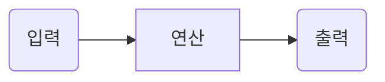

---
layout: post
title: GIT overview
---  

## mermaid
Git에서 위키에서만 안되고, 메시지나, 리드미에서는 작동된다. 만세.

# Git으로 일하기
## GitHub commit할 때 명심하기
1. 적절한 단위로 나누었는지 확인한다.
2. 제목은 잘지었는지 확인한다.
3. 메시지는 충분히 설명하고 있는지 확인한다.

## PullRequest하기 전에 확인하기
1. 더이상 작업할 내용이 없는지 확인한다.
2. 적절한 단위로 나눠져 있는지 확인한다.
3. request제목이 적절한지 확인한다.
4. 메세지가 정확한지 확인한다.

## 그외

1. 작성할 이슈를 선택한다.
2. branch를 따 작업한다.
3. pull request후 종료한다. 왜 풀리퀘스트를 이용해서 브런치를 관리해야 하는가? 더럽지 않게 하기 위해서이다.

? git project 잘 사용하는 방법

1. git wiki 그래프 그리기
리드미에는 추가가 되지만, wiki에는 추가가 안되네.

https://www.freecodecamp.org/news/how-to-add-diagrams-to-github-readme/

2. github 브런치 기록보기
3. github 망할 pullrequest

* 깃 프로젝트와 마일스톤

* 하나 빼먹고 코드 안고쳤더니, 바로 다음에 어떻게 해야 할지 애매한 상황이 나왔다. 최선을 다해서 현재 코드를 고치고 다음으로 넘어가자.

* pull request를 통해서, 작은 변경을 하나의 큰 변경으로 바꿀 수 있다. 이 어찌 효율적인가...

https://devlog-wjdrbs96.tistory.com/231

https://xo.dev/github-collaboration-guide/ 

* rebase, branch, pull request가 필요한 이유. 음. 써보니 필요하긴 하네.

* 테스트 케이스가 필요한 이유, 만들라면 필요하기는 하네.

## 
서브모듈 한 번 정리해야 합니다.
https://guseowhtjs.tistory.com/entry/%EB%AA%A8%EB%93%A0-git-%ED%95%98%EC%9C%84-%EB%AA%A8%EB%93%88%EC%9D%98-%EC%B5%9C%EC%8B%A0-%EB%B2%84%EC%A0%84%EC%9D%84-%EA%B0%80%EC%A0%B8%EC%98%A4%EB%8A%94-%EC%89%AC%EC%9A%B4-%EB%B0%A9%EB%B2%95

Git Submodule 삭제 방법
먼저 git submodule deinit -f 명령어를 통해서 해당 모듈을 deinit 해줍니다.

git submodule deinit -f test_app
그 다음 .git/modules 폴더에 들어가서 해당 폴더를 삭제합니다.

rm -rf .git/modules/test_app
마지막으로 git에서 해당 폴더를 제거해주면 됩니다.

git rm -f test_app

## 깃에서 실수했을때 어떻게 하면 개판내지 않을 수 있을까요?
[깃에서 실수했을 때 어떻게 하면 개판내지 않을 수 있을까?](https://www.letmecompile.com/git-restore-lost-commits/)
그렇다면 이러한 내용은 어떻게 배울 수 있는가?

git을 사용할 때 branch를 만들어서 사용하자. 한번 실 수 하면 어떻게 고치는지 전혀 모르게엤다.
1. Git의 LFS를 삭제해야 하는 상황이었다. Git lfs를 uninstall한 후 push를 했다. 그다음 github의 git lfs storage 사용량을 확인하였다. 결과 늘었다.
    - git attribute 에서 uasset에 대해 lfs로 설정되어있다는 것을 알았다. attribute를 제거했다. 여기서부터 문제가 발생하기 시작했다.
        - 이해할 수 있는 범주를 벗어났다.
        - 추가적으로 git을 안전하게 되돌리는 방법도 궁금하다.
    - 뭔가 중요한 것을 할 때는 시간이 더 걸리더라도 branch를 사용하도록 하자.

## 실수하지 않기 위해 기억해둬야 할 것들

* Git은 파일 및 폴더의 대무자 소문자를 구분하지 않습니다.

### Git overview  

깃은 모든 개발자들이 복사된 레포지터리를 가지고, 자신의 로컬 히스토리와 브런치 구조에서 작업합니다. 사용자는 작은 변경집합이 아닌 커밋을 공유해야 합니다. 깃은 레포지터리간의 전체 브런치를 공유할 수 있게 해줍니다.

"git remote"커맨드는 변경사항을 동기화 하는 시스템의 한 부분입니다. 
git fetch, git push, git pull과 함께 사용됩니다. 이러한 명령에는 모두 해당 링크에서 탐색할 수 있는 자체 동기화 책임이 있습니다.

* SVN은 단일 중앙 저장소를 사용하여 개발자를 위한 커뮤니케이션 허브 역활을 합니다. 개발자들의 복사본과 중앙 레포지터리의 변경 집합을 조합하여 작업이 이루어 집니다. 

https://www.atlassian.com/git/tutorials/syncing

다음의 개념들을 가지고 읽으면 조금더 편합니다.

Repository   
저장소를 의미하며, 저장소는 히스토리, 태그, 소스의 가지치기 혹은 branch에 따라 버전을 저장합니다. 저장소를 통해 작업자가 변경한 모든 히스토리를 확인 할 수 있습니다.   

Working Tree   
저장소를 어느 한 시점을 바라보는 작업자의 현재 시점입니다.   

Staging Area   
저장소에 커밋하기 전에 커밋을 준비하는 위치이다.   

Commit   
현재 변경된 작업 상태를 점검을 마치면 확정하고 저장소에 저장하는 작업입니다.   

# git bash 연습 #

& git init   
& git remote add origin "https://github.com/id/id.github.io"   
& git pull origin master   

& git remote rename origin test   
& git remote -v   
& git remote rename test origin

& git add .   
& git commit -m "message"   
& git status   
& git push origin   

& git help   
& git help remote   

https://backlog.com/git-tutorial/kr/intro/intro1_2.html 

# 커밋하는 시점 #

## 좋은 커밋 메세지 작성하기 위한 약속 ##

1. 제목과 본문을 빈 행으로 구분합니다.
2. 제목을 50글자 내로 제한합니다.
3. 제목 첫 글자는 대문자로 작성합니다.
4. 제목 끝에 마침표 넣지 않습니다.
5. 제목은 명령문으로 사용하며 과거형을 사용하지 않습니다.
6. 본문의 각 행은 72글자 내로 제한합니다.
7. 어떻게 보다는 무엇과 왜를 설명합니다.

다음 약속들의 이유는 아래의 링크에서 잘 설명되어 있습니다.     
https://meetup.toast.com/posts/106   

## 좋은 커밋 시점 ##

정해진 방법은 없지만, 커밋을 자주 해야하는 질문들에 대해서 받은 내용입니다.

* 어떤 기능에 대한 테스트가 끝났을 때, 보통 한 시간에 두 번 정도. 다섯번은 너무 많습니다.   
* 기능에 기반해서 커밋을 해야지 시간을 정해서 커밋을 하면 안됩니다. 새로운 기능을 추가했을 때 기능이 커밋할 만 하거나, 작동하는 메소드를 추가했거나, 글씨를 수정했거나, 잘못된 파일 들여쓰기를 수정했거나 등등일 때 커밋해야 합니다. 커밋이 의미가 있다면 작은 것을 커밋하는 것은 전혀 잘못된점이 아닙니다. 의미 없는 커밋은 히스토리로 이슈를 추적하는데 있어서 읽기 어렵게 합니다.   
* 새로운 테스트 케이스를 추가할 때, 테스트가 통과됐을 때, 변수 이름을 변경했을 때, 메소드를 삭제했을 때, 상태를 변경했을 때 등... 사실 커밋한 대상의 중요성은 중요하지 않습니다.   

# 특정 파일의 add #

& add file_name.xxx

커밋에 단일 파일의 변경사항을 포함합니다.
상관 없는 여러개의 파일을 변경한 다음 commit할 경우, 직접 변경한 파일을 지정하여 커밋할 수 있습니다.

# commit의 삭제 #

& git reset HEAD(16진수 숫자)~삭제갯수
& git log 

HEAD부터 삭제갯수만큼 commit을 삭제합니다.

## Branch ##

Head   
현재 작업중인 Branch를 가리키는 것입니다.   

Branch   
독립적으로 어떤 작업을 진행하기 위한 개념입니다. 작업을 할때에 현재 상태를 복사하여 Branch에서 작업을 한 후에 완전하다 싶을때 Merge를 하여 작업을 합니다.  

Merge   
다른 Branch의 내용을 현재 Branch로 가져와 합치는 작업을 의미합니다.   

# git bash 연습 #

& git branch BranchTest   
& git branch   
& git checkout BranchTest   

BranchTest 브런치를 만들고, BranchTest로 이동한다.   

& git checkout master   
& git branch --delete BranchTest   

마스터 브런치로 돌아간 후, BranchTest를 삭제한다.   

& git branch test   
& git checkout test   
... work ...   
& git checkout master   
& git merge test   

& git branch -d test   

test 브런치를 삭제합니다.   

## Branch merge ##

& git branch issue2   
& git branch issue3   
& git checkout issue2   
... work ...   

Master branch   
제품으로 출시될 수 있는 브랜치입니다.   
Develop branch   
기능 개발을 위한 브랜치들을 병합하기 위해 사용하는 브랜치 입니다.     
Feature branch   
기능을 개발하는 브랜치 입니다.
Release branch   
이번 출시 버전을 준비하는 브랜치 입니다.   
Htfix branch   
출시 버전에서 발생한 버그를 수정하는 브랜치입니다.   

& git log   
! type q exit it.   
& git log --graph --decorate --oneline   

& git branch issue2   
& git branch issue3   
... work ...   
& git merge issue2   
& git checkout issue3   
& git rebase master   
& git rebase --continue   

## 추가적으로 ##
locally와 remotely에서 branch를 지우는 방법입니다.   
& git branch -d branch_name   
& git push remote_name --delete branch_name   

로컬에서 브런치를 지웁니다.   
원격에서 브런치를 지웁니다. (Git v.1.7.0 이상부터)   

## 다른 것 ##

https://academy.realm.io/kr/posts/360andev-savvas-dalkitsis-using-git-like-a-pro/

https://dev.to/lydiahallie/cs-visualized-useful-git-commands-37p1

## .gitignore ##
프로젝트 작업시 로컬 환경의 정보나 빌드 정보등 원격 저장소에 관리하지 말아야되는 파일들에 대해서 지정하여 원격 저장소에 실수로 올라가지 않도록 관리하는 파일입니다. .gitignore는 프로젝트 파일의 최상단에 위치합니다. 다양한 황경에서의 샘플 .gitignore은 https://github.com/github/gitignore에서 확인할 수 있습니다.   

https://velog.io/@psk84/.gitignore-%EC%A0%81%EC%9A%A9%ED%95%98%EA%B8%B0 

## .

## Git LFS ##
Git Large File Storage로 
깃허브 저장소에는 용량 제한이 없지만, 100Mb가 넘는 파일을 push하려고 error메세지를 출력하고 Git lfs를 사용하라고 알려줍니다. (50Mb 이상은 warning이 나온다고 합니다.)

