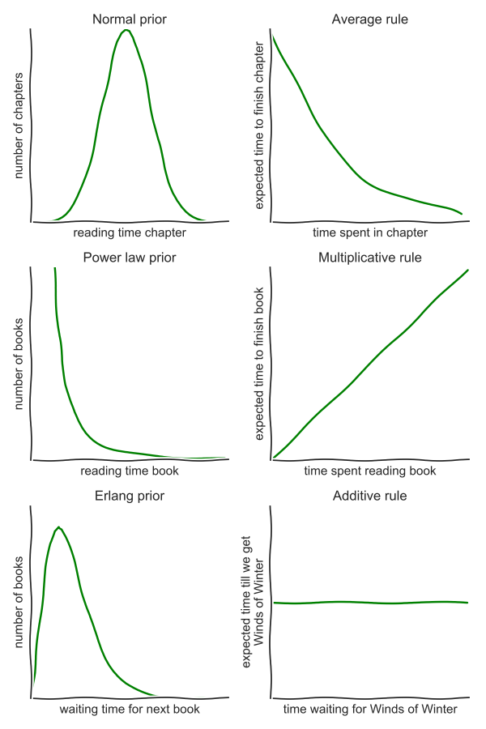

## Optimal stopping

Suppose that you are in an ice cream salon with a hundred different flavors of ice cream: chocolate-mint, peanut butter, pepper, coffee-chocolate-garlic and many more! Because you don't know any of these strange combinations, the friendly ice cream vendor allows you some tastes. You can try a little spoon of a type of ice cream and then have to decide whether you want the full portion of that type or want to taste something else. Politeness says that if you have have declined a flavor to try a new one, you can never choose that flavor again. Which strategy will lead to the best bowl of ice cream?

This problem is well-known in mathematical circles as the **secretary problem**. You have a set of candidates for the position of your new secretary which you interview in random order. After every interview you have to decide to his this candidate or reject and hire a new one. Clearly, if you decide to hire too soon, you are likely to end up with a suboptimal secretary whereas if you keep rejecting in the hope of finding someone better, it is likely that you rejected the best one. There is a rather elegant solution to this problem:

> When searching for the best item, first spend $e^{-1}\approx 37$% of your effort just looking and from then on pick a good one.

So, returning to the ice cream dilemma, if I can reasonably try ten flavors, my best strategy is to taste and reject the first four flavors to get a feel of the 'distribution' and from then onwards choose something that I like. Many daily problems can be tackled this way: hiring candidates, looking for a job, finding a new apartment to selecting your life partner. Typical for all these problems is that the distribution is unknown beforehand: before starting our search we have no point of reference for what is good or not. If instead of hiring people based on their qualitative competence, we base ourself on their study results it all becomes much easier. Just look until you find a candidate with the highest score you can reasonably expect: when interviewing ten candidates you can reasonably expect one to be in the top-ten percentile grade-wise.

## Exploring / exploiting

Where should we go and eat tonight? Are we going to our favorite Italian which we always enjoy or are we taking a gamble and try that new Lebanese place, which might be a hit or miss. This is called the **exploration vs exploitation**: should you exploit your best strategy you have found up to know or engage in the risky endeavor of exploring? As a researcher, it is a problem I face regularly: continue working on my current research lines (resulting in a quite steady output of papers though not necessary the most exciting topic) or try this new thing all the cool kids are doing (which could be high-impact, but will probably just be a dead end).

- *Gittins index*

Perhaps a more simple way guiding your choices is through a **regret bound**: which ones of these things will I regret most of not having done?

- voorbeeld
- *Gittins index*
- regret and confidence bounds
- A/B testing

## Sorting

Despite having a master degree in engineering, I have to admit that I do not really know how to operate our washing machine. Hence, I am usually the one who has to fold the laundry which my partner has washed. I can treat this mostly as an exercise in mindfulness, except for the socks. We seem to have an endless variety of different kinds of socks (my mother has a shop selling underwear) and most of my time in the laundry room is finding the matching pairs of socks. Sadly, I use a rather inefficient form of ... sort: I pick a (initially brightly colored) sock and subsequently comb trough the pile to find its partner. This leaves me with a depressing time complexity of $\mathcal{O}(n^2)$, time proportional to the the number of socks squared.

When going through your laundry, organizing your contacts, alphabetizing your books or sorting a pack of cards, an efficient method of sorting requires more effort than going though the whole collection once. More precisely, it requires about $\mathcal{O}(n\log n)$ comparisons. This is better than how I organize my socks, but still requires several passes through the collection. Why do we sort if it is that much work? Because it is much easier to find items from a sorted collection compared to an unorganized collection. And this is the *searching-sorting trade-off*. Sorting is a lot of work in advance, but you save time searching for things on the long run.

As an easy alternative for keeping your stuff perfectly sorted you can use *bin sort*:

> Ordering and keeping things ordered is often an unnecessary hassle. Instead, simply divide your collection in a manageable number of 'bins'.

This is the approach that is used in ..., the most efficient library in the world. Sorting stuff into $k$ bins has a time complexity of only $\mathcal{O}(kn)$. Furthermore, if you want to sort the bins themselves, it is quite easy as there are relatively few objects per bin. I actually use this system myself for my books, rather than sorted by author, my books are grouped by color. In addition to being esthetically pleasing, I can find my books much easier based on the color of their cover than the author's name.

And yes, from now on I subdive my socks in brownish, dark and colored.

Foto sokken

#REVIEW
- naam sorteer algorithm
- naam efficient bibliotheek
- Foto van mijn sokken

## Caching

*Cashing* means that you keep your stuff close to where you might need it. If you keep your spices in the kitchen rather than your lavatory, you are kind of already doing this. Computers do this by storing data that it often needs in its fast memory rather than the slower hard drive. This poses the obvious problem of predicting what you will need a lot and what not.

An elegant solution is assuming that the things you used in the past will be useful in the near future as well. For organizing your paper files you can use the clever **Nogushi filing system**:

> Keep your documents in a stack. New documents go on top. If you need a document from the stack put it back on top afterwards.

This stack of documents will be self-organizing in the sense that the documents you need a lot tend to be at the top, while papers you do not need any more will slowly collect at the bottom. I find it a very comforting thought that one of the most efficient ways to organize paperwork is by just putting it on a pike on your desk. I recently also applied this on my computer. I set the filing system of my MacBook such that a new Finder window will show all my documents in the order of last opened.

## Scheduling

Planning complex project with many interdependent tasks is no easy task. One such project is cooking a multi-course dinner: vegetables should be cut before they can be sautéed, the oven should be used optimally and for God's sake, do not use the knife for raw vegetables after using it for meat! Scheduling theory is serious business!

Depending on what metric is important, different strategies have to be followed. Using **earliest due date** you try to *minimize the maximum lateness* by always choosing the task which has to be finished first, irregardless of how long it takes. This makes sure that everything is finished as early as possible. If you rather want the maximize the *number of tasks finished* before the due data, you best follow **Moore's algorithm**. Here, you again pick the task that has to be finished first, unless it looks like you cannot finish it in time. In that case you discard that task and choose the next most urgent task. So you will end up with a splendid dinner, but without merengue on your dessert.

If you just have some things to do, without order (some chores at home), you will spend the same amount of time irregardless of their order. When there are different people waiting on you to finish your tasks however, you can minimize their *collective waiting time*. To this end, just do the tasks in order of the time needed to complete them. This is called **shortest processing time**. In practice some things are more important than other (taking out the trash takes less time than bringing someone to the hospital, but you are still advised to to the latter first). For this reason, it makes sense to weight your tasks by importance:

> Do tasks in order of importance divided by the time it takes to finish the task.

So, if one task takes twice as much time as another, only do it first if it is more than two times as important.

## Bayes' rule

- predicting using one data point
- *power-law distributions* => multiplicative rule
- *normal distributions* => average rule
- *Erlang distribution* => additive rule

## Computational kindness

As a last piece of advice for dealing with others (or yourself): try to limit the amount of computation needed.

- organiseren van feestjes
