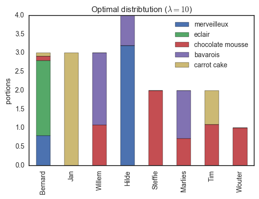
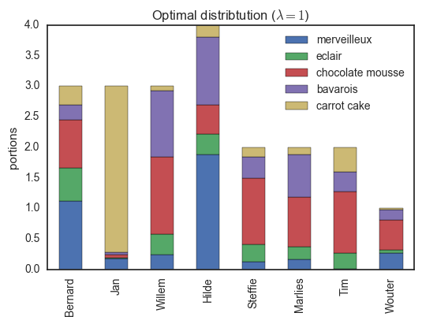
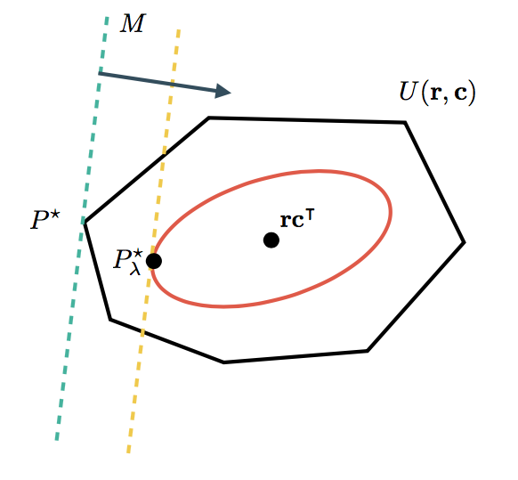
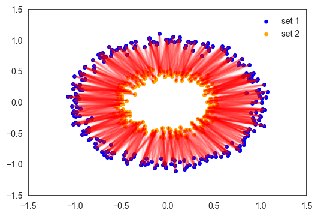
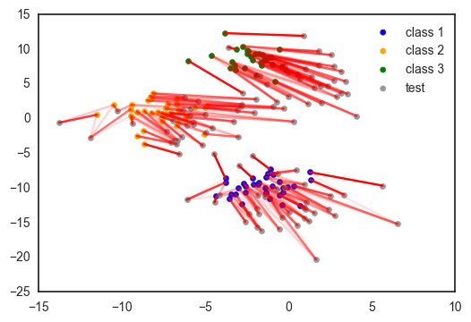
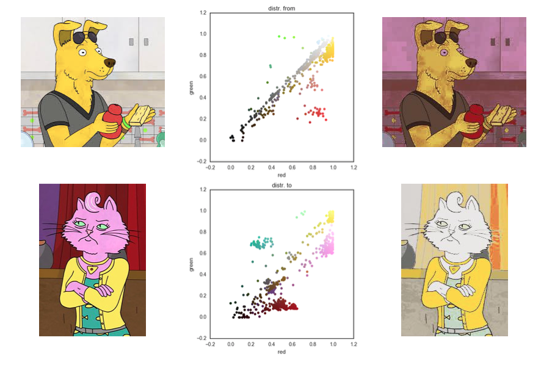

Transportation theory has been around since 1781 but still remains an active topic of research. Optimal transport theory is concerned with optimally distributing resources to a set of sinks. More formally, it is a theory to transform one probability distribution into another using a given cost function.

In this seminar I will try to convey this problem using a case study I dubbed the 'zoetjeslijst problem'. This problem will be solved using a simple algorithm. Furthermore, I will discuss some examples (in greater or smaller detail) about interpolating probability distributions, domain adaptation, image color transfer, comparing distributions with prior knowledge, modeling complex systems and computational fluid dynamics.

This seminar will take one hour max, and is relevant for people working with data, probability or distributions.

=> herwerk tot goede abstract!

## A party in the lab

Let's have a party in our research unit! Pastries and party hats for everyone! We ask Tinne, our laborant, to make some desserts: an airy merveilleux, some delicious eclairs, a big bowl of dark chocolate mousse, a sweet passion fruit-flavored bavarois and moist carrot cake (got to have vegetables). If we mentally cut all these sweets into portions, we have twenty portions as shown in the table below.

<table border="1" class="dataframe">
  <thead>
    <tr style="text-align: right;">
      <th></th>
      <th>merveilleux</th>
      <th>eclair</th>
      <th>chocolate mousse</th>
      <th>bavarois</th>
      <th>carrot cake</th>
    </tr>
  </thead>
  <tbody>
    <tr>
      <th>Pieces</th>
      <td>4</td>
      <td>2</td>
      <td>6</td>
      <td>4</td>
      <td>4</td>
    </tr>
  </tbody>
</table>

Since this is academia, we respect the hierarchy: people higher on the ladder can have to take more dessert. The professors, Bernard, Jan and Willem get three pieces each, our senior post-doc Hilde will take four portions (one for each of her children) and the teaching assistants are each allowed two portions. Sorry Wouter, since you are a shared teaching assistant with the Biomath research group, you can only take one...

<table border="1" class="dataframe">
  <thead>
    <tr style="text-align: right;">
      <th></th>
      <th>Bernard</th>
      <th>Jan</th>
      <th>Willem</th>
      <th>Hilde</th>
      <th>Steffie</th>
      <th>Marlies</th>
      <th>Tim</th>
      <th>Wouter</th>
    </tr>
  </thead>
  <tbody>
    <tr>
      <th>Pieces</th>
      <td>3</td>
      <td>3</td>
      <td>3</td>
      <td>4</td>
      <td>2</td>
      <td>2</td>
      <td>2</td>
      <td>1</td>
    </tr>
  </tbody>
</table>

As engineers and mathematicians, we pride ourselves in doing things the optimal way. So how can we divide the desserts to make everybody as happy as possible. As I prepare a course on optimization, I went around and asked which of those cakes and tarts they liked. On a scale between -2 and 2, with -2 being something they hated and 2 being their absolute favorite, the desert preferences of the teaching staff is given below (students: take note!).

<table border="1" class="dataframe">
  <thead>
    <tr style="text-align: right;">
      <th></th>
      <th>merveilleux</th>
      <th>eclair</th>
      <th>chocolate mousse</th>
      <th>bavarois</th>
      <th>carrot cake</th>
    </tr>
  </thead>
  <tbody>
    <tr>
      <th>Bernard</th>
      <td>2.0</td>
      <td>2</td>
      <td>1</td>
      <td>0</td>
      <td>0</td>
    </tr>
    <tr>
      <th>Jan</th>
      <td>0.0</td>
      <td>-2</td>
      <td>-2</td>
      <td>-2</td>
      <td>2</td>
    </tr>
    <tr>
      <th>Willem</th>
      <td>1.0</td>
      <td>2</td>
      <td>2</td>
      <td>2</td>
      <td>-1</td>
    </tr>
    <tr>
      <th>Hilde</th>
      <td>2.0</td>
      <td>1</td>
      <td>0</td>
      <td>1</td>
      <td>-1</td>
    </tr>
    <tr>
      <th>Steffie</th>
      <td>0.5</td>
      <td>2</td>
      <td>2</td>
      <td>1</td>
      <td>0</td>
    </tr>
    <tr>
      <th>Marlies</th>
      <td>0.0</td>
      <td>1</td>
      <td>1</td>
      <td>1</td>
      <td>-1</td>
    </tr>
    <tr>
      <th>Tim</th>
      <td>-2.0</td>
      <td>2</td>
      <td>2</td>
      <td>1</td>
      <td>1</td>
    </tr>
    <tr>
      <th>Wouter</th>
      <td>2.0</td>
      <td>1</td>
      <td>2</td>
      <td>1</td>
      <td>-1</td>
    </tr>
  </tbody>
</table>

See how most people like eclairs and chocolate mousse, but merveilleus are a much more polarizing dessert! Jan is lactose intolerant, so he gave a high score to the carrot cake by default.

My task is clear: divide these desserts in such a way that people get their portions of the kinds they like the most!

## The optimal transport problem

Let us introduce some notation so we can formally state this as an optimization problem. Let $\mathbf{r}$ be the vector containing the amount of dessert every portion can eat. In this case $\mathbf{r} = (3,3,3,4,2,2,2,1)^\intercal$ (in general the dimension of $\mathbf{r}$ is $n$). Similarly, $\mathbf{c}$ denotes the vector of how much there is of every dessert, i.e. $\mathbf{c}=(4, 2, 6, 4, 4)^\intercal$ (in general the dimension of $\mathbf{c}$ is $m$). Often $\mathbf{r}$ and $\mathbf{c}$ represent marginal probability distributions, hence their values sum to one.

Let $U(\mathbf{r}, \mathbf{c})$ be the set of positive $n\times m$ matrices for which the rows sum to $\mathbf{r}$ and the columns sum to $\mathbf{c}$:
$$
U(\mathbf{r}, \mathbf{c}) = \{P\in \mathbb{R}_{>0}^{n\times m}\mid P\mathbf{1}_m = \mathbf{r}, P^\intercal\mathbf{1}_n = \mathbf{c}\}\,.
$$
For our problem, $U(\mathbf{r}, \mathbf{c})$ contains all the ways of dividing the desserts for my colleagues.

The preferences of each person for each dessert is also stored in a matrix. In order to be consistent with the literature, this will be stored in a $n\times m$ *cost* matrix $M$. The above matrix is a preference matrix which can easily changed into a cost matrix by inverting the sign of every element.

So finally, the problem we want to solve is formally posed as
$$
d_M(\mathbf{r}, \mathbf{c}) = \min_{P\in U(\mathbf{r}, \mathbf{c})}\, \sum_{ij}P_{ij}M_{ij}\,.
$$
This is called the *optimal transport* between $\mathbf{r}$ and $\mathbf{c}$. This has been around for several centuries in mathematics. It can be solved using linear programming.

The optimum, $d_M(\mathbf{r}, \mathbf{c})$, is called the *Wasserstein metric*. Is a basically a distance between two probability distributions. It is sometimes also called the *earth mover distance* as it can be interpreted as how much 'dirt' you have to move to change one 'landscape' (distribution) in another.

## Choosing a bit of everything

Consider a slightly modified form of the optimal transport:
$$
d_M^\lambda(\mathbf{r}, \mathbf{c}) = \min_{P\in U(\mathbf{r}, \mathbf{c})}\, \sum_{i=1}^n\sum_{j=1}^mP_{ij}M_{ij} - \frac{1}{\lambda}h(P)\,,
$$
in which the minimizer $d^\lambda_M(\mathbf{r}, \mathbf{c})$ is called the *Sinkhorn distance*. Here, the extra term
$$
h(P) = -\sum_{ij}P_{ij}\log P_{ij}
$$
is the *information entropy* of $P$. One can increase the entropy by making the distribution more homogeneous, i.e. giving everybody an equal share of every dessert. The parameter $\lambda$ determines the trade-off between the two terms: trying to give every person only their favorites or encouraging equal distributions. Machine learners will recognize this as similar to regularization in for example ridge regression. Similar as that for machine learning problems a tiny bit of shrinkage of the parameter can lead to an improved performance, the Sinkhorn distance also works better than the Wasserstein distance on some problems. This is because we use a very natural prior on the distribution matrix $P$: in absence of a cost, everything should be homogeneous.

If you squint your eyes a bit, you can also recognize a Gibbs free energy minization problem into this, containing energy, entropy, physical restrictions ($U(\mathbf{r}, \mathbf{c})$) and a temperature ($1/\lambda$). This could be used to describe a system of two types of molecules (for example proteins and ligands) which have a varying degree of cross-affinity for each other.  

## An elegant algorithm for Sinkhorn distances

Even though the entropic regularization can be motivated, to some extent, it appears that we have made the problem harder to solve because we added an extra term. Remarkably, there exists a very simple and efficient algorithm to obtain the optimal distribution matrix $P^\star$ and the associated $d_M^\lambda(\mathbf{r}, \mathbf{c})$! This algorithm starts form the observation that the elements of the optimal distribution matrices are of the form
$$
(P_\lambda^\star)_{ij} = \alpha_i\beta_j e^{-\lambda M_{ij}}\,,
$$
with $\alpha_1,\ldots,\alpha_n$ and $\beta_1,\ldots,\beta_n$ some constants that have to be determined that the rows, resp. columns, sum to $\mathbf{r}$, resp. $\mathbf{c}$! As such, the optimal distribution matrix can be obtained by the following algorithm.

> **given**: $M$, $\mathbf{r}$, $\mathbf{c}$ and $\lambda$
>
> **initialize**: $P_\lambda = e^{-\lambda M}$
>
> **repeat**
>> 1. **scale the rows** such that the row sums match $\mathbf{r}$
>> 2. **scale the columns** such that the column sums match $\mathbf{c}$
>
> **until** convergence

An implementation in python is given below (note that the docstring is longer than the actual code).

```python
def compute_optimal_transport(M, r, c, lam, epsilon=1e-8):
    """
    Computes the optimal transport matrix and Slinkhorn distance using the
    Sinkhorn-Knopp algorithm

    Inputs:
        - M : cost matrix (n x m)
        - r : vector of marginals (n, )
        - c : vector of marginals (m, )
        - lam : strength of the entropic regularization
        - epsilon : convergence parameter

    Output:
        - P : optimal transport matrix (n x m)
        - dist : Sinkhorn distance
    """
    n, m = M.shape
    P = np.exp(- lam * M)
    P /= P.sum()
    u = np.zeros(n)
    # normalize this matrix
    while np.max(np.abs(u - P.sum(1))) > epsilon:
        u = P.sum(1)
        P *= (r / u).reshape((-1, 1))
        P *= (c / P.sum(0)).reshape((1, -1))
    return P, np.sum(P * M)
```

Using this algorithm we can compute the optimal distribution of desserts, shown below.

Here, everybody only has desserts they like. Note that for example Jan gets three pieces of carrot cake (the only thing he can eat) while Tim gets the remaining piece (he is the only person with some fondness of this dessert). If we turn the regularization parameter $\lambda$ down, we encourage a more homogeneous distribution, though some people will have to try some desserts which are not their favorites...



The optimal transport problem, with or without entropic regularization has a nice geometric interpretation, shown below.



The cost matrix determines a direction in which distributions are better or worse. The set $U(\mathbf{r}, \mathbf{c})$ contains all feasible distributions. In the unregularized case, the optimum $P^\star$ is usually found in one of the points of such a set. When adding the entropic regularizer, we restrict ourselves to distributions with a minimum of entropy, lying in the smooth red curve. Because we don't have to deal with the sharp corners of $U(\mathbf{r}, \mathbf{c})$ any more, it is easier to find the optimum. As special cases, when $\lambda\rightarrow \infty$, then $P^\star_\lambda$ will become closers to $p^\star$ (until the algorithm runs into numerical difficulties). For $\lambda\rightarrow 0$ on the other hand, only the entropic term is taken into account and $P^\star=\mathbf{r}\mathbf{c}^\intercal$, a homogeneous distribution.

## The many applications of optimal transport

So optimal transport has two big applications: *matching distributions* (being interested in $P_\lambda^\star$) or computing a *distance between distributions* (being interested in $d^\lambda_M(\mathbf{r}, \mathbf{c})$).

### Matching distributions





### Finding a distance between two distribtions

## Conclusion

## References

Lévy, B. and Schwindt, E. (2017). *Notions of optimal transport theory and how to implement them on a computer* [arxiv](https://arxiv.org/pdf/1710.02634.pdf)

Courty, N., Flamary, R., Tuia, D. and Rakotomamonjy, A. (2016). *Optimal transport for domain adaptation*

Cuturi, M. (2013) *Sinkhorn distances: lightspeed computation of optimal transportation distances*
