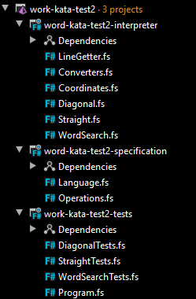
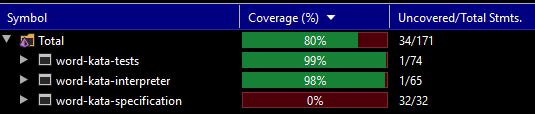

# Word search kata summary - first real F# kata

Recently I decided to start learning F#. In this blog post I will try to desribe my journey with a first bigger kata made by me. It was supposed to be a small and sumple kata, but I ended up with a much bigger and more complex code than I was expecting. 

The kata I was doing is called `Word search` and you can find it on [exercim](https://exercism.io/)

Here's a description of this kata:
```
Introduction
In word search puzzles you get a square of letters and have to find specific words in them.

For example:

    jefblpepre
    camdcimgtc
    oivokprjsm
    pbwasqroua
    rixilelhrs
    wolcqlirpc
    screeaumgr
    alxhpburyi
    jalaycalmp
    clojurermt

There are several programming languages hidden in the above square.

Words can be hidden in all kinds of directions: left-to-right, right-to-left, vertical and diagonal.

Given a puzzle and a list of words return the location of the first and last letter of each word.
```

## Surprises of F#

I'm a day to day C# developer. In this chapter I'll try to describe things which was unexpected or not-that-easy to adapt by my brain.

### Unable to reference code that is above
This one is pretty obvious, but it surprised me a lot. In C#, folders and files are sorted alphabetically



In F#, folders and files are sorted in the way you organize them. You can move them up and down as you wish, and they will stay where you dropped them. It was kinda strange at first, but after a while it totally made sense, since in F# it's impossible to reference anything from above, so sorting code manually. 

### Program.fs has to be at the end of the whole solution

I was struggling with this one way to much. I realised right now, why it is required to have `Program.fs` at the end of solution - it's related with the previous point - an entry point of a F# solution, witch is `Program.fs`, needs to have an access to all the code it's using. So naturally, it has to be the last file.

### F# coding conventions

It wasn't much of a purprise, but I'm still struggling with this one. I still tend to mix `PascalCase` (used in type names) with `camelCase` (used in function names). But this is my day-to-day struggle, since I also tend to mix things up in C#, in which I shouldn't do such mistakes ;) 

### Type inference

**TODO: need a source, and I need to understand it better.**

It was pretty hard at the beginning to understand what's going on in type inference and how it works.


At first it seemed like a black magic to me. Only after some time it started to make sense. I'm thinking about it like about a function signature. The first part represents paramteres, and the last type represents type returned by a function. In the above example, we can see that a function named `getSingle` takes a tuple as a parameter [`*` symbol represents that it's a tuple]. The tuple it made of given types:

* Grid
* Coordinate
* a function taking `Coordinate` as a parameter and returning `Coordinate`

and returns a `string` type.


This above function is a bit simpler, it takes a parameter of a type `FirstLetterSubmission` and returns a list of `Coordinate` type. As you can see, there is no implicitly defined type returned by this function, but compiler managed to figure it out by itself.

### Type as interface

If F# there's an interesting concept of interface - it's done by creating a `type` with a signature of a function, which represents the transformation that function makes. In other words, it's a functions signature, written in the same way as type inference.

In here I've got a type `GetDirections`, which defines a signature of a function implementing it. Then there's a `getDirections` function, which implements `GetDirections` type, so it transfroms a `Submission` type into an option of `Directions`.

```fsharp
type GetDirections = Submission -> Directions option
```
```fsharp
let getDirections : GetDirections =
```

Later, the `GetDirections` type is being used in a `GetLine` fuction, as a paramter. It means, that I can pass a function fulfulling the signature of a `GetDirections` type into `GetLine` function to change the behaviour of `GetLine` function.

```fsharp
type GetLine = GetDirections -> Submission -> Directions option
```

Final usage of `GetLine` function is presented below. I've got a `directions` function, which fulfills the `GetLine` type, and then is used in `getLinesInAllDirections`. 
It's used in two places: `|> directions Diagonal.getDirections` and `|> directions Straight.getDirections`, so I'm using directions function with two different behaviors injected (it's a strategy patter). It's capable of getting both diagonal and straight directions, depending on a function it gets.

```fsharp
let directions : GetLine =
            fun fn submission ->
                fn submission
    
let getLinesInAllDirections (submission : Submission) =
    { Lines =
        submission
            |> directions Diagonal.getDirections
            |> function
                | Some x -> Converters.directionsIntoSingleLinesList x
                | None -> []
        |> List.append (
            submission
                |> directions Straight.getDirections
                |> function
                    | Some x -> Converters.directionsIntoSingleLinesList x
                    | None -> [])}
```

### Using pipe operator where it is possible

It looks like F# heavily depends on pipe operator (|>). This operator passes a value from a previous function or variable into another function.
This below is a code from one of my tests. The first verison passes a `submission` parameter to a function `find` from a module `WordSearch` in a 'regular' way, in the second version it passes the same parameter using a pipe operator. I've got an impression that the second way of doing this is more 'correct', or maybe should I call it 'more functional'?
```fsharp
WordSearch.find submission
|> should equal expected
```
```fsharp
submission
|> WordSearch.find
|> should equal expected
```

### Compiler helps me with types

**TODO: Rewrite this**

This is pretty cool feature. When I'd like to fit a new function inbetween existing code, or maybe I'd like to create a function which will take some parameters and return a value, instead of writing the whole function signature, I could just write a function name and compiler should help me with determinig function signature via type inference. This way it's much easier to spot whether functions signature is what I'd expect or not. This helped me when I was getting incorrect types.


### Using modules as syntax

This thing was also quite new to me - module name at function call is an optional thing. It can be used when it improves readability, but also can be omitted when it feels redundant and not adding an value to the code.

```fsharp
submission
    |> Diagonal.singleLines 
    |> should equal expected
```

In the above example, the `Diagonal` part is totally optional and can be omitted.


```fshapr
NE = LineGetter.getSingle(grid, {HorizontalIndex = maxPosition; VerticalIndex = maxPosition}, initialPosition, northEast);
```

In an above example, name of a module feels redundant - I got rid of `LineGetter`, and left `getSingle` only, to improve readability.

```fshapr
NE = getSingle(grid, {HorizontalIndex = maxPosition; VerticalIndex = maxPosition}, initialPosition, northEast);
```

## Revelations on DDD (Domain Driven Design)

### Wrapping simple types into domain types

**TODO: Add example**

It's a really cool feature and I like it a lot. It's a lot easier to work in a codebase when compiler helps me with types. In F# it is possible to warp a simple type into my custom domain type, which in my case, for example chages a simple `string`, which by itself represents only a set of characters, into a `Word`, which is exactly the same type as `string`, but represents the word I'm looking for. Also, there's another custom type, called `SingleLine`, which in also of type `string`, but it represents a single line within a grid. Using this technique, the compiler helps me by checking if the function expecting a `string` of type `Word` gets exactly the same type I'm expecting, since if it recieves a `string` of type `SingleLine`, the code will not compile. This way I get more confidence (of course not 100%) that when the code compiles, it will work correctly. I cannot acidentally pass wrong type into my function.

### Creating complex types

F# is capable of not only wraping simple types, but is also great at aggregating this simple types into a more complex types.

```fsharp
type Submission =
    {
        Grid : Grid
        Word : Word
    }
```

The type `Submission` consists of:
* `type Grid = SingleLine list`
    * `type SingleLine = string`
* `type Word = string`

What it means is that `Grid` is a `List of string` and `Word` is a `string`, but since it's type - safe, I'm unable to put a `SingleLine` into `Word` field just by mistake, it just won't compile.

The above type is called a `record`, but there are more cool complex types. In this project I used also `discriminated union`.

```fsharp
type Directions =
    | Diagonal of DiagonalDirections list
    | Straight of StraightDirections list
```

What it means is that I've got a type called `Directions`, which contains either `DiagonalDirections list` or `StraightDirections list`. I'm using `Directions` as a type returned by a `GetLine` function, which can be used in two contexts - straight and diagonal.

### Specification as a library

**TODO: Extend this?**

I created two projects + test project. First one is interpreter, that's where the whole logic takes place. The second one is a specification, where I've got all the domaing types that are used by me. Specification has two files in it: `Language.fs` and `Operations.fs`. In laguage I've got simple and complex types (I'd call it domain value types), and in operations file I've got a types that define the logic fo my domain. 


## TDD

### Using TDD to incrementally build the application

I've started from the hardest task - getting diagonal single lines. The idea behind it was that if I was able to convert letters from a grid placed diagonal to each other into a single string or a list of string, then getting a 'straight' (up / down / left / right) lines should be a piece of cake. It later appeard to be true (partially), from the algorithmic point of view, getting diagonal lines was the hardest thing, and having it done I was able to take a ready solution and almost immediately (with minor chagnes) apply it to get straight single lines. The whole idea of the algorithm was that it was supposed to find a position in a grid of a first letter of the word I was looking for, so if I was looking for a word 'cake', I'd like to know the position of all 'c' characters on the grid. Then I'd convert elements of the grid into a single lines, starting at the positions of the first letter and going into every direction vertical, horizontal and diagonal. Then I'd take this single lines and just find if they contain the word I'm looking for or not.

I started with a simplest of the hardest case - given a word which was starting in top left corner of a grid, I wanted to return a single line that goes in bottom right direction. That was my basline, on top of which I built up the rest of the algorithm.

```fsharp
[<Fact>]
    let ``Given a grid and a word, it should return diagonal bottom right starting with words first letter``() =

        let grid = [ "abc"
                     "def"
                     "ghi" ]
        let word = { FirstLetter = 'a' ; Remaining = ['x' ; 'y'] }

        let submission : FirstLetterSubmission =
            { Grid = grid
              Word = word }

        let expected =
            [ { SE = "aei" } ]

        // Act & Assert
        submission
        |> Diagonal.singleLines  
        |> should equal expected
```

As soon as I has this test passing, I added another test - the one checking if the function `singleLines` works properly for a different index than (0, 0). It turned out that it doesn't work properly, but fortunatelly I had a test proving me that it's wrong, and it turned green as soon as I fixed this problem. After adding line one more test for this single - direction case, I added to `expected` variable more cases - so it checked for singel lines going in all directions.
```fsharp
let expected =
    [ { NW = "a"
        NE = "a"
        SW = "a"
        SE = "aei" } ]
```
As soon as this test was passing, I was able to use a similar approach to a vertical and horizontal `singleLines` function. Starting small, I incremetally made tests pass, as I was building up my solution. 

After I had all green tests, confiming that both diagonal and straight single lines are being fetched correctly, I added an end-to-end test, which returned true or false, depending on whether the word I was looking for was present at the grid or not.

After I made this test pass, I added some more tests for happy path (find diagonal word, given it exists in a grid, find horizaontal work given it exists in a grid) and at the end I added a test for a sad path (find a word given it does not exist). Fortunaltelly, the last 3 tests were green from the beginning.


And as a last thing, a test coverage of the whole solution. I'm pretty satisfied with this coverage (it's really high, but it's because this is a simple and small project), and also this tests saved me some work, by just failing after doing some changes, so i could fix them immiediately.

