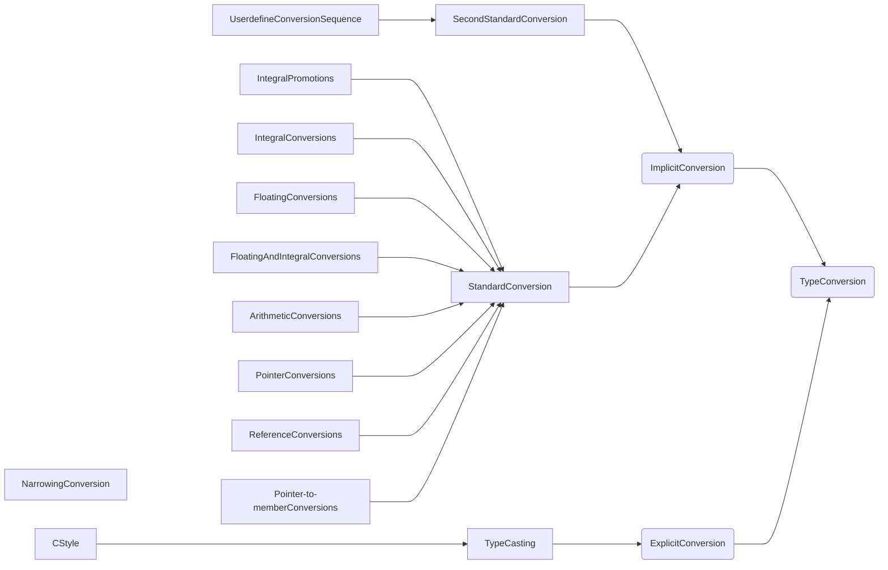

<details open><summary>컴퓨터 프로세서에 따른 자료형 크기</summary>
<div markdown="1">

|컴퓨터 프로세서|16Bit|32비트|64비트|
|---|---|---|---|
|char       |   1Byte|  1Byte|  1Byte|
|short      |   2Byte|  2Byte|  2Byte|
|int        |   2Byte|  4Byte|  4Byte|
|long       |   4Byte|  4Byte|  8Byte|
|long long  |        |  8Byte|>=8Byte|

</div></details>



* Conversion Sequence


[Casting](https://docs.microsoft.com/en-us/cpp/cpp/casting?view=msvc-170)


# standard conversion (표준 변환)
C++ 언어에서는 **기본 형식 간의 변환을 정의합니다. 또한 포인터, 참조 및 멤버 포인터 파생 형식에 대한 변환도 정의합니다.** 이러한 변환을 표준 변환이라고 합니다.

standard conversion은 한 유형을 다른 유형으로 변환할 때 **compiler가 적용할 수 있는 기본 제공 규칙 세트**입니다.

즉... 명시하지 않고 캐스팅 가능하다는 것을 의미합니다.

<details><summary>정수 계열 확장</summary>
<div markdown="1">

**정수 형식의 개체는 더 큰 값 집합을 나타낼 수 있는 다른 더 넓은 정수 형식, 즉 형식으로 변환할 수 있습니다.** 이 확대 변환 형식을 '계수 승격'이라고하며, 정수 계수 승격을 사용하면 다른 정수 계수 형식을 사용할 수 있는 모든 곳에서 식에서 다음 형식을 사용할 수 있습니다.

</div></details> 

<details><summary>

# 명시적 형식 변환 연산자 : ()
C++에서는 함수 호출 구문과 유사한 구문을 사용하여 명시적인 형식 변환을 수행할 수 있습니다.

```
simple-type-name ( expression-list )
```

<details><summary>어떻게 쓰는가?</summary>
<div markdown="1">

```cpp
int i = int(f);
```

함수 스타일 구문에서는 변환을 위해 인수를 둘 이상 지정할 수 있습니다.

</div></details>

<details><summary>캐스트 스타일도 가능하다</summary>
<div markdown="1">

```cpp
float f = (float)i;
```

캐스트 스타일 변환과 함수 스타일 변환 모두 단일 값에서 변환할 때 동일한 결과를 생성합니다.

</div></details>

<details><summary>사용자 정의 형식에서 명시적 형식 변환 연산자</summary>
<div markdown="1">

```cpp
struct Point
{
    Point( short x, short y ) { _x = x; _y = y; }
    ...
    short _x, _y;
};
...
Point pt = Point( 3, 10 );
```

</div></details>


# Cast

[캐스팅 연산자](https://docs.microsoft.com/en-us/cpp/cpp/cast-operator-parens?view=msvc-170)

형식 캐스트는 특정 상황에서 개체 형식을 명시적으로 변환하는 방법을 제공합니다.

```
cast-expression: unary-expression
( type-name ) cast-expression
```
컴파일러는 유형 캐스트가 수행된 후 cast-expression유형으로 처리합니다. type-name캐스트를 사용하여 모든 스칼라 유형의 객체를 다른 스칼라 유형으로 또는 그 반대로 변환할 수 있습니다. 명시적 유형 캐스트는 암시적 변환의 효과를 결정하는 동일한 규칙에 의해 제한됩니다. 캐스트에 대한 기타 제한은 특정 유형의 실제 크기 또는 표현으로 인해 발생할 수 있습니다.

```cpp
    i = (int)x;   // assign i the integer part of x
```

[캐스팅 규칙](https://docs.microsoft.com/ko-kr/cpp/cpp/casting-operators?view=msvc-170)

## const_cast

## static_cast

## reinterpret_cast

## dynamic_cast

### cross cast

주요 참고자료 : 마이크로 소프트 공식문서