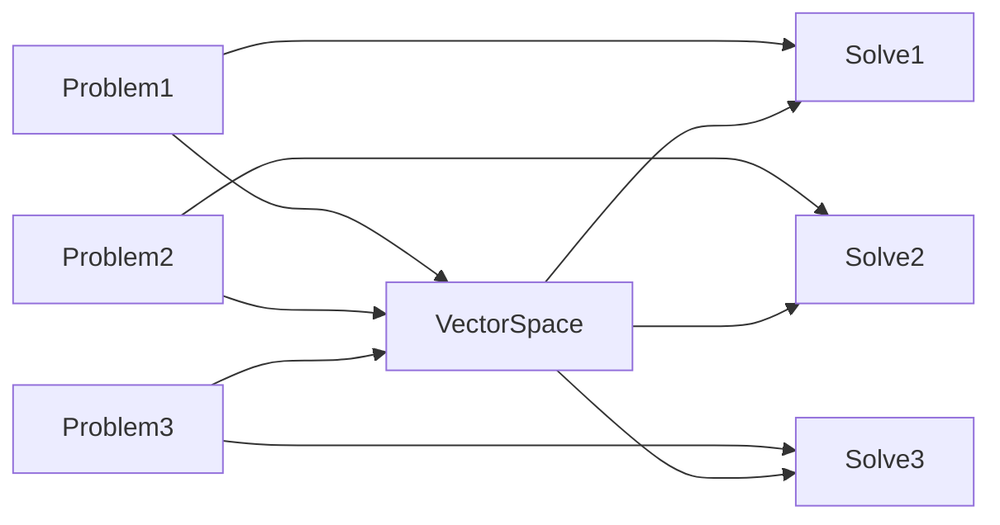

- [ ] mathjax의 행렬 표현 문제.

## 벡터

유클리디안 벡터(Euclidean vector)란 그리스 수학자 유클리드의 이름을 따랐으며 기하학적 벡터(geometric vector) 로도 알려져 있습니다. “벡터”라는 용어를 보면, 크기와 방향을 모두 가지는 어떤 양 으로 정의되는 유클리디안 벡터라고 생각할 수 있습니다.

<center><div markdown="1">

|||
|---|---|
|A에서 B로 향하는 벡터|벡터의 덧셈과 곱셉 : v벡터를 w벡터에 더하면 (v+w)벡터가 됩니다. 아래서 w벡터를 2배로 늘린 후 더하면 (v+2w)벡터가 됩니다.|

</div></center>

<details><summary>벡터의 놈</summary>
<div markdown="1">

[Norm   노름, 놈, 벡터의 길이, 벡터의 크기](http://www.ktword.co.kr/test/view/view.php?m_temp1=4201)

노름 (Norm) 이란 벡터/함수/신호 등의 크기(강도,길이)의 척도를 나타내는 수학적인 용어 입니다. 흔히, 벡터의 노름 이라고 하면, 유클리드 노름을 의미합니다.

* 유클리드 노름 (Euclidean Norm)은 유클리드 길이(Euclidean Length)입니다. 즉 원점으로부터의 거리입니다.
	- n차원 실수 공간 $$ R^n $$ 에서, `원점에서 임의 점까지의 거리` 또는 `벡터의 크기(길이)`입니다.
	- $$ \|v\| $$로 표현합니다. $$ \|v\| = \sqrt{x_1^2 + x_2^2 + ... + x_n^n} $$ 입니다.


</div></details>

<details><summary>벡터의 내적</summary>
<div markdown="1">

두 벡터 $$ v_1 = (x_1, y_1), v_2 = (x_2, y_2) $$에 대해 그 사이각을 θ라 했을 때, 두 벡터의 내적(inner product 또는 dot product)는 다음과 같이 정의됩니다.

$$ v_1 \cdot v_2 = x_1x_2 + y_1y_2 = \|v_1\| \|v_2\| cosθ $$

</div></details>

<details><summary>벡터의 외적</summary>
<div markdown="1">

[Cross Product](https://en.wikipedia.org/wiki/Cross_product)

벡터의 외적은 기본적으로 3차원에서 정의되며 두 벡터를 $$ a = (x_1, y_1, z_1), b = (x_2, y_2, z_2) $$라 했을 때, 두 벡터의 외적(cross product)는 다음과 같이 정의됩니다.

보통 수학에서는 오른손 좌표계를 쓰나, 왼손 좌표계의 경우, 외적 벡터의 방향이 반대로 됩니다. 언리얼 엔진은 왼손 좌표계 입니다.

* 유감스럽게도 내적과 외적은 서로 전혀 관계가 없습니다.

<center><div markdown="1">


</div></center>

$$ \|a\| \times \|b\| = \begin{vmatrix} i&j&k \\
x_1&y_1&z_1 \\ 
x_2&y_2&z_2  
\end{vmatrix} = (y_1z_2 - z_1y_2, z_1x_2 - x_1z_2, x_1y_2 - y_1x_2 ) = \|a\| \|b\| sinθ $$

단, $$ i=(1,0,0), j=(0,1,0), k=(0,0,1) $$는 좌표축 단위벡터.

* 외적 $$ a \times b $$는 $$ a, b $$로 이루어지는 평면에 수직이면서 그 크기가 $$ (a, b) $$로 이루어지는 평행사변형의 넓이인 $$ \|v1\|\|v2\|sinθ $$를 나타냅니다.
* **첫번째 벡터를 x축, 두번째 벡터를 y축이라 했을 때 두 벡터의 외적은 z축 이라고 생각합시다.**
* 벡터의 외적은 원래 3차원 공간에서 정의되지만, z = 0이라 생각하면 2차원 평면에서도 계산이 가능합니다.
* 영벡터가 아닌 두 벡터의 외적이 영벡터가 되는 경우는 두 벡터가 같은 방향이거나 또는 서로 반대 방향인 경우입니다.

두 벡터의 외적은 평행사변형의 넓이를 의미합니다. 그리고  Cross product의 정의 $$ \|A\|\times\|B\|=\|A\|\|B\|sinθ $$는 **CrossProduct로 나온 sinθ를 가지고 둔각에 대해서 제대로 구하지 못함합니다.**

</div></details>

<details><summary>두 벡터의 사이각(회전각)</summary>
<div markdown="1">

3차원 공간에서는 어떤 방향에서 봤느냐(이쪽에서 봤는지 반대편에서 봤는지)에 따라서 회전의 방향이 서로 반대가 될 수 있기 때문에 각의 방향을 부호로서 정할 수가 없습니다. 

따라서 3차원에서는 두 벡터 $$ v_1 = (x_1,y_1,z_1), v_2 = (x_2,y_2,z_2) $$의 절대적인 사이각은 내적을 이용하여 구하고 각의 방향은 외적 벡터의 방향을 보고 따로 판단해야 합니다.

$$ θ = cos^{-1}(v_1·v_2 / \|v1\| \|v2\|) $$

</div></details>

<details><summary>두 직선의 사이각</summary>
<div markdown="1">

직선의 경우에는 아래 그림과 같이 어떻게 벡터를 잡느냐에 따라서 서로 다른 2개의 사이각이 나올 수 있기 때문에 보통은 최소 사이각을 계산하는 것이 일반적입니다.

<center><div markdown="1">


</div></center>

기준이 되는 벡터를 잡았으면, 두 벡터의 사이각을 구하고, 다른 방법으로는 최소 사이각을 구할 수 있습니다.

</div></details>

<details><summary>벡터의 투영</summary>
<div markdown="1">

v의 벡터를 n에 투영했을때 생기는 벡터 v'를 의미하는 것이다. v에서 n로 수선을 긋게되면 직각삼각형이 생기는데, 여기에서 삼각함수을 이용하여 투영벡터를 구하는 공식을 구할수 있습니다.

<center><div markdown="1">


</div></center>

cos θ는 V의 길이를 투영된 벡터 V`의 길이로 나눈 것으로 표현할 수 있습니다.

$ 
v \cdot n = \| v \| \cdot \| n \| \cdot cos θ = \| v \| \cdot \| n \| \cdot \frac { \|V_{proj}\| } { \| v \| } = \|n\| \cdot \|v_{proj}\| \\
$

따라서 투영벡터의 길이를 다음과 같이 쓸 수 있습니다.

$ \|v_{proj}\| = \frac { v \cdot w } {\|n\|} $

투영벡터의 길이를 투영 벡터와 같은 방향인 n의 유닛벡터를 곱하면 투영벡터를 구할 수 있습니다.

$ v_{proj} = \frac { v \cdot w } {\|n\|} \cdot \hat n $

</div></details>

<details><summary>언리얼은 왼손좌표계</summary>
<div markdown="1">

[UE4 coordinate system NOT right handed](https://forums.unrealengine.com/t/ue4-coordinate-system-not-right-handed/80398)

나침판은 위에서 볼때 왼손좌표계입니다. 수학 단위 원은 위에서 볼때 오른손 잡이입니다. 컴퓨터 그래픽은 전통적으로 비행 시뮬레이션에서 발전했기 때문에 관습적으로 왼손좌표계를 씁니다. 선형 대수학은 전통적인 수학에서 발전했으므로 (x축은 오른쪽, y축은 위쪽) 관습을 오른손에 두었습니다. 

나침반으로 Y좌표를 물리적으로 해석하면, 양수 X는 앞으로, 양수 Y는 오른쪽으로 가고, Z는 위로 올라갑니다. 따라서 Z를 중심으로 한 왼쪽 회전은 시계 방향 회전을 생성합니다.

</div></details>

## 3차원 공간에서의 벡터
3차원 공간에서 벡터는 크기와 방향을 가진 것으로 일종의 화살표가 있는 직선이라고 생각할 수 있습니다. 

* 길이와 방향이 같으면 어디에 위치하든 같은 벡터라고 할 수 있습니다.
* 벡터의 크기가 1이면 우리는 이 벡터를 단위 벡터(unit vector)라고 말하고, 단위 벡터는 흔히 $ \hat u $라 합니다.
* 길이가 0인 벡터는 영 벡터(zero vector, null vector)라고 합니다.
* 벡터공간에서 벡터의 체는 실수체입니다.

<center><div markdown="1">


</div></center>

<details><summary>FVector</summary>
<div markdown="1">

```cpp
/**
 * A vector in 3-D space composed of components (X, Y, Z) with floating point precision.
 */
struct FVector 
{
public:

	/** Vector's X component. */
	float X;

	/** Vector's Y component. */
	float Y;

	/** Vector's Z component. */
	float Z;

public:
...
```

</div></details>

## 벡터 공간
* Vector field와 헷갈리지 말라고 합니다.

**수학, 물리학 및 공학에서 벡터 공간 (선형 공간 이라고도 함)은 벡터라고 하는 요소를 함께 더하고 스칼라 라는 숫자로 곱할 수 있는 집합 입니다.** 

* 스칼라는 종종 실수 이지만 복소수 또는 더 일반적으로 모든 필드 의 요소일 수 있습니다.
* 벡터 덧셈과 스칼라 곱셈 연산은 벡터 공리라고 하는 특정 요구 사항을 충족해야 합니다.
* 실수 벡터 공간 이라는 용어및 복소수 벡터 공간 은 종종 스칼라의 특성을 지정하는 데 사용됩니다(실제 좌표 공간 또는 복소 좌표 공간).
* 벡터공간의 예로는 유클리드 공간이 있습니다. 벡터공간은 유클리드 공간을 추상화, 일반화해서 벡터 공간의 정의를 만들었기 때문입니다.

<details><summary>벡터 공간이 왜 필요한가요?</summary>
<div markdown="1">

다음과 같은 문제들을 가정해 봅니다.

> Problem 1: 선형 연립방정식을 푸는 x1, x2, x3 ∈ R 찾기

$$
3x1 + 2x2 + 0x3 = 8\\
1x1 + 0x2 + 1x3 = 2\\
2x1 + 3x2 + 8x3 = 7
$$

문제 1을 행렬 방정식으로 작성할 수 있습니다.

$$
\begin{pmatrix}3&2&0\\1&0&1\\2&3&8 \end{pmatrix} \begin{pmatrix}x_1\\x_2\\x_3 \end{pmatrix} 
= \begin{pmatrix}8\\2\\7 \end{pmatrix}
$$

열 행렬만 사용하여 작성할 수 있습니다.

$$
x_1 \begin{pmatrix}3\\1\\2 \end{pmatrix} + x_2 \begin{pmatrix}2\\0\\3 \end{pmatrix} + x_3 \begin{pmatrix}0\\1\\8 \end{pmatrix} = \begin{pmatrix}8\\2\\7 \end{pmatrix}
$$

열 행렬을 사용하면, 위의 문제는 다음 두 문제와 유사해 보입니다.

> Problem 2: 다음과 같은 x1, x2, x3 ∈ R을 찾으십시오.

$$
x_1 (3t^2 + 5t - 2) + x_2 (0t^2 - t + 6) + x_3 (9t^2 + 0t + 1) = 6t^2 + 9t + 2
$$


> Problem 3: 다음과 같은 x1, x2, x3, x4, ··· ∈ C를 구합니다.

문제 3은 물리학자가 상자 안의 입자의 운동량을 알고 그 에너지를 알고 싶다면 풀 수 있는 종류의 문제입니다.

$$
x_1 (sin(\pi t)) + x_2 (sin(2 \pi t)) + x_3 (sin(3 \pi t)) + ··· = e^{5it}
$$

* field(체, 값이 존재하는 집합, 채운다에서 나온 말인거 같은데, 찾아보면 나오겠지.)
* coefficients(계수)
* complex numbers(복소수, 복잡한 수, 실제 세계의 수와 다르게 곱하면 빙빙 회전하기 때문에)
* mathematical objects(수학적 대상, 수학적으로 풀어야할 문제들)

문제 1, 2, 3에는 특정 유형의 수학적 대상이 있습니다. (열 행렬 문제 1, 문제 2의 다항식, 문제 3의 함수) 이 문제에서 xi 계수에 대한 올바른 값을 찾아 방정식의 오른쪽에 있는 개체를 왼쪽에 있는 개체의 합으로 작성하는 것입니다.

* 대상에 숫자를 곱하고 더할 수만 있다면 모든 종류의 수학적 대상를 사용하여 이러한 유형의 문제의 예를 찾을 수 있습니다.


그러나 이러한 이질적인 유형의 수학적 대상에 적용되는 정리와 기술을 아래 문구로 시작합니다.

> "열 벡터, 다항식, 함수 또는 숫자로 곱할 수 있는 다른 유형의 수학적 객체 모음이 있다고 가정합니다. 그리고 더해진..."

 
<center>



</center>

서로 다른 수학적 대상들을 정리와 기술이 있다면, 양이 많을 것입니다. 따라서 수학자들은 간결하게 표현하기 위해 벡터 공간이라는 용어를 발명하여 숫자를 곱하고 더할 수 있는 모든 유형의 수학적 객체를 의미합니다. 이런 식으로 정리는 위의 모호한 문구 대신 "V를 벡터 공간이 되게 하십시오..."라는 문구로 시작합니다.

</div></details>

<details><summary>벡터 공간의 정의</summary>
<div markdown="1">

벡터 공간은 집합 V(V의 요소를 벡터라고 함), 필드 F(F의 요소를 스칼라라고 함) 및 두 가지 연산으로 구성됩니다. 

같은 수의 성분을 가지는 벡터들로 이루어진 공집합이 아닌 집합 V가 있을 때, 
- V에 속하는 임의의 두 벡터 a와 b의 일차결합이 αa + βb (α, β 는 임의의 실수)가 또한 V에 속하고 
- **벡터에 대한 덧셈과 스칼라곱이 아래의 8가지 벡터의 합과 스칼라곱에 대한 연산법칙을 만족하면** 집합 V를 벡터공간(vector space) 또는 선형공간(linear space)이라고 하며, 그 원소를 벡터(vector)라고 합니다. 
 
 벡터의 합에 대해 
   (1) a + b = b + a <- 교환(commutative)법칙
   (2) (a + b) + c = a + (b + c) <- 결합(associative) 법칙
   (3) a + 0 = a : 항등원
   (4) a + (-a) = 0 : 역원
 
  스칼라곱에 대해 
   (5) c(a + b) = ca + cb : 분배법칙
   (6) (c + k)a = ca + ka : 분배법칙
   (7) c(ka) = (ck)a
   (8) 1a = a 

</div></details>

주요 참고자료 : 수학으로 시작하는 3D 게임 개발, 위키피디아, [What is a Vector Space](http://www.math.toronto.edu/gscott/WhatVS.pdf)