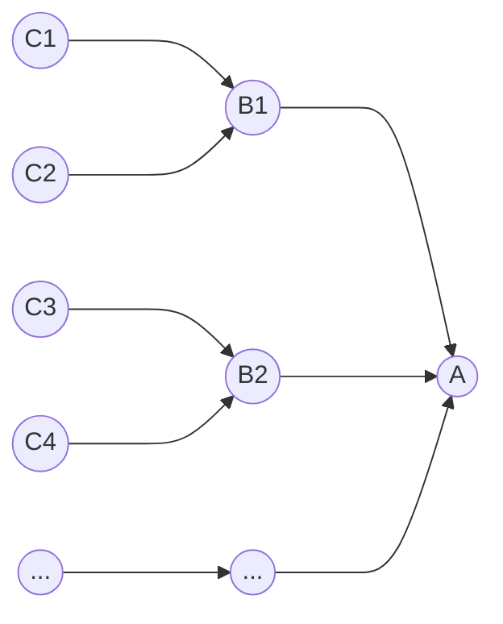

# 전문가가 되기 위해서는

[전문가와 ㅈ문가의 차이](https://www.youtube.com/watch?v=yiG0nOK7woU)

전문가가 되기 위해서는
1. 타당한 환경
2. 많은 반복
3. 적절한 피드백
4. 주도적(의도적) 연습

## 의도적 연습

타당한 환경, 많은 반복, 적절한 피드백이 갖춰져도, 의도적으로 연습하지 않는다면 실력이 늘지 않습니다. 약점을 인식하고, 이를 해결할 수 있는 방법을 숙련해야합니다.

전문가가 되기 위해서는, 수천시간동안 심리적으로 불편한 영역(잘할 수 없는 것)에서 연습을 해야합니다. **기술들의 핵심은 결국 인식으로, 장기기억에 저장된 엄청난 양의 정보 기억에서 길술이 나오게 됩니다.**

# 효율적으로 공부하기

'노력은 배신하지 않는다.', '1만 시간의 법칙' 이런 말이 있듯이 결국 많이 하면 점점 잘하게 되는 것이 일반 상식이다.

그러나 현실을 가만히 들여다보면 그렇지가 않다. 어떤 사람은 점점 잘하게 되고, 어떤 사람은 아무리 많이 해도 실력이 늘지를 않는다. 일상에서 찾아볼 수 있는 예를 들자면, 요리가 있다.

어떤 사람은 수년 혹은 수십 년, 아무리 많이 해도 늘지 않는다. 또 다른 예로 글씨가 있다. 많이 하면 점점 좋아져야 한다면, 어린이를 제외하고는 악필이 없어야 할 것이다. 십수 년, 수십 년을 글씨를 써도 여전히 악필인 사람이 있다. 어떤 사람은 평생 집에만 있던 것도 아닌데, 길치이다. 길을 잘 못 찾고, 잘 기억하지 못한다.

하면 할수록 잘 하게 되는 게 맞다면, 선생님은 연차가 쌓일수록 점점 더 실력이 좋아져야 할 것이다. 강의 내용도 실력이고, 학생들 감정을 다독이는 것도 실력이다. 강의에 집중하게 만드는 것도 실력이다. 그러나 선생님도 많은 경우 일정 이상 되면, 더이상 실력이 늘지를 않는다. 어떤 학생은 수능 시험을 대비하여 문제를 수없이 푸는데, 계속 점수가 제자리다.

세상에는 하면 할수록 점점 실력이 좋아져야 한다는 일반 상식에 반하는 일들이 너무나 많다. 왜 그런 걸까?

피드백 때문이다. 실력은 피드백에 의해 좋아지는 법인데, 피드백을 제대로 받지 못했기 때문이다. 피드백이 잘 이뤄지지 못한다면, 아무리 많이 해도 실력은 제자리 걸음일 수 있다. 피드백이 잘 이뤄지지 않는다? 대표적인 세 가지 경우가 있다.

첫째, 새로운 도전이다. 원래 하던 그것만 그대로 하면, 그것에서 실력의 단물이 다 빠져나가는 순간 더이상의 실력 상승은 없다. 오래 씹은 껌처럼 단물이 나오지 않는 것이다. 단 맛을 느끼려면, 새 껌을 씹으면 된다. 새 껌을 입에 넣고, 몇 번 씹다보면 본격적으로 단 맛이 나오는데, 그 때부터 실력 상승이 시작된다. 간단한 이치이다. 새로운 도전이 있어야, 새로운 피드백이 있을 것 아니겠는가.

둘째, 새로운 주목이다. 새로운 주목도 마찬가지로 새로운 피드백이 이뤄지게 한다. 관찰이란 무언가를 주목해서 보는 것이다. 그러면 머릿속에 정신적인 새로운 입력이 이뤄진다. 때문에 관찰을 하면, 피드백이 이뤄진다. 관찰은 마치 햇빛과 같다. 햇빛이 닿는 곳에 생명이 자라나듯, 관찰이 닿는 곳에 실력이 자라나는 법이다. 악필? 자신의 글씨를 관찰하지 않고, 습관적인 주목에 따라서만 글씨를 쓰니 아무리 많이 써도 늘지를 않는 것이다. 이는 요리도 마찬가지다. 요리 할 때 무엇에 주목하는가? 새로운 주목이 없으면 결국 요리 실력도 제자리 걸음을 하게 될 것이다.

셋째, 복잡한 피드백이다. 피드백이 복잡한 경우도 피드백이 잘 이뤄지지 않을 수 있다. 사람들은 흔히 무의식을 어떤 만능의 초능력이라고 막연히 생각하고, 어떤 복잡한 것을 머릿속에 넣더라도 알아서 직관으로 해석해주리라 믿는다. 그런데 이 세상에 초능력 따윈 없다. 그냥 인간의 두뇌일 뿐이다. 무의식은 자동으로 패턴 분석을 할 수 있는 부분이 있는데, 이를 보고 복잡해도 일단 머릿속에 쑤셔 넣으면 자연히 실력이 늘겠지... 하는 미신을 갖게 되는 것이다.

원칙적으로 피드백은 단순해야 한다. 피드백이 복잡하면 무의식은 그걸 어디에다가 피드백을 줘야 할지 알기 힘들다. 그래서 피드백을 안 주거나, 혹은 엉뚱한 곳에 피드백을 주게 된다.

피드백이란 원인과 결과에 해당하는 정신적인 입력이 각각 이뤄져야 하고, 이 둘 사이를 인지적으로 연결해야만 한다. 그런데 원인 또는 결과가 여러 개이고 그 연관성도 잘 드러나지 않는다면, 당연히 복잡성에 의해 피드백은 교란되는 것이다. 때문에 원칙적으로 피드백은 단순해야 한다. 그래서 예체능 분야, 이를테면 축구 선수는 기초훈련을 열심히 한다. 기초훈련이란 것의 정신적인 본질은 바로... 피드백의 단순성이기 때문이다.

이는 어떤 분야든 마찬가지다. 기초훈련의 본질은 피드백의 단순성이다. 단순한 피드백을 통해 정신적인 발전을 효율적으로 꾀하는 것이다. 어떤 이는 영문해석을 잘하기 위해 오로지 주어 동사만 찾는데 집중훈련한다. 이 역시 그 나름의 기초훈련이라 할 수 있다.

그런데 왜 '원칙적으로'라는 말을 붙이는 건가? 왜 원칙적으로 피드백은 단순해야 하는가? 예외가 있기 때문이다. 그 예외는 바로... 단순한 것을 이미 잘 피드백 받아서 능숙해진 경우이다. 그러면 더 복잡한 것도 인지적으로는 단순해져서 피드백이 잘 이뤄지기 때문이다. 드리블만 집중 훈련하여 능숙해졌다? 신경을 덜 쓰면서도 감각적으로 정교하게 드리블 할 수 있다? 그러면 드리블하면서도 시야를 확보하고 공간을 읽는 활동을 하기 쉬워질 것이다.

나는 간단히 이렇게 생각한다. 피드백을 단순하게 쪼갠다면, 10 + 10 = 20 번의 훈련이 필요하다. 피드백을 복잡하게 그대로 한다면, 10 * 10 = 100 번의 훈련이 필요하다. 즉 단순하면 더하기고, 복잡하면 곱하기다. 단순한 피드백이면 30번이면 될 것을 복잡한 피드백이면 1000번은 해야 한다.

단순한 피드백을 잘 받아놓으면, 실력의 한계도 높아진다. 난 이 점에 예외가 과연 있을지 의문이다. 요리사가 단순한 피드백으로 기초훈련을 철저히 하지 않으면, 결국 실력의 한계는 금방 찾아올 것이다. 마치 건물의 기초공사가 그 건물을 몇 층까지 올릴 수 있을지를 좌우하는 것과 유사하다.

피드백이 복잡하면, 아무리 해도 실력이 늘지 않는다. 수포자? 내 생각은 그렇다. 이는 피드백의 복잡성의 문제이다. 차근차근 단순한 피드백부터 잘 받아서 실력을 쌓아야 하는데, 그 과정을 생략하거나 부실하게 해놓고 복잡한 거 하려니 멘붕이 오는 것이다. 이는 언어적인 능력도 마찬가지다. 글을 읽는다는 것은 육체적으로는 단순해보이지만, 정신적으로는 복잡한 활동이다.

특히 어린이 동화책도 아니고, 수능시험을 치르거나, 전공 공부를 하거나, 어려운 학술적인 책을 읽는다면 더욱 복잡할 것이다. 이런 것은 단순한 피드백을 통해 얼마나 기초 공사를 잘 해뒀는 지에 좌우되는 것이다. 복잡하면 아무리 많이 해도 실력이 늘지 않는다. 7회독? 글쎄... 읽기의 기초실력이 없으면, 이것도 잘 해낼 수 없다. 애초에 그걸 다 읽고 이해할 시간도 없게 되고, 하는 동안에도 잘 안 되니 맥이 빠져서 중단하게 되기 쉽다.

'초등학교 때부터 책을 읽으면서 자연스럽게 습득한 속독 능력은 내 인생의 중요한 자산이다. 빨리 읽으면서도 이해를 할 수 있는 능력은 고시공부에 절대적으로 도움이 되었다.' - 고승덕

10회독이 시간적으로나 인지적으로나 가능한 것은 기초실력 때문이다. 단순한 피드백을 받으면서 기초실력을 쌓은 덕분이다.

예전에 글 리프팅이라면서, 작업기억력을 초과하는 한 문장을 읽고, 안 보고 따라 적으면서 기억해내는 것을 반복해보라는 이야기를 한 적이 있다. 이 역시 피드백이 단순해야 한다는 기본 원리에 의한 훈련이다. 글자를 흘리지 않고 의미로서 부호화하는 기초 실력이 좋아진다.

예전에 빈치관찰훈련법이라면서, 똑같은 것을 보고 미처 주목하지 못한 새로운 것을 관찰해내는 것을 누적적으로 빠르게 반복해보라는 이야기를 한 적이 있다. 이 역시 단순한 피드백이다. 조건은 오직 새롭기만 하면 되는 것이기 때문이다.

빈치상상훈련법도 마찬가지다. 무엇이든 좋으니 새로운 상상을 1초 간격으로 떠올리면 되는 단순한 피드백이다. 이를통해 관찰과 상상의 경직성을 해소하고, 관찰력과 상상력의 기초실력을 키울 수 있다.

아무리 해도 실력이 늘지 않고 있다면, 세 가지를 살펴야 한다.

새로운 도전이 없는 건 아닌지 살펴야 한다. 새로운 주목이 없는 건 아닌지 살피고, 새로운 것을 관찰해야 한다. 뛰어난 사람은 무엇에 도전하는지, 무엇에 주목하는지를 참고해도 좋다.

피드백이 복잡하면 아무리 많이 해도 실력이 제자리일 수 있으니, 피드백을 단순하게 만들어 기초실력을 쌓아야 한다.

기초실력은 초창기에만 하는 게 아니다. 계속 하는 것이다. 특히 실력이 한계에 이르렀다고 생각된다면, 당연히 기초로 돌아가야 단순한 피드백에 집중해야 한다. 기초를 더욱 정교하고, 정확하고, 빠르게 해낼수록, 실력의 한계는 높아질 것이다.

## 이해란

* 이해를 한다라는 것은, 해당 A를 조작하여, 원하는 방향으로 사용할 수 있음을 의미합니다.

A는 B1, B2...를 근거로, A가 상황에 따른 결과를 냅니다. B1, B2...의 현상은 요소가 되어 A라는 현상을 만듭니다.

해당 결과를 원하는 방향으로 내도록 조작하기 위해서는, A를 이루는 근거 B1, B2...의 현상을 알 필요가 있습니다.

예로 B1이 A의 최종결과값을 요소에 따라 곱한다고 했을 떄, B1의 요소를 2로 설정하면, A는 2배의 현상을 내도록 조작할 수 있습니다.

## A를 이해하기 위해 분리하기

A를 이해하기 위해서는 B1, B2...들의 이해를 필요로 한다. B1, B2...는 다시 C1, C2...들로, C1, C2... 는 다시 D1, D2...들을 근거로 합니다.

이럴 때, A만을 이해하기 위해서는, 연결된 정말 수도없이 많은 지식들을 필요로 한다. A를 이해하기 위해서, A를 분리할 필요가 있습니다.

A라는 현상을 이해하기 B1, B2...의 현상을 외우는 것으로 접근할 수 있다. B1이 이러한 결과를 가져온다는 것을 알면, A를 이해할 수 있게 된다.

## 공부

[효율적으로 공부하는 법](https://wonderfulmind.co.kr/strategies-get-study-time/)

## 프로그래밍 대전재
* 기능을 잘 쪼갤 수 있어야 한다.
* 자기 기능은 자기한테 있어야 한다. 자꾸 기능을 엉뚱한 곳에 넣는 경우가 있다. 이 객체가 과연 어떠한 역활을 하는 녀석인지 명확하게 하지 않으면, 어렵다.
* 오만가지 기능을 만드는데, 제일 판단하기 어려운건 이 기능을 어디에다 둬야 하는지가 제일 어렵다.
* 프로그래머는 스스로 하는 행동이 옳다고 판단하고 행동하기 때문에 이를 객관적으로 판단할 수 있는지가 중요. 자신의 판단이 타당한지 등등 결정할 수 있어야함. 사람끼리 부디쳐 보면서 협업, 이런시긍로.
* 가장 무서운건 A, B... 여러 군데 넘게 둬도 돌아가는데, 어디다 둬야하는지... 게임 코딩같은 경우 유지보수를 전제로 하고, 여러명이서 동시에 만드는, 따라서 최소한 분리하는 경우를 전제로 하는데... 생각보다 굉장히 어려움.
* 아이템은 아이템에 있어야함. 점수는 점수를 관리하는 곳에 있어야함.
* 대부분 게임 기능은 충돌로 만듬. 충돌이라고 하는 기능은 쌍방임.
* 이벤트 기점(알려주는 타이밍), A가 B를 알아야 하느냐, B가 A를 알아야 하느냐? 어떻게 판단하냐? 객체를 늘려보면 알 수 있음. 아이템을 가져다가 폭탄, 버튼, 전등을 만든다. 화살표를 어떻게 그려야 할 까? 캐릭터가 폭탄, 버튼, 전등을 알려고 하면 전부 케이스를 구현해야 하지만, 캐릭터만 안다고 하면, 캐릭터만 구현하면 된다.
* 최대한 자료형이 적게 나오는 쪽을 아는식으로 구현한다. 캐릭터도 3명, 아이템 5개 이때는? 이때 필요한게 상속이다.
* 내가 내손으로 직접 관리하겠다. -> 자료구조,
* 하나만 알면 된다. -> 직접 통신
* 이게 이것이다. 상속. 포함한다. 조립.
* 포트폴리오에서 나는 객체 관리를 이런 식으로 이렇게 했다라고 라고 설명해야 한다.
* 문열고 만드는 기능을 가지고 했다라고 말할 수 없다. 엔진을 쓰는 이상 객체 관리 말고는 어필할 수 있는게 없다. 내가 3D에 관련된 이론을 기본적으로 알고있다. 엔진 기능을 충분히 숙지하고 있다. 음. 훌륭하군. 돈을 낼만했네.

## 기술 검토
1. 기술 검토란?
어떤 기술이 내 프로젝트에 사용하기 적합한지 알아보는 것을 뜻한다.

사용하기 적합??
사용하기 적합하다는 기준은 무엇일까?
이 기술이 사용하기 적합한지 알아보려면 무엇을 해야 할까?

2. 기술검토를 하는 법
1. 우리 제품이 현재 필요로 하는 기능은 무엇인지 정리한다.
우리 프로젝트의 경우 필요한 기능은 다음과 같았다.

앱의 메인 페이지에 있는 문구를 관리자가 매일매일 다른 문구로 변경한다.
앱에 새로운 버전이 있을 경우 버전 업데이트를 유도한다.

2. 알아보려고 하는 기술이 무엇을 하는 기술인지 알아본다.
우리 프로젝트 같은 경우는 Firebase Remote Config 에 대한 기술검토를 하고자 했다.

그렇다면 Firebase Remote Config 가 무엇을 하는 기술인지 알아본 후 정리한다.

3. 가격, 사용량(한계치), API 지원 여부 등을 알아본다.
사실상 가장 중요한 부분이다.

처음에 적용하기 간단하고, 무료로 지원되어 허들이 낮더라도
사용량에 따라서 추가 금액이 발생할 수 있는 기술이 많다.

섣불리 적용했다간 나중에 요금 폭탄을 맞는 수가 있다...

API 지원 여부를 알아봐야 하는 이유는, 서버사이드에서 값 수정이 필요한 경우를 위해서이다.

4. 간단한 설계를 해본다.
현재 내 프로젝트가 필요로 하는 기능을 구현할 때, 이 기술을 어떤 식으로 적용할 것인지??

간단한 다이어그램 등을 그려서 정리를 해 보면 좋다.

보고를 해야 할 필요가 있다면 PPT 등으로 정리한다.

여기서 더 나아가면 께름칙한 부분들(이슈가 있을것 같은 부분들)도 정리하도록 한다.

5. 샘플 코드를 만들어 테스트해본다.
기존 프로젝트에서 새로운 브랜치를 딴다.
새로운 브랜치에서 샘플 코드를 적용해보고, 예제 코드 + 주석 조금의 형태로 올린다.

## 서문
개발의 세계에는 웹 개발자, 인공지능 개발자, 데이터 엔지니어, 인프라 엔지니어 등 많은 직업이 있다. 하지만 여기서 직업이 아닌 역할군의 의미로 분류되는 것이 있는데, 바로 코더와 개발자다. 이 주제는 상당히 까다로운 주제여서 자칫 논란의 여지가 될 수 있음을 잘 알고 있지만, 나 역시 개발을 수 년간 해보면서 느낀바가 다소 있기 때문에 이 글을 작성해보기로 하였다.

 

많은 개발자들은 코더가 되길 꺼려한다. 간단히 말해 코더는 말 그대로 코드만 작성한다. 기획, 설계, 테스팅, 배포와 같이 프로덕션 사이클에서 중요한 위치에 있는 것들에 대해서는 하지 않고, 구현 그 자체에 관심을 두고 있는 것이 코더다. 코더라는 말에는 비하의 의미가 섞여있기 때문에 많은 이들이 자신에 대해 이런 말을 쏟아내는 것에 대해 불쾌감을 드러내는 경우가 상당하다.

 

이 글에서는 코더가 아닌 개발자가 되려면 어떤 마음가짐을 가져야 할지를 고민해보는 시간을 갖는다. 논리력? 자료구조? 알고리즘? 수학? 아니다. 개발이라는 업(業)에 대한 이야기이며 개발자라면 가져야 할 것들에 대해 생각해본다. 만약 아래의 것들이 충족되지 못한다면 어느순간 코더로 전락할 가능성이 크다.

연차가 많다고 실력도 좋을까?
개발은 연차가 많다고 다 잘하는 것은 아니다. 신입사원이 10년차보다도 많은 연봉을 받을 수 있다. 그 말은 반대로 아무리 연차를 쌓아도 개발 실력이 나아지지 않는다면, 신입사원보다 낮아질 수도 있다는 이야기다. 업무의 프로세스가 시간이 지나서도 엇비슷해지거나 하나의 프로세스로 구성되는 작업에 대해 장인정신이 필요한 숙련도가 요구되어 누가 보기에도 장인이 만든 것은 다른 사람과는 다르다고 생각되는 직업군에 대해서는 웬만하면 연차가 쌓일수록 실력과 노하우가 늘어나는 것이 일반적이다.

 

그러나 개발업계는 수시로 변한다. 여러 갈래가 있지만 가장 변화가 심하다고 생각되는 부분은 웹 분야에서도 프론트엔드다. 프론트엔드 프레임워크는 수시로 새로운 프레임워크가 등장하며 시장이 요구하는 프레임워크도 달라진다. 프론트엔드 라이브러리를 평정하던 제이쿼리의 시대는 가고 리액트의 시대가 왔듯이 말이다. 만약, 수 년간 제이쿼리를 하고 제이쿼리에 대해 너무나도 잘 아는 사람일지라도 리액트를 새로시작하는 것은 초보자보다 조금 더 앞에 나아가 있을 뿐 결국 새로 공부해야하는 것은 똑같다.

 

그렇다면, 개발자로써 어떻게 하면 좋을까? 바로 공부하는 것이다. 공부라는 단어때문에 벌써부터 짜증이 몰려오는 경우도 많겠지만, 어느 개발 유튜버가 이야기했듯이 개발자는 늘 공부하는 직업이다. 무엇을 개발하냐의 따라 정도의 차이는 있더라도 변화하는 시대에 맞춰서 개발자도 성장할 필요가 있다.

 

클라우드 슈밥이 이야기했듯이 현재 4차 산업혁명 시대를 맞이했다. 인공지능과 데이터 산업의 가치는 나날이 상승했으며 블록체인, IoT, 자율주행 등은 이제는 입에 익을 정도로 많이 듣는 단어가 되었다. 우리는 이렇듯 변화하는 시대에 대해 발걸음을 맞춰서 나아갈 필요가 있는데, 공부하지 않고 제자리에만 있다면 시간이 지날수록 도태될 수 밖에 없다.

 

개발은 아날로그에 가까운 방식에 대해 선호하지 않는 경향이 있다. 그렇다고 아날로그가 필요없다는 이야기는 아니다. 그리고, 현재보다 시간이 더욱 지나서 다시 한 번 놀라운 기술발전이 일어난다면, 또 다시 우리는 공부해야 한다. 공부는 개발자의 숙명이며 떨어뜨릴 수 없는 불가분의 관계다.

프로세스의 혁신과 더 나은 코드
개발자가 알고리즘을 짜면서 겪는 문제는 시간 복잡도와 공간 복잡도와 같은 알고리즘이 갖는 효율성에 대한 문제다. 같은 문제를 해결할 수 있다고 한들, 어떤 코드는 더 빠르고 적은 공간으로 할 수 있다. 이는 알고리즘에 국한되는 문제일지도 모르지만 사실 개발에서 더 나아가 인생에 대한 전략적인 고민을 해야한다는 것을 의미한다. 코드를 구현하는 사람에게 있어 알고리즘의 효율성을 높히는 일은 중요하지만, 어떤 하나의 서비스를 기획하고 배포가 되는 그 과정까지의 사이클에 있어서 얼마나 프로세스의 혁신을 이루어 낼 수 있는지도 고민해야 하는 것이다.

 

애자일과 같은 다양한 소프트웨어 개발 방법론이 탄생, 테스팅과 배포 자동화를 위해 CD/CI 개념이 나타나는 등 프로세스의 혁신을 위한 노력이 개발자들 사이에서 여전히 이루어지고 있다. 하지만 프로세스에 있어 정답은 없다. 어느 때는 과거 아날로그 방식처럼 FTP 를 연결하고 파일을 배포하는 방식이 나을수도 있다. 개발자는 상황에 따라 유연해지는 것이 좋으므로 반드시 이렇게 해야한다거나 이것이 정답이라는 방식으로 접근하는 것은 유연한 생각이 필요한 개발자가 되기는 어려운 사고방식이다.

 

현재보다 더 나은 방식이 없을까? 지금 가진 문제점이 있다면 그 문제를 어떤 방식으로 해결할 수 있을까를 고민하면서 코드를 작성해본다면 더 나은 코드와 사용자 경험이 담긴 어플리케이션, 또는 서비스를 만들고 사람들에게 소개할 수 있을 것이라 생각한다. 

개발자는 코더가 아니다
개발자의 길에 진입하려는 사람, 또는 개발자에 대해 잘 모르는 사람들은 대부분 개발자가 그저 코딩만 잘하면 되는 줄 알고있다. 애초에 미디어 상에서 광고를 할때도 코딩 학원이라고 하지 개발 학원이라고 하지 않는다. 코딩이라는 말에는 설계와 테스팅, 최적화 등을 포함하는 넓은 의미의 코딩과 그저 코드 자체를 작성하는 좁은 의미의 코딩으로 생각해볼 수 있는데, 사회에서는 좁은 의미로 이해하고 있는 경우가 많은 것 같다. 

 

내 또래 컴퓨터공학과 친구들이나 개발에 진입하려는 사람들을 가끔 보다보면 코드를 작성하기 위한 이론들, 예를 들어 문법이나 객체지향, 함수형 프로그래밍 등의 개념은 알고 있는데 정작 코드 자체는 작성하지 못하는 경우를 보았다. 이미 코드를 작성하기 위한 이론적인 지식은 탑재가 되었지만 다른 것이 부족한 것이다.

 

바로 현실세계과 코드 작성을 잇는 매핑능력이다. 이론은 있으나 코드를 작성하지 못하는 사람들은 현실세계에 존재하는 문제나 개체를 코드로 옮겨 표현하는 것을 어려워한다. 프로그램을 알고리즘을 통해 구현하는 그 단계보다도 더 높은 단계에 있는 추상화 단계를 생각하지 않고 구현만을 먼저 고민하게 되어 문제가 된다.

 

주어진 문제가 있으면 어떠한 함수, 클래스, 프로퍼티, 메서드가 필요한가, 그들간의 관계는 어떻게 연결시켜 생각할 수 있으며 현실세계와 비교했을 때 객제치향의 상속과 인터페이스가 가지는 의미를 생각하여 어떻게 코드로 나타낼 수 있을지를 고민해야 하는데, 내부 구현부터 고민하고 있으므로 막히게 된다.

 

이러한 코드의 설계부터 시작해서 프로그램의 무결성 유지를 위해 테스트를 하고 배포를 일관성있게 진행하며 유지보수가 수월하도록 가독성있는 코드를 작성, 리팩토링, 더 나아가 사용자에게 불편하지 않도록 사용자 경험까지 고민해보는 과정을 모두 고민할 수 있어야 개발자라고 생각한다. 단순 코드만을 작성하고 구현하는 일만이 개발자가 하는 일의 전부는 아닌 것이다.

질문하는 것도 실력이다
너무 많은 것을 질문하거나 검색만으로도 나오는 질문의 경우는 안 하는게 약일 수 있다. 같은 개발자에게 질문했을 때 가장 야박한 대답은 검색을 해보라는 것이다. 그 만큼 검색을 하면 많은 정보가 나온다는 것인데, 하나부터 끝까지 질문만 하는 사람을 본 적이 있다.

 

어떤 코드가 동작이 되지 않는다면 다음과 같이 질문을 바꿔어보라. 지금 이런 프로그램을 작성하고 있는데, 그걸 이렇게 하고싶고 어떤 문제가 발생했고 해결을 위해 이러한 것을 시도해봤다는 사실을 질문을 받는 대상자에게 이야기해보자. 단순히 코드만 던져놓고 동작이 안 된다고 한다거나 검색도 안 해보고 질문만 던지는 행위는 주위사람을 괴롭히려고 하는 의도라고 밖에 생각되지 않는다. 또는 검색을 위해 문제에 해결에 대한 키워드를 물어보는 것도 좋은 방법이다.

 

구글과 같은 검색엔진이 있는 한 개발자에게 있어 검색 능력은 큰 힘이다. 실제로 알고리즘을 작성하는 실력이나 코드를 작성하는 능력자체가 떨어진다고 하더라도 검색을 통해 어느정도 극복이 가능하다. 검색이 누적되고 축적되면 어느순간 자기것이 되기 마련이다.

 

하지만 질문을 하기 전에 먼저 실험을 해보아야 한다. 질문을 받는 사람은 질문자가 해당 문제에 대해 얼마나 시도를 해보았는지 어느정도 직감적으로 알 수 있기 때문에 무작정 질문했다가는 상대방도 기분나쁘게 받아들일 뿐이다. 질문을 하기전에 먼저 작성해볼 수 있는 코드는 작성해보고 질문을 던지는 것이 더 나은 개발자가 되기 위한 길이라고 볼 수 있다.  

기술보다, 먼저 무엇을 만들지 고민하라
이는 창의력과 관련된 문제로 생각될 수 있다. 예를 들면 내가 자바를 할 줄 안다고 생각해보자. 그러면 무언가 포트폴리오를 만들고자 할때 이런 생각을 먼저 해보기 나름이다. 

 

내가 자바를 할 줄 아는데 이걸로 만들 수 있는 것은 무엇일까?

 

이래서는 멋진 프로그램을 만들기 어렵다. 나 같은 경우를 이야기해보자면, 무언가를 만들어야겠다 싶을 때 먼저 만들 것을 결정하고 그에 필요한 기술스택을 설정한다. 예를 들면 스트리밍 서비스를 만들고 싶다고 해보았을 때, 스트리밍 서비스를 만들기 위한 첫 번째 과정은 오픈소스 라이브러리나 프레임워크를 검색해보는 것이다. 물론 여기서 스트리밍 서비스 자체에 대한 기술적 이해도가 없는 경우라면 그것이 먼저 선행되어야 한다. 그런 다음 내가 할 줄 아는 언어에 대한 SDK 를 찾고 그에 대한 공식 문서를 보고 코드를 작성해보는 과정을 거친다.

 

개발자는 무언가를 만드는 직업이다. 도구를 먼저 생각하고 무엇을 만들지 고민하면 만들 수 있는 것에 제약이 있지만, 그 순서를 바꾸어 무엇을 만들지 생각하고 도구를 결정하면 벽이 어느정도 허물어지기 마련이다. 따라서 프로그래밍 언어에 대해 호불호는 가질 수 있지만 너무 집착을 가지는 것은 그다지 바람직하지 못하다. 프로그래밍 언어는 그저 프로그램을 개발하기 위한 도구일 뿐이다.

마치며
여기까지 내가 생각하는 코더가 아닌 개발자가 되기 위한 요소들에 대해 적어봤다. 개발 업계를 살펴보고 있으면 주니어 개발자는 넘치는데 3년차 이상 중급, 시니어 개발자는 많이 없는 것 같다. 그 만큼 신규로 개발자를 하려는 친구들이 개발자라는 직업에 대한 이해가 부족한 상태에서 진입하고 있기 때문이 아닐까 조심스레 추측해본다.

더 읽을거리
개발자가 지양해야 할 공부법

# 소프트웨어 설계의 근본 원칙, 관심사의 분리

[소프트웨어 설계의 근본 원칙, 관심사의 분리](https://velog.io/@eddy_song/separation-of-concerns)

엄청 좋은 글이네,,

글을 쓸 때 '개요'에 신경을 많이 씁니다. 내 생각을 어떻게 전달할지 뼈대를 잡는 과정입니다.

개요를 짜다보면 이런 고민을 하게 됩니다. 개요를 잘 짜려면 결국 읽는 사람을 생각해야 하기 때문입니다.

어떻게 개요를 짜야 이 글의 내용이 잘 전달되고, 공감을 이끌어낼 수 있을까?

프로그래밍을 하게 되면 코드 그 자체를 쓰는 기술도 배워야 하지만, 더 수준이 올라갈수록 중요해지는 건, 코드를 어떻게 나누고, 어떻게 배치하고, 나눈 코드들을 어떻게 조합할 것인가 같은 질문들입니다.

이런 질문을 소프트웨어 설계, 아키텍처라고 부릅니다. 객체지향의 원리, 디자인 패턴도 이 질문에 대한 답입니다.

수많은 소프트웨어 엔지니어들이 아주 본질적이고 중요한 원칙이라면서 언급하는 단어는 관심사의 분리(Separatation of Concerns)입니다. 코드를 하나의 커다란 뭉텅이로 만들지 말고, 작게 쪼개서 역활을 나눠주라는 뜻입니다.

관심사의 분리가 근본적이고 중요한 이유는, 소프트웨어가 복잡하기 때문입니다.

인간이 복잡한 것을 다루는 방법은, '잘 나누는 것'입니다.

우리는 거대한 시스템을 우리가 다룰 수 있을만큼의 작은 크기로 나눕니다. 하나씩 풀어낸 다음, 그걸 다시 잘 결합해서 복잡한 전체를 만들어냅니다.

어떻게 해야 소프트웨어를 잘 나눌 수 있을까? 어떻게 해야 관심사/역활의 분리를 잘할 수 있을까? 이 질문이 소프트웨어 엔지니어링에서 근본 중의 근본 질문일 수밖에 없습니다.

클린 코드, 

함수를 작게 나눠라, (20줄 이하의 한 가지 일을 기준으로 관심사를 분리해라)

캡슐화 공과 사를 나눠라 공은 인터페이스, 사는 구현이라고 설명한다.

단일 책임 원칙, 변경 이유를 기준으로 나눠라, 만약 이 소프트웨어가 잘 작동을 하다가 우리가 뭔가 기능을 변경해야 한다고 가정해보라는 뜻이다. 근데 변경하는 상황 A에도 이 객체를 바꿔야 하고, 변경하는 상황 B에도 이 객체를 바꿔야 한다? 그럼 관심사의 분리가 잘 나눠진 게 아니다. 객체가 한번에 너무 많은 일을 하고 있고, 응집도가 낮다고 볼 수 있다.

인터페이스를 잘 나누고 싶으면 클라이언트 기준으로 나눠라, 클라이언트 사용하는 메시지 외에 다른 메시지가 인터페이스에 들어있지 않도록 나눠주라는 말입니다.

MV? 패턴 (MVC, MVP, MVVM), UI와 비즈니스 로직은 나눠라
오래 전 GUI가 등장하면서 개발자들은, GUI와 데이터/로직이 굉장히 다른 특성과 변경 주기를 갖고 있다는 사실을 알게 됐습니다. 그래서 UI(View)와 비즈니스 로직(Model)을 분리하는 구조가 등장하게 되었습니다. 이게 바로 MVC의 시작입니다.

각각의 패턴은 각각 UI와 비즈니스 로직을 어떻게 하면 더 잘 나눌까에 대한 서로 다른 견해와 해석을 반영한 결과물입니다.

다만 주의할 점은 'MVC'라고 해서 개발자들이 모두 같은 걸 떠올리지는 않는다는 점입니다. 플랫폼이나 개발자마다 각자 생각하는 MVC는 미묘학 다를 수 있습니다.

레포지토리 패턴, 비즈니스 로직과 데이터 접근을 나눠라,

레이어 간 의존성 규칙, 의존성은 한쪽으로만 생기도록 나눠라

## 남는 것들

* 회사의 공식 문서를 보고 작업하는 것이 직접 삽질하는 것보다 훨씬 많이 배울 수 있고, 시간을 아낄 수 있습니다.
* 라이브러리를 직접 세팅해보는 것이 나중에 진짜 자기 지식이 됩니다.
  * API나 프레임워크의 작동 원리를 더 깊이 알 수 있습니다. 