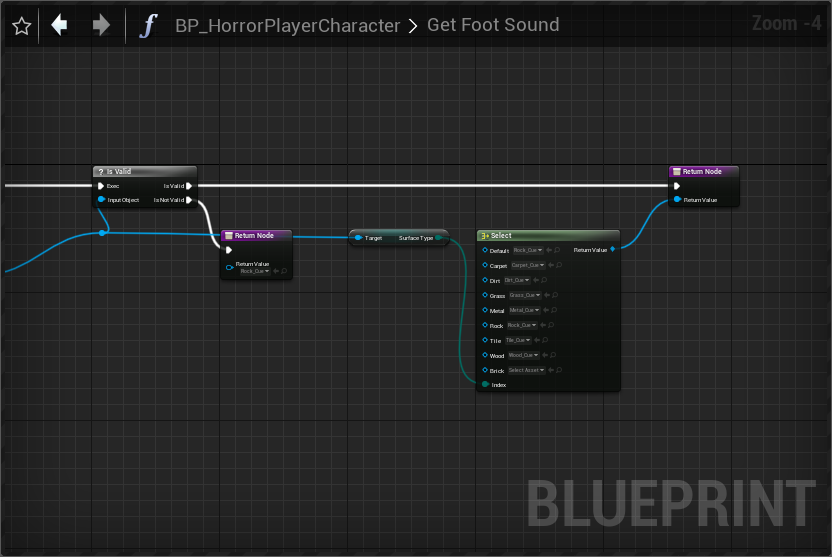

- [ ] [커스텀 애니메이션 노드 만들기](https://www.unrealengine.com/ko/blog/creating-custom-animation-nodes) 만들어 놓은 코드랑 비교해서 정리하기...
- [ ] DirectX 관점으로, 캐릭터 애니메이션이 어떻게 작동하는지, 정리하기...
- [ ] [AnimGraph는 코딩할 수 없으므로 CPP에서 애니메이션 블렌딩을 실행 할 수 없습니다.](https://forums.unrealengine.com/t/blend-two-animations-in-c/466229)

<details><summary>그림의 떡</summary>
<div markdown="1">

* [Using Control Rig in Unreal Engine](https://www.youtube.com/watch?v=y2WzNvJZk0E)

* [Animating with the Control Rig Sample Project](https://www.youtube.com/watch?v=SIp4vFoU_d8)

* [Animation Bootcamp : An Indie Approach to procedural Animation](https://www.youtube.com/watch?v=LNidsMesxSE)

* [IK Rig : procedural pose animation](https://www.youtube.com/watch?v=KLjTU0yKS00)

* [Making the believable horeses of 'Red Dead Redemption II'](https://www.youtube.com/watch?v=8vtCqfFAjKQ)

* [Generalizing Locomotion Style to New Animals With Inverse Optimal Regression](https://grail.cs.washington.edu/projects/inverse_locomotion/paper/animal_motion_joint_inverse.pdf)

* Rune Skovbo Johansen의 "Automated Semi-Procedural Animation for Character Locomotion'

* [How to share 1 animation between 2 skeletons](https://forums.unrealengine.com/t/how-to-share-1-animation-between-2-skeletons/232893/2)

[Interaction with IK](https://www.reddit.com/r/Unity3D/comments/pz6j39/made_an_ik_interaction_tool_it_takes_only_two/)

* [NDC 프로젝트 DH의 절차적 애니메이션 시스템](http://ndcreplay.nexon.com/NDC2017/sessions/NDC2017_0026.html#k%5B%5D=%EC%95%A0%EB%8B%88%EB%A9%94%EC%9D%B4%EC%85%98)
* [NDC 프로젝트 DH의 절차적 애니메이션 시스템2](http://ndcreplay.nexon.com/NDC2018/sessions/NDC2018_0042.html#k%5B%5D=%EC%95%A0%EB%8B%88%EB%A9%94%EC%9D%B4%EC%85%98)

</div></details>

## 스켈레탈 메쉬와 캐릭터

<details><summary>TPose vs APose</summary>
<div markdown="1">

TPose로 포즈를 맞출 경우, 보다 편하게 애니메이션의 리타겟팅을 적용할 수 있습니다.

* 유니티와 Mixamo는 TPose를 사용합니다.
* 회사에서 작업할 때, 모든 작업은 일괄적으로 수행할 수 있어야 합니다.

APose는 리타겟팅이 힘든 면이 있습니다. 이는 기본 APose의 모양에 맞게 캐릭터의 리타겟팅 포즈를 맞춰야 하기 때문입니다.

* APose는 만드는 사람마다 포즈가 다른 경우가 많습니다.

</div></details>

## Anim Bluepirnt (애님 블루프린트)

* **Anim Instance에서 Anim Instance를 불러올 수도 있습니다.**

<details><summary>애니메이션에서 Trace</summary>
<div makrdown="1">

Anim Graph가 멀티스레드를 이용한 업데이트가 아닐 경우 멀티 쓰레드에서 안전하지 않은 함수는 호출할 수 없습니다.

따라서 Trace함수는 호출할 수 없습니다. **애니메이션을 업데이트 할 떄 멀티 쓰레드를 이용한 업데이트는 필수라고 생각하므로 Trace를 적용할 다른 방법이 필요합니다.**

</div></details>

## 애니메이션 시퀀스

<details><summary>Animation Retargeting(애니메이션 리타겟팅)</summary>
<div markdown="1">

리타겟팅 할 때, Retargeting Base pose를 가능한 비슷하게 만들어야 합니다.

* 인간형 릭은 바꿨을 떄 한번은 확인을 해야합니다. 본이 제대로 설정되어있는지, 본 리타겟팅 모양을 제대로 설정했는지 등을 말입니다. 이는 적용되어 있는지 안알려 주기 때문입니다. 반드시 포즈 숨김, 포즈 보기로 정상적으로 적용되었는지 확인해야 합니다.

</div></details>

<details><summary>Morph target</summary>
<div markdown="1">

[스태틱 메시 모프 타깃](https://docs.unrealengine.com/4.27/ko/WorkingWithContent/Types/StaticMeshes/MorphTargets/)

Morph target은 기본 형태에서 목표 형태로 메시를 변형(deform)시키는 수단입니다. 보통 애니메이션 시스템의 일부로써 스켈레탈 메시와 함께 사용되나, 스태틱 메시도 모프 타깃을 사용하여 변형시킬 수 있습니다.

**Morph Target(모프 타겟)이란 일정한 방식으로 변형되어 버린 특정 메시의 버텍스 위치에 대한 스냅샷을 말합니다.** 예를 들어 캐릭터 모델을 선택하여, 그 얼굴 모양을 바꿔 얼굴 표정을 만든 다음, 그 수정된 버전을 모프 타깃으로 저장합니다. 언리얼에서 그 모프 타깃으로 블렌딩하여, 캐릭터의 얼굴이 그 표정을 짓도록 만들 수 있습니다. 모프 타깃은 FBX를 통해 언리얼로 임포트되며, 애니메이션 시퀀스 안에서 캡슐화됩니다.

[FBX 모프 타깃 파이프라인](https://docs.unrealengine.com/4.27/ko/WorkingWithContent/Importing/FBX/MorphTargets/)

</div></details>

## 애니메이션 노티파이 (Animation Notify)

[애니메이션 노티파이](https://docs.unrealengine.com/4.27/ko/AnimatingObjects/SkeletalMeshAnimation/Sequences/Notifies/)

애니메이션 프로그래머는 Animation Notification (애니메이션 노티파이), 또는 AnimNotify (애님 노티파이), 줄여서 그냥 Notify (노티파이)를 통해 **애니메이션 시퀀스 도중의 특정 지점에 이벤트가 발생하도록 구성할 수 있습니다.** 

노티파이는 걷기나 달리기 도중의 발소리같은 이펙트 추가 및 애니메이션 도중 파티클 시스템을 스폰시키는 데 주로 사용됩니다. 하지만 커스텀 노티파이 유형으로 시스템을 확장시켜 어떤 유형의 게임 요구에도 맞출 수 있기에 다른 식으로도 얼마든지 사용할 수 있습니다.

* 노티파이 만들기 정석은 노티파이 관리에 있는 걸 추가해야 합니다. 이는 노티파이를 삭제해도, 노티파이 관리에 남아있기 때문에 정리할려면 관리탭을 봐야합니다.

<details><summary>애니메이션 노티파이 네이티브 선언</summary>
<div markdown="1">

클래스의 선언은 다음과 같이 이루어 집니다.

```cpp
#include "Animation/AnimNotifies/AnimNotify.h"

UCLASS()
class UNewAnimNotify : public UAnimNotify
{
    GENERATED_BODY()

public:
    virtual FString GetNotifyName_Implementation() const override;
private:
    virtual void Notify(USkeletalMeshComponent* MeshComp, UAnimSequenceBase* Animation) override;
}
```

</div></details>

<details><summary>캐릭터 애니메이션에 커스텀 노티파이 설정하기</summary>
<div markdown="1">

노티파이에서 설정할 변수를 정의합니다.

```cpp
USTRUCT(BlueprintType)
struct FIRSTPERSON_HORROR_API FFootHitData
{
	GENERATED_BODY()

public:
	UPROPERTY(EditANywhere, BlueprintReadWrite)
	FName SocketName;

	UPROPERTY(EditAnywhere, BlueprintReadWrite)
	float Multifly;
	
	UPROPERTY(VisibleAnywhere, BlueprintReadWrite)
	FHitResult HitResult;

	UPROPERTY(VisibleAnywhere, BlueprintReadWrite)
	bool IsHit;
};
```

Anim notify에서 캐릭터로 통신할 인터페이스를 작성합니다.
```cpp
...
/**
 * 
 */
class FIRSTPERSON_HORROR_API ICharacterFootHit
{
	GENERATED_BODY()

	// Add interface functions to this class. This is the class that will be inherited to implement this interface.
public:
	UFUNCTION(BlueprintCallable, BlueprintNativeEvent)
	void CallFootStrike(const FFootHitData& FootHitEvent);
	virtual void CallFootStrike_Implementation(const FFootHitData& FootHitEvent) {}
};

```

AnimNotify를 만든 후, 호출하도록 만듭니다.


애니메이션에 Notify를 설정합니다.


</div></details>

## 애니메이션 노티파이 스테이트 (Animation Notify State)

Anim Notify State (애님 노티파이 스테이트), 또는 Notify State (노티파이 스테이트)는 위의 표준 노티파이와 비슷합니다. 다른 점은 begin(시작), tick(틱), end(끝) 세 개의 이벤트가 있습니다. 

단순히 시작해서 노티파이 시작과 끝 지점에 발동되고, 애니메이션에서 시간이 다가왔을 때 그 안의 이벤트 그래프 가 발동됩니다. 틱은 끝 이벤트에 도달할 때까지 모든 애니메이션 업데이트를 발동합니다. 

보통 노티파이와 노티파이 스테이트와 큰 차이점은, 자체 독립적인 블루프린트 라는 점입니다.

* 애님 노티피 스테이트는 오버랩과 마찬가지로 시작과 끝을 반드시 보장해줍니다.
* 노티파이 스테이트는 가능한 몽타주에서 호출하지 말고, 원본 애니메이션에 두도록 합니다.

<details><summary>애니메이션 노티파이 스테이트 네이티브 선언</summary>
<div markdown="1">

클래스의 선언은 다음과 같이 이루어 집니다.

```cpp
#include "Animation/AnimNotifies/AnimNotifyState.h"

UCLASS()
class ..._API UMyAnimNotifyState : public UAnimNotifyState
{
    GENERATED_BODY()
    ...
}
```

</div></details>

## 컨트롤 리그 (Control Rig)

[Control Rig](https://docs.unrealengine.com/4.27/en-US/AnimatingObjects/SkeletalMeshAnimation/ControlRig/)

Control Rig 는 노드 기반 리깅 시스템으로, 리거와 애니메이터에게 아티스트 친화적인 인터페이스를 통해 유연하고 역동적이며 절차적인 캐릭터를 생성할 수 있는 도구를 제공합니다. 

캐릭터에 대한 사용자 정의 컨트롤을 만들고 조작할 수 있고, 시퀀서 에서 애니메이션을 적용할 수 있으며, 기타 다양한 애니메이션 도구를 사용하여 애니메이션 프로세스를 지원할 수 있습니다.

* Rig는 조작하다의 의미를 가지고 있습니다. 이미지로는 낚시줄입니다.
* 조작할 수 있는 것과 잘만드는 것은 다르다는 것을 알고 **애니메이터를 신뢰합시다.**
* Message Log / Control RIg Python Log를 통해서 파이썬 명령어를 볼 수 있습니다. 

<details><summary>Control Rig의 Solve</summary>
<div markdown="1">

**forward solve는 시퀀서 및 애니메이션 블루프린트 내에서 사용됩니다.** **backward solve는 애니메이션 시퀀스의 애니메이션을 Control Rig에 굽는데 사용됩니다.** Setup Event는 Control Rig의 초기화 후 한번 실행됩니다.

Control Rig Editor에서는 캐릭터에 대한 사용자 정의 컨트롤, 채널 및 기타 조작기를 만들 수 있습니다. 리그를 만든 후에는 **시퀀서와 같은 Unreal Engine의 다른 영역 내에서 이러한 컨트롤을 에니메이션화 할 수 있습니다.**

* Control Rig를 이용해서 Unreal에서 Animation을 만들 수 있습니다.
* **AnimBlueprint에서 ControlRig로 호출할 수 있습니다. 이를 이용해 보다 자연스로운 애니메이션을 만들 수 있습니다.**
* Animation을 만들 때 FK Control Rig를 이용하여 Control Rig를 만들지 않고 작업할 수 있습니다.

Control Rig의 포즈 캐싱 기능은 **컨트롤 리그 그래프에서 애니메이션 포즈를 저장하고 다른 시간에 적용하는 데 사용됩니다.**
    - AnimBlueprint의 포즈 캐싱과 비슷합니다.

</div></details>

## Skeletal Mesh Animation System (스켈레탈 메시 애니메이션 시스템)

[스켈레탈 메시 애니메이션 시스템(Skeletal Mesh Animation System)](https://docs.unrealengine.com/5.0/en-US/skeletal-mesh-animation-system-in-unreal-engine/)

언리얼 엔진의 캐릭터 애니메이션은 애니메이션을 만들기 위해 조작할 수 있는 조작된 메시인 스켈레탈 메시 를 기반으로 구축됩니다. 또한 애니메이션 블루프린트 를 스켈레탈 메시로 확장하여 레벨 내에서 애니메이션 동작과 상호작용을 제어하는 ​​로직을 적용할 수 있습니다.

언리얼 엔진은 스켈레탈 메시와 함께 작업하여 애니메이션을 더욱 향상시킬 수 있는 다양한 애니메이션 도구를 제공합니다. 이 페이지에서는 이러한 기본 시스템에 대한 개요를 제공합니다.

<details><summary>Mixamo Base mapping cheat sheet</summary>
<div markdown="1">

* 휴머노이드 컨트롤 리그를 이용합니다.

|UE|MixAmo|	
|---|---|	
|Root					|None				|
|Pelvis					|Hips				|
|spine_01				|Spine				|
|spine_02				|Spine1				|
|spine_03				|Spine2				|
|---|---|			
|clavicle_l				|LeftShoulder		|
|UpperArm_L				|LeftArm			|
|lowerarm_l				|LeftForeArm		|
|Hand_L					|LeftHand			|
|---|---|			
|clavicle_r				|RightShoulder		|
|UpperArm_R				|RightForeArm		|
|lowerarm_l				|LeftForeArm		|
|Hand_R					|RightHand			|
|---|---|			
|neck_01				|Neck				|
|head					|Head				|
|---|---|			
|Thigh_L				|LeftUpLeg			|
|calf_l					|LeftLeg			|
|Foot_L					|LeftFoot			|
|---|---|			
|Thigh_R				|RightUpLeg			|
|calf_r					|RightLeg			|
|Foot_R					|RightFoot			|
|---|---|			
|index_01_l				|LeftHandIndex1		|
|index_02_l				|LeftHandIndex2		|
|index_03_l				|LeftHandIndex3		|
|middle_01_l			|LeftHandMiddle1	|
|middle_02_l			|LeftHandMiddle2	|
|middle_03_l			|LeftHandMiddle3	|
|pinky_01_l				|LeftHandPinky1		|
|pinky_02_l				|LeftHandPinky2		|
|pinky_03_l				|LeftHandPinky3		|
|ring_01_l				|LeftHandRing1		|
|ring_02_l				|LeftHandRing2		|
|ring_03_l				|LeftHandRing3		|
|thumb_01_l				|LeftHandThumb1		|
|thumb_02_l				|LeftHandThumb2		|
|thumb_03_l				|LeftHandThumb3		|
|lowerarm_twist_01_l	|None				|
|upperarm_twist_01_l	|LeftArm			|
|---|---|			
|index_01_r				|RightHandIndex1	|
|index_02_r				|RightHandIndex2	|
|index_03_r				|RightHandIndex3	|
|middle_01_r			|RightHandMiddle1	|
|middle_02_r			|RightHandMiddle2	|
|middle_03_r			|RightHandMiddle3	|
|pinky_01_r				|RightHandPinky1	|
|pinky_02_r				|RightHandPinky2	|
|pinky_03_r				|RightHandPinky3	|
|ring_01_r				|RightHandRing1		|
|ring_02_r				|RightHandRing2		|
|ring_03_r				|RightHandRing3		|
|thumb_01_r				|RightHandThumb1	|
|thumb_02_r				|RightHandThumb2	|
|thumb_03_r				|RightHandThumb3	|
|lowerarm_twist_01_r	|None				|
|upperarm_twist_01_r	|RightArm			|
|---|---|
|calf_twist_01_l		|LeftLeg			|
|ball_l					|LeftToeBase		|
|thigh_twist_01_l		|LeftUpLeg			|
|---|---|
|calf_twist_01_r		|RightLeg			|
|ball_r					|RightToeBase		|
|thigh_twist_01_r		|RightUpLeg			|
|---|---|
|Other|None|

</div></details>

## 캐릭터 애니메이션

애님 블루프린트와 상태 머신을 결정 하는 기준을 나누기 애매하지만, 결론은 없다. 가능한 편한 용도로 사용하는 것 입니다.

애님 블루프린트에서도, 하위 애님블루프린트로도 할 수는 있지만, 몽타주를 활용 하여 예를 들어 주문을 외우고 주문을 사용하는 모션을 하나로 만들고, 공통된 규칙으로, 재활용 하는 것이 복잡함을 줄일 수 있습니다.

상태는 로코모션의 상태(걷는, 가만히 있는)를 나타내지만, 몽타주는 움직이지 않는, 무시하고 재생하는 애니메이션이니 (재장전, 주문 외우기) 몽타주로 재생한다.

몽타주를 상태 머신에 추가하면, 심각하게 상태가 복잡해집니다.

분기로 나눠질 수 있는 애니메이션인 경우에는, Anim Blueprint를 이용하도록 합시다.

* **가깝지만 먼 훗날 모션 캡쳐와 모션 매칭이 상용화 되기를 기다립니다.**

**만들 때 기억해야될 내용으로는**

* **애니메이션 처음 만드는 사람이, 정교하게 애니메이션을 만든다고, 게임이 재미있어지지 않습니다.**
* **대부분의 애니메이션은 서로 섞이지 않습니다.**
* 어렵다 생각하기 보다 쉽게쉽게 생각하면, 사용할 수 있습니다.
* 잘 분리하고 프로그래밍하는 것이 정말 잘하는 것입니다.
    - **장기적으로 기능이 미친듯이 들어가면, 잘라서 작업 할 수밖에 없습니다.**
    - 개발 당시에는 잘 모르지만, 정말 전체적으로 큰 시선으로, 이런일이 앞으로 벌어질꺼다 예측하는 능력좋은 개발 팀장을 만날 확률은 거의 제로입니다.
* 잘 모르겠으면, 노티파이는 원본 애니메이션에다가 하는 것이 좋습니다.
    - 노티파이가 호출되지 않아, 정상적으로 처리되지 않는 경우가 있습니다.
* 만약에 어떤 상황이 벌어질지, 오만가지 상황을 염두에 둬야합니다.
* 애니메이션을 만들고 싶어도, 맞는 애니메이션이 있는지 아는게 더 중요합니다.
* 애니메이션도 그렇고 게임은 자연스럽게 만드는 것이 가장 중요합니다.
* 게임을 만들 때, 대부분 이벤트를 애니메이션 중에 발생시킵니다.

**고려해야할 버그들로는**

* 로아의 경우, 애니메이션 발생의 취소와 틱타임이 꼬여서 생긴게 있습니다. 스킬을 쓰고 취소하면 1초 쿨, 스킬을 다쓰면 쿨이 도는 시스템. 누르고 있다가 나가자 마자 취소하면서, 스킬을 안쓴 것으로 처리되어 버그가 발생했습니다. 이는 블렌드되면서 노티파이가 발생하지 않아서 였습니다.
* 엘든링이 잘만든 것은, 래버를 당기는 애니메이션, 상자를 드는 애니메이션 하나가지고 여러곳에서 사용함.

<details><summary>모션에 대한 이해</summary>
<div markdown="1">

* 애니메이션의 선행 동작이 있을 때, 마우스를 누르고 때는 점을 생각해볼 수 있습니다.

* FPS에서 모든 총은 누르자 마자 나갑니다.
    - 누르자 마자 나간다는 것은 누르는 타이밍에 총알이 나간다는 것을 의미합니다.
    - 화살 같은 경우에는 누르는 타이밍이 아니라 활 시위를 당기는 (특정 애니메이션)이 있고, 그 다음에 나갑니다. 선행하는 애니메이션이 있다는 의미입니다.

</div></details>

<details><summary>신비 캐릭터 구현 예시</summary>
<div markdown="1">


**Ground Locomotion**

신비의 지면 운동은 Idle, (JogStart, Run, JogStop)의 상태를 가집니다. 

**변수에 대해서**

1. IsInAir는 공중에 있는지 나타내는 변수입니다.
2. IsAccelerating는 최근에 캐릭터 무브먼트 컴포넌트가 가속받았는지 나타냅니다.
3. Speed는 캐릭터의 이동속도를 나타냅니다.

**애니메이션에 대해서**

1. Idle은 멈춰있는 상태를 의미합니다. 여기서 Idle은 대기 애니메이션을 재생하는 것으로 설정되어 있습니다.
    - Idle은 JogStart로 트랜시션 될 수 있습니다. 속도가 있고, 하늘에 있는 상태가 아니며, 가속받는 상태여야 합니다. 
    1. 공중에 있지 않아야 달릴 수 있다는 것은 꽤 당연합니다.
    2. 속도가 0이상이고 가속되고 있을 때, 달리기를 시작합니다.
2. JogStart는 Jog를 자연스럽게 하기위한 상태입니다. 임시 상태로 **루프 애니메이션이 아닙니다.**
    - JogStart는 자연스럽게 Run으로 트랜시션됩니다.
3. Run은 상태입니다. **자연스럽게 회전하기 위해, 블렌드 2D를 이용합니다.** 
    - 여기서 경사 높이에 따라, 회전하는 애니메이션이 있습니다. 하지만, Slop을 결정하는 변수는 들어가 있지 않습니다.
    - 가속되지 않을 경우, JogStop으로 들어갑니다.
4. JogStop은 자연스럽게 멈추기 위한 상태입니다.
    - JogStop애니메이션에서 자연스럽게 Idle로 가거나, 가속될 때 Idle을 거쳐 조건 JogStart로 가게 됩니다.

* 상태를 어떻게 가지고 나눌지는 의도하고 만들지에 결정됩니다.

**Aim**

1. 신비의 Aim을 보면, Anim Instance에서 Base Aim 로테이션과 Actor의 로테이션 사이의 델타를 구해, Raw, Pitch 변수를 구합니다.
2. 애니메이션에 Aim을 적용시킵니다.

* 이때 Aim은 위아래(Pitch)는 45도 까지 바라보고, 넘어가면 다시 정면으로, 양 옆(Yaw)는 90도 까지 바라보고, 넘어가면 다시 정면으로 보도록 만들어져 있습니다.

* **AimOffset은 AdditiveAnimation으로 되어있습니다.** [공식문서에 따라](https://docs.unrealengine.com/4.27/ko/AnimatingObjects/SkeletalMeshAnimation/AnimHowTo/AimOffset/) Asset Action/Bulk Edit via Property Matrix에서 Additive Setting을 해줘야 합니다. 
    - **애니메이션이 에임 오프셋과 호환되도록 하려면, 애디티브 애님 유형이 메시 스페이스 를 사용하도록 설정되어 있어야 합니다.**
    - **Asset Detail에서도 바꿀 수 있습니다.** 이에 따라, BasePose에서 Offset을 더할 수 있습니다.

[1.](/images/AnimationCharacter_Aim_RollPitchYaw.png)
[2.](/images/AnimationCharacter_Aim_Apply.png)
[3.](/images/AnimationCharacter_Aim_AdditiveSetting.png)

**Jump**

점프는 뛰기 시작하는 단계와, 꼮대기에 도달하는 상태, 그리고 착지하기 전의 애니메이션으로 나뉩니다. 모든 애니메이션은 루프가 아니고, Preland상태를 목적지로 자연스럽게 블렌드 됩니다.

1. JumpStart 상태는 뛰기 전에 자연스럽게 하는 상태로 루프가 아닙니다.
    - JumpStart 애니메이션이 재생되고, 자연스럽게 JumpApex 애니메이션으로 블렌드 됩니다.
    - 여기서 점프가 되지 않았다면(WasJumping) 바로 Apex로 넘어갈 수 있습니다. 이는 높은 곳에서 떨어질 때 보다 자연스러울 수 있습니다.
2. JumpApex(Apex는 꼭대기) 상태는 꼭대기에 다다르는 것을 의미합니다.
    - Jump_Preland로 자연스럽게 넘어갑니다.
3. Jump_Preland 상태는 지면에 착지함을 나타냅니다.

지면에 착지하는 애니메이션은 로코모션에 구현되어 있습니다.

**Locomotion**

로코모션은 가만히 있거나, 띄는 상태, 뛰는 상태, 착지하는 상태로 나눠집니다.

1. Idle/Jogs는 Ground Locomotion 캐시를 재생합니다.
    - 공중에 있을 때 Jumps상태로 블렌드 됩니다.
    - 점프로 가는 애니메이션은 매우 짧은 Duration을 가지고 있습니다. 이떄 Duration을 늘리면, 뛰는 모션이 살짝 부자연스러워 지고, 대신 블랜드 되면서 덜 튀게 됩니다.
2. Jumps는 Jump 상태머신을 이용합니다.
    - 공중에 있지 않다면 Jump_Land 상태로 넘어갑니다.
3. Jump_Land는 착지하는 상태로, 애디티브 애니메이션을 이용해서 Idle/Jogs상태로 동적으로 자연스럽게 블렌드 합니다. 
    - Idle/Jogs가 상태이므로 다른 애니메이션을 가질 수 있는데 이를 자연스럽게 더 할 수 있게 됩니다.
    - 애니메이션이 종료되면 자연스럽게 Idle/Jogs로 갑니다.
    - 만일 공중에 있다면 Idle상태를 통과하여 다시 Jumps상태로 넘어가게 됩니다.

**Combo**

콤보는 왼쪽 마우스 버튼으로 시작해서, 애니메이션 노티파이를 통해서 콤보를 연결시킵니다.

**공격모션의 동작**

간략하게 설명하면, 공격하기로 하면(IsAttack) 먼저 첫번째 기본 공격 애니메이션을 재생합니다. 

그후 또 공격을 누르면(공격중인 상태에서 공격을 하면) 공격을 저장(SaveAttack)합니다.

**애니메이션의 재생**

애니메이션은 SaveAttack에 따라서 다음 모션을 재생시킬 목적의 Notify와 공격 모션을 초기화할 목적의 ResetCombo 노티파이가 있습니다.

노티파이는 애님 인스턴스에서 처리되어 신비 캐릭터의 메서드를 호출합니다.

**콤보의 연결**

콤보를 연결하는 ComboAttackSave 이벤트는 AttackCount로 스위치 합니다. 0일 때는 1로 증가시키고, 첫번째 공격 모션을, 1일 때는 2로 증가시키고, 두번째 공격 모션을, 2일 때는 0으로(연속적으로 공격할려고 했나 봅니다.) 공격모션을 이동시킵니다.

ComboAttackSave에서 콤보 공격을 하지 않는다면(SaveAttack이 false여서) 다음번 공격으로 넘어가지 않습니다.

콤보가 종료되면, AttackCount를 0으로, SaveAttack을 false인 기본값으로 설정 후, 공격중을 취소(IsAttacking = false)합니다.

**Cloth & Hair**

메시에서 클로드 툴을 이용해서 작업합니다. 자세한 내용과 기능은 [클로딩 툴](https://docs.unrealengine.com/4.27/ko/InteractiveExperiences/Physics/Cloth/Overview/)에서 볼 수 있습니다.

* 디자이너의 도움이 필요합니다.

</div></details>

<details><summary>Blend</summary>
<div markdown="1">

애니메이션(예를 들어 몽타주)을 특정 본들만 적용하기 위해서 사용합니다.

[Blend](https://docs.unrealengine.com/4.27/en-US/AnimatingObjects/SkeletalMeshAnimation/NodeReference/Blend/)

**Layered Blend Per Bone에서 Blend Depth란 본의 계층구조에서 블렌드를 어떻게 할지를 결정합니다.**

[What does the ‘Blend Depth’ parameter in ‘Layered Blend Per Bone’ do?](https://forums.unrealengine.com/t/what-does-the-blend-depth-parameter-in-layered-blend-per-bone-do/350231)


* Pelvis에서 Blend Depth를 0으로 설정하면, 모든 본에 블렌드가 바로 적용되게 됩니다.
* Blend Depth가 양수인 경우 하위 본까지 부드럽게 블렌드됨을 의미합니다.   
* Blend Depth4의 경우 Spine1 25%, Spine2 50%, Spine3 75%, Shoulder 100%, UpperArm 100%, ...식으로 적용됨을 의미합니다.    
* Blend Depth가 -1(음수)은 이 본부터 하위본까지 블렌드를 적용시키지 않음을 의미합니다.    

**몽타주를 이용한 방법**

[애니메이션 몽타주 사용법](https://docs.unrealengine.com/4.27/ko/AnimatingObjects/SkeletalMeshAnimation/AnimMontage/UserGuide/)

코드에서 PlayMontage를 이용해 애니메이션을 재생시킬 수 있습니다. 이때 몽타주 슬랏을 이용해, 애님 인스턴스에 설정할 수 있습니다.

* 몽타주의 전체 재생 시간보다 blend 시간을 압도적으로 짧게 잡아야 합니다. 그렇지 않으면 blend 하는 사이에 애니메이션이 끝나 결과적으로 애니메이션이 재생되지 않는 것처럼 보입니다.

**포즈 캐시를 이용한 방법**

Cache pose(캐시 포즈)는 애니메이션 포즈를 기억하고, 다른 곳에서 사용할 때 블렌드 할 수 있습니다.

</div></details>

<details><summary>점프 위치</summary>
<div markdown="1">

[Unreal engine Jump prediction](https://www.youtube.com/watch?v=pL-k4a7opWk)

1. 시뮬레이션 해서 떨어지는 포지션을 구합니다.
2. 떨어지는 위치를 구했다면, 애니메이션과 바인딩 해서 사용할 수 있습니다. 

* 캐릭터의 콜리전이 캡슐이므로 캡슐을 시뮬레이션합니다.

</div></details>

<details><summary>캐릭터 발의 위치</summary>
<div markdown="1">

캐릭터는 발로 지면을 딛고 서있습니다. 땅 아래로 가거나 허공에 떠있다면 이는 이상하다고 느낄 것 입니다.

[IK를 이용한 걷는 애니메이션](https://www.youtube.com/watch?v=c4-KYbYyxhg)

가장 간단하게 사용되는 방법으로, **조정할 발 위치를 가져와 해당 발위치에 가도록 조정하는 방법이 있습니다.**

1. 발이 위치해야할 좌표 정보를 구합니다.
2. 발의 위치가 해당 위치로 가도록 조정합니다.

* Location.Z 좌표성분을 이용하는 이유는, 발이 지면을 통과하거나 허공에 떠있는 문제를 해결하는데 주요 관심이 있기 때문입니다. 일반적으로 걷을 때 발은 포물선을 그리면서 이동한다고 할 수 있는데, 포물선의 모양이 변형된 평면으로 이동하게 됩니다.
* 포물선 모양을 변형하기 위하여, 발의 오프셋은 애니메이션의 z값과 지면의 z값을 이용해서 발위치를 수정합니다. 

위의 방법은 고르지 않은 평면에서 문제를 일으킵니다. 발이 지면을 따라 위아래로 흔들릴 것 입니다. 그렇다면 다음번에 있어야할 발의 위치를 안다면, 처음부터 부드럽게 이동하도록 할 수 있습니다.

</div></details>

<details><summary>캐릭터의 발소리</summary>
<div markdown="1">

발로 걷는 캐릭터가 있습니다. 발은 여러개일 수 있습니다. 캐릭터가 움직일 때 발을 사용합니다. 발은 움직이며 지면에 닿을 때 발소리가 납니다. 이 현상은 대부분의 사람들이 몰라도, 알고있습니다. **따라서 몰입을 위한 자연스러움에서 발소리가 나야합니다.**

* 땅에 떨어지는 상황에서의 발소리는 첫번째 발은 크게 소리가 나고, 왼쪽 발은 보다 작은 소리가 날 수 있습니다.

1. 스켈레톤 노티파이를 이용하여 애님 블루프린트에 알림
2. 커스텀 노티파이를 이용하여 알림

1에 대해 스켈레톤 노티파이를 이용하면, 별도의 작업 없이, 엔진의 알림을 이용하여 작업할 수 있다는 장점이 있습니다. 하지만 애님 블루프린트를 통해 구현되며, 캐릭터 애니메이션에 따라 스케일이 달라지는 경우, 복잡해 집니다.

2에 대해 커스텀 노티파이에 애니메이션에서 발소리에 대한 정보를 담아, 직접 캐릭터에 발소리를 내도록 할 수 있습니다. 애님 블루프린트에 구현을 분리할 수 있습니다.

</div></details>

<details><summary>피직스 머티리얼에 따른 발소리 다르게 하기</summary>
<div markdown="1">

피직스 머티리얼에 따라 다르게 하거나, 피직스 머티리얼의 서페이스 타입에 따라 다르게 할 수 있습니다. 다른 방법으론, 피직스 머티리얼에 함수를 구현하거나 변수를 추가하여 사용할 수 있지만, 선택은 필요에 의해 정해집니다.

아래의 예시는 캐릭터가 피직스 머티리얼의 서페이스 타입에 따라 다른 사운드 클래스를 내도록 했습니다.


</div></details>

<details><summary>캐릭터 애니메이션 잔상 효과</summary>
<div markdown="1">

[잔상 효과](https://mingyu0403.tistory.com/247)

1. 애니메이션 되는 스켈레탈 메쉬의 포즈를 새로 스폰된 포즈어블 메쉬에 포즈로 설정합니다.
2. 노티파이로 애니메이션 효과를 보여줄 수 있습니다.

</div></details>
