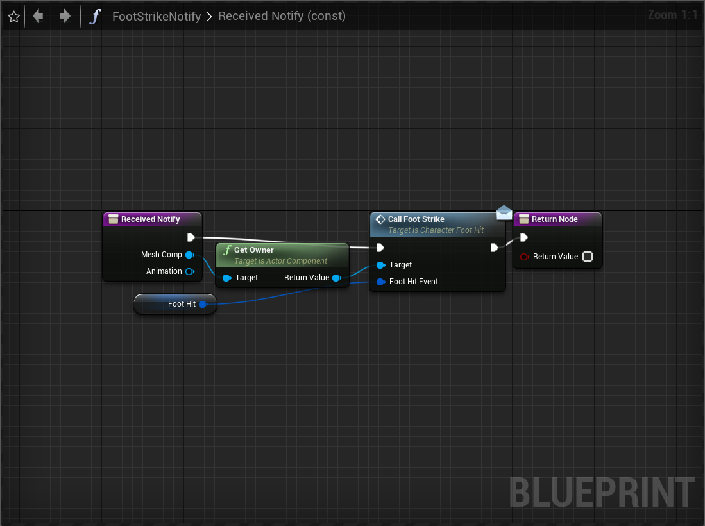
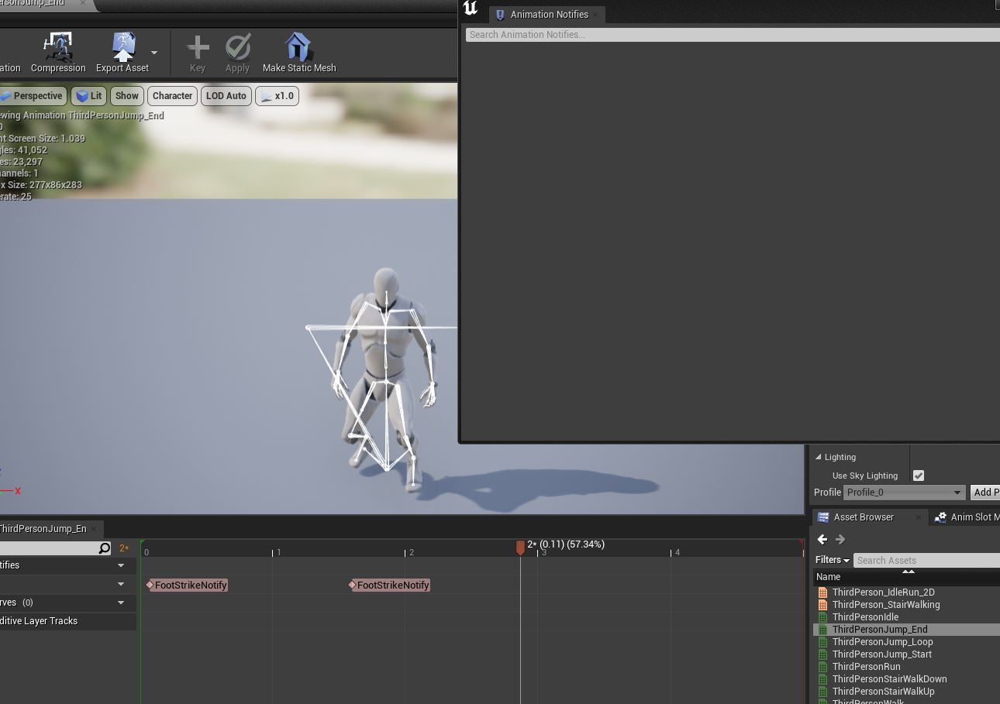

- [ ] 캐릭터 무브먼트 컴포넌트
- [ ] 캐릭터가 지면에 착지할 때
- [ ] UE-4.27.2 환경에서, 머티리얼 오버라이드의 경우, 레이 캐스트할 때, 컴플렉스 콜리전의 경우 적용되지 않습니다. 머티리얼 오버라이드의 경우, 심플 콜리전에 대해서만 작동하는 것으로 보입니다. 확인이 필요합니다. 또한 머티리얼에 피직스 머티리얼을 이용하는 경우, 이를 가져오기 위해서는 컴플렉스 레이 캐스트를 이용해야 가져올 수 있습니다. 현재 생각은 이름에 오해의 소지가 있고, 레이 캐스트가 컴플렉스에 따라 다른 성격을 고려했을 때, 콜리전 타입에 있는 피직스 머티리얼에 접근하는 것과, 폴리곤에 있는 피직스 머티리얼에 접근하는 것으로, 명확한 것으로 생각됩니다. 코드에서 확인이 필요합니다.

## 캐릭터의 발소리
> 발로 걷는 캐릭터가 있습니다. 발은 여러개일 수 있습니다. 캐릭터가 움직일 때 발을 사용합니다. 발은 움직이며 지면에 닿을 때 발소리가 납니다. 이 현상은 대부분의 사람들이 몰라도, 알고있습니다.
> 따라서 몰입을 위한 자연스러움에서 발소리가 나야합니다.

* 땅에 떨어지는 상황에서의 발소리는 첫번째 발은 크게 소리가 나고, 왼쪽 발은 보다 작은 소리가 날 수 있습니다.

<details><summary>발소리를 내기위한 방법들</summary>
<div markdown="1">

1. 스켈레톤 노티파이를 이용하여 애님 블루프린트에 알림
2. 커스텀 노티파이를 이용하여 알림

1에 대해 스켈레톤 노티파이를 이용하면, 별도의 작업 없이, 엔진의 알림을 이용하여 작업할 수 있다는 장점이 있습니다. 하지만 애님 블루프린트를 통해 구현되며, 캐릭터 애니메이션에 따라 스케일이 달라지는 경우, 복잡해 집니다.

2에 대해 커스텀 노티파이에 애니메이션에서 발소리에 대한 정보를 담아, 직접 캐릭터에 발소리를 내도록 할 수 있습니다. 애님 블루프린트에 구현을 분리할 수 있습니다.

</div></details>

<details><summary>캐릭터 애니메이션에 커스텀 노티파이 설정하기</summary>
<div markdown="1">

노티파이에서 설정할 변수를 정의합니다.
```cpp
USTRUCT(BlueprintType)
struct FIRSTPERSON_HORROR_API FFootHitData
{
	GENERATED_BODY()

public:
	UPROPERTY(EditANywhere, BlueprintReadWrite)
	FName SocketName;

	UPROPERTY(EditAnywhere, BlueprintReadWrite)
	float Multifly;
	
	UPROPERTY(VisibleAnywhere, BlueprintReadWrite)
	FHitResult HitResult;

	UPROPERTY(VisibleAnywhere, BlueprintReadWrite)
	bool IsHit;
};
```

Anim notify에서 캐릭터로 통신할 인터페이스를 작성합니다.
```cpp
...
/**
 * 
 */
class FIRSTPERSON_HORROR_API ICharacterFootHit
{
	GENERATED_BODY()

	// Add interface functions to this class. This is the class that will be inherited to implement this interface.
public:
	UFUNCTION(BlueprintCallable, BlueprintNativeEvent)
	void CallFootStrike(const FFootHitData& FootHitEvent);
	virtual void CallFootStrike_Implementation(const FFootHitData& FootHitEvent) {}
};

```

AnimNotify를 만든 후, 호출하도록 만듭니다.


애니메이션에 Notify를 설정합니다.


</div></details>


<details><summary>피직스 머티리얼에 따른 발소리 다르게 하기</summary>
<div markdown="1">

피직스 머티리얼에 따라 다르게 하거나, 피직스 머티리얼의 서페이스 타입에 따라 다르게 할 수 있습니다. 다른 방법으론, 피직스 머티리얼에 함수를 구현하거나 변수를 추가하여 사용할 수 있지만, 선택은 필요에 의해 정해집니다.

아래의 예시는 캐릭터가 피직스 머티리얼의 서페이스 타입에 따라 다른 사운드 클래스를 내도록 했습니다.


</div></details>