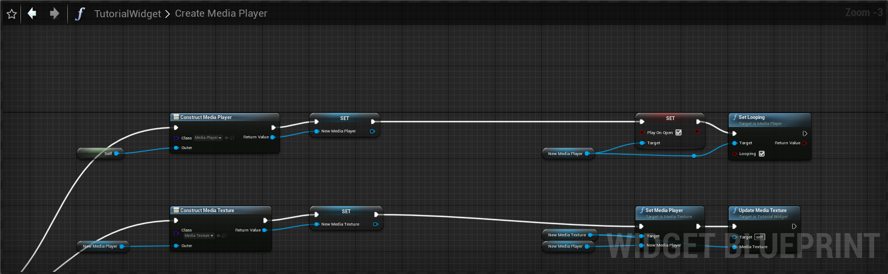
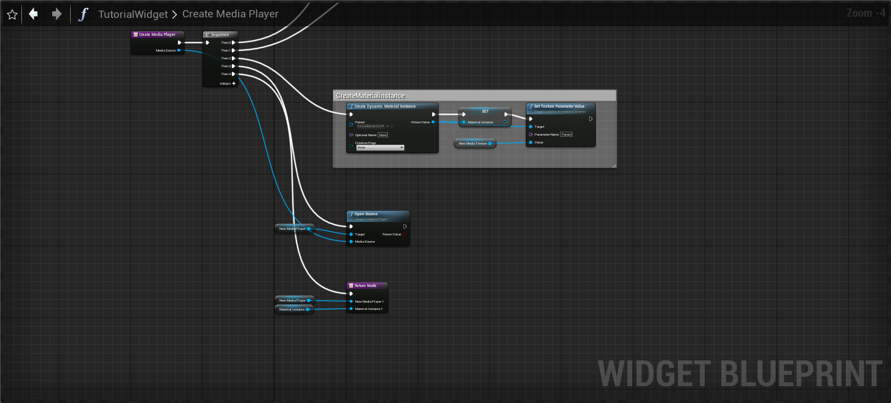

## MediaPlayer 생성하기

레벨 안에 있는 TV 든, UI 일부로써 배경이든, 심지어 전체화면이든, 레벨 안에서 비디오를 재생하려는 방법을 찾는 경우, Media Framework (미디어 프레임워크) 툴과 Media Source (미디어 소스) 애셋을 사용해야 합니다.

* [비디오 파일 재생](https://docs.unrealengine.com/4.27/ko/WorkingWithMedia/IntegratingMedia/MediaFramework/HowTo/FileMediaSource/)

미디어 프레임워크 가 필요합니다. 위의 두 가지 예제 모두 해결될 뿐만 아니라, 일반적인 미디어 재생 관련된 능력을 훨씬 많이 제공해 줍니다.

언리얼 엔진의 미덩 프레임워크는
* Engine & Slate Agnostic, 즉 엔진이나 슬레이트 어디서든 사용할 수 있습니다.
* 현지화된 오디오 & 비디오 트랙 지원이 가능합니다.
* 콘텐츠 브라우저, 머티리얼 에디터, 사운드 시스템에서 접근 가능합니다.
* 블루프린트 & UMG UI 디자이너에서 사용 가능합니다.
* 스트리밍 미디어 지원이 가능합니다.
* 빨리 감기, 되돌리기, 재생, 일시정지, 스크러빙이 가능합니다.
* 플러그가능(Pluggable) 플레이어 지원이 가능합니다.


* [미디어 프레임워크](https://docs.unrealengine.com/4.27/ko/WorkingWithMedia/IntegratingMedia/MediaFramework/)

레벨 안에 있는 TV 든, UI 일부로써 배경이든, 심지어 전체화면이든, 레벨 안에서 비디오를 재생하려는 방법을 찾는 경우, Media Framework (미디어 프레임워크) 툴과 Media Source (미디어 소스) 애셋을 사용해야 할 것입니다. 여러가지 미디어 소스 애셋 유형이 있지만, File Media Source (파일 미디어 소스) 애셋을 사용하면 (컴퓨터든 전화든 콘솔 기기든) 디바이스에 저장된 비디오 파일을 언리얼 엔진 4 (UE4) 안에서 재생할 수 있습니다.

* [미디어 프레임워크 테크니컬 레퍼런스](https://docs.unrealengine.com/5.0/ko/media-framework-technical-reference-for-unreal-engine/)
    - 현재 지원되는 파일 확장자, URL, 캡처 디바이스는 물론 다양한 플랫폼에서 Media Framework (미디어 프레임워크)를 켜는 법 관련 문제해결 팁을 개괄적으로 설명


* MediaPlayer의 OpenURL을 이용해서, 영상을 재생할 수 있습니다.

<details><summary>동적으로 미디어 번들 생성하기</summary>
<div markdown="1">

블루프린트로 구현하기 전에 `MediaAssets` 모듈을 사용할 위치에 미디어 텍스처를 업데이트 하는 코드를 추가합니다.
```cpp
    UFUNCTION(BlueprintCallable)
	void UpdateMediaTexture(UMediaTexture* mediaTexture)
	{
		mediaTexture->UpdateResource();
	}
```

* 텍스처 리소스를 업데이트를 블루프린트에서 불러올 수 있는 함수를 못찾았습니다.

동적으로 미디어 번들을 생성하는 방법은 다음과 같습니다.

1. MediaPlayer를 생성합니다. 여기서는 미디어 리소스를 설정하면 재생하고 반복하게 설정했습니다.
2. MediaTexture를 생성합니다. 생성한 미디어 플레이어를 설정하고, 미디어 텍스처의 리소스를 업데이트합니다.
3. 여기서 미디어텍스처를 UI에 보여주는 머티리얼을 생성합니다.
4. MediaSource를 미디어 플레이어로 엽니다. 1에 따라 자동으로 재생되고, 반복하게 됩니다.
5. 머티리얼 인스턴스와, 미디어 플레이어를 전달합니다.


아래는 실제 코드입니다.



</div></details>

<details><summary>에디터 미디어 번들 생성코드</summary>
<div markdown="1">

```cpp
#if WITH_EDITOR
TArray<UPackage*> UMediaBundle::CreateInternalsEditor()
{
	TArray<UPackage*> Result;

	if (GIsEditor)
	{
		IAssetTools& AssetTools = FModuleManager::Get().LoadModuleChecked<FAssetToolsModule>("AssetTools").Get();

		const FString ParentName = GetOuter()->GetName() + "_InnerAssets/";
		FString OutAssetName;
		FString OutPackageName;

		//Create MediaPlayer
		AssetTools.CreateUniqueAssetName(*(ParentName + TEXT("/MediaP_") + GetName()), TEXT(""), OutPackageName, OutAssetName);
		MediaPlayer = Cast<UMediaPlayer>(AssetTools.CreateAsset(OutAssetName, ParentName, UMediaPlayer::StaticClass(), nullptr));
		MediaPlayer->AffectedByPIEHandling = false;
		Result.Add(MediaPlayer->GetOutermost());

		//Create MediaTexture 
		AssetTools.CreateUniqueAssetName(*(ParentName + TEXT("/T_") + GetName() + TEXT("_BC")), TEXT(""), OutPackageName, OutAssetName);
		MediaTexture = Cast<UMediaTexture>(AssetTools.CreateAsset(OutAssetName, ParentName, UMediaTexture::StaticClass(), nullptr));
		MediaTexture->SetDefaultMediaPlayer(MediaPlayer);
		MediaTexture->SetMediaPlayer(MediaPlayer);
		MediaTexture->UpdateResource();
		Result.Add(MediaTexture->GetOutermost());

		//Create LensDisplacementMap RenderTarget
		AssetTools.CreateUniqueAssetName(*(ParentName + TEXT("/RT_") + GetName() + TEXT("_LensDisplacement")), TEXT(""), OutPackageName, OutAssetName);
		LensDisplacementMap = Cast<UTextureRenderTarget2D>(AssetTools.CreateAsset(OutAssetName, ParentName, UTextureRenderTarget2D::StaticClass(), nullptr));
		LensDisplacementMap->RenderTargetFormat = RTF_RGBA16f;
		LensDisplacementMap->InitAutoFormat(256, 256);
		LensDisplacementMap->UpdateResource();
		Result.Add(LensDisplacementMap->GetOutermost());

		//Create MaterialInstanceConstant
		UMaterialInstanceConstantFactoryNew* Factory = NewObject<UMaterialInstanceConstantFactoryNew>();
		Factory->InitialParent = DefaultMaterial;

		AssetTools.CreateUniqueAssetName(*(ParentName + TEXT("/MI_") + GetName()), TEXT(""), OutPackageName, OutAssetName);
		UMaterialInstanceConstant* NewMaterial = Cast<UMaterialInstanceConstant>(AssetTools.CreateAsset(OutAssetName, ParentName, UMaterialInstanceConstant::StaticClass(), Factory));
		NewMaterial->SetTextureParameterValueEditorOnly(FMaterialParameterInfo(MediaBundleMaterialParametersName::MediaTextureName), MediaTexture);
		NewMaterial->SetTextureParameterValueEditorOnly(FMaterialParameterInfo(MediaBundleMaterialParametersName::FailedTextureName), DefaultFailedTexture);
		NewMaterial->SetTextureParameterValueEditorOnly(FMaterialParameterInfo(MediaBundleMaterialParametersName::LensDisplacementMapTextureName), LensDisplacementMap);
		NewMaterial->PostEditChange();
		Material = NewMaterial;
		Result.Add(Material->GetOutermost());
	}

	//If we are creating a new object, set the default actor class. Duplicates won't change this.
	if (MediaBundleActorClass == nullptr)
	{
		MediaBundleActorClass = DefaultActorClass;
	}

	return Result;
}
#endif // WITH_EDITOR
```

</div></details>

