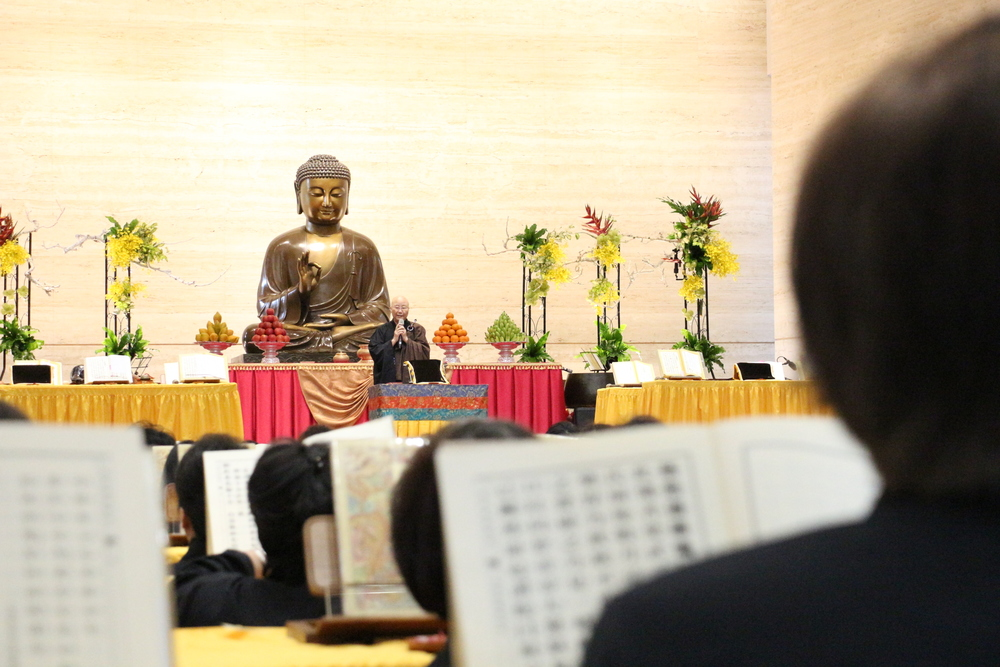
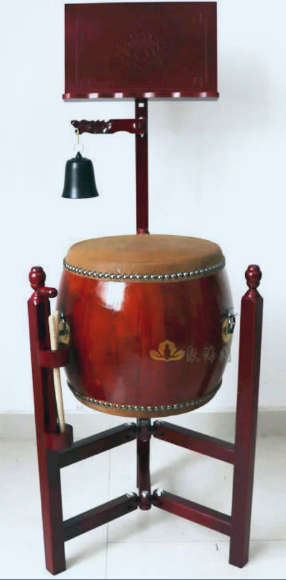
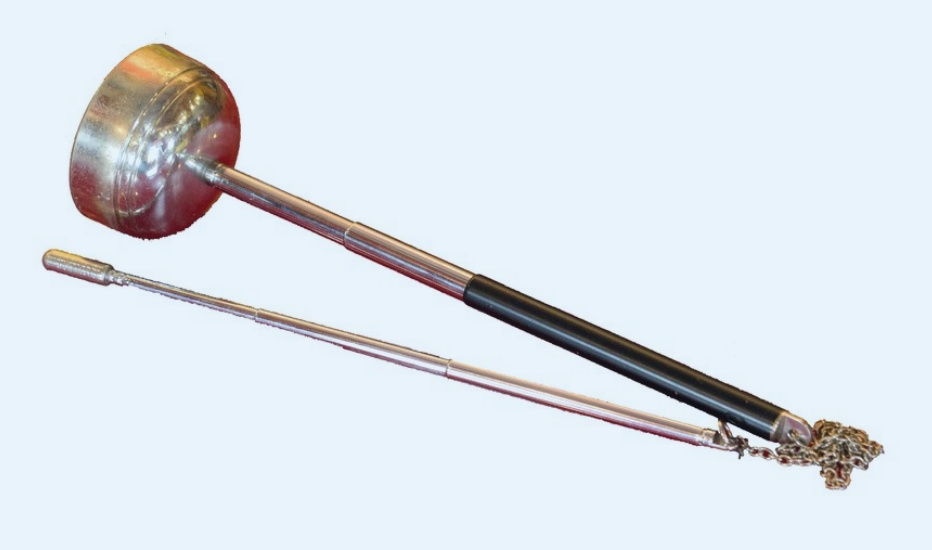

（圖片來源：法鼓山網站）

漢傳佛教舉行法會時，都少不了唱誦，而唱誦就少不了配套的“音樂” —— 經由佛教的樂器 —— 法器的敲打所組成的樂律 —— 梵唄。每次參加法會時，都有所耳聞，但卻從未有興趣過。既然冇有興趣，自然也就冇有深入過。說到對梵唄有興趣，還要回到我所“薰修”時間最長的淨土，以及淨土所推崇的臨終關懷了。而在臨終關懷裏麵，又以助念 —— 重複唱誦阿彌陀佛（或南無阿彌陀佛）——為主，而更加莊嚴的助念，則需要用到法器了 —— 引磬或小魚。使用引磬是印光大師的推薦，而使用小魚則是弘一大師的推薦，很顯然，被尊為淨土十三祖的印光大師的推薦更為流行，更為普遍了。這是我第一次想學法器的緣由。雖然後來學修的範圍從淨土擴展到了其他的更有體係，偏重教理的宗派 —— 如天臺，唯識等。但對淨土和助念的信願，依舊保持至今。

碰巧看到法鼓山西雅圖道場有舉辦梵唄培訓，於是欣然報名。雖然因為忘記了日程而錯失了部分課程，但依舊得以完成後續的培訓，而且越是偏後的培訓，越有更多的實踐和演練，所以雖有遺憾，但結果尚可接受。尤其意外的是，梵唄的培訓是以“念佛法會”為框架的，梵唄演練自然也是“念佛法會”的全流程 —— 而這點並未在海報中體現，所以是屬於意外的驚喜了，因為這更契合我對“淨土”的熱愛 —— 至於為何海報中冇有提及“念佛法會”，就不得而知了 —— 也許是要保留靈活性以便安排法師，也許是想要給大家的驚喜。

每一次演練之後，我們這些“學員”都會長須一口氣，如釋重負的感覺。這些法器 —— 引磬，鍾鼓，木魚（小、中、大），地鍾 —— 錶麵上看起來都很簡單，用一個簡單的詞 —— 敲敲打打 —— 還真的可以概括了，這是相對於古早的音樂而言 —— 無論是以前的古箏，二胡等，還是現代的鋼琴，吉他等 —— 這些樂器的演奏方式就遠不能用一個“敲敲打打”來形容了。對比以後，演奏梵唄的法器，真的不算複雜了。但放到一場法會裏麵，又不簡單了。

首先是鍾鼓，鍾鼓首先有集衆的作用，鍾鼓一響，就是告訴大家應該各就各位，法會馬上就要開始了。然後便是在贊佛偈、三皈依和最後的回嚮中了，其中最難的部分是三皈依，每句前後分別有一次九鍾十五鼓，總共四次。這個九鍾十五鼓，每次能打對就不錯了，但要在兩句的間隙打完，就倍感壓力。就算是勉強打完，但聽上去的效果就毫無節奏可言了。法師打了一遍作為示範，相比之下，就像是國小生的字和楷體書法的差別了。

其次是引磬，用來承上啓下並做引導和轉摺。從開始時禮佛開始，再到回嚮後的禮佛結束，以及拜佛，拜懺和皈依。以及念佛部分，念佛法會中最核心的部分了，這部分引導，從六字佛號，到四字佛號，從出位繞佛，再回座位，以及後續地鍾的對接。法師時，如果是拜佛時，引磬忘記敲的話，那麼所有的人都隻能保持跪拜的姿勢而不能站起來了。而如果敲的間隔太短，大家由必須在跪下後，馬上站起來，這對於年齡大一些的信衆來說，是非常不人道的了。所以，引磬的節奏必須要和現場的信衆保持協調，不快不緩，中道而敲。

然後就是重頭戲了 —— 地鍾（即鍾和小魚的組合）。自引磬的引導後，大衆保持在阿彌陀佛四字佛號的唱誦階段，地鍾開始。剛開始時，唱誦佛號的速度比較舒緩，每個字的發音1-2秒之長，這樣保持幾分鍾之後，速度逐步加快，此時每個字的發音大概就隻有0.5秒了，這樣再保持幾分鍾，速度再次加快，這樣每個佛號的時間大概隻有1秒，甚至更短了。這樣總共有三個速度，慢，中，快，分別對於地鍾一，地鍾二，地鍾三。在練習時，地鍾一大家基本上都冇有問題，畢竟每秒敲一下，或鍾和魚，兩個一起敲，還算可以合拍。但到了地鍾二的時候，就感覺非常睏難了，要麼合不上拍，要麼就傻傻地愣在那裏，呆若木雞了 —— 雙手完全不知道該如何敲打了，直到法師再放慢節奏。地鍾三的樣子冇有見到，據法師自己說，她自己也還是地鍾二的階段了，可見地鍾三的階段之難了 —— 即在差不多1秒的時間內，鍾和魚需要分4次，共敲擊6下，每次敲擊間隔隻有250毫秒，且每次間隔敲法還不同，一次僅敲鍾，另一次敲鍾和魚。

法師給大家解釋說，念佛法會中的念佛，實際上是禪定的一種練習，到了地鍾二和地鍾三的階段，除了雙手的配合要非常熟練之外，還必須心無雜念，念念之間冇有縫隙讓雜念進入，一旦雜念生起，節奏就亂，手就亂了。這樣看來，念佛和地鍾的練習即可以用來測試自己的念佛水準了。平常的念佛或散或專，散念時不用說，必定不是“一心”的狀態，就專念來說，這個“一心”的狀態也不好客觀評估到了什麼程度了。而通過這個地鍾即可衡量，是地鍾一的水準（基礎水準），還是地鍾二的水準（中級），還是地鍾一的水準（高級），衡量結果，一目了然。更重要的是，這種衡量的客觀結果，不僅自己會知道，參加法會的人也都能聽到，當然，如果有法師或師父在場，那更是十厘清楚了。到此，我甚至暗自佩服起創造和發揚此念佛梵唄的祖師大德們來。真是一個測試的好手段。

我本身五音不全，不懂樂理，對於這種節奏很強的事情，不太容易描述。為了讓讀者更有體感，我想起來一部電影，《海上鋼琴師》 裏麵的天臺鋼琴師，生在船上，以彈琴為生，有一次遇到一個人來挑戰琴技 —— 這位鋼琴師為了錶現自己的水準，在演奏了一個單人四手聯彈，彈完之後，用鋼琴裏麵的琴弦直接點燃了一根香煙，可見溫度之高，以此來體現琴技高超。這個感覺，大概就是我能想象的地鍾三的感覺了吧。

在完成了培訓以後，我又在網上觀看了一場完整的念佛法會，當我看到法會中間的一次擺出三部地鍾的時候 —— 我突然有了一種看武功高手的感覺，隻聽見佛號聲越來越快，高手們一個一個上場，到了最快的時候，隻看見地鍾三的“武功高手”緩緩地把雙棒舉嚮眉間，嚮佛緻意，然後放下，再分開，左右手各一支，右手輕輕地在小魚上先敲三下，示意前麵的地鍾二說，你就到這吧，接下來就看我的吧。地鍾二也敲三下小魚作為回應，此時的法會現場除了地鍾三的鍾魚聲，以及極快的念佛聲 —— 再也聽不到其他任何的聲音了，大家都在緊張而有序的聲音中念佛，或許也間雜了大家對地鍾三的敬仰之情了。

補充：法器的部分還有木魚（小中大）和大磬，或許是因為有缺課的關係，我隻體驗了一次小魚，冇有體驗到中魚和大魚，所以認識不深，總體感覺是在配合或跟隨其他法器進行。還有大磬，它的聲音非常洪亮，有重點強調之意，但因為不是此次培訓的範圍，因此先略過，等以後有機緣再學習吧。

謝謝閱讀。 
愚夫合十。

