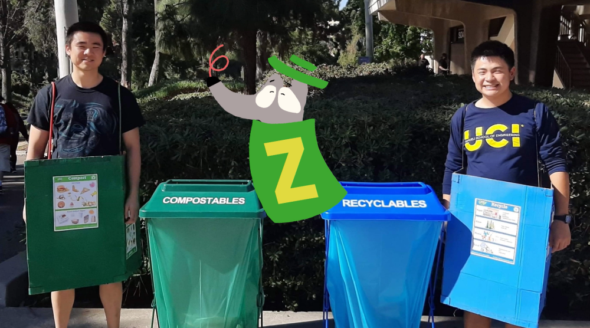

ZotBins is system of sensor-enabled waste bins with a suite of web-based applications to quantify and promote actionable solutions to reduce waste. Waste monitoring systems already exist in commercial settings, but ZotBins Community Edition (ZBCE) helps expand this capability to the individual and community level. ZotBins is completely opensource. Built for people, by people. To learn more visit [zotbins.github.io](zotbins.github.io) or view our [ACM Sensys Video](http://www.youtube.com/watch?v=gcljm-4PmsE "The ZotBins Solution to Waste Management using Internet of Things")

## Mission

To better inform all actors in the [Municipal Solid Waste](https://en.wikipedia.org/wiki/Municipal_solid_waste) Stream system and help close the [loop](https://en.wikipedia.org/wiki/Circular_economy) for a sustainable society.

## Goals

1. Help communities reach a **85% waste diversion rate or more**
2. Help individuals reduce the average per person disposal rate of [1,704 lbs.](https://www.globalcitizen.org/en/content/americans-produce-most-waste/) per year (in the United States) by **66% or more**

## How it Started
This project started at UCI in 2017 with a group of 4 undergraduates for a hackathon hosted by [UCI TIPPERS](http://tippers.ics.uci.edu/). The aim of the project was to help create a tool to help with UCI's zero waste initiatives. With the guidance of professors and graduate students from the TIPPERS research group, the team was able to grow from 4 to over 15 individuals all working on the ZotBins project. Together they have been able to build and deploy a network of 9 smart bins on campus that are currently making a positive impact for UCI. Since then, the project is being shared to the open-source community through ZBCE and the ZotBins UCI undergraduate team continues with new members every year.

## ZBCE Team
This ZBCE project was initiated by [Owen Yang](https://okyang.github.io). It currently has a few people in the community and has a strong connection with the ZotBins team at UCI.

## ZBCE 4-layer IoT Architecture

## Values
#### 🙌 *Supportive Community*

A supportive community where all members are able to grow and help mentor or learn from one another. Healthy communities are to be inclusive, welcoming, and respectful of one another.

#### 🌱 *Environmental Sustainability*

Protecting the environment and helping preserve our planet's biodiversity is critical. Doing our part in supporting sustainable practices is morally important to sustain future generations.

#### 🔒 *Privacy and Using Data Ethically*

When data is collected, users involved have their right to privacy and any data collected is used ethically. All applications developed will be developed with privacy in mind. We will never try to sell personal data for profit.

#### 🎇 *Passion*

Pursuing our passions and being motivated to take initiative. That's how this project started!

## Public Roadmap

ZBCE is just getting started and there's a long way to go. Here is our [Road Map](https://github.com/orgs/zotbins/projects/9)

## Common Ways to Contribute

- 🙋‍♀️ Just want to share some ideas? Create an issue, feel free to use the feature request template for guidance. Or share it in our [Discord server](https://discord.gg/mGKVVpxTPr)
- 🐞 Found a bug? Go to the repository's issue page and submit a report using the bug template.
- 📝 Want to improve or create documentation to help others learn how to use the repo? Fork the repo, make your changes, and submit a pull request.

## Contact

[zotbinsuci@gmail.com](mailto:zotbinsuci@gmail.com)
