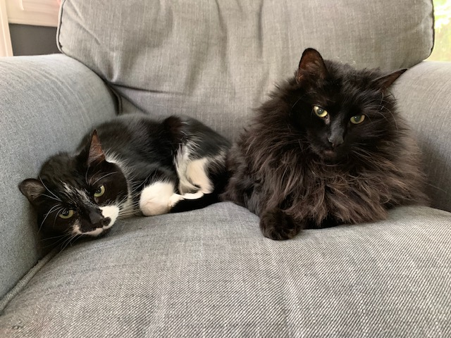
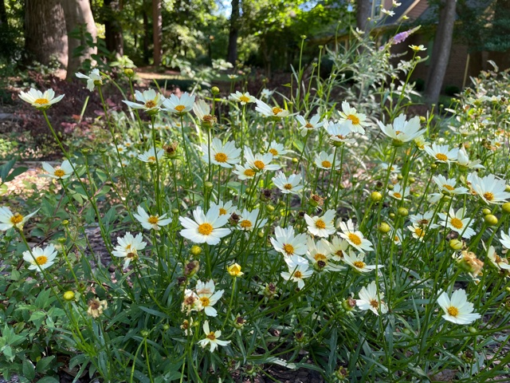
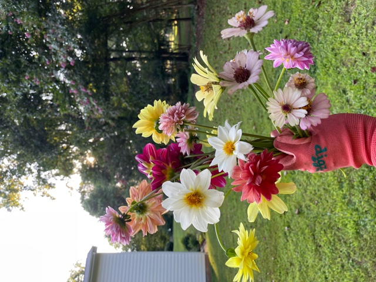

## Hello and welcome to my about page! 
My name is Jennifer Relihan and I am a data manager at an agriculture biotechnology company in RTP, North Carolina. I've been in NC for two years when I transferred to my companies RTP site. I'm from Massachusetts and not missing the winters 😎

I live here with my husband (Tom), two cats (Boo and Sylive), and dog (Pepper). Gardening is my hobby and obsession and you'll find me in the garden at our home any chance I can get. 

### Contact me

[email](mailto:jlreliha@ncsu.edu)
