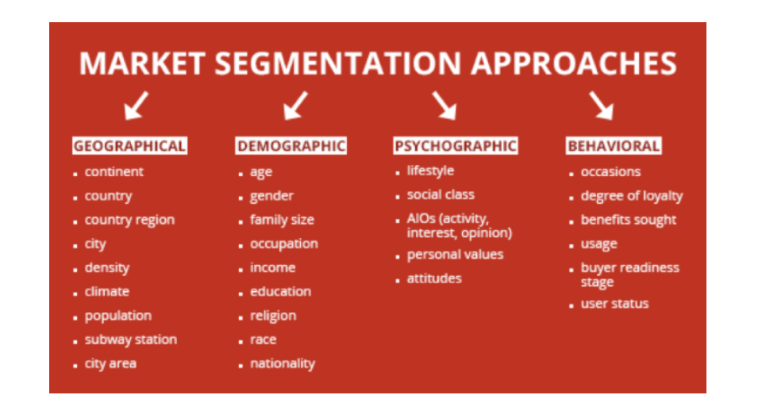

## DNS Enumeration Audit
  - Do they own their own domain?
    - often the admin/tech/billing contact is registered to the personal email of a past employee. If they aren't responding to renewal reminders, the website and email attached to the domain can go down without warning
  - Who is the domain registrar?
    - Is the contact information displayed publicly or is it "cloaked" behind the registrar contact info?
  - Who is hosting the DNS records (iow, where are the NS records pointing)?
    - if the registrar is hosting the DNS, then server uptime might be at risk if the web host moves servers around and changes your IP. The web host will send advance notice when this happens so make sure someone is resposible for those emails.
    - if the DNS is hosted by the web host, then web server IP changes are handled automatically by the host.
    - Who's responsible for maintaining the domain's DNS records? If no one at the company is, the client will assume you're responsible for it. 
  - Who's hosting their email? Do the email accounts and data reside on the same server as the website?
    - Who's responsible for maintaining the email server and user accounts? If no one at the company is, the client will assume you're responsible for it. 
    - Do they have SPF records set up? If not, recommend that they do this.

## Project specific questions to ask the client
1. Is this a new or existing project?
2. Does the client have Analytics installed?
    - Get access to the GA
    - Use the Content Drilldown to learn which site content is most popular.
    - What is the Audience
      - What percentage is mobile traffic?
      - What is the browser share?
3. How are you getting paid?
    - time and materials (by the hour; Tony recommends this for beginners)
      - Track time in 15 increments
      - invoice monthly (or every two weeks, if possible)
      - no fixed quotes; be explicit
    - fixed quote with installments
      - avoid if possible
      - weigh the installements so your at least 75% paid by the time the website is ready for launch
    - retainer
      - hard to get until you're more experienced
    - product
4. Where is the site going to be hosted?
    - hosted: i.e. with Media Temple, Hostgator, AWS, Azure, etc
      - make sure there is a good support system in place
    - on-premise: hosted on site with the client
      - only allow this if the client has an IT department (could be one person)
5. Where is the site going to be developed?
    - if the servers are different, when how will the site be migrated?

## 4 Phases of Waterfall
1. Plan
2. Design
3. Development 
4. Launch

## PLAN
1. Competitor Analysis 
2. Client Goals
3. Target Audience
4. Needs Assessment 
5. Define Scope
6. Create Sitemap 
7. Gather content

## Design
1. Wireframes
2. Visual Identity
3. Web and Component Design

## Development
1. Build website
2. Populate the website with content 
3. Test website
4. Conduct user testing

## Launch
1. Train clients
2. SEO
3. Marketing
4. Maintenance
5. Evaluating success of website 
6. Improving website

## Planning a Website
### CLIENT HOMEWORK/INTERVIEW
- Goals
- Target Audience 
- Competitors
- Website Needs vs Wants

## Website Goals
### Example: Restaurant vs Musician Goals:
1. I want people to be able to easily find me.
2. I want to tell people about my products and services.

### Example - Restaurant "ABC" Specific Goals:
1. I want nearby customers searching on their phone to be able to easily find me, especially my location and phone number.
2. I want customers to easily find my menu and specials. 
3. I want to update special events and promotions.

## Example - Musician "XYZ" Specific Goals:
1. I want people world wide to find my website.
2. I want to be able to sell CDs and downloads on my site.
3. I want to have a membership area to connect with super-fans.

## Mini-Goals
Every page should lead to an action. What should someone do after
visiting this page?
- About Page -> Contact Me
- Restaurant Menu -> Make a Reservation 
- Events Page -> Buy Tickets

## Activity: What are your goals?
- Think about your portfolio website.
- What are your specific goals?
- Create mini-goals for each of these common portfolio pages:
  - Home 
  - About 
  - Services 
  - Portfolio 
  - Contact

## Target Audience
- "Everyone" is not a target audience.

### Example: Texas Beard Company

## Target Audience - Segments

## Target Audience
Use your target audience to help decide design and user experience choices.
- A website for kids might include bright primary colors and use a large font size with short sentences and a lot of helpful visual explanations.
- A website for adults may look cleaner with a lot more white space.

## Activity: Target Audience
Think about your personal website. Answer these questions.
1. Describe your target audience (general age, income, location, hobbies, etc.)
2. What are their problems?
3. Why do they want a solution to this problem?
4. How can you help them?

## Competitor Analysis
- Gain a better understanding of the market and how to position the client
- Analyze 3-5 competitor websites
- 3 Basic Questions
  - What are they selling?
  - What are they communicating? 
  - What are they missing?

1. COLLECT AND ORGANIZE
        - Set up a spreadsheet with a column for each competitor and also one for your client if they already have a website

2. Analyze
    - Start with a high-level analysis:
        - **Strengths** - Characteristics of the website that give an advantage and help reach objectives.
            - What is this website really good at?
            - What do they do better than others?
        - **Weaknesses** - Website characteristics that present a disadvantage or prevent the competitor from reaching objectives.
            - What is this website bad at?
            - What do the competitors do better?

3. ANALYZE MORE
Go through a checklist to analyze each website
    - [Alexa Score](https://www.alexa.com/siteinfo) by Amazong 
    - [Website Grader](https://website.grader.com/) by HubSpot 
    - [SEMRush](https://www.semrush.com/)

4. ANALYZE EVEN MORE
    - Key messages - what are they?
    - Social icons - what platforms do they use?
    - Is the design modern or outdated?
    - Does the website use compelling visuals?
    - Is the website responsive?
    - Does the website have unique functionality?

5. ANALYZE EVEN MORE!!!
    - eCommerce?
    - Lead magnet/email sign-up 
    - Audio?
    - Video?
    - Membership-only content? 
    - Blog?
    - Forum?
    - Chat?
    - User surveys? 
    - Multi-language? 
    - Localization?

6. Present Your Research
    - What are your client's strengths and weaknesses?
    - What do you recommend for your client's website based on the research you performed?
    - Where do you want to emulate vs differentiate?

## Activity: Competitor Research
- Choose 1-3 competitors for your personal website (don't choose your classmate's websites )
- Set up a spreadsheet to analyze them
  - What are there strengths? 
  - What are there weaknesses? 
  - What features do you like? 
  - What features do you hate?

## Needs Assessment QUESTIONS
- What features are required for the website? 
- What features do you want but aren't necessary? 
- What features do you not want?
- What pages do you want on your navigation?

## COLLECT CONTENT ON TIME
1. SET EXPECTATIONS
    - **Website questionnaire**: Ask about their content and if they already have it together.
    - **Initial meeting**: reiterate that you need content from them. Mention that websites that don't launch on time are usually behind due to content delays.
    - **Proposal**: Obvious section that lists important stuff in plain English including that you need their content. Don't develop until you have content.

2. Give Reminders
    - **Time Blocking**: Allocate time each week to check in on the progress of all projects. Check in on content as part of it. 
    - **Follow Up**: You can use a tool like FollowUpThen to schedule email reminders.
    - **Email Automation**: If you use a email automation tool like Mailchimp you can send clients a series of email reminders.

3. Help Them Visualize
    - **Wireframes**: Show your clients what type of content you'll need from them and where it will go on the website.
    - **Content Workbook**: Create a document (Google Docs is great for this) with prompts for the types of content you need from your client.

4. Give Guidance
    - **Videos**: Use video to guide clients through the document and show examples of websites that might help them. Try Loom 
    - **Instructions and constraints**: Explain the purpose of each piece of content and guidelines they need to follow (including copyright laws, image sizes, character limits, etc.).
    - **Provide resources**: Give links that better explain things (How to Write the Perfect Headline).

## Activity: Portfolio Content
- What content do you need for your portfolio website? Make a list. 
  - Think about your biography, descriptions of your work, headlines, images, text on buttons
- If you have time, start checking the list off by creating and collecting content.

## Choose a Domain Name
### A Good Domain Name
- 1st choice: .com
- 2nd choice : .ca (in Canada)
- Do you want any other extensions? (.org, .co, .biz, .info, .io) Make the name as short as possible and unique
- Avoid numbers and symbols
- Keep the name lowercase and make sure it's easy to read and write and not easily confused with something bad (IT Scrap -> ITScrap.com -> itscrap.com -> uh oh)
- Is the domain name available?

## Activity: Choose a Domain Name
- If you already have a domain name for your portfolio site, pretend its already taken.
- Find 3 domain names you'd be happy with

## Choose Hosting
1. WHICH TYPE OF HOSTING DO YOU NEED?
2. DETERMINE WHAT TYPE OF SITE YOU'RE BUILDING
    - Blog?
    - Online Store?
    - Online Portfolio or Résumé?
    - WordPress?
    - static HTML?
    - web app with lots of photos or calculations?

Make sure you understand the technical requirements needed for your website and check to see if the hosting provider supports those requirements.

## How Much Traffic Do You Expect To Receive?
This will determine how much resources you need and whether or not you need a host that offers scalability.
- What Is Your Monthly Budget? This will help you weed out certain hosts and packages.
111

## Reliablity, Speed, Backups, Support
Avoid hosting companies that report anything below 99% uptime. Find speed stats on a hosting company's website and then browse through online reviews to see how customers' sites have performed.
- Look for hosts that backup your site every 24 hours.
- Look for hosts with good customer support (check support hours, channels (live chat, email, phone), read reviews)

## Activity: Choose Hosting
Find 3 different hosting services for your portfolio site. What are the pros and cons of each?
Which one would you choose and why?

## Website Maintenance
## Will You Offer A Maintenance Package?
- Increased income
- Quick and relatively easy work 
- Build a relationship with your client 
- Offer peace of mind and support

## TYPES OF SERVICES
- CMS updates
- Theme and plugin updates
- Automatic Backups
- Extra Manual Backups
- Security
- Support and answer client questions
- Site Health Checks (broken links, page speed, etc.) Minor changes to website
- Analytics tracking and reporting
- Content creation
- Email marketing

If you don't want to sell packages, offer your client recommendations for companies who do.

## Activity: Maintenance
What kind of maintenance will your portfolio website need?
Make a list of the types of maintenance required and how often you would perform each type of maintenance.

## Legal Requirements 
### Disclaimer: Your instructor is not a lawyer (probs).

## Legal Requirements
1. Privacy Policy - What info you're collecting from visitors and what you're doing with it.
2. Terms and Conditions - A contract between the website owner and website visitor.
3. Copyright Designations - Copyright symbol in the footer is common

## Creating Legal Documents
1. Hire a lawyer 
2. Buy a template
    - https://www.youronlinegenius.com/ 
    - https://www.shopcreativelaw.com/ 
    - https://thecontractshop.com/
3. Use a generator 
    - https://getterms.io/
    - https://www.freeprivacypolicy.com/ 
    - https://www.shopify.com/tools/policy-generator 
    - https://www.shopify.com/tools/policy-generator/terms-and- conditions

## Activity: Privacy Policy
Explore the generators and contract shops.
- Try generating a privacy policy and terms of service for your website.
- Is there anything the free policies are missing that you need?

## Develop A Marketing Plan

## Marketing Plan
- **Plan**. Plan. Plan. - Put effort into building a communications plan to market the new website.
- **Get Early Buy In** - Engage users during beta testing to get them excited about the new website. Put up a Coming Soon page and start collecting email addresses.
- **Prepare for the Worst** - What's the plan if the launch doesn't go smoothly?
- **Don't Launch Before a Big Event** - Launch day should be a quiet day so that you can test the site and make sure things are working.
- **Mix and Match** - Use both online and offline marketing techniques.

## Online Marketing
- Blog
- Video
- Permission-based email campaign 
- Pay-per-click ads
- Social media

## Offline Marketing
- Print, brochures, ads
- TV, radio, press release Billboards
- Business cards
- Contests
- Clothing and other merchandise URL on vehicles

## Activity: Create A Marketing Plan
Collecting emails is incredibly important for marketing. What can you offer visitors in exchange for signing up for a newsletter?
- ebook
- video
- email course other examples
- Start working on creating that lead magnet.

## Create A Proposal
### Parts Of A Proposal
- Project Overview Goals
- Audience
- Delivery Requirements 
- Site Content
- Site Structure 
- Visual Design 
- Budget 
- Promotional Plan