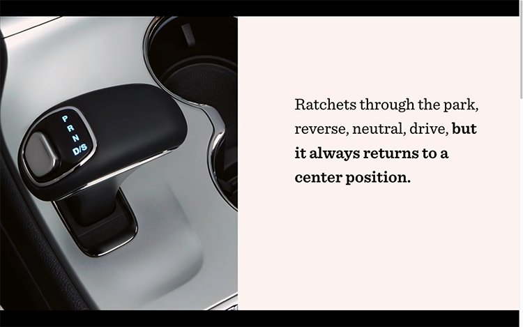
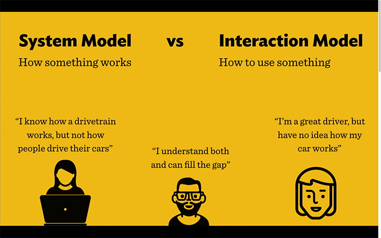
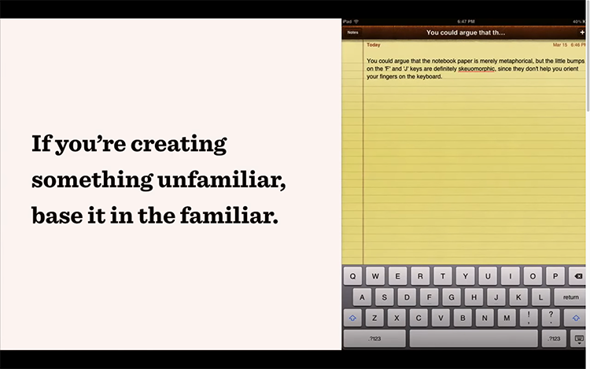
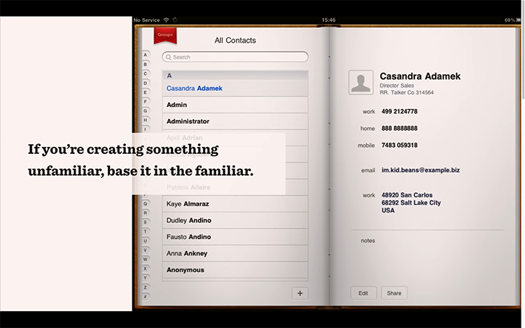
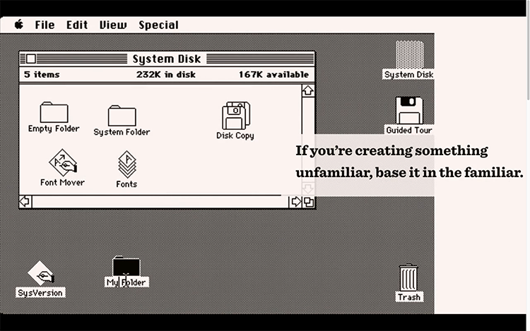
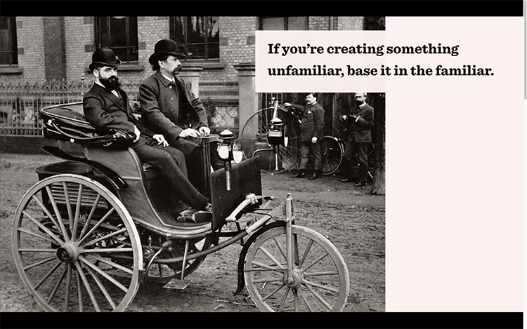
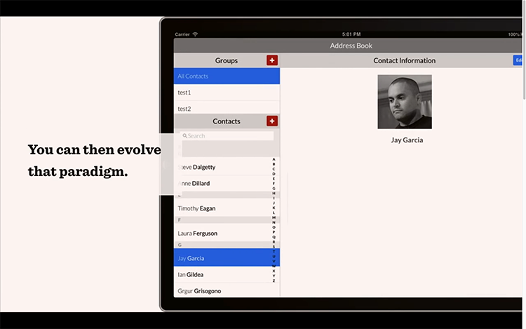
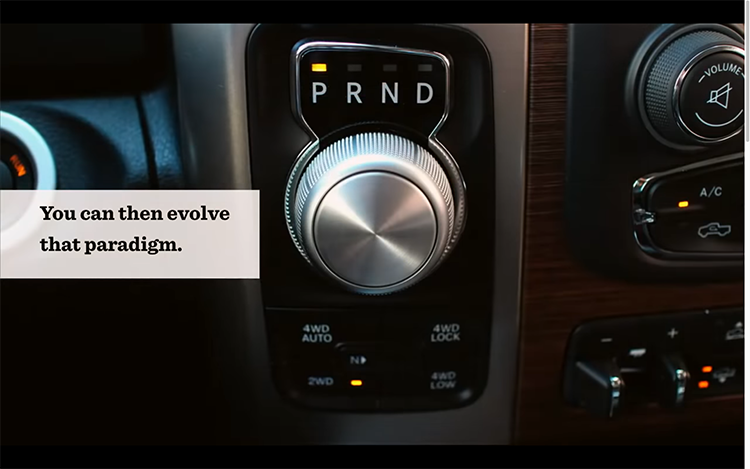

Source: [UX Design Basics: Mental Models](https://youtu.be/9gM8K4ooavY) by [Jamal Nichols](https://www.youtube.com/channel/UCAoua8S8h1e4OkaafTEklMQ)

## Definitions
<dl>
  <dt>Mental Model</dt>
  <dd>A mental model is how you think something will work, based on your knowledge and experience.</dd>
  <dt>System Model</dt>
  <dd>How something works.</dd>
  <dt>Interaction Model</dt>
  <dd>How to use something.</dd>
</dl>

> If the way something works lines up with your expectations, you'll understand how to use it. And if it doesn't, you will struggle.

## The _Rocket Switch Gearshift_

<figure>
  
  <figcaption>Figure 1: The Rocket Switch Gearshift is an example of a good System Model but bad Interaction Model.</figcaption>
</figure>

In early 2006. Fiat Chrysler Automobiles recalled over one million vehicles due to a new shifter design known as the "Rocket Switch Gearshift".

It ratcheted through _park_, _reverse_, _neutral_ and _drive_ but **it would return to the centre position** (i.e. what most people would assume is _park_). Driver confusion led to [266 crashes and 68 injuries](https://www.freep.com/story/money/cars/chrysler/2016/06/28/fiat-chrysler-gearshift-probe-anton-yelchin/86460430/), including the death of actor Anton Yelchin.

It was a failure in interface design. But how did this happen?

## System Model vs interaction Model

<figure>
  
  <figcaption>Figure 2: The <strong>system model</strong> is how something <em>works</em> while the <strong>interaction model</strong> is how <em>we interact</em> with that something.</figcaption>
</figure>

Engineers (the people who build products) usually have strong system models but they often have weak interaction models.

An automotive engineer will know how a car's engine and drive train work but they won't necessarily understand how an average person drives their car. 

Conversely, the average driver prefers to be comfortable over knowledgeable.

## The Role of the designer
Designers fill the gap between the builders and the users. A great designer has strong **system models** _and_ strong **interaction models**.

> It's a good idea for designers to learn how to code... You should, at least, have coded one project from start to finish... After that, you'll understand systems much better and it'll make you a better designer.

## Key Principle: If you're creating something unfamiliar, base it in the familiar
### Examples
<figure>
  
  <figcaption>Figure 3: Apple Notes app interface mimics a physical note pad.</figcaption>
</figure>

<figure>
  
  <figcaption>Figure 4: Apple Address Book app interface mimics a physical address book.</figcaption>
</figure>

<figure>
  
  <figcaption>Figure 5: The original Mac Desktop mimics a physical office space.</figcaption>
</figure>

<figure>
  
  <figcaption>Figure 6: The very first cars looked like horseless carriages.</figcaption>
</figure>

## Fact: Mental models can evolve over time
As a designer, you may get to a point where you can take full advantage of a digital interface. But, first users need to build up that knowledge.

<figure>
  
  <figcaption>Figure 7: Eventually Apple was able to adopt a flat interface for its Address Book.</figcaption>
</figure>

## Evolving the gear shifter

<figure>
  
  <figcaption>Figure 8: Car makers are now moving to a rotary dial to completely replace the gear shifter entirely.</figcaption>
</figure>

While this interface [still has its problems](https://www.autoweek.com/news/a1860056/another-fca-gear-shifter-investigated-rollaway-risk-following-crashes/), it has faired better than the Rocket Swift Gearshift. Why is that?

## Key Takeaway
If the mental model closely matches the actual behavior of the device or interface, then people can:
1. make accurate predictions;
2. make correct decisions;
3. choose appropriate actions.
