The primary goal of creating visual hierarchies is to make content more scannable.

<blockquote>
  An important way to make pages easy to grasp in a hurry is to make sure that the appearance of the things on the page - all of the visual cues - accurately portray the relationships between the things on the page.

  Pages with clear visual hierarchy have three traits:
  <ol>
    <li>The more <strong>important</strong> something is, the more <strong>prominent</strong> it is.</li>
    <li>Things that are related <strong>logically</strong> are related <strong>visually</strong>.</li>
    <li>Things are "<strong>nested</strong>" visually to show what's <strong>part of</strong> what.</li>
  </ol>
  <address>Source: Steve Krug, Don't Make Me Think; p.33</address>
</blockquote>

## 11 Principles of Visual Hierarchy
You can find many videos online about "Top X" principles of visual hierarchy. The number ranges from 5 to 15 or more, so these are not hard and fast rules.

The following examples were taken from [11 Visual Hierarchy Principles](https://youtu.be/ZXItTIjC0Wk) by [Visme](https://www.youtube.com/channel/UC2isRzoZisjBS6PaGWTDV0Q):

## 1. Size and Scale
Size can drive emotion and signify importance. The greater the scale, the greater the emphasis.

### Meh
<figure>
  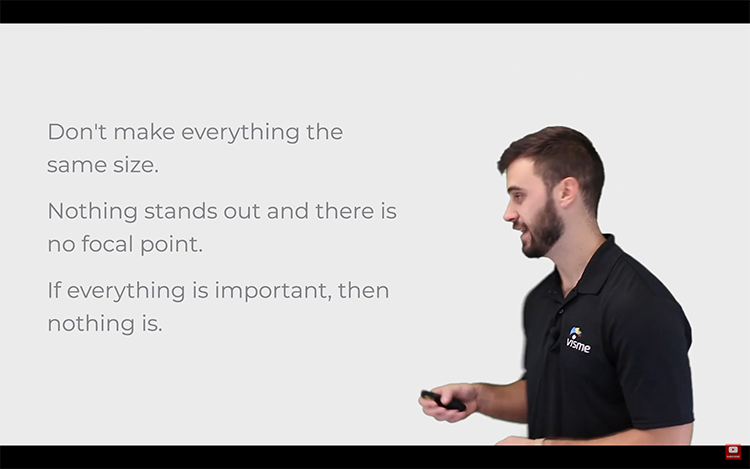
  <figcaption>Figure 1: The text is the same size so there is no focal point and no way to tell what's most important.</figcaption>
</figure>

### Better
<figure>
  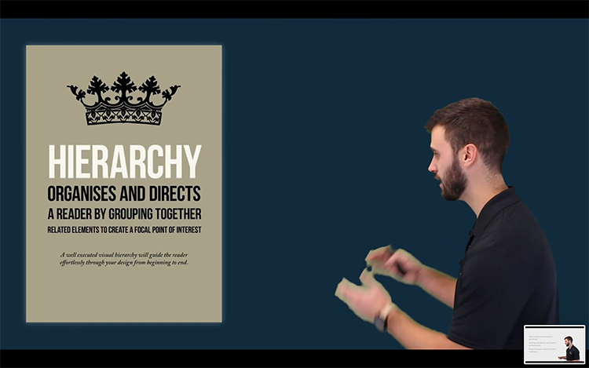
  <figcaption>Figure 2: "Hierarchy" is the largest word in this design and, therefore, dictates the focus of the design.</figcaption>
</figure>

## 2. Perspective
Perspective creates the illusion of depth, which can lead to a perceived difference in importance.

### Meh
<figure>
  
  <figcaption>Figure 3: With no depth of field or contrast, the text in this image is very difficult to read.</figcaption>
</figure>

### Better
<figure>
  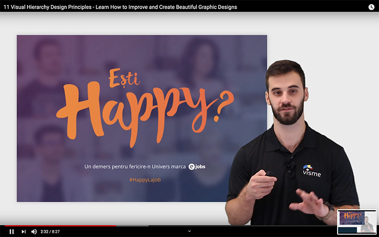
  <figcaption>Figure 4: This new design by the same company employs the [Bokeh Effect](https://en.wikipedia.org/wiki/Bokeh) to convey depth of field, making the text easier to read.</figcaption>
</figure>

### The effect of contrast
<figure>
  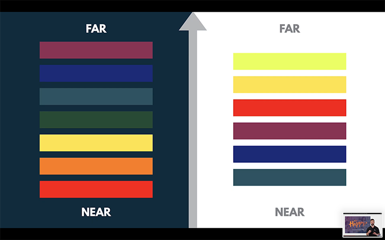
  <figcaption>Figure 5: Colours can also create depth. Bright colours look closer on a dark background while the opposite is true with a light background.</figcaption>
</figure>

## 3. Colour and Contrast
Similar to size and scale, colour and contrast can also draw attention by providing a focal point for the user.

## Meh
<figure>
  
  <figcaption>Figure 6: The contrast between the figures in this population statistic are barely noticeable. None of the figures look any more important than the others.</figcaption>
</figure>

### Better
<figure>
  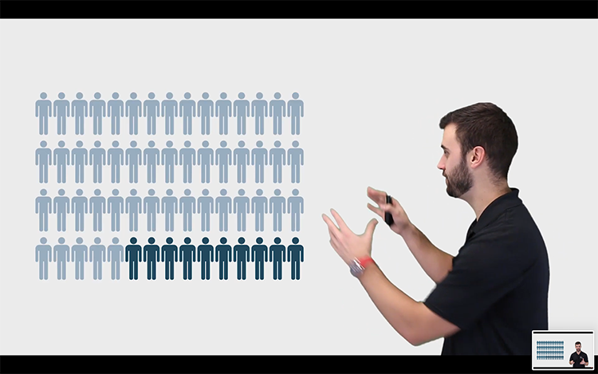
  <figcaption>Figure 6: The contrast between the figures in this population statistic are barely noticeable. None of the figures look any more important than the others.</figcaption>
</figure>

## Better
<figure>
  
  <figcaption>Figure 7: Increasing the contrast between the same figures makes it obvious to the user what they should be paying attention to.</figcaption>
</figure>

## 4. Typography
Choosing contrasting fonts (with contrasting size and colour) conveys importance to the user.

## Meh
<figure>
  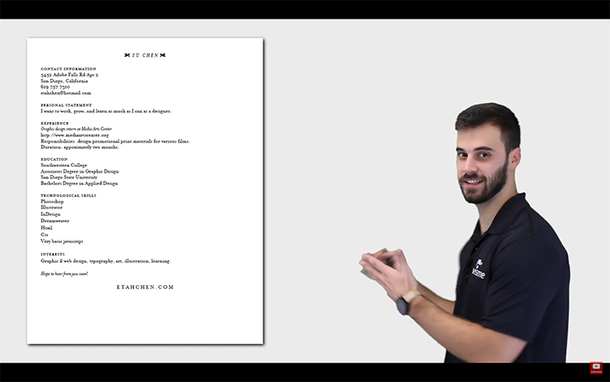
  <figcaption>Figure 8: This resume gives no hint to the reader about what is most important to know.</figcaption>
</figure>

### Better
<figure>
  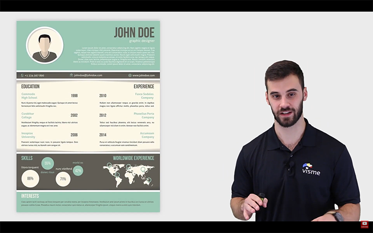
  <figcaption>Figure 9: This resume uses contrasting typography, font size and colour to clearly identify where to find the information the reader (i.e. potential employer) is looking for.</figcaption>
</figure>

## 5. Proximity
Items that are closer together in proximity also seem more alike.

## Meh
<figure>
  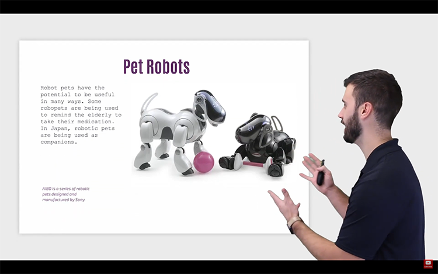
  <figcaption>Figure 10: There is no indication, based on proximity, which of these 4 image components are related.</figcaption>
</figure>

### Better
<figure>
  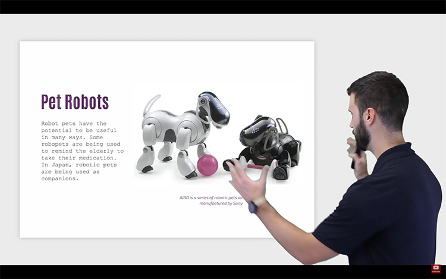
  <figcaption>Figure 11: Proximity tells the reader that the heading is related to the body text and that the image comes with a caption.</figcaption>
</figure>

## 6. Negative Space
Negative space (closely related to proximity) will naturally draw the eye by _removing_ information.

## Meh
<figure>
  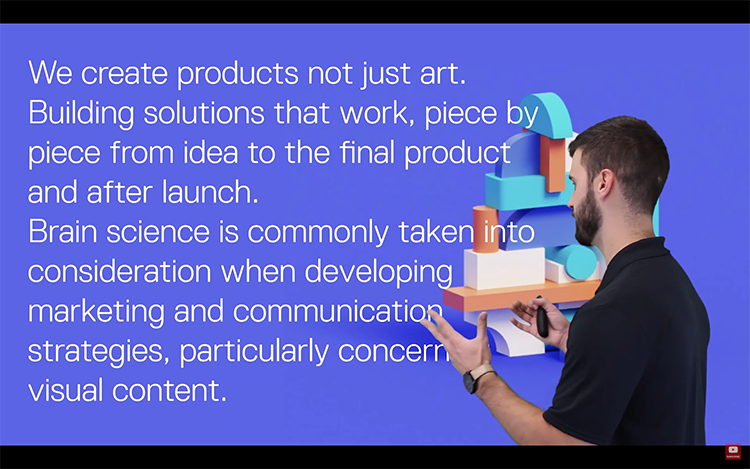
  <figcaption>Figure 12: This image has little to no negative space and, therefore, the text is difficult to read and understand.</figcaption>
</figure>

### Better
<figure>
  
  <figcaption>Figure 13: This new design is made much more meaningful with concise text and a lot of negative space.</figcaption>
</figure>

## 7. Alignment
Users who write in a left-right direction like to read in an _F pattern_

TODO: Definition Slide

## Meh
<figure>
  
  <figcaption>Figure 14: Mixing text alignment often violates the F pattern.</figcaption>
</figure>

### Better
<figure>
  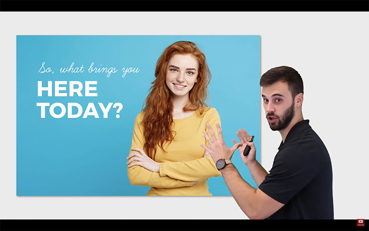
  <figcaption>Figure 15: Left aligned text flows naturally into an F pattern.</figcaption>
</figure>

## 8. Rule of Odds
Images are more appealing when an odd number of them are applied.

## Meh
<figure>
  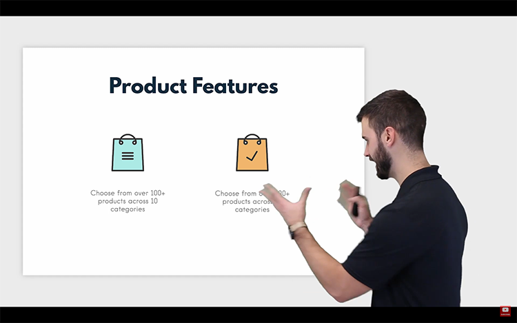
  <figcaption>Figure 16: Two items often appear imbalanced and boring.</figcaption>
</figure>

### Better
<figure>
  
  <figcaption>Figure 17: Three items is much more appealing because reasons.</figcaption>
</figure>

## 9. Repetition
Repetition creates a feeling of unity and cohesiveness by creating patterns for the user to recognize (consciously or not).

## Meh
<figure>
  
  <figcaption>Figure 18: There are no patterns to be had in these presentation slides.</figcaption>
</figure>

### Better
<figure>
  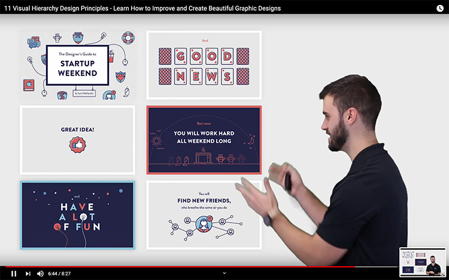
  <figcaption>Figure 19: "Unity and cohesiveness" often come from consistent typography, imagery, colour schemes and layout.</figcaption>
</figure>

## 10. Leading Lines
Leading lines grab the user's attention by creating a sense of movement.

## Meh
<figure>
  
  <figcaption>Figure 20: This is just bad layout. It's not hard to imagine how to fix it.</figcaption>
</figure>

### Better
<figure>
  
  <figcaption>Figure 21: The human gaze is a powerful way to create leading lines. </figcaption>
</figure>

## 11. The Rule of Thirds
Divide your design into a 3x3 grid with each intersection being a potential focal point for the user.

## Meh
<figure>
  
  <figcaption>Figure 22: The model is centered horizontally and the text is centered vertically. There are no thirds.</figcaption>
</figure>

### Better
<figure>
  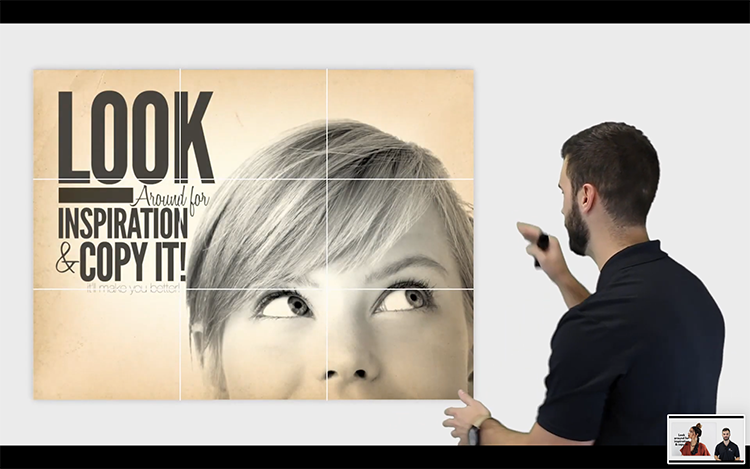
  <figcaption>Figure 23: The model and text are more balanced. Notice that the intersections don't have to be perfect. This "rule" (like everything in this list) is more of a guideline.</figcaption>
</figure>
