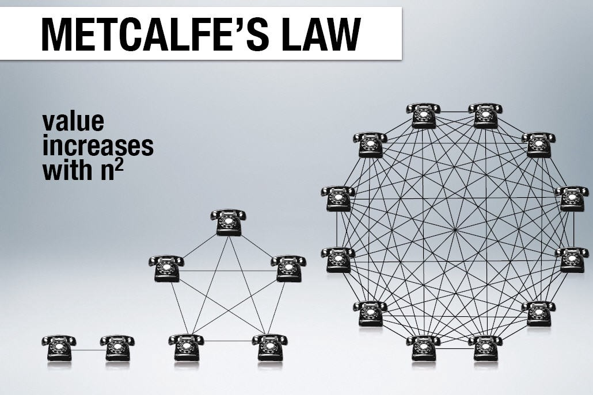
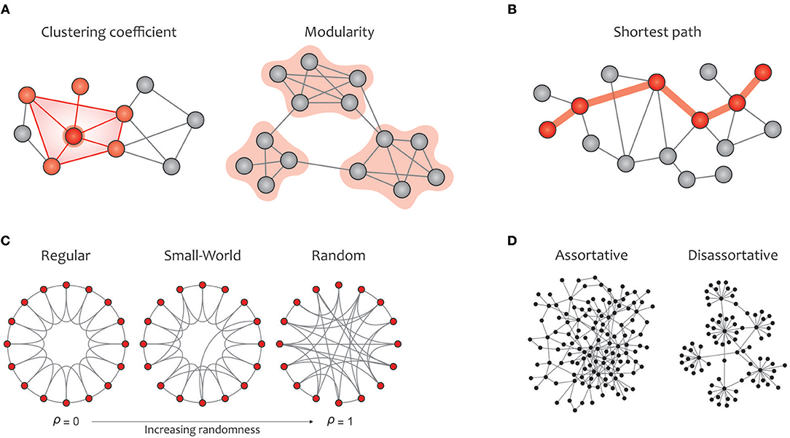

## Terminology
<dl>
  <dt>Node</dt>
  <dd>Individual actors, people, or things within the network.</dd>
  <dt>Connection</dt>
  <dd>Relationships or interactions that connect nodes. Also called ties, edges, or links.</dd>
  <dt>Homophily</dt>
  <dd>the natural tendency for people to interact with others who are similar to themselves based on almost any dimension. </dd>
  <dt>Induced Homophily</dt>
  <dd>Groups created as a result of outside forces such as age, socioeconomic status.</dd>
  <dt>Choice Homophily</dt>
  <dd>Individuals will find others similar to themselves regardless of the group setting.</dd>
</dl>

## Network Growth
Metcalf's Law states that "the effect of a telecommunications network is proportional to the square of the number of connected users of the system (n2)"

Figure 1: Connections grow exponentially with network size ([Source](https://medium.com/@embrkbusiness/knowledge-and-metcalfes-law-f0bc13a33db3))

## Monkey Spheres
First referenced by David Wong, editor of cracked.com). [source](https://www.cracked.com/article_14990_what-monkeysphere.html)

There is a cognitive limit to the number of people with whom one can maintain stable social relationships in which an individual knows who each person is and how each person relates to every other person. 

Social scientists refer to this limit as [Dunbar's number](https://en.wikipedia.org/wiki/Dunbar%27s_number).

### "Small World" Theory of Networks
Social network analysis studies the human social patterns in a world where we have limited cognitive resources for maintaining social ties. 

Studies show that a few people account for a disproportionate amount of the connectivity. These "connectors" maintain many weak ties to a larger collection of tighter groups with stronger ties.

Scientists refer to this as the [Small World Theory of Networks](https://en.wikipedia.org/wiki/Small-world_network). We call it [6 Degrees of Kevin Bacon](https://www.google.com/search?q=6+degrees+of+kevin+bacon).

Figure 2: Graph Theory Clusters ([Source](https://sciences.ucf.edu/psychology/lighthalllab/dr-lighthall-contributes-to-new-systematic-review-of-graph-theory/))

### The Small World Effect on Social Media
- Twitter: [10% of users are create 80% of tweets](https://www.searchenginejournal.com/10-of-twitter-users-are-creating-80-of-tweets/305101/)
- Facebook: [3.57 degrees of friends](https://www.bbc.com/news/newsbeat-35500398)
- Wikipedia: [5% of users contribute 80% of the content](https://www.nature.com/articles/srep01783)
