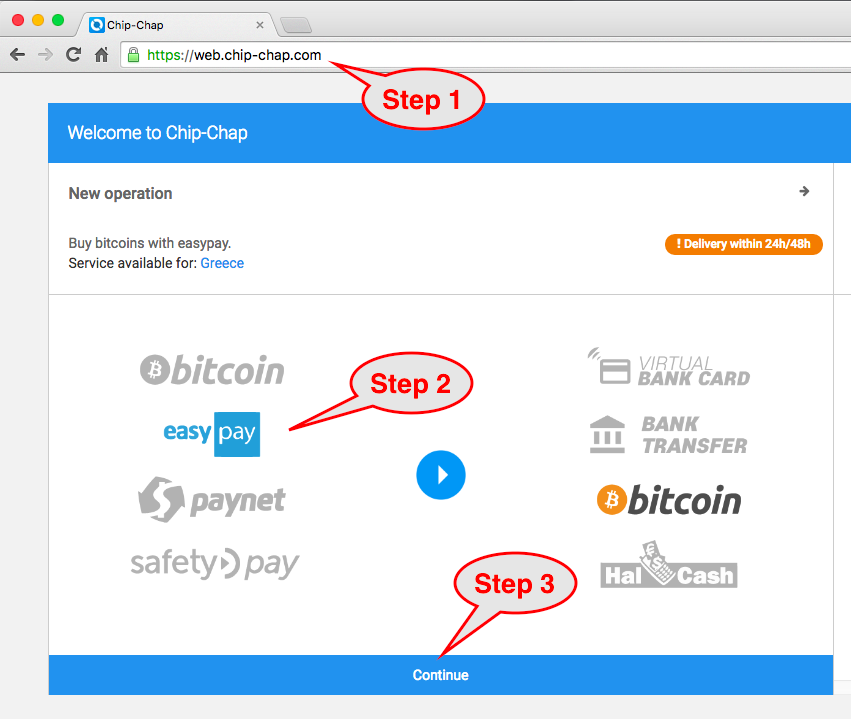
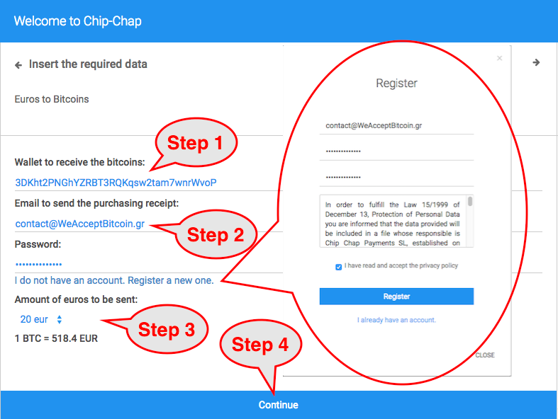
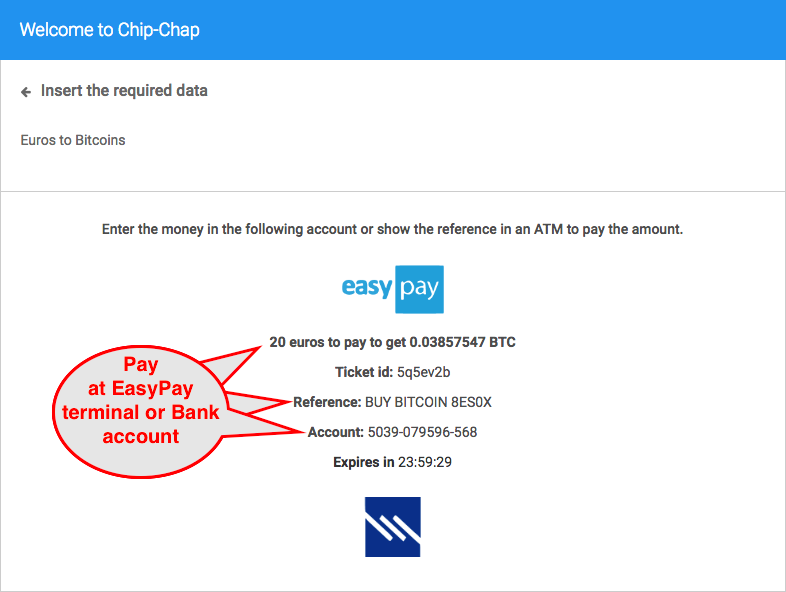
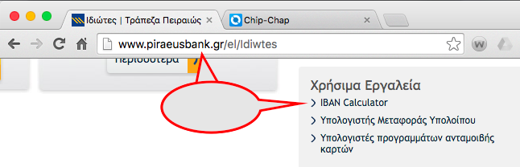
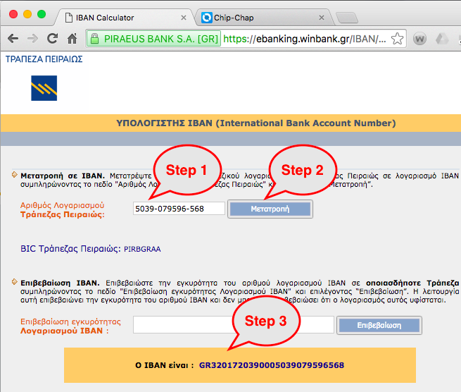
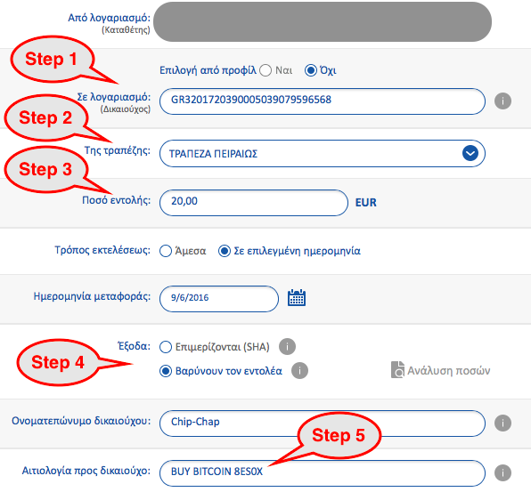
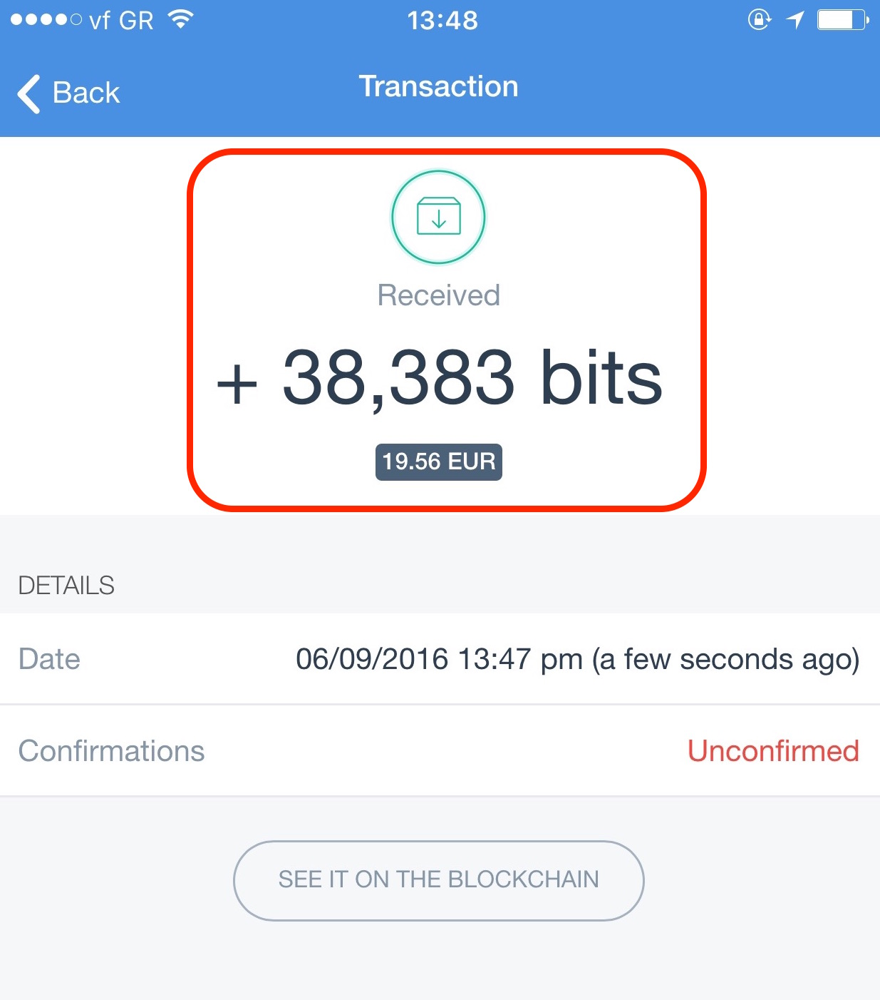
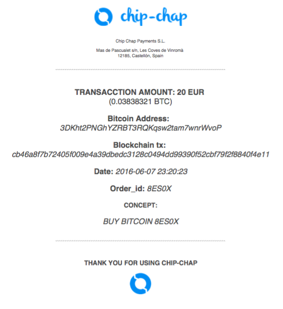

Ελάτε στην επόμενη συνάντησή μας στην [Αθήνα](http://www.meetup.com/BlockchainGreece-0/) ή στη [Θεσσαλονίκη](http://www.meetup.com/BlockchainGreece-1/). Γραφτείτε στο [Slack](http://bitcoingreece.herokuapp.com) (online chat) μας. Διαβάστε το [BitcoinTalk](https://bitcointalk.org/gr) forum.

- [Ποιες εταιρείες και επαγγελματίες δέχονται Bitcoin στην Ελλάδα;](#merchant-table)
- [Ποιες γνωστές εταιρείες του εξωτερικού δέχονται Bitcoin;](#bluechips)
- [Πώς μπορώ να αγοράσω Bitcoin από την Ελλάδα;](#buybitcoin)
- [Που μπορώ να μάθω περισσότερα για το Bitcoin;](#bitcoin.org)
- [Πως μπορώ να αποκτήσω ένα πορτοφόλι Bitcoin;](#wallet)
- [Αναζητώ ένα πορτοφόλι Bitcoin που να λειτουργεί στα Ελληνικά](#greekwallet)
- [Τι χρειάζομαι για να δέχομαι πληρωμές σε κατάστημα;](#paymentsinperson)
- [Είναι απαραίτητο να διαθέτω πορτοφόλι Bitcoin για να δέχομαι πληρωμές σε Bitcoin; Μπορώ να μετατρέπω τα Bitcoin σε Ευρώ αυτόματα;](#processors)
- [Μπορώ να φορτίζω μια χρεωστική κάρτα σε Ευρώ με Bitcoin;](#prepaidcard)
- [Τι έξοδα έχει μια πληρωμή σε Bitcoin;](#fees)
- [Μπορεί ο πληρωτής να ακυρώσει την πληρωμή που έκανε με Bitcoin;](#reversal)
- [Ποια είναι η τρέχουσα ισοτιμία του Bitcoin σε Ευρώ;](#exchangerate)
- [Διάβασα ότι στην Ευρωπαϊκή Ένωση οι συναλλαγές με Bitcoin εξαιρούνται από το ΦΠΑ, είναι αλήθεια;](#VAT)
- [Πως μπορώ να δω μια πληρωμή με Bitcoin από κοντά;](#demo)
- [Έχω Bitcoin και θέλω να καταθέσω Ευρώ σε λογαριασμό τρίτου σε Ελληνική τράπεζα ή σε τράπεζα της Ευρωζώνης](#bitcointosepa)
- [Πως μπορώ να δεχτώ έμβασμα σε τράπεζα της Ευρωζώνης και να μετατρέψω τα Ευρώ σε Bitcoin;](#sepatobitcoin)
- [Πως θα διαφημίσω ότι δέχομαι Bitcoin ως τρόπο πληρωμής;](#promote)

### Ποιές εταιρείες και επαγγελματίες δέχονται Bitcoin στην Ελλάδα;

[Αναζήτηση σε χάρτη](https://coinmap.org/#/world/38.81403111/24.63134766/6). Ενημερωθείτε για νέες καταχωρήσεις στον χάρτη [εδώ](https://twitter.com/hashtag/coinmap_gr?f=tweets&vertical=default&src=hash).

<table>

  <tr text-align: center;>
		
		<td text-align: center;><a href="{{company.url}}" rel="nofollow">{{company.company_gr}}</a></td>
		
		<td text-align: center;>{{company.company_gr}}</td>
		
		<td text-align: center;>{{company.category_gr}}</td>
		<td text-align: center;>{{company.location_gr}}</td>
  </tr>

</table>

###  Ποιες γνωστές εταιρείες του εξωτερικού δέχονται Bitcoin;

Ενδεικτικά:

- [Microsoft](https://commerce.microsoft.com/PaymentHub/Help/Right?helppagename=CSV_BitcoinHowTo.htm), για πελάτες στην Αμερική
- [Dell](http://www.dell.com/learn/us/en/uscorp1/campaigns/bitcoin-marketing?c=us&l=en&s=corp), για χώρες στις οποίες διατηρεί ηλεκτρονικό κατάστημα
- [Expedia](http://www.expedia.com/Checkout/BitcoinTermsAndConditions) και στην Ελλάδα
- [Περιοδικό Fortune](https://subscription.timeinc.com/storefront/site/fo-20for1999ccar1214bc.html)
- [Wikipedia](https://wikimediafoundation.org/wiki/Ways_to_Give#bitcoin), για δωρεές
- [Steam](http://store.steampowered.com)

### Πώς μπορώ να αγοράσω Bitcoin από την Ελλάδα;

- Στο Bitcoin ATM στο βιβλιοπωλείο Ορίζοντες, Θηβαίου Ιωάννου 20, Αχαρνές 13671, Αττική.
- Στο Bitcoin ATM της [BCash](https://bcash.gr/) στην Δημητρακοπούλου 84, Αθήνα, κοντά στο Μετρό Συγγρού-Φιξ. Δείτε το [βίντεο](https://youtu.be/9bT2XI2YQ-Y) που δείχνει πως αγοράζετε Bitcoin από τη συσκευή αυτή.
- Σε οποιοδήποτε ανταλλακτήριο Bitcoin διεθνώς, μέσω τραπεζικού εμβάσματος. Αυτήν τη στιγμή (Οκτώβριος 2016) επιτρέπεται έμβασμα στο εξωτερικό μέχρι €1000 το μήνα χωρίς δικαιολογητικά. Αυτή η μέθοδος έχει και τα χαμηλότερα κόστη, εφόσον το έμβασμα γίνει με τη μέθοδο SEPA (ενδεικτικό κόστος μεταφοράς: €1). Παραδείγματα ανταλλακτηρίων που δέχονται εμβάσματα με SEPA είναι [Kraken](https://www.kraken.com), [Coinbase](https://www.coinbase.com/) και [BitStamp](https://www.bitstamp.net).
- Σε ανταλλακτήρια που δέχονται πιστωτικές ή χρεωστικές κάρτες. Ένα ανταλλακτήριο που δέχεται Ελληνικές κάρτες είναι το [Coinbase](https://www.coinbase.com/) και χρεώνει 3,99%. Μια άλλη επιλογή είναι το [Circle](https://www.circle.com/). Κάποιες Ελληνικές τράπεζες δεν επιτρέπουν τη χρήση των καρτών τους σε κάποια ανταλλακτήρια.
- <strike>Στο ανταλλακτήριο [BTCGreece](https://www.btcgreece.com) που δέχεται εμβάσματα σε Ελληνικό τραπεζικό λογαριασμό.</strike>
- Από κάποιον ιδιώτη στην Ελλάδα που θα τον εντοπίσετε στο [Localbitcoins](https://localbitcoins.com/) ή στο [BuyBitcoin.gr](https://www.facebook.com/BuyBitcoin.gr). Με αυτούς μπορείτε να ανταλλάξετε Ευρώ με όποιον τρόπο θέλετε π.χ. χέρι-με-χέρι, Paypal, Western Union, Πειραιώς Λεφτά Στο Λεπτό, τραπεζική μεταφορά κλπ.
- Από το ανταλλακτήριο [Chip-Chap](https://chip-chap.com/) με κατάθεση μετρητών στα μηχανήματα EasyPay της Τράπεζας Πειραιώς ή με κατάθεση/έμβασμα σε λογαριασμό της Τράπεζας Πειραιώς. Χρεώνει 5% πάνω στην ισοτιμία του ανταλλακτηρίου [Kraken](https://www.kraken.com) τη στιγμή της αγοράς Bitcoin, η οποία είναι μερικές ώρες αφού τα χρήματα πιστωθούν στον λογαριασμό της Πειραιώς. Μερικές οδηγίες:

    Χρησιμοποιούμε την εφαρμογή Chip-Chap σε Android ή επισκεπτόμαστε τη σελίδα [https://web.chip-chap.com](https://web.chip-chap.com/) και επιλέγουμε EasyPay. Αυτή τη στιγμή η εφαρμογή σε κινητά iOS δεν υποστηρίζει το EasyPay.

	

	Δηλώνουμε τη διεύθυνση πορτοφολιού που θέλουμε να λάβουμε τα Bitcoin. Πρέπει να την έχουν δημιουργήσει από πριν ([Πως μπορώ να αποκτήσω ένα πορτοφόλι Bitcoin;](#wallet)). Φτιάχνουμε έναν λογαριασμό με ένα email και password. Στο email θα μας σταλεί η απόδειξη αγοράς Bitcoin. Επιλέγουμε το ποσό Ευρώ που σκοπεύουμε να καταθέσουμε. Η επιλογή είναι ανάμεσα σε €10 και €500:

	

	Στην επόμενη σελίδα η Chip-Chap μας ενημερώνει ότι πλέον μπορούμε να καταθέσουμε το ποσό σε συγκεκριμένο λογαριασμό της Πειραιώς με συγκεκριμένο reference code (το οποίο είναι μοναδικό για εμάς). Μπορούμε να κάνουμε την κατάθεση σε μετρητά σε ένα μηχάνημα EasyPay της Τράπεζας Πειραιώς ή να εμβάσουμε τα χρήματα στον λογαριασμό από οποιαδήποτε τράπεζα στην Ελλάδα:

	

	Εάν θέλουμε να εμβάσουμε χρήματα από τράπεζα, μετατρέπουμε τον αριθμό λογαριασμού που μας υπέδειξε η Chip-Chap σε μορφή IBAN:

	

	

	Υπόδειγμα εμβάσματος από άλλη Ελληνική τράπεζα:

	

	Μερικές ώρες αφού τα χρήματα πιστωθούν στον λογαριασμό της Πειραιώς λαμβάνουμε τα Bitcoin στο πορτοφόλι μας:

	

	Υπόδειγμα απόδειξης από το Chip-Chap:

	

### Που μπορώ να μάθω περισσότερα για το Bitcoin;

Η επίσημη σελίδα ενημέρωσης για το Bitcoin είναι το [bitcoin.org](https://bitcoin.org).

### Πως μπορώ να αποκτήσω ένα πορτοφόλι Bitcoin;

Μια λίστα με πορτοφόλια Bitcoin είναι αναρτημένη στο [bitcoin.org](https://bitcoin.org/en/choose-your-wallet), [εδώ](http://bitcoinx.io/wallets/) και [εδώ](https://en.bitcoin.it/wiki/Software). Εδώ μπορείτε να δείτε ένα [βίντεο](https://www.youtube.com/watch?v=9qgqPvc6kgM) για το πως φτιάχνετε ένα πορτοφόλι CoPay.

###  Αναζητώ ένα πορτοφόλι Bitcoin που να λειτουργεί στα Ελληνικά

Δοκιμάστε τα:

- [Coinomi](https://coinomi.com), τρέχει σε Android. Είναι thin client.
- [Electrum](https://electrum.org) τρέχει σε Windows, Mac, Linux, Android. Είναι thin client.
- [MultiBit HD](https://multibit.org) τρέχει σε Windows, Mac, Linux. Είναι thin client.

###  Τι χρειάζομαι για να δέχομαι πληρωμές σε κατάστημα;

Εσείς και ο πελάτης που μπαίνει στο κατάστημα χρειάζεστε από ένα smartphone ή ένα tablet ή έναν υπολογιστή με σύνδεση στο Internet και ένα πορτοφόλι Bitcoin. Ο πελάτης με το smartphone ή το tablet θα σκανάρει το QR code που θα δημιουργήσει το δικό σας πορτοφόλι. Η υπόλοιπη συναλλαγή θα γίνει μέσω Internet.

###  Είναι απαραίτητο να διαθέτω πορτοφόλι Bitcoin για να δέχομαι πληρωμές σε Bitcoin; Μπορώ να μετατρέπω τα Bitcoin σε Ευρώ αυτόματα;

Μπορείτε να χρησιμοποιήσετε έναν πάροχο πληρωμών που θα δέχεται Bitcoin για εσάς και θα σας αποδίδει Ευρώ. Τέτοιοι πάροχοι είναι:

- [Bitpay](https://bitpay.com)
- [Coinbase](https://www.coinbase.com/merchants)
- [Braintree](https://www.braintreepayments.com)

###  Μπορώ να φορτίζω μια χρεωστική κάρτα σε Ευρώ με Bitcoin;

Μπορείτε να βγάλετε μια επαναφορτιζόμενη προπληρωμένη χρεωστική κάρτα Visa σε Ευρώ από την [e-coin.io](https://www.e-coin.io/) (υπάρχουν και άλλες τράπεζες που εκδίδουν τέτοιες κάρτες). Μπορείτε να χρησιμοποιήσετε την κάρτα για αγορές και αναλήψεις μετρητών στην Ελλάδα και στο εξωτερικό.

###  Τι έξοδα έχει μια πληρωμή σε Bitcoin;

Για τον παραλήπτη, τίποτα, εκτός αν κάνει χρήση κάποιου πάροχου πληρωμών. Στον αποστολέα κοστίζει περίπου €0,03 (3 λεπτά του Ευρώ) ανεξαρτήτως του ποσού.

###  Μπορεί ο πληρωτής να ακυρώσει την πληρωμή που έκανε με Bitcoin;

Αυτό είναι δυνατόν με πληρωμές με πιστωτικές/χρεωστικές κάρτες και Paypal, αλλά είναι αδύνατον με Bitcoin. Μόνο ο παραλήπτης της πληρωμής μπορεί να επιστρέψει τα Bitcoin, εαν το επιθυμεί.

###  Ποια είναι η τρέχουσα ισοτιμία του Bitcoin σε Ευρώ;

Μπορείτε να τη δείτε στη σελίδα της [Google](https://www.google.com/finance?q=BTCEUR).

###  Διάβασα ότι στην Ευρωπαϊκή Ένωση οι συναλλαγές με Bitcoin εξαιρούνται από το ΦΠΑ, είναι αλήθεια;

Όχι, οι συναλλαγές που γίνονται σε Bitcoin υπάγονται σε ΦΠΑ όπως και οι συναλλαγές που γίνονται σε Ευρώ.

Αυτό που αποφάσισε το Ευρωπαϊκό Δικαστήριο στις 22 Οκτωβρίου 2015 είναι ότι [η αγορά και πώληση Bitcoin έναντι άλλων νομισμάτων δεν υπάγεται σε ΦΠΑ](http://curia.europa.eu/jcms/upload/docs/application/pdf/2015-10/cp150128en.pdf), όπως για παράδειγμα δεν υπάγεται σε ΦΠΑ η αγορά και πώληση Ευρώ έναντι Δολαρίων Αμερικής.

###  Πως μπορώ να δω μια πληρωμή με Bitcoin από κοντά;

Επισκευτείτε κάποιο από τα καταστήματα του πίνακα. Ελάτε σε κάποια [συνάντησή μας στην Αθήνα](http://www.meetup.com/BlockchainGreece-0/) ή στη [Θεσσαλονίκη](http://www.meetup.com/BlockchainGreece-1/). Γράψτε στο [Ελληνικό τμήμα του Bitcoin Talk](https://bitcointalk.org/gr). Γραφτείτε στο [Slack](http://bitcoingreece.herokuapp.com) (online chat) μας. Δείτε αυτό το [βίντεο](https://www.youtube.com/watch?v=9qgqPvc6kgM) για το πως φτιάχνετε ένα πορτοφόλι και στέλνετε και λαμβάνετε Bitcoin.

###  Έχω Bitcoin και θέλω να καταθέσω Ευρώ σε λογαριασμό τρίτου σε Ελληνική τράπεζα ή σε τράπεζα της Ευρωζώνης

Μπορείτε να χρησιμοποιήσετε κάποια από αυτές τις υπηρεσίες:

- [Cashila](https://www.cashila.com)
- [Bitwala](https://bitwa.la)

###  Πως μπορώ να δεχτώ έμβασμα σε τράπεζα της Ευρωζώνης και να μετατρέψω τα Ευρώ σε Bitcoin;

Μπορείτε να χρησιμοποιήσετε:

- [Cashila](https://www.cashila.com)

###   Πως θα διαφημίσω ότι δέχομαι Bitcoin ως τρόπο πληρωμής;

- Προσθέστε τον εαυτό σας στον [χάρτη του Coinmap](https://coinmap.org/#/world/38.81403111/24.63134766/6).
- Προσθέστε κάποια σχετική [εικόνα](https://en.bitcoin.it/wiki/Promotional_graphics) (π.χ. Bitcoin Accepted Here) στο κατάστημά σας και στην ιστοσελίδα σας.
- Στείλε μας email (αναγράφεται στο τέλος της σελίδας) ώστε να σας προσθέσουμε στη σελίδα αυτή. Ή κάνετε ένα Pull Request στο GitHub!

Τελευταία ενημέρωση: 2016-11-20

<!-- 

  
    <article class="post">

      <h1><a href="{{ site.baseurl }}{{ post.url }}">{{ post.title }}</a></h1>

      

        {{ post.excerpt }}
      

      <a href="{{ site.baseurl }}{{ post.url }}" class="read-more">Read More</a>
    </article>
  

 -->
