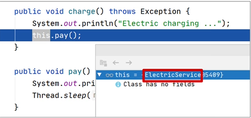

Spring AOP 是 Spring 中除了依赖注入外（DI）最为核心的功能，顾名思义，AOP 即 Aspect Oriented Programming，翻译为面向切面编程。

而 Spring AOP 则利用 CGlib 和 JDK 动态代理等方式来实现运行期动态方法增强，其目的是将与业务无关的代码单独抽离出来，使其逻辑不再与业务代码耦合，从而降低系统的耦合性，提高程序的可重用性和开发效率。因而 AOP 便成为了日志记录、监控管理、性能统计、异常处理、权限管理、统一认证等各个方面被广泛使用的技术。

追根溯源，我们之所以能无感知地在容器对象方法前后任意添加代码片段，那是由于 Spring 在运行期帮我们把切面中的代码逻辑动态“织入”到了容器对象方法内，所以说 **AOP 本质上就是一个代理模式**。然而在使用这种代理模式时，我们常常会用不好，那么这节课我们就来解析下有哪些常见的问题，以及背后的原理是什么。

## **案例 1：this 调用的当前类方法无法被拦截**
假设我们正在开发一个宿舍管理系统，这个模块包含一个负责电费充值的类 ElectricService，它含有一个充电方法 charge()：
```java
@Service
public class ElectricService {

    public void charge() throws Exception {
        System.out.println("Electric charging ...");
        this.pay();
    }

    public void pay() throws Exception {
        System.out.println("Pay with alipay ...");
        Thread.sleep(1000);
    }

}
```
在这个电费充值方法 charge() 中，我们会使用支付宝进行充值。因此在这个方法中，我加入了 pay() 方法。为了模拟 pay() 方法调用耗时，代码执行了休眠 1 秒，并在 charge() 方法里使用 this.pay() 的方式调用这种支付方法。

但是因为支付宝支付是第三方接口，我们需要记录下接口调用时间。这时候我们就引入了一个 @Around 的增强 ，分别记录在 pay() 方法执行前后的时间，并计算出执行 pay() 方法的耗时。

```java
@Aspect
@Service
@Slf4j
public class AopConfig {
    @Around("execution(* com.spring.puzzle.class5.example1.ElectricService.pay()) ")
    public void recordPayPerformance(ProceedingJoinPoint joinPoint) throws Throwable {
        long start = System.currentTimeMillis();
        joinPoint.proceed();
        long end = System.currentTimeMillis();
        System.out.println("Pay method time cost（ms）: " + (end - start));
    }
}
```
完成代码后，我们访问上述接口，会发现这段计算时间的切面并没有执行到，输出日志如下：
`Electric charging ...
Pay with alipay ...`

## 案例解析

我们可以从源码中找到真相。首先来设置个断点，调试看看 this 对应的对象是什么样的：


可以看到，this 对应的就是一个普通的 ElectricService 对象，并没有什么特别的地方。再看看在 Controller 层中自动装配的 ElectricService 对象是什么样：

