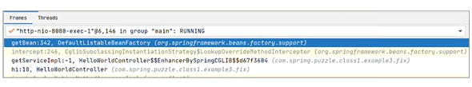
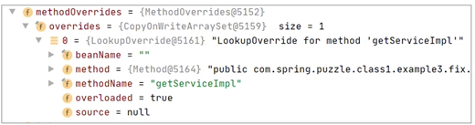

案例 1：隐式扫描不到 Bean 的定义
在构建 Web 服务时，我们常使用 Spring Boot 来快速构建。例如，使用下面的包结构和相关代码来完成一个简易的 Web 版 HelloWorld：

其中，负责启动程序的 Application 类定义如下：
```java 
package com.spring.puzzle.class1.example1.application
//省略 import
@SpringBootApplication
public class Application {
public static void main(String[] args) {
SpringApplication.run(Application.class, args);
}
}
提供接口的 HelloWorldController 代码如下：
package com.spring.puzzle.class1.example1.application
//省略 import
@RestController
public class HelloWorldController {
@RequestMapping(path = "hi", method = RequestMethod.GET)
public String hi(){
return "helloworld";
};
}
```
上述代码即可实现一个简单的功能：访问http://localhost:8080/hi 返回 helloworld。两个关键类位于同一个包（即 application）中。其中 HelloWorldController 因为添加了 @RestController，最终被识别成一个 Controller 的 Bean。
但是，假设有一天，当我们需要添加多个类似的 Controller，同时又希望用更清晰的包层次和结构来管理时，我们可能会去单独建立一个独立于 application 包之外的 Controller 包，并调整类的位置。调整后结构示意如下：

实际上，我们没有改变任何代码，只是改变了包的结构，但是我们会发现这个 Web 应用失效了，即不能识别出 HelloWorldController 了。也就是说，我们找不到 HelloWorldController 这个 Bean 了。这是为何？
案例解析
要了解 HelloWorldController 为什么会失效，就需要先了解之前是如何生效的。对于 Spring Boot 而言，关键点在于 Application.java 中使用了 SpringBootApplication 注解。而这个注解继承了另外一些注解，具体定义如下：
```java 
@Target(ElementType.TYPE)
@Retention(RetentionPolicy.RUNTIME)
@Documented
@Inherited
@SpringBootConfiguration
@EnableAutoConfiguration
@ComponentScan(excludeFilters = { @Filter(type = FilterType.CUSTOM, classes = TypeExcludeFilter.class),
@Filter(type = FilterType.CUSTOM, classes = AutoConfigurationExcludeFilter.class) })
public @interface SpringBootApplication {
//省略非关键代码
}
```
从定义可以看出，SpringBootApplication 开启了很多功能，其中一个关键功能就是 ComponentScan，参考其配置如下：
@ComponentScan(excludeFilters = { @Filter(type = FilterType.CUSTOM, classes = TypeExcludeFilter.class)
当 Spring Boot 启动时，ComponentScan 的启用意味着会去扫描出所有定义的 Bean，那么扫描什么位置呢？这是由 ComponentScan 注解的 basePackages 属性指定的，具体可参考如下定义：
```java 
public @interface ComponentScan {
/**
* Base packages to scan for annotated components.
* <p>{@link #value} is an alias for (and mutually exclusive with) this
* attribute.
* <p>Use {@link #basePackageClasses} for a type-safe alternative to
* String-based package names.
  */
  @AliasFor("value")
  String[] basePackages() default {};
  //省略其他非关键代码
  }
  ```
  而在我们的案例中，我们直接使用的是 SpringBootApplication 注解定义的 ComponentScan，它的 basePackages 没有指定，所以默认为空（即{}）。此时扫描的是什么包？这里不妨带着这个问题去调试下（调试位置参考 ComponentScanAnnotationParser#parse 方法），调试视图如下：
  从上图可以看出，当 basePackages 为空时，扫描的包会是 declaringClass 所在的包，在本案例中，declaringClass 就是 Application.class，所以扫描的包其实就是它所在的包，即 com.spring.puzzle.class1.example1.application。
  对比我们重组包结构前后，我们自然就找到了这个问题的根源：在调整前，HelloWorldController 在扫描范围内，而调整后，它已经远离了扫描范围（不和 Application.java 一个包了），虽然代码没有一丝丝改变，但是这个功能已经失效了。
  所以，综合来看，这个问题是因为我们不够了解 Spring Boot 的默认扫描规则引起的。我们仅仅享受了它的便捷，但是并未了解它背后的故事，所以稍作变化，就可能玩不转了。
  问题修正
  针对这个案例，有了源码的剖析，我们可以快速找到解决方案了。当然了，我们所谓的解决方案肯定不是说把 HelloWorldController 移动回原来的位置，而是真正去满足需求。在这里，真正解决问题的方式是显式配置 @ComponentScan。具体修改方式如下：
```java   
@SpringBootApplication
  @ComponentScan("com.spring.puzzle.class1.example1.controller")
  public class Application {
  public static void main(String[] args) {
  SpringApplication.run(Application.class, args);
  }
  }
  ```
  通过上述修改，我们显式指定了扫描的范围为 com.spring.puzzle.class1.example1.controller。不过需要注意的是，显式指定后，默认的扫描范围（即 com.spring.puzzle.class1.example1.application）就不会被添加进去了。另外，我们也可以使用 @ComponentScans 来修复问题，使用方式如下：
  @ComponentScans(value = { @ComponentScan(value = "com.spring.puzzle.class1.example1.controller") })
  顾名思义，可以看出 ComponentScans 相比较 ComponentScan 多了一个 s，支持多个包的扫描范围指定。
  此时，细心的你可能会发现：如果对源码缺乏了解，很容易会顾此失彼。以 ComponentScan 为例，原有的代码扫描了默认包而忽略了其它包；而一旦显式指定其它包，原来的默认扫描包就被忽略了。
  案例 2：定义的 Bean 缺少隐式依赖
  初学 Spring 时，我们往往不能快速转化思维。例如，在程序开发过程中，有时候，一方面我们把一个类定义成 Bean，同时又觉得这个 Bean 的定义除了加了一些 Spring 注解外，并没有什么不同。所以在后续使用时，有时候我们会不假思索地去随意定义它，例如我们会写出下面这样的代码：
```java   
@Service
  public class ServiceImpl {
  private String serviceName;
  public ServiceImpl(String serviceName){
  this.serviceName = serviceName;
  }
  }
  ```
  ServiceImpl 因为标记为 @Service 而成为一个 Bean。另外我们 ServiceImpl 显式定义了一个构造器。但是，上面的代码不是永远都能正确运行的，有时候会报下面这种错误：
  Parameter 0 of constructor in com.spring.puzzle.class1.example2.ServiceImpl required a bean of type 'java.lang.String' that could not be found.
  那这种错误是怎么发生的呢？下面我们来分析一下。
  案例解析
  当创建一个 Bean 时，调用的方法是 AbstractAutowireCapableBeanFactory#createBeanInstance。它主要包含两大基本步骤：寻找构造器和通过反射调用构造器创建实例。对于这个案例，最核心的代码执行，你可以参考下面的代码片段：
```java   
// Candidate constructors for autowiring?
  Constructor<?>[] ctors = determineConstructorsFromBeanPostProcessors(beanClass, beanName);
if (ctors != null || mbd.getResolvedAutowireMode() == AUTOWIRE_CONSTRUCTOR ||
      mbd.hasConstructorArgumentValues() || !ObjectUtils.isEmpty(args)) {
   return autowireConstructor(beanName, mbd, ctors, args);
}
```
Spring 会先执行 determineConstructorsFromBeanPostProcessors 方法来获取构造器，然后通过 autowireConstructor 方法带着构造器去创建实例。很明显，在本案例中只有一个构造器，所以非常容易跟踪这个问题。
autowireConstructor 方法要创建实例，不仅需要知道是哪个构造器，还需要知道构造器对应的参数，这点从最后创建实例的方法名也可以看出，参考如下（即 ConstructorResolver#instantiate）：
```java 
private Object instantiate(
      String beanName, RootBeanDefinition mbd, Constructor<?> constructorToUse, Object[] argsToUse)
   ```
  那么上述方法中存储构造参数的 argsToUse 如何获取呢？换言之，当我们已经知道构造器 ServiceImpl(String serviceName)，要创建出 ServiceImpl 实例，如何确定 serviceName 的值是多少？
  很明显，这里是在使用 Spring，我们不能直接显式使用 new 关键字来创建实例。Spring 只能是去寻找依赖来作为构造器调用参数。
  那么这个参数如何获取呢？可以参考下面的代码片段（即 ConstructorResolver#autowireConstructor）：
  argsHolder = createArgumentArray(beanName, mbd, resolvedValues, bw, paramTypes, paramNames,
  getUserDeclaredConstructor(candidate), autowiring, candidates.length == 1);
  我们可以调用 createArgumentArray 方法来构建调用构造器的参数数组，而这个方法的最终实现是从 BeanFactory 中获取 Bean，可以参考下述调用：
```java   
return this.beanFactory.resolveDependency(
  new DependencyDescriptor(param, true), beanName, autowiredBeanNames, typeConverter);
  ```
  如果用调试视图，我们则可以看到更多的信息：
  如图所示，上述的调用即是根据参数来寻找对应的 Bean，在本案例中，如果找不到对应的 Bean 就会抛出异常，提示装配失败。
  问题修正
  从源码级别了解了错误的原因后，现在反思为什么会出现这个错误。追根溯源，正如开头所述，因为不了解很多隐式的规则：我们定义一个类为 Bean，如果再显式定义了构造器，那么这个 Bean 在构建时，会自动根据构造器参数定义寻找对应的 Bean，然后反射创建出这个 Bean。
  了解了这个隐式规则后，解决这个问题就简单多了。我们可以直接定义一个能让 Spring 装配给 ServiceImpl 构造器参数的 Bean，例如定义如下：
```java 
  //这个bean装配给ServiceImpl的构造器参数“serviceName”
  @Bean
  public String serviceName(){
  return "MyServiceName";
  }
  ```
  再次运行程序，发现一切正常了。
  所以，我们在使用 Spring 时，不要总想着定义的 Bean 也可以在非 Spring 场合直接用 new 关键字显式使用，这种思路是不可取的。
  另外，类似的，假设我们不了解 Spring 的隐式规则，在修正问题后，我们可能写出更多看似可以运行的程序，代码如下：
```java 
  @Service
  public class ServiceImpl {
  private String serviceName;
  public ServiceImpl(String serviceName){
  this.serviceName = serviceName;
  }
  public ServiceImpl(String serviceName, String otherStringParameter){
  this.serviceName = serviceName;
  }
  }
  ```
  如果我们仍用非 Spring 的思维去审阅这段代码，可能不会觉得有什么问题，毕竟 String 类型可以自动装配了，无非就是增加了一个 String 类型的参数而已。
  但是如果你了解 Spring 内部是用反射来构建 Bean 的话，就不难发现问题所在：存在两个构造器，都可以调用时，到底应该调用哪个呢？最终 Spring 无从选择，只能尝试去调用默认构造器，而这个默认构造器又不存在，所以测试这个程序它会出错。
  案例 3：原型 Bean 被固定
  接下来，我们再来看另外一个关于 Bean 定义不生效的案例。在定义 Bean 时，有时候我们会使用原型 Bean，例如定义如下：
```java 
  @Service
  @Scope(ConfigurableBeanFactory.SCOPE_PROTOTYPE)
  public class ServiceImpl {
  }
  ```
  然后我们按照下面的方式去使用它：
```java 
  @RestController
  public class HelloWorldController {
  @Autowired
  private ServiceImpl serviceImpl;
  @RequestMapping(path = "hi", method = RequestMethod.GET)
  public String hi(){
  return "helloworld, service is : " + serviceImpl;
  };
  }
  ```
  结果，我们会发现，不管我们访问多少次http://localhost:8080/hi，访问的结果都是不变的，如下：
  helloworld, service is : com.spring.puzzle.class1.example3.error.ServiceImpl@4908af
  很明显，这很可能和我们定义 ServiceImpl 为原型 Bean 的初衷背道而驰，如何理解这个现象呢？
  案例解析
  当一个属性成员 serviceImpl 声明为 @Autowired 后，那么在创建 HelloWorldController 这个 Bean 时，会先使用构造器反射出实例，然后来装配各个标记为 @Autowired 的属性成员（装配方法参考 AbstractAutowireCapableBeanFactory#populateBean）。
  具体到执行过程，它会使用很多 BeanPostProcessor 来做完成工作，其中一种是 AutowiredAnnotationBeanPostProcessor，它会通过 DefaultListableBeanFactory#findAutowireCandidates 寻找到 ServiceImpl 类型的 Bean，然后设置给对应的属性（即 serviceImpl 成员）。
  关键执行步骤可参考 AutowiredAnnotationBeanPostProcessor.AutowiredFieldElement#inject：
```java   
protected void inject(Object bean, @Nullable String beanName, @Nullable PropertyValues pvs) throws Throwable {
  Field field = (Field) this.member;
  Object value;
  //寻找“bean”
  if (this.cached) {
  value = resolvedCachedArgument(beanName, this.cachedFieldValue);
  }
  else {
  //省略其他非关键代码
  value = beanFactory.resolveDependency(desc, beanName, autowiredBeanNames, typeConverter);
  }
  if (value != null) {
  //将bean设置给成员字段
  ReflectionUtils.makeAccessible(field);
  field.set(bean, value);
  }
  }
  ```
  待我们寻找到要自动注入的 Bean 后，即可通过反射设置给对应的 field。这个 field 的执行只发生了一次，所以后续就固定起来了，它并不会因为 ServiceImpl 标记了 SCOPE_PROTOTYPE 而改变。
  所以，当一个单例的 Bean，使用 autowired 注解标记其属性时，你一定要注意这个属性值会被固定下来。
  问题修正
  通过上述源码分析，我们可以知道要修正这个问题，肯定是不能将 ServiceImpl 的 Bean 固定到属性上的，而应该是每次使用时都会重新获取一次。所以这里我提供了两种修正方式：
1. 自动注入 Context
   即自动注入 ApplicationContext，然后定义 getServiceImpl() 方法，在方法中获取一个新的 ServiceImpl 类型实例。修正代码如下：
```java 
   @RestController
   public class HelloWorldController {
   @Autowired
   private ApplicationContext applicationContext;
   @RequestMapping(path = "hi", method = RequestMethod.GET)
   public String hi(){
   return "helloworld, service is : " + getServiceImpl();
   };

   public ServiceImpl getServiceImpl(){
   return applicationContext.getBean(ServiceImpl.class);
   }
   }
   ```
2. 使用 Lookup 注解
   类似修正方法 1，也添加一个 getServiceImpl 方法，不过这个方法是被 Lookup 标记的。修正代码如下：
```java 
   @RestController
   public class HelloWorldController {

   @RequestMapping(path = "hi", method = RequestMethod.GET)
   public String hi(){
   return "helloworld, service is : " + getServiceImpl();
   };
   @Lookup
   public ServiceImpl getServiceImpl(){
   return null;
   }  
   }
   ```
   通过这两种修正方式，再次测试程序，我们会发现结果已经符合预期（每次访问这个接口，都会创建新的 Bean）。
   这里我们不妨再拓展下，讨论下 Lookup 是如何生效的。毕竟在修正代码中，我们看到 getServiceImpl 方法的实现返回值是 null，这或许很难说服自己。
   首先，我们可以通过调试方式看下方法的执行，参考下图：

   从上图我们可以看出，我们最终的执行因为标记了 Lookup 而走入了 CglibSubclassingInstantiationStrategy.LookupOverrideMethodInterceptor，这个方法的关键实现参考 LookupOverrideMethodInterceptor#intercept：
```java    
private final BeanFactory owner;
   public Object intercept(Object obj, Method method, Object[] args, MethodProxy mp) throws Throwable {
   LookupOverride lo = (LookupOverride) getBeanDefinition().getMethodOverrides().getOverride(method);
   Assert.state(lo != null, "LookupOverride not found");
   Object[] argsToUse = (args.length > 0 ? args : null);  // if no-arg, don't insist on args at all
   if (StringUtils.hasText(lo.getBeanName())) {
   return (argsToUse != null ? this.owner.getBean(lo.getBeanName(), argsToUse) :
   this.owner.getBean(lo.getBeanName()));
   }
   else {
   return (argsToUse != null ? this.owner.getBean(method.getReturnType(), argsToUse) :
   this.owner.getBean(method.getReturnType()));
   }
   }
```
   我们的方法调用最终并没有走入案例代码实现的 return null 语句，而是通过 BeanFactory 来获取 Bean。所以从这点也可以看出，其实在我们的 getServiceImpl 方法实现中，随便怎么写都行，这不太重要。
   例如，我们可以使用下面的实现来测试下这个结论：
```java 
   @Lookup
   public ServiceImpl getServiceImpl(){
   //下面的日志会输出么？
   log.info("executing this method");
   return null;
   }  
   ```
   以上代码，添加了一行代码输出日志。测试后，我们会发现并没有日志输出。这也验证了，当使用 Lookup 注解一个方法时，这个方法的具体实现已并不重要。
   再回溯下前面的分析，为什么我们走入了 CGLIB 搞出的类，这是因为我们有方法标记了 Lookup。我们可以从下面的这段代码得到验证，参考 SimpleInstantiationStrategy#instantiate：
```java   
@Override
   public Object instantiate(RootBeanDefinition bd, @Nullable String beanName, BeanFactory owner) {
   // Don't override the class with CGLIB if no overrides.
   if (!bd.hasMethodOverrides()) {
   //
   return BeanUtils.instantiateClass(constructorToUse);
   }
   else {
   // Must generate CGLIB subclass.
   return instantiateWithMethodInjection(bd, beanName, owner);
   }
   }
```
   在上述代码中，当 hasMethodOverrides 为 true 时，则使用 CGLIB。而在本案例中，这个条件的成立在于解析 HelloWorldController 这个 Bean 时，我们会发现有方法标记了 Lookup，此时就会添加相应方法到属性 methodOverrides 里面去（此过程由 AutowiredAnnotationBeanPostProcessor#determineCandidateConstructors 完成）。
   添加后效果图如下：

   以上即为 Lookup 的一些关键实现思路。还有很多细节，例如 CGLIB 子类如何产生，无法一一解释，有兴趣的话，可以进一步深入研究，留言区等你。
   重点回顾
   这节课我们介绍了 3 个关于 Bean 定义的经典错误，并分析了其背后原理。
   不难发现，要使用好 Spring，就一定要了解它的一些潜规则，例如默认扫描 Bean 的范围、自动装配构造器等等。如果我们不了解这些规则，大多情况下虽然也能工作，但是稍微变化，则可能完全失效，例如在案例 1 中，我们也只是把 Controller 从一个包移动到另外一个包，接口就失效了。
   另外，通过这三个案例的分析，我们也能感受到 Spring 的很多实现是通过反射来完成的，了解了这点，对于理解它的源码实现会大有帮助。例如在案例 2 中，为什么定义了多个构造器就可能报错，因为使用反射方式来创建实例必须要明确使用的是哪一个构造器。
   最后，我想说，在 Spring 框架中，解决问题的方式往往有多种，不要拘泥于套路。就像案例 3，使用 ApplicationContext 和 Lookup 注解，都能解决原型 Bean 被固定的问题一样。
   思考题
   在案例 2 中，显示定义构造器，这会发生根据构造器参数寻找对应 Bean 的行为。这里请你思考一个问题，假设寻找不到对应的 Bean，一定会如案例 2 那样直接报错么？
