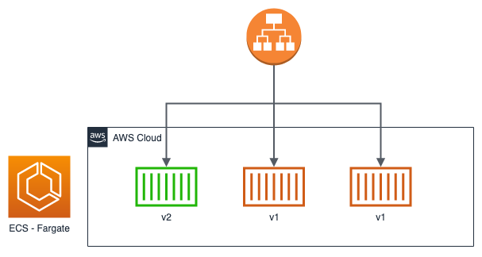
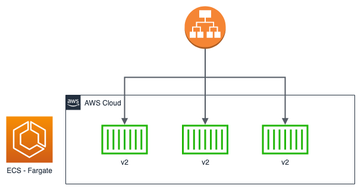

# Deployment Type

# Rolling Update

> [https://docs.aws.amazon.com/AmazonECS/latest/developerguide/deployment-type-ecs.html](https://docs.aws.amazon.com/AmazonECS/latest/developerguide/deployment-type-ecs.html)
> 
- Use the deployment circuit breaker, which can roll back to last completed deployment upon a deployment failure.
    - Even 1 task is successfully running, it is not a failure....
- Explanation with image:

# Blue/Green deploy

- Deployment doc [https://aws.amazon.com/blogs/compute/bluegreen-deployments-with-amazon-ecs/](https://aws.amazon.com/blogs/compute/bluegreen-deployments-with-amazon-ecs/)

[https://github.com/aws-samples/ecs-blue-green-deployment](https://github.com/aws-samples/ecs-blue-green-deployment)

# Automate Deployment with CodeDeploy

- [https://docs.aws.amazon.com/codedeploy/latest/userguide/tutorial-ecs-deployment.html](https://docs.aws.amazon.com/codedeploy/latest/userguide/tutorial-ecs-deployment.html)