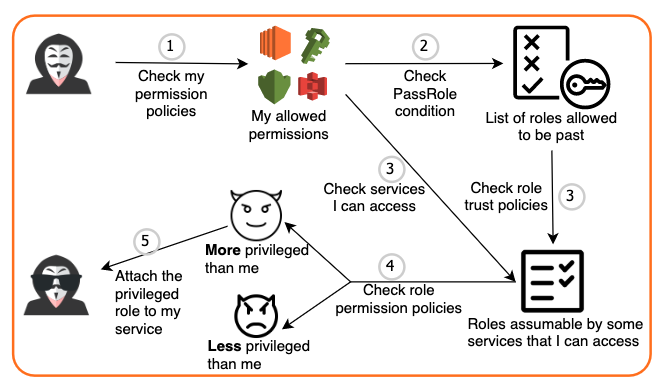
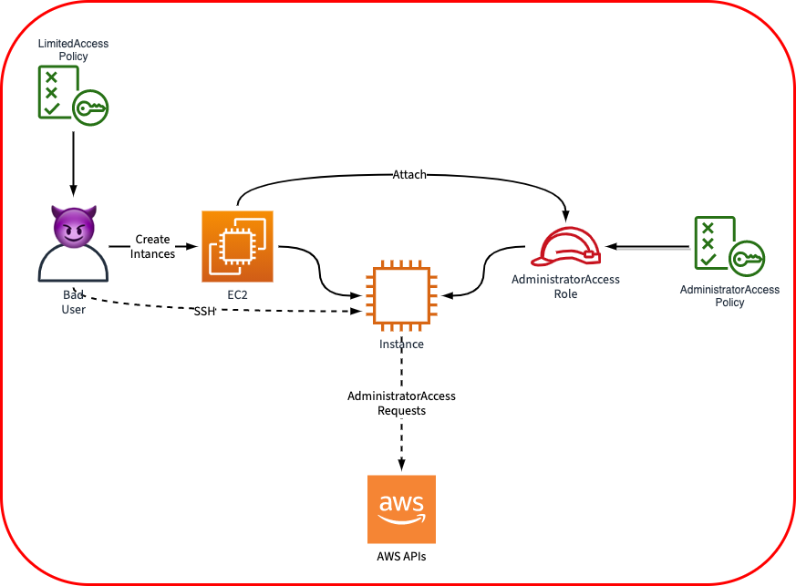
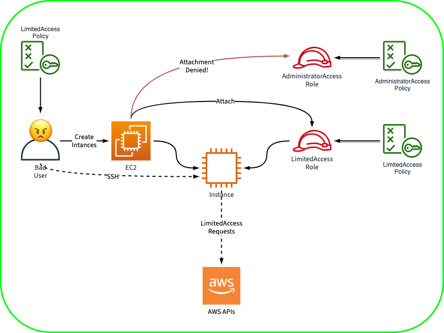
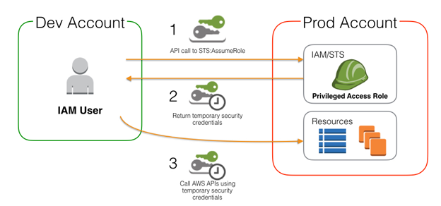

# IAM

## 3 Important setting in Roles

- Permission policies
- Permission boundaries
- Trust relationships

## PassRole & AssumeRole

- PassRole → For a role A, what other `roles` it(RoleA) can assign to other `resources`
- AssumeRole → For a role A, what `resources` can “pretend” this roleA



## PassRole

- [https://blog.rowanudell.com/iam-passrole-explained/](https://blog.rowanudell.com/iam-passrole-explained/)
- The importance of PassRole:
    
    
    
- It is NOT an action, although listed in Action Block
- It is to specify, for a **`user/role`** , what kind of `roles` they can assign to other resources.
    
    > e.g.  You can limit a user or service, only can assign the specific role ARN(as below) to other `resources`
    > 
    
    ```python
    {
      "Effect": "Allow",
      "Action": "iam:PassRole",
      "Resource": "arn:aws:::123456789012:role/LimitedAccess"
    }
    ```
    
    
    

---

## AssumeRole

- It defines which resources / user can assume this role
- Here is a sample trusted relationships
    
    > e.g. This role can only be assumed by EC2
    > 
    
    ```json
    {
      "Version": "2012-10-17",
      "Statement": [
        {
          "Effect": "Allow",
          "Principal": {
            "Service": "ec2.amazonaws.com"
          },
          "Action": "sts:AssumeRole"
        }
      ]
    }
    ```
    

- When you switch to use a role temporarily, you get the Power as the same as `target role` through STS
- So that the user ARN will become sts,  `arn:aws:sts::xxxxxxxx`
    - original user should be iam, `arn:aws:iam::xxxxxx`

